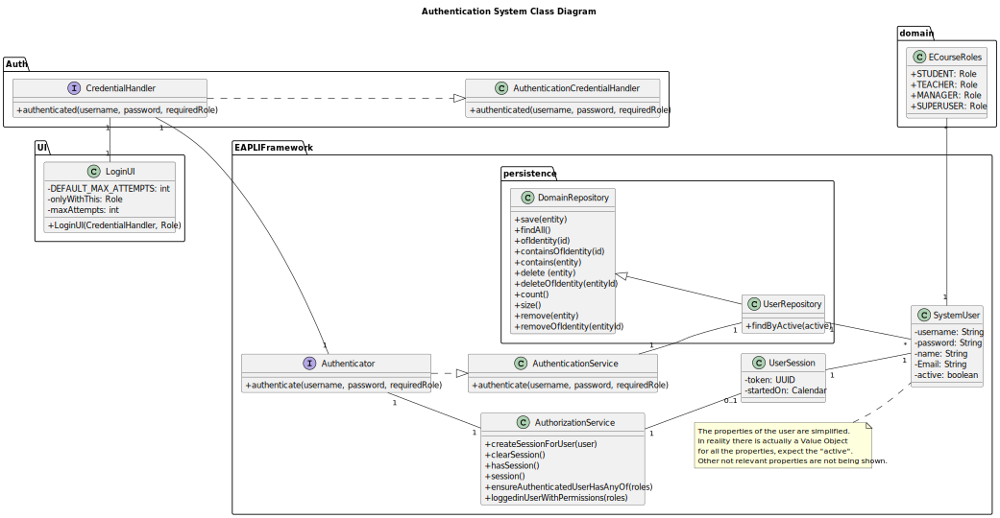
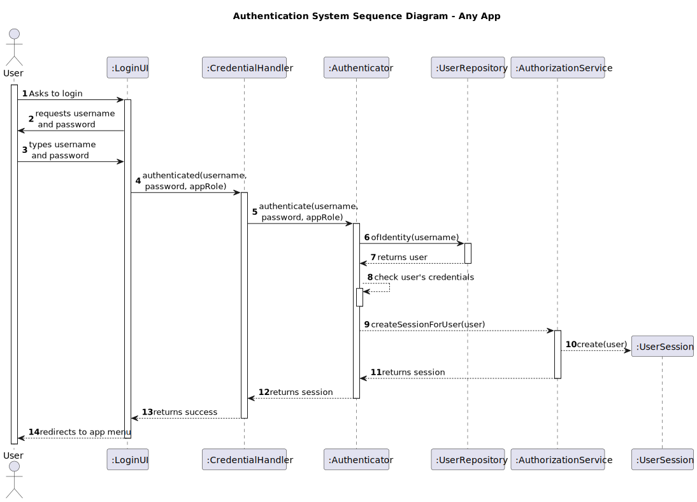

# G006 - As a Project Manager, I want the system to have an authentication system

## 1. Context

This requirement is related to the authentication of users in the system. 
It will be needed to implement a system that authenticates users in the system, according to their role.

To give further context, there is already such system implement in EAPLI's framework, which is being used in the project.
Therefore, the team will have to use this system, and adapt it to the needs of the project.

## 2. Requirements

It is required that there is a system that authenticates users in the system, according to their role.
The system should ask for the user's username and password, and then,
if the user is registered and has the role necessary for the application that is running, the user should be able to access the application.

**US G006** As a Project Manager, I want the system to have an authentication system

- G002.1. As a Manager, I want to log in into the Managers app.
- G002.2. As a Teacher, I want to log in into the Teachers app.
- G002.3. As a Student, I want to log in into the Students app.

## 3. Analysis

Since the framework already provides with all the base classes and interfaces needed to implement this functionality, the team will only need
to add some classes to fully implement this functionality. 
In order to be able to test everything, it is also needed to have a way to add users to the system. This will be done by bootstrapping the system
with a SuperUser, which will be able to add the first user to the system.
The Managers should be the ones to actually add users, but the user story for that matter is only due to the next sprint.
Anyway, there will be created the controller for the Use Case of adding users, and the user story will be implemented in the next sprint.

For the sake of simplicity, this document will only focus on the actual login functionality.
The analysis of the use case of adding users will be done in the next sprint, along with the implementation of the use case.


## 4. Design

### 4.1. Class Diagram



** Role is another class from the EAPLI framework.

### 4.2. Sequence Diagram

This sequence diagram represents the case of a successful login, for any app.

The login can fail for the following reasons:
- The user is not registered in the system. (UserRepository returns null)
- The user is registered, but either the password or the role is wrong. (Verifications made in the Authenticator)

*In either case the access is denied.

The appRole depends on the app that is running.



### 4.3. Applied Patterns

Some main patterns used in this functionality are:

* **Single Responsibility Principle:** *Every class has only one responsibility (e.g.: The AuthenticationService only authenticates users) *
* **Open/Closed Principle:** *By using interfaces, the system is open to extension, but closed to modification. (e.g.: The AuthenticationService is open to extension, but closed to modification, since it only depends on interfaces, and not on concrete classes).*
* **Dependency Injection:** *The persistence layer, the Password policy, the Encoder and the authorization service are all received in the Authentication Service through DI.*
* **Creator:** *The Authorization Service is a creator, since it creates the user session.*
* **Information Expert:** *The UserRepository is the IE of the Users. The Authorization Service is the IE of the UserSession.*
* **Low Coupling:** *All the classes are loosely coupled, not depending on concrete classes.*
* **High Cohesion:** *All the classes have a high cohesion, since they have only one responsibility.*

### 4.4. Tests

The relevant test cases for this functionality are:
- Test the login when the user is not registered in the system. Should return false.
- Test the login when the user is registered, but the password is wrong. Should return false.
- Test the login when the user is registered, but the role is wrong. Should return false.
- Test the login when the user is registered, and the password and role are correct. Should return true.

## 5. Demonstration

In order to run this functionality it is needed to either run the bootstrap app or to add a user to the system manually.
Then it is just needed to run one of the apps, and try to log in with the user that was added.

Demo video logging as a valid manager, and then trying to log as an invalid manager.


https://user-images.githubusercontent.com/103595766/234697768-3e8b0d97-8937-43fd-b1a1-1835214e3d78.mp4


## 6. Implementation

Here is a list of the classes that were created in order to integrate this functionality, using the EAPLI's framework.

- **CreateSystemUserController:** The controller that uses the services from the framework to create a user.

````java
@UseCaseController
public class CreateSystemUserController {
    private final AuthorizationService authzSvc = AuthzRegistry.authorizationService();
    private final UserManagementService userManagementSvc = AuthzRegistry.userService();

    public SystemUser addUser(final String username, final String password, final String firstName,
                              final String lastName,
                              final String email, final Set<Role> roles, final Calendar createdOn) {
        authzSvc.ensureAuthenticatedUserHasAnyOf(ECourseRoles.SUPERUSER,ECourseRoles.MANAGER);

        return userManagementSvc.registerNewUser(username, password, firstName, lastName, email, roles,
                createdOn);
    }

    public SystemUser addUser(final String username, final String password, final String firstName,
                              final String lastName,
                              final String email, final Set<Role> roles) {
        return addUser(username, password, firstName, lastName, email, roles, CurrentTimeCalendars.now());
    }
}
````

- **ECourseRoles:** The class that contains the roles that are used in the system.
In order to be able to add a user to the system, with EAPLI's framework we have to define the roles will be available.

````java
public class ECourseRoles {

    public static final Role SUPERUSER = Role.valueOf("SUPER_USER");
    public static final Role STUDENT = Role.valueOf("STUDENT");
    public static final Role TEACHER = Role.valueOf("TEACHER");
    public static final Role MANAGER = Role.valueOf("MANAGER");


    /**
     * Method that returns the existing roles (only domain roles)
     *
     * @return the role array
     */
    public static Role[] existingRoles() {
        return new Role[]{STUDENT, TEACHER, MANAGER};
    }

}
````

- **ECoursePasswordPolicy:** Class that implements the PasswordPolicy interface, and defines the password policy for the
system.

````java
public class ECoursePasswordPolicy implements PasswordPolicy {
    private static final int MINIMUM_PASSWORD_LENGTH = 6;

    @Override
    public boolean isSatisfiedBy(final String rawPassword) {

        // Check if password is null or empty
        if (StringPredicates.isNullOrEmpty(rawPassword)) {
            return false;
        }

        // Check if password has the minimum length
        if (rawPassword.length() < MINIMUM_PASSWORD_LENGTH) {
            return false;
        }

        // Check if password has at least one digit
        if (!StringPredicates.containsDigit(rawPassword)) {
            return false;
        }

        // Check if password has at least one capital letter
        return StringPredicates.containsCapital(rawPassword);
    }
}
````
