# US1001 — As a Manager, I want to be able to register, disable/enable, and list users of the system

## 1. Context

In order to be able to use the system, the users need to be registered in the system.
The Manager should be able to manage them by registering, disabling, enabling and listing them.

## 2. Requirements

It is required that the following use cases are implemented:

* **UC1001.1** As a Manager, I want to be able to register a Student in the system.
* **UC1001.2** As a Manager, I want to be able to register a Teacher in the system.
* **UC1001.3** As a Manager, I want to be able to register a Manager in the system.
* **UC1001.4** As a Manager, I want to be able to disable users in the system.
* **UC1001.5** As a Manager, I want to be able to enable users in the system.
* **UC1001.6** As a Manager, I want to be able to list users in the system.

It could be argued that the first 3 use cases could be all the same one, since there are a lot of similarities between
them.
However, to ensure the scalability of the system, and accounting for the different fields that each user type has,
it was decided to split them into 3 use cases (more on that in the design section).

### Client Clarifications

#### System Specifications Document

"A student is characterized by his/her name, date of birth, taxpayer number and a mechanographic number assigned automatically by the system based on the year of registration and a
sequential number, e.g., "202300001"."


#### Forum

The taxpayer number rules will be the Portuguese ones.

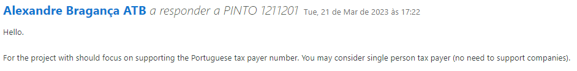

Portuguese rules for tax number validation:
https://rr.sapo.pt/artigo/o-mundo-em-tres-dimensoes/2019/04/12/sabia-que-o-ultimo-digito-do-nif-e-um-algarismo-de-controle/147771/

Acronym rules:

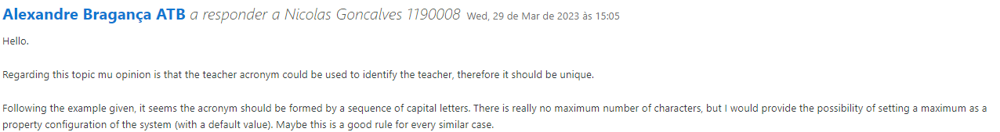


## 3. Analysis

Although we already have the "SystemUser" class, that won't be enough to satisfy the requirements, according to the
domain of the project.

The "SystemUser" class is a class that represents a user in the system, but it doesn't represent a domain user.

There are some more attributes that are needed to represent a domain user, such as userBirthdate, taxpayer number.
Also, if the user is a Student, it should have a mechanographic number (automatically assigned by the system, based on
the year of registration, and a sequential number, e.g., "202300001"), in the case of a Student.
If the user is a Teacher, it should have an acronym defined by the Manager, e.g., "AALB".

For that reason, it was decided to create a new class, called "ECourseUser", that will represent a domain user.
This class will have a "SystemUser" as an attribute, and will have the attributes that are specific to a domain user.

Since the SystemUser is a class provided by the framework, its creation is not in the scope of this user story and thus
will be partially omitted from the diagrams. 

For documentation purposes and to be stated somewhere, it's relevant to note that the SystemUser is created by calling
the CreateSystemUserController, a controller to make the creation of a SystemUser easier, using the framework. 
It can be found in the core module on the usermanagement package.

Note: It does not mean it won't be appearing in the diagrams, but it will be represented without the details of its
creation, use, etc...

As of now, the enabling and disabling of users will only affect their State attribute, as no other action is required.

To choose the user that will be disabled/enabled, there is a dependency to the UC1001.6, which is the use case that
lists the users, as the manager will have to choose the user from the list.

Since there is no clear specification on the listing of users, and since there are use cases related to enable and 
disable users, it was decided that this use case can either list all the users, independently of their state, where
all the users' information will be printed,except for the password, list all the users that are enabled, or list all
the users that are disabled, where all the users' information will be printed, except for the password and their state.

### 3.1. Use Case Diagram

A use case diagram was created to represent the use cases that are related to this user story.

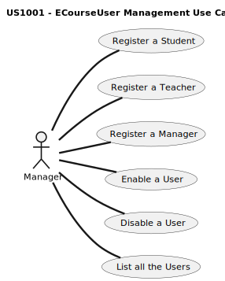

## 4. Design

Since this is a "complex" user story, it was decided to split it into 6 use cases, each one with its own functionality.

There is a common class diagram for all the use cases.

As for the sequence diagrams, they're different for each use case.

### 4.1. Class Diagram

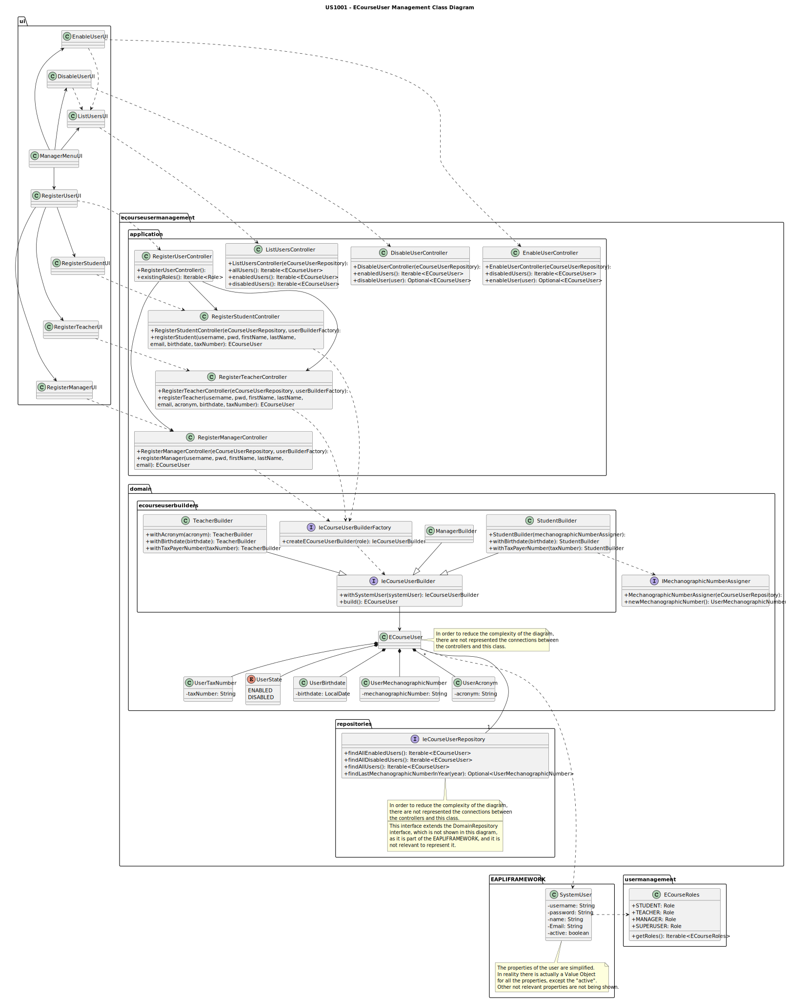

### 4.2. Sequence Diagrams

As mentioned before, the sequence diagrams are different for each use case.

Disclaimers: 
- As stated later in point 4.3, the dependency injection should be done with the help of a framework.
Since we are not using one, the dependency injection is done manually, by injecting the dependencies upon the
creation of the object.
- To ensure coherency between the code and the diagrams, the DI is represented on the creation of the object.
- The sequence diagrams only represents the successful execution of the use case.


**4.2.1. As a Manager, I want to be able to register users in the system.**

Since this functionality is rather complex, some explanation is needed.

There will be 3 use cases, one for each type of user.
This enables the system to be scalable, and to be able to add more types of users in the future, without having to
change the code of the use cases.

As it is possible to see in the class diagram, there will be 4 controllers, one to control the functionality itself,
and then 3 controllers, one for each type of user (In the future, if more types of users are added, we can easily add
more controllers).

The controllers will be responsible for receiving the data from the UI, and then with the help of the
ECourseUserBuilderFactory, they will receive the respective builder, according to the role of the user.

With the help of the builder, the controller will create the respective user, and then the controller will call the
repository to save the user.
This is common for all the use cases, related to this functionality.

The differences between the use cases are:
- The Student has a mechanographic number, which is automatically assigned by the system, with the help of the 
MechanographicNumberAssigner.
- The Teacher has an acronym, which is defined by the Manager.
- The Manager doesn't have a taxpayer number nor a userBirthdate (the other 2 have).

These differences are what makes the use cases different, and thus, they were split into 3 use cases.

It was possible to merge all the use cases into one, but it would make the code much less scalable, and it is arguable
that the Open/Closed principle would be violated as for each new type of user, we would have to change the logic of the
method that creates the user.                                                                              
Tough, it is also arguable that it wouldn't be broken since the principle explicitly states that the code should only
have one reason to change, and in this case, the reason to change would be to add a new type of user, which is valid. 

When created, UserState will always be "ENABLED", because it makes sense that the user is enabled when it is created.

---
**Register User Starting Point Sequence Diagram**

Since the starting point is the same for all the use cases related with the registry of users, it was decided to create
a sequence diagram that represents the starting point for all the use cases.

Note: <<f_entity>> means that it's an entity from the framework.

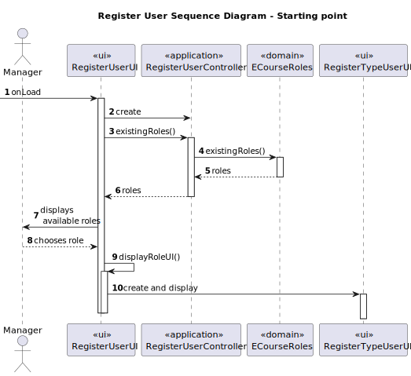

---
**[UC1001.1] As a Manager, I want to be able to register a student in the system.**

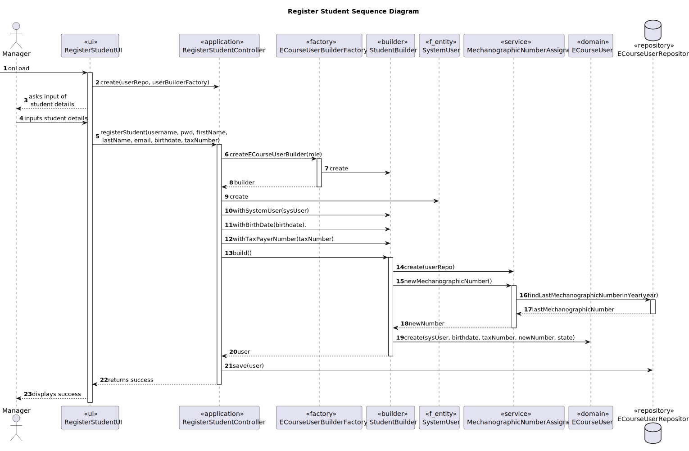

---
**[UC1001.2] As a Manager, I want to be able to register a teacher in the system.**

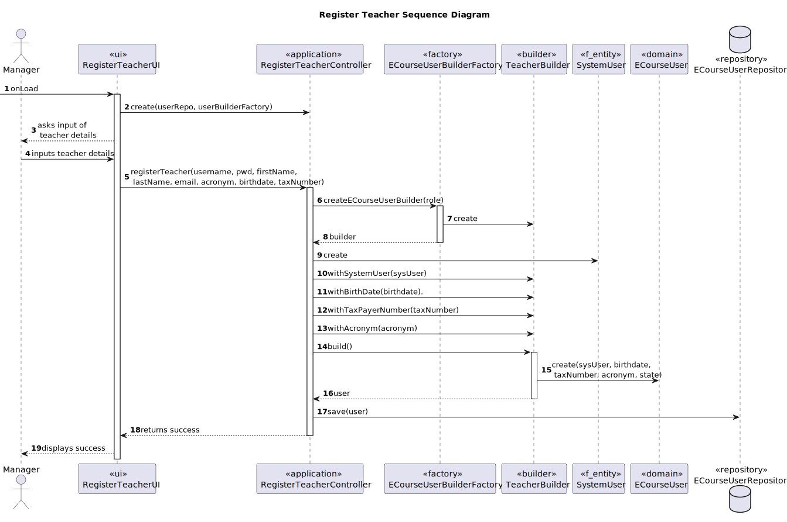

---
**[UC1001.3] As a Manager, I want to be able to register a manager in the system.**

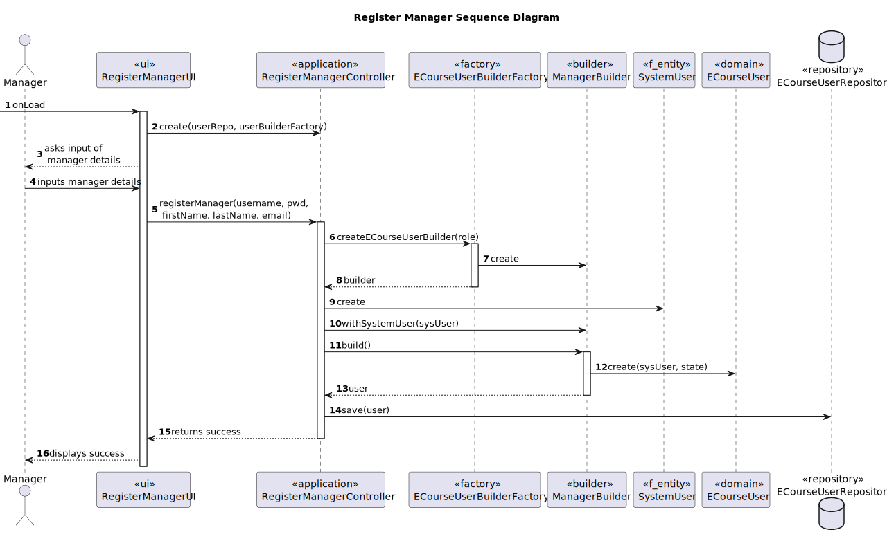

---

**4.2.2. As a Manager, I want to be able to enable/disable users.**

As stated before, the enabling and disabling of users will only affect their State attribute, as no other action is
required. 

To ensure that if in the future further actions are required, there is flexibility in the code, this feature was split
into 2 use cases, one for enabling and one for disabling.

Therefore, there will be 2 controllers, one for each use case, this makes so that if in the future anything changes
it is just needed to add logic to the respective controller, and not to the other one.

___
**[UC1001.4] As a Manager, I want to be able to disable a user in the system.**

The list of users is a responsibility of UC1001.6, therefore, further details about the list of users can be found in
that use case sequence diagram.

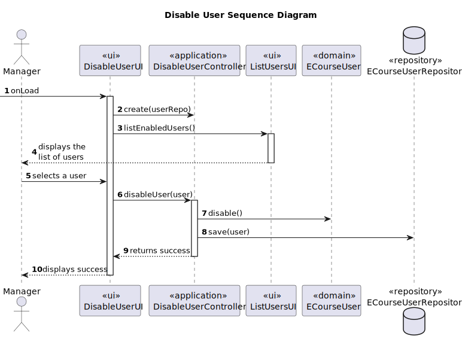
___
**[UC1001.5] As a Manager, I want to be able to enable a user in the system.**

The list of users is a responsibility of UC1001.6, therefore, further details about the list of users can be found in
that use case sequence diagram.

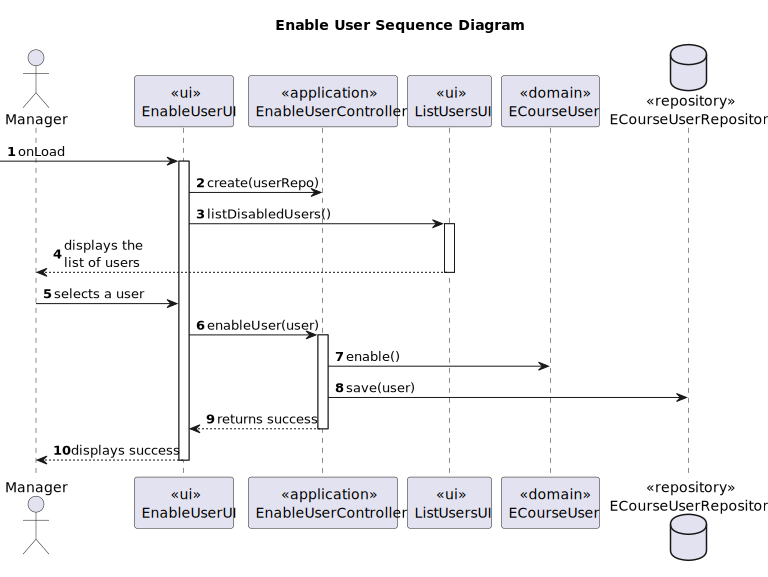
___
**[UC1001.6] As a Manager, I want to be able to list the users in the system.**

Although this use case will be able to print all the users, the enabled users and the disabled users, only the list of
all the users will be represented in a sequence diagram, since the other 2 are very similar to this one.

The only actual differences will be names of the methods and the printed information.

The manager will be asked to choose from the following options:
- List all users
- List enabled users
- List disabled users

and then the process will continue accordingly.

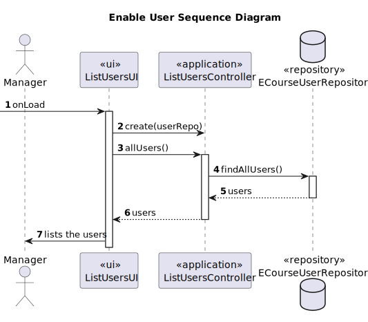

### 4.3. Applied Patterns

Some main patterns used in this user story as a whole are:

* **Single Responsibility Principle + High Cohesion:** *Every class has only one responsibility, which leads to higher 
cohesion.*
* **Open/Closed Principle:** *We could've considered the first 3-use cases to be one and share a controller, but that
would lead to possible hard times in the future if we wanted to have more types of users.*
* **Dependency Injection:** *Instead of instantiating the repositories or services that will be used inside the classes,
they are received by parameter.* *
* **Information Expert:** *The UserRepository is the IE of the Users.*
* **Low Coupling + Dependency Inversion:** *All the classes are loosely coupled, not depending on concrete classes,
rather depending on interfaces.*

Overall, the SOLID and GRASP principles were applied.

*The dependency injection should be made with the help of a framework, such as Spring, but since the project is not
using any framework, it was decided to use the constructor injection, which is the most basic form of dependency
injection. By using dependency injection, the code is more scalable, flexible, and it is easier to test.

### 4.4. Tests

Since, for now, there is only the requirement of having unit tests, only those were implemented.

For each use case, there will be the code of one test. The others are also implemented, but they are not shown here as 
that would make the document too long.

Notes:
- All tests cases, both unit and integration, can and should be also executed manually, by running the application
and assuring that everything is running smoothly.
- For the first 3 use cases, a sysUser is considered invalid if it doesn't the role to be using the constructor of the
role

#### 4.4.1. UC1001.1 - Test cases

##### 4.4.1.1 UC1001.1 - Unit Tests

| Test Case | Description                                                         | Expected Result                  |
|:---------:|:--------------------------------------------------------------------|:---------------------------------|
|     1     | Create a student with valid data                                    | ECourseUser is created           |
|     2     | Create a student with no sysUser                                    | Exception is thrown              |
|     3     | Create a student with an invalid sysUser                            | Exception is thrown              |
|     4     | Create a student with no userBirthdate                              | Exception is thrown              |
|     5     | Create a student with no taxpayer number                            | Exception is thrown              |
|     6     | Create a student with no mechanographic number                      | Exception is thrown              |
|     7     | Create a valid userBirthdate                                        | Birthdate is created             |
|     8     | Create a userBirthdate with a date after today's date               | Exception is thrown              |  
|     9     | Create a userBirthdate with a null date                             | Exception is thrown              |
|    10     | Create a valid taxpayer number                                      | Taxpayer number is created       |
|    11     | Create a taxpayer number with no value                              | Exception is thrown              |
|    12     | Create a taxpayer number with letters                               | Exception is thrown              |
|    13     | Create a taxpayer number with length different than 9 digits        | Exception is thrown              |
|    14     | Create a taxpayer number that does not respect portuguese rules     | Exception is thrown              |
|    15     | Create a valid mechanographic number                                | Mechanographic number is created |
|    16     | Create a mechanographic number with year different from the current | Exception is thrown              |
|    17     | Create a mechanographic number with no value                        | Exception is thrown              |
|    18     | Create a mechanographic number no year                              | Exception is thrown              |
|    19     | Create a mechanographic number no number                            | Exception is thrown              |


- **Create valid Student test**:
````java
@BeforeEach
        void setUp() {
            // Create a SystemUser
            final Set<Role> roles = new HashSet<>();
            roles.add(ECourseRoles.STUDENT);
            SystemUserBuilder builder = UserBuilderHelper.builder();
            builder.withUsername("username")
                    .withPassword("pwdBigTest1")
                    .withEmail("stu@gmail.com")
                    .withName("stud", "test").withRoles(roles);
            systemUser = builder.build();

            // Create a UserBirthdate
            final var birth = LocalDate.of(2003, 3, 16);
            userBirthdate = new UserBirthdate(birth);

            userTaxNumber = new UserTaxNumber("243989890");

            // Create a UserMechanographicNumber
            final var currentYear = LocalDate.now().getYear();
            userMechanographicNumber = new UserMechanographicNumber(currentYear + "00001");
        }

        @Test
        void ensureValidStudentIsCreated() {
            // Act
            ECourseUser student = new ECourseUser(systemUser, userTaxNumber, userBirthdate, userMechanographicNumber);

            // Assert
            Assertions.assertNotNull(student);
        }
````


##### 4.4.1.2 UC1001.1 - Integration Tests

The unit tests cover the majority of the cases, but to ensure the functionality is working as a whole, some of the tests
could be done with integration tests.
The most important ones being:
    
- Register a student with valid data and assure it was saved in the repository.
- Register a student with invalid data and assure it was not saved in the repository.
- Ask the MechanographicNumberAssigner for a new mechanographic number and assure it was the expected one. (Implemented)

Performing integration tests for the student comes with the extra advantage of assuring that all the right steps are
being taken in the right order, accounting with the use of the MechanographicNumberAssigner.

- **MechanographicNumberAssigner Integration Tests**: 
````java
 @Test
    void ensureMechanographicNumberAssignerReturnsCorrectMechanographicNumber() {
        // Arrange
        String currentYear = String.valueOf(LocalDate.now().getYear());
        UserMechanographicNumber lastMechNumInRepo = new UserMechanographicNumber(currentYear + "00001");
        when(eCourseUserRepository.findLastMechanographicNumberInYear(currentYear)).thenReturn(Optional.of(lastMechNumInRepo));
        UserMechanographicNumber expectedMechanographicNumber = new UserMechanographicNumber(currentYear + "00002");

        // Act
        UserMechanographicNumber actualMechanographicNumber = mechanographicNumberAssigner.newMechanographicNumber();

        // Assert
        assertEquals(expectedMechanographicNumber, actualMechanographicNumber);
    }
````

````java
    @Test
    void ensureMechanographicNumberAssignerReturnsCorrectMechanographicNumberWhenLastMechanographicNumberIsNotPresent() {
        // Arrange
        String currentYear = String.valueOf(LocalDate.now().getYear());
        when(eCourseUserRepository.findLastMechanographicNumberInYear(currentYear)).thenReturn(Optional.empty());
        UserMechanographicNumber expectedMechanographicNumber = new UserMechanographicNumber(currentYear + "00001");

        // Act
        UserMechanographicNumber actualMechanographicNumber = mechanographicNumberAssigner.newMechanographicNumber();

        // Assert
        assertEquals(expectedMechanographicNumber, actualMechanographicNumber);
    }
````

#### 4.4.2. UC1001.2 - Test cases

##### 4.4.2.1 UC1001.2 - Unit Tests

| Test Case | Description                                            | Expected Result        |
|:---------:|:-------------------------------------------------------|:-----------------------|
|     1     | Create a teacher with valid data                       | ECourseUser is created |
|     2     | Create a teacher with no sysUser                       | Exception is thrown    |
|     3     | Create a teacher with an invalid sysUser               | Exception is thrown    |
|     4     | Create a teacher with no userBirthdate                 | Exception is thrown    |
|     5     | Create a teacher with no taxpayer number               | Exception is thrown    |
|     6     | Create a teacher with no acronym                       | Exception is thrown    |
|     7     | Create a valid acronym                                 | Acronym is created     |
|     8     | Create an acronym with no value                        | Exception is thrown    |
|     9     | Create an acronym with length > maximum defined length | Exception is thrown    |
|    10     | Create an acronym with numbers                         | Exception is thrown    |
|    11     | Create an acronym with non capital letters             | Exception is thrown    |

The teacher also has a taxpayer number and a userBirthdate, like the student. The tests to those classes are already covered.

- **Create valid Teacher test**:
````java
@BeforeEach
void setUp() {
        // Create a SystemUser
        final Set<Role> roles = new HashSet<>();
        roles.add(ECourseRoles.TEACHER);
        SystemUserBuilder builder = UserBuilderHelper.builder();
        builder.withUsername("username")
        .withPassword("pwdBigTest1")
        .withEmail("tea@gmail.com")
        .withName("teach", "test").withRoles(roles);
        systemUser = builder.build();

        // Create a UserBirthdate
        final var birth = LocalDate.of(2003, 3, 16);
        userBirthdate = new UserBirthdate(birth);

        userTaxNumber = new UserTaxNumber("243989890");
        userAcronym = new UserAcronym("TST");
}

@Test
void ensureValidTeacherIsCreated() {
        // Act
        ECourseUser teacher = new ECourseUser(systemUser, userTaxNumber, userBirthdate, userAcronym);

        // Assert
        Assertions.assertNotNull(teacher);
}
````


##### 4.4.2.2 UC1001.2 - Integration Tests

Like in the previous use case, the unit tests cover the majority of the cases, but to ensure the functionality
is working as a whole, some of the tests could be done with integration tests.
The most important ones being:

- Register a teacher with valid data and assure it was saved in the repository.
- Register a teacher with invalid data and assure it was not saved in the repository.

#### 4.4.3. UC1001.3 - Test cases

##### 4.4.3.1 UC1001.3 - Unit Tests

| Test Case | Description                              | Expected Result                  |
|:---------:|:-----------------------------------------|:---------------------------------|
|     1     | Create a manager with valid data         | ECourseUser is created           |
|     2     | Create a manager with no sysUser         | Exception is thrown              |
|     3     | Create a manager with an invalid sysUser | Exception is thrown              |

- **Create valid Manager test**:

````java
 @BeforeEach
        void setUp() {
            // Create a SystemUser
            final Set<Role> roles = new HashSet<>();
            roles.add(ECourseRoles.MANAGER);
            SystemUserBuilder builder = UserBuilderHelper.builder();
            builder.withUsername("username")
                    .withPassword("pwdBigTest1")
                    .withEmail("man@gmail.com")
                    .withName("many", "test").withRoles(roles);
            systemUser = builder.build();
        }

        @Test
        void ensureValidManagerIsCreated() {
            // Act
            ECourseUser manager = new ECourseUser(systemUser);

            // Assert
            Assertions.assertNotNull(manager);
        }
````

##### 4.4.3.1 UC1001.3 - Integration Tests

Once again, the unit tests cover everything, but it's always good to have some integration tests to assure that
everything is working as a whole.

- Register a manager with valid data and assure it was saved in the repository.
- Register a manager with invalid data and assure it was not saved in the repository.

#### 4.4.4. UC1001.4 - Test cases

#####  4.4.4.1 UC1001.4 - Unit tests

| Test Case | Description             | Expected Result     |
|:---------:|:------------------------|:--------------------|
|     1     | Disable an enabled User | User gets disabled  |
|     2     | Disable a disabled User | Exception is thrown |

````java
@Test
void ensureEnabledUserIsDisabled() {
    // Arrange
    // Create a SystemUser
    final Set<Role> roles = new HashSet<>();
    roles.add(ECourseRoles.MANAGER);
    SystemUserBuilder builder = UserBuilderHelper.builder();
    builder.withUsername("username")
            .withPassword("pwdBigTest1")
            .withEmail("man@gmail.com")
            .withName("many", "test").withRoles(roles);
    var systemUser = builder.build();
    ECourseUser manager = new ECourseUser(systemUser);

    // Act
    manager.disable();

    // Assert
    Assertions.assertFalse(manager.isEnabled());
}

@Test
void ensureDisablingDisabledUserThrowsException() {
        // Arrange
        // Create a SystemUser
        final Set<Role> roles = new HashSet<>();
        roles.add(ECourseRoles.MANAGER);
        SystemUserBuilder builder = UserBuilderHelper.builder();
        builder.withUsername("username")
        .withPassword("pwdBigTest1")
        .withEmail("man@gmail.com")
        .withName("many", "test").withRoles(roles);
        var systemUser = builder.build();
        ECourseUser manager = new ECourseUser(systemUser);

        // Act
        manager.disable();

        // Assert
        Assertions.assertThrows(IllegalStateException.class, manager::disable);
}

    
````

#####  4.4.4.2 UC1001.4 - Integration tests

- Disable an enabled user and assure it was saved in the repository as disabled.
- Disable a disabled user and assure it was not saved in the repository.

#### 4.4.5. UC1001.5 - Test cases

#####  4.4.5.1 UC1001.5 - Unit tests

| Test Case | Description             | Expected Result     |
|:---------:|:------------------------|:--------------------|
|     1     | Enable an disabled User | User gets enabled   |
|     2     | Enable a enabled User   | Exception is thrown |

````java
@Test
void ensureDisabledUserIsEnabled() {
    // Arrange
    // Create a SystemUser
    final Set<Role> roles = new HashSet<>();
    roles.add(ECourseRoles.MANAGER);
    SystemUserBuilder builder = UserBuilderHelper.builder();
    builder.withUsername("username")
    .withPassword("pwdBigTest1")
    .withEmail("man@gmail.com")
    .withName("many", "test").withRoles(roles);
    var systemUser = builder.build();
    ECourseUser manager = new ECourseUser(systemUser);

    // Act
    manager.disable();
    manager.enable();

    // Assert
    Assertions.assertTrue(manager.isEnabled());
}

@Test
void ensureEnablingEnableUserThrowsException() {
    // Arrange
    // Create a SystemUser
    final Set<Role> roles = new HashSet<>();
    roles.add(ECourseRoles.MANAGER);
    SystemUserBuilder builder = UserBuilderHelper.builder();
    builder.withUsername("username")
    .withPassword("pwdBigTest1")
    .withEmail("man@gmail.com")
    .withName("many", "test").withRoles(roles);
    var systemUser = builder.build();
    ECourseUser manager = new ECourseUser(systemUser);

    // Act & Assert
    Assertions.assertThrows(IllegalStateException.class, manager::enable);
}
    
````

#####  4.4.5.2 UC1001.5 - Integration tests

- Enable a disabled user and assure it was saved in the repository as enabled.
- Enable an enabled user and assure it was not saved in the repository.

#### 4.4.6. UC1001.6 - Test cases

There is really no relevant test for this use case, since it's only getting a list from the repository and printing it.

Even if we used mocks, there would be no benefit in doing so, since we would get the mocked results right away.

## 5. Demonstration

Here is a series of videos executing the user story functionalities.

### 5.1 Registering a User

#### 5.1.1 Student

https://user-images.githubusercontent.com/103595766/234706801-659b0d6a-a8d7-4fae-ba64-209ae767129c.mp4

#### 5.1.2 Teacher

https://user-images.githubusercontent.com/103595766/234707071-25c8578d-79f1-4b98-a6a0-14ac5dd4b616.mp4

#### 5.1.3 Manager

https://user-images.githubusercontent.com/103595766/234707307-08b93390-dc64-4bcf-bc47-71b12c1db53b.mp4

### 5.2 Listing Users

https://user-images.githubusercontent.com/103595766/234707546-56ab8244-8eed-4205-904a-04bce092f3e8.mp4

### 5.3 Disable and Enable a User

https://user-images.githubusercontent.com/103595766/234707813-ed5a0f19-044f-4b73-ac93-fbb0a2d9fa06.mp4


## 6. Implementation

Here is a list of the main classes and their responsibilities:
- **ECourseUser:** Represents our domain user.

We have a constructor for each type of user, and each one has its own fields.

To ensure some coherence between a domain user and a system user, the primary key of the domain user is the same as the
system user's (username).

````java
@Entity
public class ECourseUser implements AggregateRoot<String> {

    private static final long serialVersionUID = 1L;
    @Id
    @GeneratedValue(strategy = GenerationType.AUTO)
    private Long id;

    // Just because SystemUser's email has protected access
    @Column(unique = true)
    private String email;

    @OneToOne(cascade = CascadeType.ALL, optional = false)
    private SystemUser systemUser;
    @Embedded
    UserTaxNumber userTaxNumber;
    @Embedded
    UserBirthdate userBirthDate;
    @Enumerated(EnumType.STRING)
    private UserState userState;
    // Field only used by student
    @Embedded
    private UserMechanographicNumber userMechanographicNumber;
    // Field only used by teacher
    @Embedded
    private UserAcronym userAcronym;


    /**
     * Instantiates a new Student
     *
     * @param user                     the user
     * @param userTaxNumber            the user tax number
     * @param userBirthDate            the user birthdate
     * @param userMechanographicNumber the user mechanographic number
     * @throws IllegalArgumentException if the user is null
     * @throws IllegalArgumentException if the user doesn't have the role of student
     * @throws IllegalArgumentException if the userTaxNumber is null
     * @throws IllegalArgumentException if the userBirthDate is null
     * @throws IllegalArgumentException if the userMechanographicNumber is null
     */
    public ECourseUser(final SystemUser user, final UserTaxNumber userTaxNumber, final UserBirthdate userBirthDate, final UserMechanographicNumber userMechanographicNumber) {
        // Check if the systemUser is not null
        if (user == null) {
            throw new IllegalArgumentException("SystemUser can't be null");
        }
        this.systemUser = user;
        this.email = systemUser.email().toString();

        // Check if the system user is valid (has the role of the student)
        if (!user.hasAny(ECourseRoles.STUDENT)) {
            throw new IllegalArgumentException("SystemUser must have the role of student");
        }

        // Check if the userTaxNumber is not null
        if (userTaxNumber == null) {
            throw new IllegalArgumentException("UserTaxNumber can't be null");
        }
        this.userTaxNumber = userTaxNumber;

        // Check if the userBirthDate is not null
        if (userBirthDate == null) {
            throw new IllegalArgumentException("UserBirthDate can't be null");
        }
        this.userBirthDate = userBirthDate;

        // Check if the userMechanographicNumber is not null
        if (userMechanographicNumber == null) {
            throw new IllegalArgumentException("UserMechanographicNumber can't be null");
        }
        this.userMechanographicNumber = userMechanographicNumber;

        this.userState = UserState.ENABLED;
    }


    /**
     * Instantiates a new Teacher
     *
     * @param user          the user
     * @param userTaxNumber the user tax number
     * @param userBirthDate the user birthdate
     * @param userAcronym   the user acronym
     * @throws IllegalArgumentException if the user is null
     * @throws IllegalArgumentException if the user doesn't have the role of teacher
     * @throws IllegalArgumentException if the userTaxNumber is null
     * @throws IllegalArgumentException if the userBirthDate is null
     * @throws IllegalArgumentException if the userAcronym is null
     */
    public ECourseUser(final SystemUser user, final UserTaxNumber userTaxNumber, final UserBirthdate userBirthDate, final UserAcronym userAcronym) {
        // Check if the systemUser is not null
        if (user == null) {
            throw new IllegalArgumentException("SystemUser can't be null");
        }
        this.systemUser = user;
        this.email = systemUser.email().toString();

        // Check if the system user is valid (has the role of the teacher)
        if (!user.hasAny(ECourseRoles.TEACHER)) {
            throw new IllegalArgumentException("SystemUser must have the role of teacher");
        }

        // Check if the userTaxNumber is not null
        if (userTaxNumber == null) {
            throw new IllegalArgumentException("UserTaxNumber can't be null");
        }
        this.userTaxNumber = userTaxNumber;

        // Check if the userBirthDate is not null
        if (userBirthDate == null) {
            throw new IllegalArgumentException("UserBirthDate can't be null");
        }
        this.userBirthDate = userBirthDate;

        // Check if the userAcronym is not null
        if (userAcronym == null) {
            throw new IllegalArgumentException("UserAcronym can't be null");
        }
        this.userAcronym = userAcronym;

        this.userState = UserState.ENABLED;
    }


    /**
     * Instantiates a new Manager
     *
     * @param user the user
     * @throws IllegalArgumentException if the user is null
     * @throws IllegalArgumentException if the user doesn't have the role of manager
     */
    public ECourseUser(final SystemUser user) {
        // Check if the systemUser is not null
        if (user == null) {
            throw new IllegalArgumentException("SystemUser can't be null");
        }
        this.systemUser = user;
        this.email = systemUser.email().toString();

        // Check if the system user is valid (has the role of the student)
        if (!user.hasAny(ECourseRoles.MANAGER)) {
            throw new IllegalArgumentException("SystemUser must have the role of manager");
        }

        this.userState = UserState.ENABLED;
    }
    
    @Override
    public String toString() {
        if (this.systemUser.hasAny(ECourseRoles.STUDENT)) {
            return String.format("Student: %s | %s | %s | %s| %s | %s | %s", this.systemUser.username(),
                    this.userMechanographicNumber, this.systemUser.name(), this.userTaxNumber, this.userBirthDate,
                    this.systemUser.email(), this.userState);
        } else if (this.systemUser.hasAny(ECourseRoles.TEACHER)) {
            return String.format("Teacher: %s | %s | %s | %s | %s | %s | %s", this.systemUser.username(),
                    this.userAcronym, this.systemUser.name(), this.userTaxNumber, this.userBirthDate,
                    this.systemUser.email(), this.userState);
        } else if (this.systemUser.hasAny(ECourseRoles.MANAGER)) {
            return String.format("Manager: %s | %s | %s | %s", this.systemUser.username(),
                    this.systemUser.name(), this.systemUser.email(), this.userState);
        }
        // It only happens if the user is a superuser
        return "";
    }

    protected ECourseUser() {
        // for ORM purposes only
    }

    @Override
    public boolean sameAs(Object other) {
        return DomainEntities.areEqual(this, other);
    }

    @Override
    public String identity() {
        return this.email;
    }

    @Override
    public boolean equals(Object o) {
        if (this == o) return true;
        if (o == null || getClass() != o.getClass()) return false;
        ECourseUser user = (ECourseUser) o;
        return Objects.equals(id, user.id);
    }
}
````
- **RegisterStudentController:** Controller for the UC1001.1.

This is the implementation of the controller for registering a student. As specified in the design topic about this use
case, we can see that the controller is using the StudentBuilder to create the student and then saving it in the
repository. All the controllers related to the registration of a user look very similar.

We can see it making use of eapli's framework classes to create a system user.

Also, we can see the controller receiving the dependencies through the constructor, ensuring Dependency Injection

````java
public class RegisterStudentController {

    // Controller for creating a system user
    private final CreateSystemUserController createSystemUserController = new CreateSystemUserController();
    private final IeCourseUserRepository userRepository;
    private final IeCourseUserBuilderFactory userBuilderFactory;


    /**
     * Instantiates a controller for registering a student.
     * Receives the user repository and the user builder factory as parameters. (DI)
     *
     * @param userRepository     the user repository
     * @param userBuilderFactory the user builder factory
     */
    public RegisterStudentController(IeCourseUserRepository userRepository,
                                     IeCourseUserBuilderFactory userBuilderFactory) {
        if ( userRepository == null ) {
            throw new IllegalArgumentException("User repository must be provided.");
        }
        this.userRepository = userRepository;
        if ( userBuilderFactory == null ) {
            throw new IllegalArgumentException("User builder factory must be provided.");
        }
        this.userBuilderFactory = userBuilderFactory;
    }

    /**
     * Register student eCourse user that is a student.
     *
     * @param username  the username
     * @param pwd       the pwd
     * @param firstName the first name
     * @param lastName  the last name
     * @param email     the email
     * @param birthdate the birthdate
     * @param taxNumber the tax number
     * @return the student
     */
    public ECourseUser registerStudent(String username, String pwd, String firstName, String lastName, String email,
                                       UserBirthdate birthdate, UserTaxNumber taxNumber) throws IllegalArgumentException {
        // Create a system user
        Set<Role> roles = Set.of(ECourseRoles.STUDENT);
        SystemUser systemUser;
        try {
            systemUser = createSystemUserController.addUser(username, pwd, firstName, lastName, email, roles);
        } catch (IllegalArgumentException e) {
            throw new IllegalArgumentException("Error creating the user. Please make sure you fill all the fields" +
                    " correctly and that you properly respect the password policy." +
                    "\nPassword policy: 6 characters minimum, at least one Capital letter, one number.");
        }

        // Create a builder for the student
        StudentBuilder builder =  userBuilderFactory.createStudentBuilder();

        // Build the student
        builder.withSystemUser(systemUser)
                .withUserBirthDate(birthdate)
                .withUserTaxNumber(taxNumber);
        ECourseUser student = builder.build();

        // Save the student
        return userRepository.save(student);
    }
}
````
- **ECourseUserBuilderFactory:** Factory for the ECourseUserBuilder, it creates the builder for each type of user.

A simple implementation of the factory pattern for the creation of the builders for the users.

````java
public class ECourseUserBuilderFactory implements IeCourseUserBuilderFactory {
    
    @Override
    public StudentBuilder createStudentBuilder() {
        return new StudentBuilder(new MechanographicNumberAssigner(PersistenceContext.repositories().eCourseUsers()));
    }

    @Override
    public TeacherBuilder createTeacherBuilder() {
        return new TeacherBuilder();
    }

    @Override
    public ManagerBuilder createManagerBuilder() {
        return new ManagerBuilder();
    }
}

````
- **StudentBuilder:** Used to build an ECourseUser that represents a student. It has the responsibility of creating
the student and for that it uses the MechanographicNumberAssigner.

An implementation of the builder pattern for the creation of the students. It uses the MechanographicNumberAssigner to
assign a mechanographic number to the student. Receives the MechanographicNumberAssigner as a dependency in the
constructor (DI pattern), and uses it to assign the mechanographic number to the student.

````java
public class StudentBuilder implements IeCourseUserBuilder{

    private SystemUser systemUser;
    private UserTaxNumber userTaxNumber;
    private UserBirthdate userBirthdate;

    private IMechanographicNumberAssigner mechanographicNumberAssigner;

    /**
     * Instantiates a new Student builder.
     * Receives the mechanographic number assigner as a dependency (DI pattern)
     *
     * @param mechanographicNumberAssigner the mechanographic number assigner
     */
    public StudentBuilder(IMechanographicNumberAssigner mechanographicNumberAssigner) {
        if (mechanographicNumberAssigner == null) {
            throw new IllegalArgumentException("Mechanographic number assigner must be provided!");
        }
        this.mechanographicNumberAssigner = mechanographicNumberAssigner;
    }


    @Override
    public StudentBuilder withSystemUser(SystemUser systemUser) {
        this.systemUser = systemUser;
        return this;
    }

    /**
     * Add user tax number to the student builder.
     *
     * @param userTaxNumber the user tax number
     * @return the student builder
     */
    public StudentBuilder withUserTaxNumber(UserTaxNumber userTaxNumber) {
        this.userTaxNumber = userTaxNumber;
        return this;
    }

    /**
     * Add user birthdate to the student builder.
     *
     * @param userBirthDate the user birthdate
     * @return the student builder
     */
    public StudentBuilder withUserBirthDate(UserBirthdate userBirthDate) {
        this.userBirthdate = userBirthDate;
        return this;
    }


    /**
     * Build the "Student".
     *
     * @return the eCourseUser
     */
    @Override
    public ECourseUser build() {
        // Ask the mechanographic number assigner for a new mechanographic number
        UserMechanographicNumber userMechanographicNumber = this.mechanographicNumberAssigner.newMechanographicNumber();

        // Return the student
        return new ECourseUser(this.systemUser, this.userTaxNumber, this.userBirthdate, userMechanographicNumber);
    }
}
````
- **MechanographicNumberAssigner:** Used to assign a mechanographic number to a student. Implements the interface
IMechanographicNumberAssigner.

By creating an interface that is used by the StudentBuilder, we can easily change the behavior of the assigner, by 
creating another implementation of the interface, being this a good example of how the strategy pattern can be used
to assure the flexibility of the code.

It receives the repository of the users as a dependency in the constructor (DI pattern).

````java
public class MechanographicNumberAssigner implements IMechanographicNumberAssigner{

    private final IeCourseUserRepository userRepository;

    /**
     * Instantiates a new Mechanographic number assigner.
     * Receives the user repository as a dependency (DI pattern)
     *
     * @param userRepository the user repository
     */
    public MechanographicNumberAssigner(IeCourseUserRepository userRepository) {
        if ( userRepository == null ) {
            throw new IllegalArgumentException("User repository must be provided.");
        }
        this.userRepository = userRepository;
    }


    @Override
    public UserMechanographicNumber newMechanographicNumber() {
        String currentYear = String.valueOf(java.time.Year.now().getValue());

        // Call the repository to get the last mechanographic number in the current year
        UserMechanographicNumber lastMechanographicNumber = userRepository.findLastMechanographicNumberInYear(currentYear).orElse(null);

        // If there is no user with a mechanographic number in the current year, return the first one
        if (lastMechanographicNumber == null) {
            return new UserMechanographicNumber(currentYear + "00001");
        }

        // Otherwise, increment the last mechanographic number and return it
        return new UserMechanographicNumber(String.valueOf(Integer.parseInt(lastMechanographicNumber.toString()) + 1));
    }
}
````

- **IeCourseUserRepository:** Interface for a Repository for the ECourseUser.

This interface is used to define the methods that the repository for the ECourseUser must implement.

By having a repository interface, we can easily have multiple implementations of the repository (strategy pattern),
we are also adhering to the repository pattern, since the repository is the one that has the access to the data.

````java
public interface IeCourseUserRepository extends DomainRepository<String, ECourseUser> {

    /**
     * Find last mechanographic number in year.
     *
     * @param year the year
     * @return the last mechanographic number in the given year or empty
     */
    Optional<UserMechanographicNumber> findLastMechanographicNumberInYear(String year);

    /**
     * Returns all users that are enabled.
     *
     * @return the iterable of users
     */
    Iterable<ECourseUser> findAllEnabledUsers();

    /**
     * Returns all users that are disabled.
     *
     * @return the iterable of users
     */
    Iterable<ECourseUser> findAllDisabledUsers();
}
````

- **JpaECourseUserRepository:** Implementation of the IeCourseUserRepository interface.

This implementation makes use of the JPA to access the data.
````java
public class JpaECourseUserRepository extends eCourseJpaRepositoryBase<ECourseUser, String, String>
        implements IeCourseUserRepository {

    public JpaECourseUserRepository() {
        super("id");
    }

    @Override
    public Optional<UserMechanographicNumber> findLastMechanographicNumberInYear(String year) {
        // TypedQuery in JPQL that returns the last mechanographic number in a given year
        final TypedQuery<UserMechanographicNumber> query = entityManager().createQuery(
                "SELECT u.userMechanographicNumber FROM ECourseUser u" +
                        " WHERE u.userMechanographicNumber.mechanographicNumber LIKE :year " +
                        "ORDER BY u.userMechanographicNumber.mechanographicNumber DESC",
                UserMechanographicNumber.class);
        query.setParameter("year", year + "%");

        try {
            return Optional.ofNullable(query.setMaxResults(1).getSingleResult());
        } catch (NoResultException e) {
            return Optional.empty();
        }
    }

    @Override
    public Iterable<ECourseUser> findAllEnabledUsers() {
        // TypedQuery in JPQL that returns all enabled users
        final TypedQuery<ECourseUser> query = entityManager().createQuery(
                "SELECT u FROM ECourseUser u WHERE u.userState = :userState",
                ECourseUser.class);
        query.setParameter("userState", UserState.ENABLED);

        return query.getResultList();
    }

    @Override
    public Iterable<ECourseUser> findAllDisabledUsers() {
        // TypedQuery in JPQL that returns all disabled users
        final TypedQuery<ECourseUser> query = entityManager().createQuery(
                "SELECT u FROM ECourseUser u WHERE u.userState = :userState",
                ECourseUser.class);
        query.setParameter("userState", UserState.DISABLED);

        return query.getResultList();
    }
}
````

## 7. Observations

- A possible improvement would be to add an abstract controller for the registration of users, since all register
controllers have the same methods and at least the parameters:
"IeCourseUserBuilderFactory" and "IECourseUserRepository".


