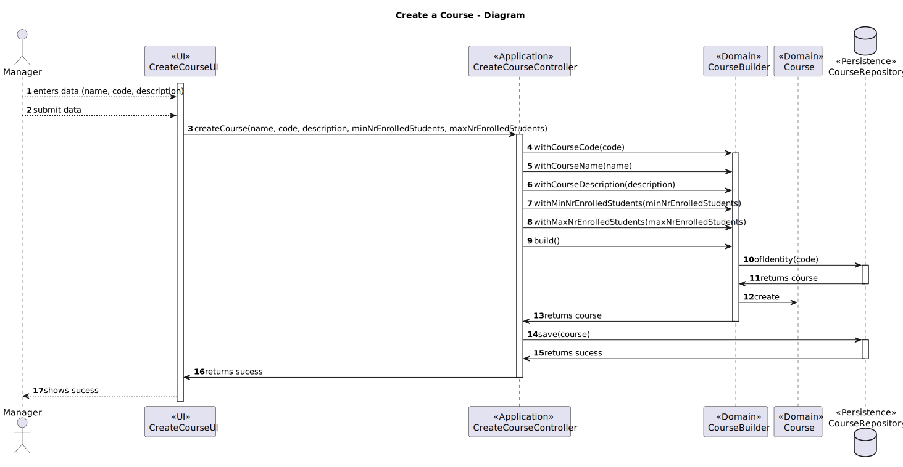

# US1002 - As Manager, I want to create courses

## 1. Context

This requirement is related to the creation of courses in the system.
A [course](../MainDocs/glossary.md) consists of classes and exams. 
It has a name, a unique code, a description, a teacher in charge and other teachers that lecture the course 
and a minimum and maximum number of enrolled students.
It also has a state, which can either be: 
* **_close_** - Course has been created but not yet opened.
* **_open_** - Course is open
* **_enroll_** - Course is open for enrollments
* **_in progress_** - Course is closed for enrollments, so it is in progress
* **_closed_** - Course has ended

## 2. Requirements

In order to create a course, there must be a manager logged in the system.
The manager must then provide the following information:
- The code of the course.
- The name of the course.
- The description of the course.
- The min and max limit of students that can enroll in the course.

The teachers of the course are defined later, after the course is created.
Students can only enroll in the course after it is created and ready for enrollments.
This information will then be validated, and if it is valid, the course will be created.

## 3. Analysis

This User Story is relatively simple, since it only requires the <span style="color: #d0734c">**creation of a course**</span>.
For this, a manager needs to **log in the system**, and then **provide the information** needed to create a course.

This information will then be <span style="color: #d0734c">**validated**</span>, and if it is valid, the course will be created. 
Each class, whether the entity Course or its attributes, are responsible for <span style="color: #d0734c">**validating their own information**</span>.
There is, although, an <span style="color: #d0734c">**exception**</span> to this rule, which is the code of the course.
This code must be <span style="color: #d0734c">**unique**</span>, and therefore, there needs to be communication between the CourseCode class and the CourseRepository.
As the CourseCode class is a value object, it doesn't make much sense that it communicates directly with the CourseRepository.
So, in order to solve this problem, a builder was introduced,<span style="color: #d0734c">**CourseBuilder**</span>.
This class has the responsibility of creating a course, and therefore, it is the one that will communicate with the CourseRepository, in order to check if the code is unique.

Another important aspect to point out, is the fact that the Controller class, _CreateCourseController_, will receive a CourseRepository, and not a specific implementation of it.
This is done in order to follow the **Dependency Injection Principle**. 
Which allows us to have a low coupling between the classes, high cohesion and more flexibility.


## 4. Design

### 4.1. Class Diagram


### 4.2. Sequence Diagram

This sequence diagram represents the case of a successful creation of a course.

The creation can fail for the following reasons:
- The manager provides an empty code.
- The manager provides an already existing code.
- The manager provides an empty name.
- The manager provides a one-word or empty description.
- The manager provides a negative minimum number of students.
- The manager provides a maximum number of students that is lower than the minimum number of students.
- The manager provides a negative maximum number of students.




### 4.3. Applied Patterns

Some main patterns used in this functionality are:

* **Single Responsibility Principle:** *Every class has only one responsibility.*
* **Information Expert:** *The CourseRepository is the IE of the Courses.*
* **Dependency Injection:** *The CreateCourseController will receive a CourseRepository, not depending on a specific implementation*
* **Low Coupling:** *All the classes are loosely coupled, not depending on concrete classes.*
* **High Cohesion:** *All the classes have a high cohesion, since they have only one responsibility.*

### 4.4. Tests

| Test Case | Description                                                                       | Expected Result     |
|:---------:|:----------------------------------------------------------------------------------|:--------------------|
|     1     | Create a course with a valid code, name and description                           | Course is created   |
|     2     | Create a course with an empty code                                                | Exception is thrown |
|     3     | Create a course with an already existing code                                     | Exception is thrown |
|     4     | Create a course with an empty name                                                | Exception is thrown |
|     5     | Create a course with an empty description                                         | Exception is thrown |
|     6     | Create a course with a one-word description                                       | Exception is thrown |
|     7     | Create a course with a negative minimum number of students                        | Exception is thrown |
|     8     | Create a course with a maximum number of students that is lower than the minimum  | Exception is thrown |
|     9     | Create a course with a negative maximum number of students                        | Exception is thrown |


## 5. Demonstration

In order to run this functionality you must first run the Manager program.
Then, you must log in, and select the option to create a course.
You will then be prompted to provide the information needed to create a course.

There is a video demonstrating the creation of a course, which can be found in the following link:

https://user-images.githubusercontent.com/116153853/235497808-f5744f8c-6c04-4a80-a3fc-184308ca7d2e.mp4


## 6. Code

### Input - CreateCourseUI

```java
public class CreateCourseUI {

    private final CreateCourseController controller = new CreateCourseController(PersistenceContext.repositories().courses());
    
    public void doShow() {

        final String courseCode = Console.readNonEmptyLine("Course Code: ", "Please provide a course code");
        final String courseName = Console.readNonEmptyLine("Course Name: ", "Please provide a course name");
        final String courseDescription = Console.readNonEmptyLine("Course Description: ", "Please provide a course description");

    }
}
```

### Creation of a Course - CreateCourseController

```java
public class CreateCourseController {

    private final CourseRepository repo;

    public CreateCourseController(CourseRepository repo) {
        this.repo = repo;
    }

    /**
     * Creates a new course and saves it to the database
     *
     * @param courseCode - Course's Code
     * @param courseName - Course's Name
     * @param courseDescription - Course's Description
     */
    public void createCourse(String courseCode, String courseName, String courseDescription) {
        Course course = new CourseBuilder(repo)
                .withCourseCode(courseCode)
                .withCourseName(courseName)
                .withCourseDescription(courseDescription)
                .build();

        repo.save(course);
    }
}
```

### CourseCode build() - CourseBuilder

```java
public class CourseBuilder {

    private final CourseRepository courseRepository;

    public CourseBuilder(CourseRepository courseRepository) {
        this.courseRepository = courseRepository;
    }

    public Course build() {

        if (repo.findByCode(courseCode) != null)
            throw new IllegalArgumentException("Course code already exists");

        return new Course(courseCode, courseName, courseDescription);
    }
}

```

### Find Course by Code - JpaCourseRepository

```java
public class JpaCourseRepository extends eCourseJpaRepositoryBase<Course, CourseCode, CourseCode> implements CourseRepository {

    @Override
    public Course findByCode(String courseCode) {
        final TypedQuery<Course> query = entityManager().createQuery(
                "SELECT c FROM Course c WHERE c.courseCode.courseCode = :code", Course.class);
        query.setParameter("code", courseCode);

        try {
            return query.getSingleResult();
        } catch (Exception e) {
            return null;
        }
    }
}

```

## 7. Tests

### Course Tests

```java
public class CourseTest {

    @Test
    public void ensureCourseIsCreatedWithValidInformation() {
        // Arrange
        String courseCode = "LAPR4";
        String courseName = "LAPR4";
        String courseDescription = "This is a course";
        Course course = new Course(courseCode, courseName, courseDescription);

        String stringCourse = "CourseCode: " + courseCode + " | CourseName: " + courseName + " | CourseState: " + "CLOSE";

        // Assert
        Assert.assertEquals(course.toString(), stringCourse);
    }

    @Test
    public void ensureCourseIsNotCreateWithEmptyCourseCode() {
        // Arrange
        String courseCode = "";
        String courseName = "LAPR4";
        String courseDescription = "This is a course";

        // Assert
        Assert.assertThrows(IllegalArgumentException.class, () -> new Course(courseCode, courseName, courseDescription));
    }
    
}
    
```

### CourseBuilder Tests

```java
public class CourseBuilderTest {

    CourseRepository courseRepo;

    @BeforeEach
    void setUp() {
        courseRepo = mock(CourseRepository.class);
    }

    @Test
    public void ensureCourseBuilderReturnsCorrectCourse() {
        // Arrange
        CourseBuilder courseBuilder = new CourseBuilder(courseRepo);
        String courseCode = "1234";
        String courseName = "Test Course";
        String courseDescription = "Test Course Description";
        when(courseRepo.findByCode(courseCode)).thenReturn(null);

        // Act
        Course course = courseBuilder.withCourseCode(courseCode)
                .withCourseName(courseName)
                .withCourseDescription(courseDescription)
                .build();

        String courseString = "CourseCode: " + courseCode + " | CourseName: " + courseName + " | CourseState: " + "CLOSE";

        // Assert
        Assertions.assertEquals(course.toString(), courseString);
    }

    @Test
    public void ensureCourseBuilderThrowsExceptionWhenCourseCodeAlreadyExists() {
        // Arrange
        CourseBuilder courseBuilder = new CourseBuilder(courseRepo);
        String courseCode = "1234";
        String courseName = "Test Course";
        String courseDescription = "Test Course Description";
        Course course = new Course(courseCode, courseName, courseDescription);
        when(courseRepo.findByCode(courseCode)).thenReturn(course);

        // Act
        Assertions.assertThrows(IllegalArgumentException.class, () -> {
            courseBuilder.withCourseCode(courseCode)
                    .withCourseName(courseName)
                    .withCourseDescription(courseDescription)
                    .build();
        });
    }
}
```
