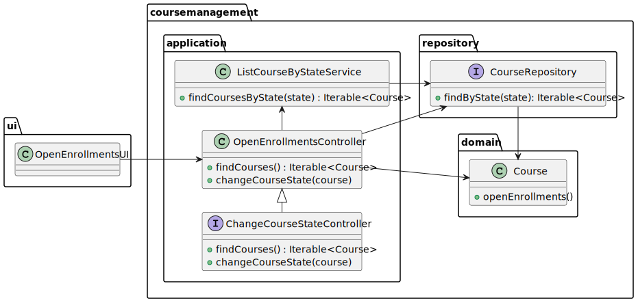
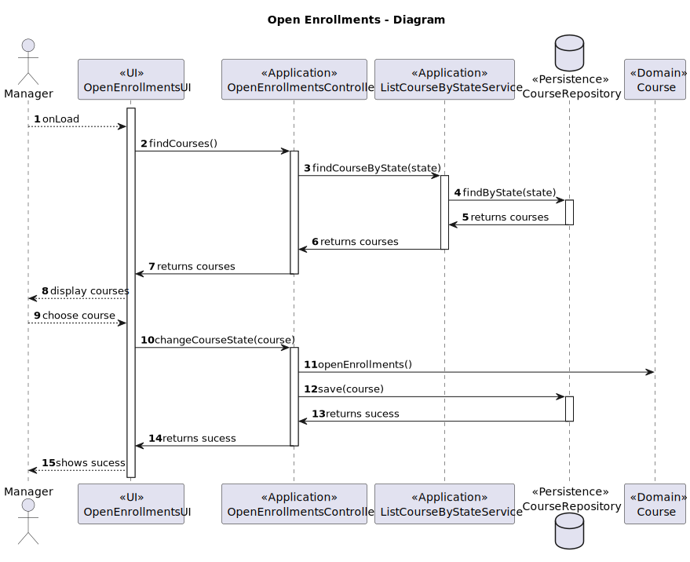
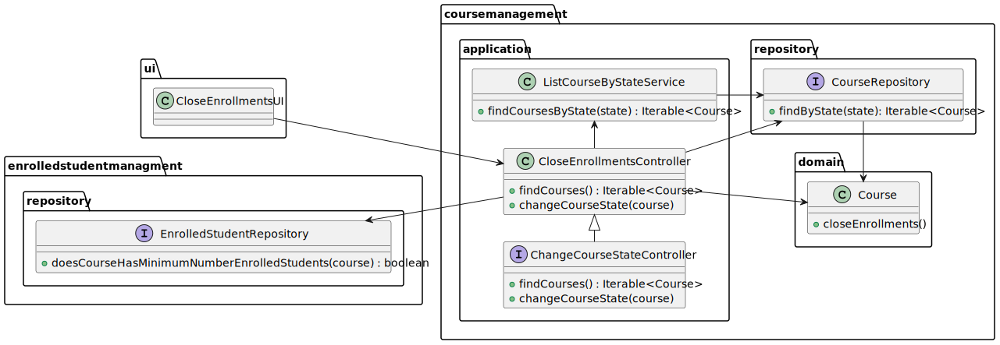
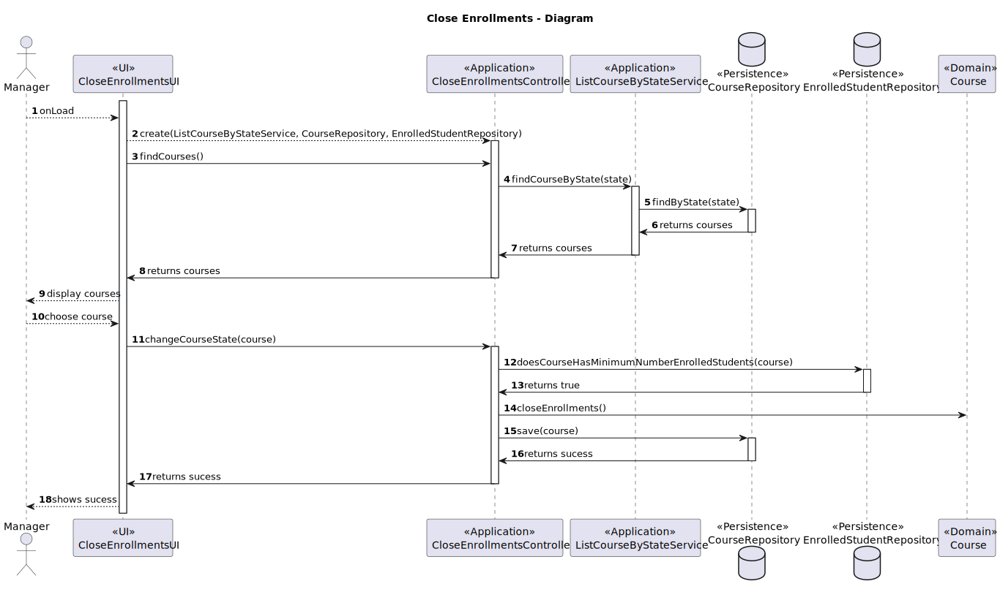

# US1003 - As Manager, I want to open and close enrollments

## 1. Context

This requirement is related to <span style="color: #d0734c">**opening**</span> and <span style="color: #d0734c">**closing enrollments**</span>  in a course.
A course has a state, which keeps track of the current <span style="color: #d0734c">**state of the course**</span>.
In order to open the enrollments of a course, the manager must first create it, and then change its state to open, and finally, open the enrollments.
To close them, the manager, must perform the same steps, and then close the enrollments, changing the state of the course to **in_progress**.

## 2. Requirements

In order to open or close enrollments in a course, there must be **a manager logged** in the system.
To open a course the manager must select a course that has an **open** state, and then change its state to **enroll**.

To close the enrollments, the manager must select a course that has an **enroll** state, and then change its state to **in_progress**.


## 3. Analysis

This User Story has two main very similar functionalities, which are opening and closing enrollments.
Both, open and close enrollments, <span style="color: #d0734c">**consist of changing the state of a course**</span>. 
The only difference between them is the <span style="color: #d0734c">**previous state**</span> of the course, which must be **open** to open enrollments, and **enroll** to close them.

So two different UI and Controllers will be created, one for each functionality.
However, each Controller will implement the same <span style="color: #d0734c">**interface**</span> as they **share the same goal** but with different validations.
This interface will be called **ChangeCourseStateController** and will be shared by both controllers and by the US1004 (Open/Close Course).

By approaching the problem in this way, if new states were introduced, we would only need to create a new Controller, which would implement the same interface.
This controller would have the same methods, but with different validations, depending on the new state.

### 3.1 Interface - ChangeCourseStateController

This controller has two methods:
- **findCourse** - Finds the course which are relevant to the functionality.
- **changeCourseState** - Changes the state of the course.

Each controller which implements the interface will have a different implementation of these methods, depending on the functionality.

## 4. Design

### 4.1. Open Enrollments

#### 4.1.1. Class Diagram




## 4.1.2 Sequence Diagram

This sequence diagram represents the case opening of enrollments with success.

Can fail for the following reasons:
- The course is not in an **open** state.




<br>

### 4.2. Close Enrollments

#### 4.2.1. Class Diagram




## 4.2.1 Sequence Diagram

This sequence diagram represents the case closing of enrollments with success.

Can fail for the following reasons:
- The course is not in an **enroll** state.





### 4.3. Applied Patterns

Some main patterns used in this functionality are:

* **Single Responsibility Principle:** *Every class has only one responsibility.*
* **Information Expert:** *The CourseRepository is the IE of the Courses.*
* **Dependency Injection:** *Each Controller will receive a CourseRepository and a ListCourseByState, not depending on a specific implementation*
* **Interface Segregation Principle:** *The CourseRepository only has the methods that are needed.*
* **Open/Close Principle:** *The Interface ChangeCourseStateController is open for extension, but close for modification*
* **Liskov Substitution Principle** *The CourseRepository is a subtype of the Repository interface.*
* **Low Coupling:** *All the classes are loosely coupled, not depending on concrete classes.*
* **High Cohesion:** *All the classes have a high cohesion, since they have only one responsibility.*

### 4.4. Tests

| Test Case | Description                                                             | Expected Result        |
|:---------:|:------------------------------------------------------------------------|:-----------------------|
|     1     | Open Enrollment                                                         | Returns True           |
|     2     | Close Enrollment                                                        | Returns True           |
|     3     | Ensure Course does not open enrollments being in a _close_ state        | Exception is thrown    |
|     4     | Ensure Course does not open enrollments being in a _enroll_ state       | Exception is thrown    |
|     4     | Ensure Course does not open enrollments being in a _in_progress_ state  | Exception is thrown    |
|     4     | Ensure Course does not open enrollments being in a _closed_ state       | Exception is thrown    |
|     5     | Ensure Course does not close enrollments being in a _close_ state       | Exception is thrown    |
|     5     | Ensure Course does not close enrollments being in a _open_ state        | Exception is thrown    |
|     5     | Ensure Course does not close enrollments being in a _in_progress_ state | Exception is thrown    |
|     5     | Ensure Course does not close enrollments being in a _closed_ state      | Exception is thrown    |


## 5. Demonstration

In order to run this functionality you must:
- Run the Manager application and login as a manager
- Select the option **Open Enrollments**/**Close Enrollments**
- Select the course you want to open/close enrollments
- The course's state will be changed to **enroll**/**in_progress**

Here's a quick demo demostrating how to open/close enrollments in a course.

https://user-images.githubusercontent.com/116153853/235496349-dd0c1bd1-64bf-4716-940a-819ec0b1cf87.mp4


## 6. Code

### Input - OpenEnrollmentsUI

```java
public class OpenEnrollmentsUI implements AbstractUI {

    @Override
    protected boolean doShow() {
        ListSelector<Course> listSelector =
                new ListSelector<>("Open State Courses", (Collection<Course>) controller.findCourses());

        if (listSelector.isEmpty()) {
            errorMessage("There are no courses in an open state");
            Sleeper.sleep(1000);
            return false;
        }

        listSelector.showAndSelectWithExit();

        try {
            controller.changeCourseState(listSelector.getSelectedElement());
            System.out.println();
        } catch (IllegalArgumentException e) {
            errorMessage(e.getMessage());
            Sleeper.sleep(1000);
            return false;
        }

        successMessage("Course state changed successfully");
        Sleeper.sleep(1000);

        return false;
    }
}
```

### ChangeCourseStateController

```java
public class ChangeCourseStateController {

    /**
     * Finds all courses depending on the state
     *
     * @return all courses
     */
    Iterable<Course> findCourses();


    /**
     * Changes the course state
     *
     * @param course - course to change state
     */
    void changeCourseState(Course course);
    
}
```

### OpenEnrollmentsController

```java
public class OpenEnrollmentsController {

    /**
     * Finds all courses with state OPEN
     *
     * @return all courses with state OPEN
     */
    @Override
    public Iterable<Course> findCourses() {
        return listService.findCoursesByState(CourseState.OPEN);
    }


    /**
     * Changes the course state to ENROLL
     *
     * @param course the course to change the state
     */
    @Override
    public void changeCourseState(Course course) {
        course.openEnrollments();

        repo.save(course);
    }
}
```

### Find Course By State - JpaCourseRepository

```java
public class JpaCourseRepository extends eCourseJpaRepositoryBase<Course, CourseCode, CourseCode> implements CourseRepository {

    @Override
    public Iterable<Course> findCoursesByState(CourseState state) {
        final TypedQuery<Course> query = entityManager().createQuery(
                "SELECT c FROM Course c WHERE c.courseState = :state", Course.class);
        query.setParameter("state", state);

        try {
            return query.getResultList();
        } catch (Exception e) {
            return null;
        }
    }
}

```

## 7. Tests

### Course Tests

```java
public class CourseTest {

    @Test
    public void ensureCourseOpensEnrollment() {
        // Arrange
        String courseCode = "LAPR4";
        String courseName = "LAPR4";
        String courseDescription = "This is a course";
        Course course = new Course(courseCode, courseName, courseDescription);

        // Act
        course.openCourse();
        course.openEnrollments();

        // Assert
        Assert.assertTrue(course.areEnrollmentsOpen());
    }


    @Test
    public void ensureCourseDoesNotOpenEnrollmentsInAEnrollState() {
        // Arrange
        String courseCode = "LAPR4";
        String courseName = "LAPR4";
        String courseDescription = "This is a course";
        Course course = new Course(courseCode, courseName, courseDescription);

        // Act
        course.openCourse();
        course.openEnrollments();

        // Assert
        Assert.assertThrows(IllegalStateException.class, course::openEnrollments);
    }


    @Test
    public void ensureCourseDoesNotOpenEnrollmentsInAProgressState() {
        // Arrange
        String courseCode = "LAPR4";
        String courseName = "LAPR4";
        String courseDescription = "This is a course";
        Course course = new Course(courseCode, courseName, courseDescription);

        // Act
        course.openCourse();
        course.openEnrollments();
        course.closeEnrollments();

        // Assert
        Assert.assertThrows(IllegalStateException.class, course::openEnrollments);
    }


    @Test
    public void ensureCourseClosesEnrollment() {
        // Arrange
        String courseCode = "LAPR4";
        String courseName = "LAPR4";
        String courseDescription = "This is a course";
        Course course = new Course(courseCode, courseName, courseDescription);

        // Act
        course.openCourse();
        course.openEnrollments();
        course.closeEnrollments();

        // Assert
        Assert.assertTrue(course.isInProgress());
    }


    @Test
    public void ensureCourseDoesNotCloseEnrollmentInAIn_ProgressState() {
        // Arrange
        String courseCode = "LAPR4";
        String courseName = "LAPR4";
        String courseDescription = "This is a course";
        Course course = new Course(courseCode, courseName, courseDescription);

        // Act
        course.openCourse();
        course.openEnrollments();
        course.closeEnrollments();

        // Assert
        Assert.assertThrows(IllegalStateException.class, course::closeEnrollments);
    }


    @Test
    public void ensureCourseDoesNotCloseEnrollmentInAClosedState() {
        // Arrange
        String courseCode = "LAPR4";
        String courseName = "LAPR4";
        String courseDescription = "This is a course";
        Course course = new Course(courseCode, courseName, courseDescription);

        // Act
        course.openCourse();
        course.openEnrollments();
        course.closeEnrollments();

        // Assert
        Assert.assertThrows(IllegalStateException.class, course::closeEnrollments);
    }
}
    
```
