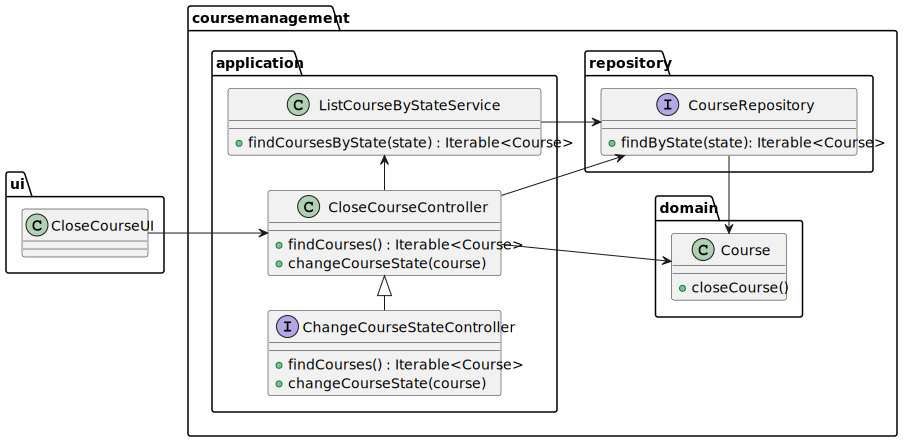
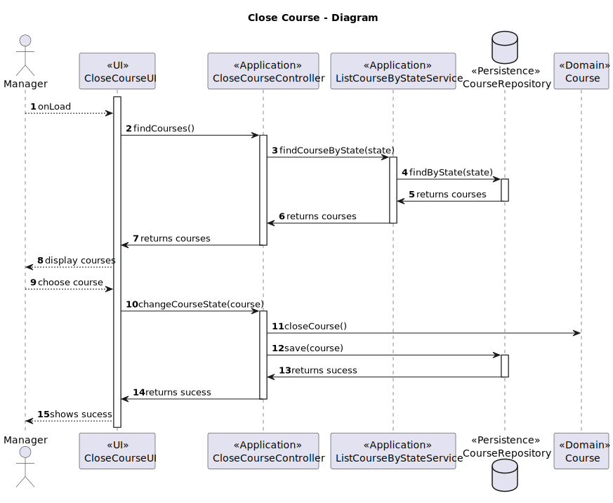

# US1004 - As Manager, I want to open and close course

## 1. Context

This requirement is related to <span style="color: #d0734c">**opening**</span> and <span style="color: #d0734c">**closing of a course**</span>.
A course has a state, which keeps track of the current <span style="color: #d0734c">**state of the course**</span>.
In order to open a course, it has to be in a **close** state, and then it can be opened.
To close it, the manager, must open the course, open and close the enrollments, and finally it can be changed to **closed**.

## 2. Requirements

In order to open or close a course, there must be **a manager logged** in the system.
To open a course the manager must select a course that has a **close** state, and then change its state to **open**.

To close it, the manager must select a course that has an **in_progress** state, and then change its state to **closed**.


## 3. Analysis

This User Story has two main very similar functionalities, which are opening and closing of a course.
Both, open and close, <span style="color: #d0734c">**consist of changing the state of a course**</span>.
The only difference between them is the <span style="color: #d0734c">**previous state**</span> of the course, which must be **close** to open, and **in_progress** to close it.

So two different UI and Controllers will be created, one for each functionality.
However, each Controller will implement the same <span style="color: #d0734c">**interface**</span> as they **share the same goal** but with different validations.
This interface will be called **ChangeCourseStateController**, the same interface used in the US1003.

By approaching the problem in this way, if new states were introduced, we would only need to create a new Controller, which would implement the same interface.
This controller would have the same methods, but with different validations, depending on the new state.

### 3.1 Interface - ChangeCourseStateController

This controller has two methods:
- **findCourse** - Finds the course which are relevant to the functionality.
- **changeCourseState** - Changes the state of the course.

Each controller which implements the interface will have a different implementation of these methods, depending on the functionality.

## 4. Design

### 4.1. Open Course

#### 4.1.1. Class Diagram


## 4.1.2 Sequence Diagram

This sequence diagram represents the case opening of a course with success.

Can fail for the following reasons:
- The course is not in a **close** state.


<br>

### 4.2. Close Enrollments

#### 4.2.1. Class Diagram




## 4.2.1 Sequence Diagram

This sequence diagram represents the case closing of a course with success.

Can fail for the following reasons:
- The course is not in an **in_progress** state.





### 4.3. Applied Patterns

Some main patterns used in this functionality are:

* **Single Responsibility Principle:** *Every class has only one responsibility.*
* **Information Expert:** *The CourseRepository is the IE of the Courses.*
* **Dependency Injection:** *Each Controller will receive a CourseRepository and a ListCourseByState, not depending on a specific implementation*
* **Interface Segregation Principle:** *The CourseRepository only has the methods that are needed.*
* **Open/Close Principle:** *The Interface ChangeCourseStateController is open for extension, but close for modification*
* **Liskov Substitution Principle** *The CourseRepository is a subtype of the Repository interface.*
* **Low Coupling:** *All the classes are loosely coupled, not depending on concrete classes.*
* **High Cohesion:** *All the classes have a high cohesion, since they have only one responsibility.*

### 4.4. Tests

| Test Case | Description                                                 | Expected Result        |
|:---------:|:------------------------------------------------------------|:-----------------------|
|     1     | Open Course                                                 | Returns True           |
|     2     | Close Course                                                | Returns True           |
|     3     | Ensure Course does not open being in a _open_ state         | Exception is thrown    |
|     4     | Ensure Course does not open being in a _enroll_ state       | Exception is thrown    |
|     4     | Ensure Course does not open being in a _in_progress_ state  | Exception is thrown    |
|     4     | Ensure Course does not open being in a _closed_ state       | Exception is thrown    |
|     5     | Ensure Course does not close being in a _close_ state       | Exception is thrown    |
|     5     | Ensure Course does not close being in a _open_ state        | Exception is thrown    |
|     5     | Ensure Course does not close being in a _enroll_ state      | Exception is thrown    |
|     5     | Ensure Course does not close being in a _in_progress_ state | Exception is thrown    |


## 5. Demonstration

In order to run this functionality you must:
- Run the Manager application and login as a manager
- Select the option **Open Course**/**Close Course**
- Select the course you want to open/close
- The course's state will be changed to **open**/**closed**

Here it is a quick demo demonstrating how to open/close a course

https://user-images.githubusercontent.com/116153853/235497075-9060f491-07f8-44e8-8504-0989a952ad0d.mp4


## 6. Code

### Input - OpenCourseUI

```java
public class OpenCourseUI implements AbstractUI {

    @Override
    protected boolean doShow() {
        ListSelector<Course> listSelector =
                new ListSelector<>("Close State Courses", (Collection<Course>) controller.findCourses());

        if (listSelector.isEmpty()) {
            errorMessage("There are no courses in an close state");
            Sleeper.sleep(1000);
            return false;
        }

        listSelector.showAndSelectWithExit();

        try {
            controller.changeCourseState(listSelector.getSelectedElement());
            System.out.println();
        } catch (IllegalArgumentException e) {
            errorMessage(e.getMessage());
            Sleeper.sleep(1000);
            return false;
        }

        successMessage("Course state changed successfully");
        Sleeper.sleep(1000);

        return false;
    }
}
```

### ChangeCourseStateController

```java
public class ChangeCourseStateController {

    /**
     * Finds all courses depending on the state
     *
     * @return all courses
     */
    Iterable<Course> findCourses();


    /**
     * Changes the course state
     *
     * @param course - course to change state
     */
    void changeCourseState(Course course);
    
}
```

### OpenCourseController

```java
public class OpenCourseController {

    /**
     * Finds all courses with state OPEN
     *
     * @return all courses with state OPEN
     */
    @Override
    public Iterable<Course> findCourses() {
        return listService.findCoursesByState(CourseState.CLOSE);
    }


    /**
     * Changes the course state to ENROLL
     *
     * @param course the course to change the state
     */
    @Override
    public void changeCourseState(Course course) {
        course.openCourse();

        repo.save(course);
    }
}
```

### Find Course By State - JpaCourseRepository

```java
public class JpaCourseRepository extends eCourseJpaRepositoryBase<Course, CourseCode, CourseCode> implements CourseRepository {

    @Override
    public Iterable<Course> findCoursesByState(CourseState state) {
        final TypedQuery<Course> query = entityManager().createQuery(
                "SELECT c FROM Course c WHERE c.courseState = :state", Course.class);
        query.setParameter("state", state);

        try {
            return query.getResultList();
        } catch (Exception e) {
            return null;
        }
    }
}

```

## 7. Tests

### Course Tests

```java
public class CourseTest {

    @Test
    public void ensureCourseOpens() {
        // Arrange
        String courseCode = "LAPR4";
        String courseName = "LAPR4";
        String courseDescription = "This is a course";
        Course course = new Course(courseCode, courseName, courseDescription);

        // Act
        course.openCourse();

        // Assert
        Assert.assertTrue(course.isOpen());
    }


    @Test
    public void ensureCourseDoesNotOpenInAOpenState() {
        // Arrange
        String courseCode = "LAPR4";
        String courseName = "LAPR4";
        String courseDescription = "This is a course";
        Course course = new Course(courseCode, courseName, courseDescription);

        // Act
        course.openCourse();

        // Assert
        Assert.assertThrows(IllegalStateException.class, course::openCourse);
    }


    @Test
    public void ensureCourseDoesNotOpenInAEnrollState() {
        // Arrange
        String courseCode = "LAPR4";
        String courseName = "LAPR4";
        String courseDescription = "This is a course";
        Course course = new Course(courseCode, courseName, courseDescription);

        // Act
        course.openCourse();
        course.openEnrollments();

        // Assert
        Assert.assertThrows(IllegalStateException.class, course::openCourse);
    }


    @Test
    public void ensureCourseCloses() {
        // Arrange
        String courseCode = "LAPR4";
        String courseName = "LAPR4";
        String courseDescription = "This is a course";
        Course course = new Course(courseCode, courseName, courseDescription);

        // Act
        course.openCourse();
        course.openEnrollments();
        course.closeEnrollments();
        course.closeCourse();

        // Assert
        Assert.assertTrue(course.isClosed());
    }


    @Test
    public void ensureCourseDoesNotCloseInACloseState() {
        // Arrange
        String courseCode = "LAPR4";
        String courseName = "LAPR4";
        String courseDescription = "This is a course";
        Course course = new Course(courseCode, courseName, courseDescription);

        // Assert
        Assert.assertThrows(IllegalStateException.class, course::closeCourse);
    }


    @Test
    public void ensureCourseDoesNotCloseInAOpenState() {
        // Arrange
        String courseCode = "LAPR4";
        String courseName = "LAPR5";
        String courseDescription = "This is a course";
        Course course = new Course(courseCode, courseName, courseDescription);

        // Act
        course.openCourse();

        // Assert
        Assert.assertThrows(IllegalStateException.class, course::closeCourse);
    }
}
    
```
