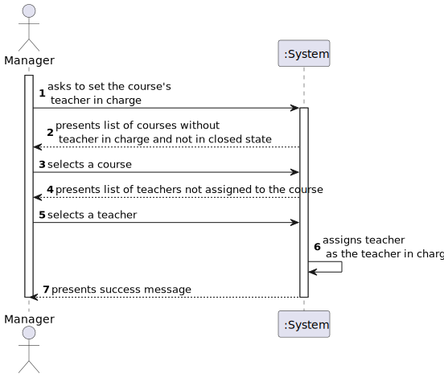
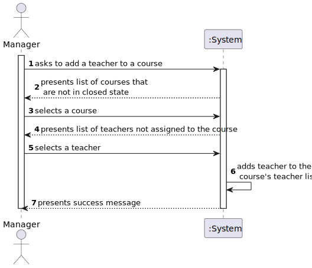
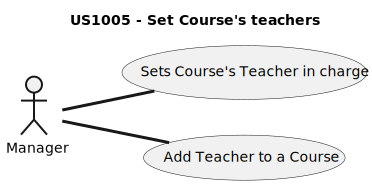
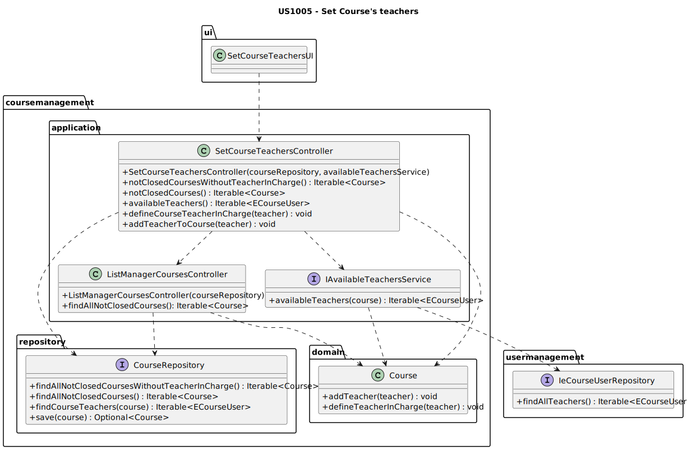
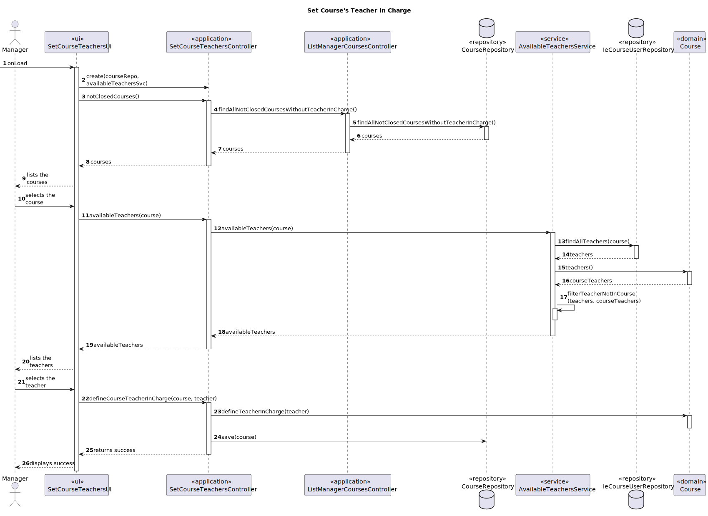

# US1005 —  As Manager, I want to set the teachers of a course

## 1. Context

A Course must have a Teacher in Charge, and also a set of Teachers that will be responsible for the course's classes.

## 2. Requirements

It is required that the following use cases are implemented:

* **UC1005.1** As a Manager, I want to be able to set the course's Teacher in Charge.
* **UC1005.2** As a Manager, I want to be able to add a Teacher to a course.

### Client Clarifications

#### System Specifications Document

- FRC04 - Set Course Teachers Each course may have several teachers and must have
only one Teacher in Charge. 
- Only managers are able to execute this functionality.

## 3. Analysis

In order to set the teacher in charge, and the course teachers of a course, the manager must be able to see the list of
courses that are not in the closed state.

In US1002 we already have the feature of listing all the available courses, so it makes sense to re-utilize the
controller from that use case, and add a new method that lists only the courses that are not in the closed state.

It will also be needed to list all the teachers available in the system, that are not yet added on that course, so that
the manager can choose which ones to assign to the course. For that a new service will be created, that will be used by
the controller to get the list of teachers that are not yet assigned to the course.

There will be a sub menu with 2 options:
- Set Teacher in Charge
- Add Teacher

The Set Teacher in Charge option will only display courses that do not have a teacher in charge yet.
This option will let the manager select one of the teachers from the list, and then assign it as the teacher in charge.

The Add Teacher option will list all the teachers that are not yet assigned to the course, and let the manager select
one of them, and then add it to the course's teachers, each time the teachers are listed, the ones that are already 
assigned to the course will be removed from the list, and the manager will be prompted asking if he wants to add another
teacher. This will go on until he decides to stop adding teachers.

### 3.1. Flux of Events

#### 3.1.1. UC1005.1 — As a Manager, I want to be able to set the course's Teacher in Charge.

Here is the flux of events for the use case UC1005.1. represented by a SSD.  
This will be further detailed in the next section.



#### 3.1.2. UC1005.2 — As a Manager, I want to be able to add a Teacher to a course.

Here is the flux of events for the use case UC1005.2. represented by a SSD.
This will be further detailed in the next section.



### 3.2. Use Case Diagram

A use case diagram was created to represent the use cases that are related to this user story.



## 4. Design

### 4.1. Class Diagram



### 4.2. Sequence Diagrams

Since there are 2 use cases, there will be 2 sequence diagrams, one for each use case.

---
**[UC1005.1] As a Manager, I want to be able to set the course's Teacher in Charge.**



---
**[UC1001.2] As a Manager, I want to be able to add a Teacher to a course.**


### 4.3. Applied Patterns

Some main patterns used in this user story as a whole are:

* **Pure Fabrication:** *The AvailableTeachersService is a pure fabrication, since it is not a real world concept, it
was created to help the controller to get the list of teachers that are not yet assigned to the course.*
* **Controller:** *The controller is responsible for handling the user input, and orchestrating (controlling) the use
cases.*
* **Single Responsibility Principle + High Cohesion:** *Every class has only one responsibility, which leads to higher 
cohesion.*
* **Dependency Injection:** *Instead of instantiating the repositories or services that will be used inside the classes,
they are received by parameter.* *
* **Information Expert:** *The UserRepository and CourseRepository are the IE of the Users and Courses, respectively.*
* **Low Coupling + Dependency Inversion:** *All the classes are loosely coupled, not depending on concrete classes,
rather depending on interfaces.* *

Overall, the SOLID and GRASP principles were applied.

*The dependency injection should be made with the help of a framework, such as Spring, but since the project is not
using any framework, it was decided to use the constructor injection, which is the most basic form of dependency
injection. By using dependency injection, the code is more scalable, flexible, and it is easier to test.  
*Since we are using the controller from another US, it would be nice to have an interface for the controller, so that
we could inject the dependency of the controller, instead of instantiating it inside the class. But since this is a
rather simple application, and the controller is not a complex class, it was decided to instantiate it inside the
class, and not create an interface for it. This note serves as a reminder that, in a real world application, this
should be done, to reduce the coupling even more.

### 4.4. Tests

Since, for now, there is only the requirement of having unit tests, only those were implemented.

For each use case, there will be the code of one test. The others are also implemented, but they are not shown here as 
that would make the document too long.

Notes:
- All tests cases, both unit and integration, can and should be also executed manually, by running the application
and assuring that everything is running smoothly.

##### 4.4.1 Unit Tests

| Test Case | Description                                                 | Expected Result                |
|:---------:|:------------------------------------------------------------|:-------------------------------|
|     1     | Set the teacher in charge in a course without one           | Teacher in charge is set       |
|     2     | Set the teacher in charge in a course that already has one  | Exception is thrown            |
|     3     | Set the teacher in charge with a null teacher               | Exception is thrown            |
|     4     | Set the teacher in charge with a user that is not a teacher | Exception is thrown            |
|     5     | Filter a list of teachers with the AvailableTeacherService  | A filtered list is returned    |
|     6     | Add a teacher to a course that does not have him            | Teacher is added to the course |
|     7     | Add a teacher to a course that already has him              | Exception is thrown            |
|     8     | Add a null teacher to a course                              | Exception is thrown            |
|     8     | Add a user that is not a teacher to a course                | Exception is thrown            |

- **Test case 1 implementation**:
````java
@Test
public void ensureTeacherInChargeIsDefined() {
        // ARRANGE
        // Create a course
        String courseCode = "LAPR4";
        String courseName = "LAPR4";
        String courseDescription = "This is a course";
        Course course = new Course(courseCode, courseName, courseDescription);
        // Create a teacher
        ECourseUser teacher = UserDataSource.getTestTeacher1();

        // ACT
        course.defineTeacherInCharge(teacher);

        // ASSERT
        Assert.assertEquals(course.teacherInCharge(), teacher);
}
````

- **Test case 6 implementation**:
````java
@Test
 public void ensureTeacherIsAddedToCourseTeachers() {
     // ARRANGE
     // Create a course
     String courseCode = "LAPR4";
     String courseName = "LAPR4";
     String courseDescription = "This is a course";
     Course course = new Course(courseCode, courseName, courseDescription);
     // Create a teacher
     ECourseUser teacher = UserDataSource.getTestTeacher1();

     // ACT
     course.addTeacher(teacher);

     // ASSERT
     Assert.assertTrue(course.teachers().contains(teacher));
 }
````

##### 4.4.2 Integration Tests

With the help of mocks, some interesting integration tests that could be made to assure the correct behavior of the
use case are:

| Test Case | Description                                                                          | Expected Result                     |
|:---------:|:-------------------------------------------------------------------------------------|:------------------------------------|
|     1     | Set the teacher in charge in a course without one                                    | Teacher in charge is set            |
|     2     | Set the teacher in charge in a course that already has one                           | Exception is thrown                 |
|     3     | Asking for the available teachers when the course has teachers                       | A filtered list is returned         |
|     4     | Asking for the available teachers when the course has no teachers                    | List w/all the teachers is returned |
|     5     | Asking for the available teachers when the course has all the teachers in the system | Empty list is returned              |

These tests would be made by making the calls to the controller, and assuring that the results are the expected ones.

## 5. Demonstration

Here is a video demonstrating the US, where a teacher is set as the teacher in charge of a course and multiple teachers are added to a course.


https://user-images.githubusercontent.com/103595766/234715526-58540a92-e656-45e0-af3a-d33ec430db11.mp4


## 6. Implementation

Here is a list of the main classes and their responsibilities:

- **Course:**

````java
@Entity
public class Course implements AggregateRoot<CourseCode> {

    private static final long serialVersionUID = 1L;

    @EmbeddedId
    private CourseCode courseCode;
    @Embedded
    private CourseName courseName;
    @Embedded
    private CourseDescription courseDescription;
    @Enumerated(EnumType.STRING)
    private CourseState courseState;
    @ManyToMany(fetch = FetchType.EAGER)
    private List<ECourseUser> courseTeachers;
    @ManyToOne(fetch = FetchType.EAGER)
    private ECourseUser teacherInCharge;


    public Course(final String courseCode, final String courseName, final String courseDescription) {
        this.courseCode = new CourseCode(courseCode);
        this.courseName = new CourseName(courseName);
        this.courseDescription = new CourseDescription(courseDescription);
        this.courseState = CourseState.CLOSE;
        courseTeachers = new ArrayList<>();
    }


    /**
     * Checks if the course is close
     *
     * @return true if the course is close
     */
    public boolean isClose() {
        return this.courseState == CourseState.CLOSE;
    }

    /**
     * Changes the course state to OPEN
     */
    public void openCourse() {
        if (this.courseState != CourseState.CLOSE) {
            throw new IllegalStateException("The course is not in a close state. You can't open it.");
        }

        this.courseState = CourseState.OPEN;
    }

    /**
     * Checks if the course is open
     *
     * @return true if the course is open
     */
    public boolean isOpen() {
        return this.courseState == CourseState.OPEN;
    }

    /**
     * Changes the course state to ENROLL
     */
    public void openEnrollments() {
        if (this.courseState != CourseState.OPEN) {
            throw new IllegalStateException("The course is not open. You can't open enrollments.");
        }

        this.courseState = CourseState.ENROLL;
    }

    /**
     * Checks if the course is in enrollment state
     *
     * @return true if the course is in enrollment state
     */
    public boolean areEnrollmentsOpen() {
        return this.courseState == CourseState.ENROLL;
    }

    /**
     * Changes the course state to IN_PROGRESS
     */
    public void closeEnrollments() {
        if (this.courseState != CourseState.ENROLL) {
            throw new IllegalStateException("The course is not in an enroll state. You can't close enrollments.");
        }

        this.courseState = CourseState.IN_PROGRESS;
    }

    /**
     * Checks if the course is in progress state
     *
     * @return true if the course is in progress state
     */
    public boolean isInProgress() {
        return this.courseState == CourseState.IN_PROGRESS;
    }

    /**
     * Changes the course state to CLOSED
     */
    public void closeCourse() {
        if (this.courseState != CourseState.IN_PROGRESS) {
            throw new IllegalStateException("The course is not in progress. You can't close the course.");
        }

        this.courseState = CourseState.CLOSED;
    }

    /**
     * Checks if the course is closed state
     *
     * @return true if the course is closed state
     */
    public boolean isClosed() {
        return this.courseState == CourseState.CLOSED;
    }

    /**
     * Defines the teacher in charge of the course
     *
     * @param teacherInCharge the teacher in charge
     * @throws IllegalArgumentException if the teacher is null or already defined
     */
    public void defineTeacherInCharge(ECourseUser teacherInCharge) {
        if (teacherInCharge == null) {
            throw new IllegalArgumentException("The teacher in charge can't be null.");
        }
        if (this.teacherInCharge != null) {
            throw new IllegalArgumentException("The teacher in charge is already defined.");
        }
        if (courseTeachers.contains(teacherInCharge)) {
            throw new IllegalArgumentException("The teacher is already in the course.");
        }
        if (!teacherInCharge.isTeacher()) {
            throw new IllegalArgumentException("The teacher in charge must be a teacher.");
        }
        this.teacherInCharge = teacherInCharge;
        this.courseTeachers.add(teacherInCharge);
    }

    /**
     * Adds a teacher to the course.
     *
     * @param teacher the teacher
     * @throws IllegalArgumentException if the teacher is null or already in the course
     */
    public void addTeacher(ECourseUser teacher) {
        if (teacher == null) {
            throw new IllegalArgumentException("The teacher can't be null.");
        }
        if (courseTeachers.contains(teacher)) {
            throw new IllegalArgumentException("The teacher is already in the course.");
        }
        if (!teacher.isTeacher()) {
            throw new IllegalArgumentException("Only teachers can be teachers in a course.");
        }
        courseTeachers.add(teacher);
    }

    /**
     * Returns the teacher in charge of the course
     *
     * @return the e course user
     */
    public ECourseUser teacherInCharge() {
        return teacherInCharge;
    }

    public List<ECourseUser> teachers() {
        return courseTeachers;
    }


    /**
     * @return the course as String
     */
    @Override
    public String toString() {
        return "CourseCode: " + courseCode + " | CourseName: " + courseName + " | CourseState: " + courseState;
    }

    @Override
    public boolean sameAs(Object other) {
        if (!(other instanceof Course)) {
            return false;
        }

        final Course that = (Course) other;
        if (this.equals(that)) {
            return true;
        }

        return identity().equals(that.identity());
    }

    /**
     * @return the courseCode
     */
    @Override
    public CourseCode identity() {
        return courseCode;
    }

    protected Course() {
        // for ORM only
    }
}
````
- **SetCourseTeachersController:** Controller that allows to set the teachers of a course

````java
/**
 * Controller for setting the teachers of a course.
 */
public class SetCourseTeachersController {
    private final CourseRepository courseRepository;
    private final IAvailableTeachersService availableTeachersService;

    /**
     * Instantiates a new controller for setting the teachers of a course.
     *
     * @param courseRepository         the course repository
     * @param availableTeachersService the available teachers service
     */
    public SetCourseTeachersController(CourseRepository courseRepository, IAvailableTeachersService availableTeachersService) {
        this.courseRepository = courseRepository;
        this.availableTeachersService = availableTeachersService;
    }

    /**
     * Returns the not closed courses without a teacher in charge iterable.
     *
     * @return the courses
     */
    public Iterable<Course> notClosedCoursesWithoutTeacherInCharge() {
        return courseRepository.findAllNotClosedCoursesWithoutTeacherInCharge();
    }

    /**
     * Returns the not closed courses.
     *
     * @return the courses
     */
    public Iterable<Course> notClosedCourses() {
        return courseRepository.findAllNotClosedCourses();
    }

    /**
     * Returns the available teachers for the course.
     *
     * @return the teachers
     */
    public Iterable<ECourseUser> availableTeachers() {
        return availableTeachersService.availableTeachers(course);
    }

    /**
     * Defines the course teacher in charge.
     *
     * @param teacher the teacher
     */
    public void defineCourseTeacherInCharge(ECourseUser teacher) {
        course.defineTeacherInCharge(teacher);
        courseRepository.save(course);
    }

    /**
     * Adds a teacher to the course.
     *
     * @param teacher the teacher
     */
    public void addTeacherToCourse(ECourseUser teacher) {
        course.addTeacher(teacher);
        courseRepository.save(course);
    }
}
````

- **AvailableTeachersService:** Service responsible for returning the available teachers for a course (implementation)

````java
public class AvailableTeachersService implements IAvailableTeachersService {

    private final IeCourseUserRepository eCourseUserRepository;

    /**
     * Instantiates a new Available teachers service.
     *
     * @param eCourseUserRepository the e course user repository
     * @throws IllegalArgumentException if the user repository is null
     */
    public AvailableTeachersService(IeCourseUserRepository eCourseUserRepository) {
        if (eCourseUserRepository == null)
            throw new IllegalArgumentException("User repository must be provided.");
        this.eCourseUserRepository = eCourseUserRepository;
    }

    @Override
    public Iterable<ECourseUser> availableTeachers(Course course) {
        List<ECourseUser> allTeachers = (List<ECourseUser>) eCourseUserRepository.findAllTeachers();
        return filterNotAssignedTeachers(allTeachers, course.teachers());
    }

    private List<ECourseUser> filterNotAssignedTeachers(List<ECourseUser> allTeachers, List<ECourseUser> teachersInCourse) {
        allTeachers.removeAll(teachersInCourse);
        return allTeachers;
    }
}
````


