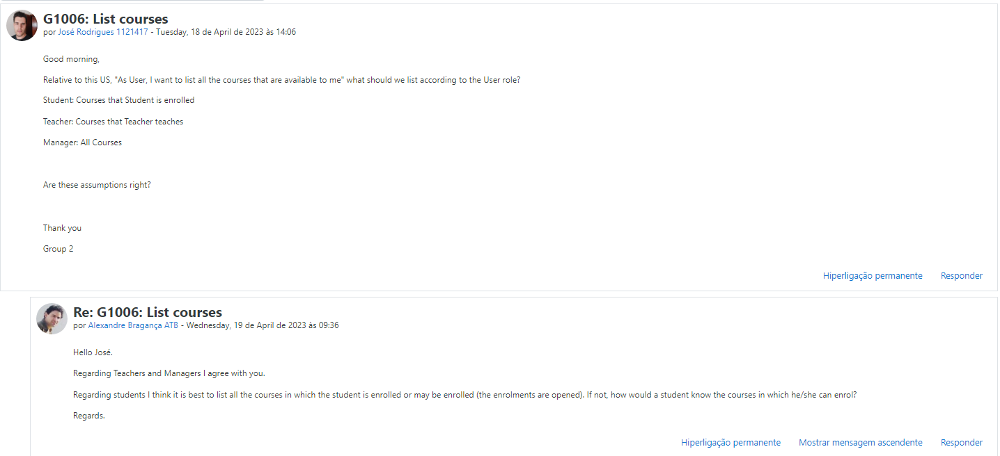
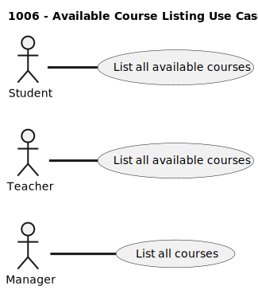
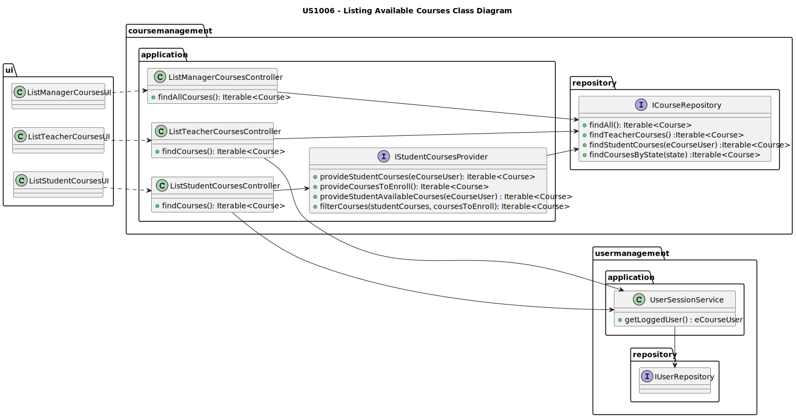
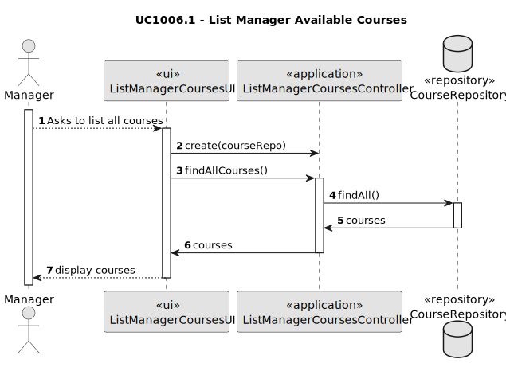
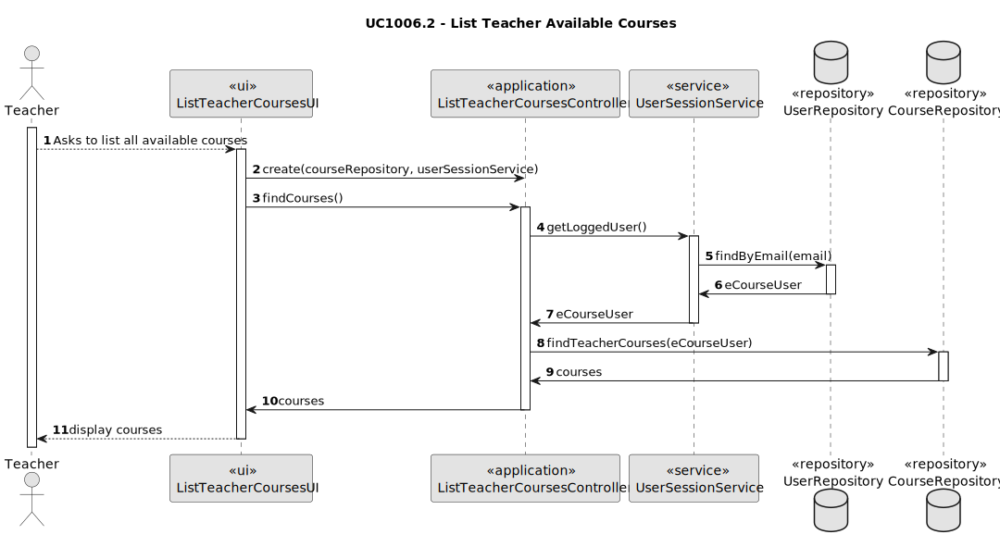
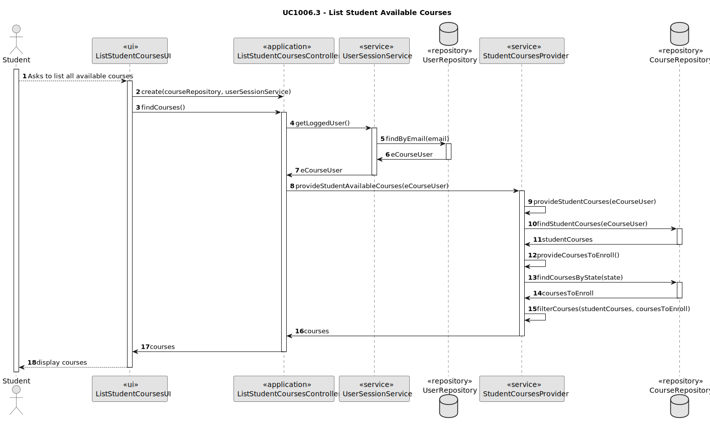

# US1006 - As User, I want to list all the courses that are available to me.

## 1. Context
This US is being developed for the first time, since it was assigned in this sprint (sprint 2).
This requirement is placed in the context of listing all available courses for a [student](../MainDocs/glossary.md), or a [teacher](../MainDocs/glossary.md) or a [manager](../MainDocs/glossary.md).

A [course](../MainDocs/glossary.md) consists of classes and exams and has a name, a code, a description, a teacher in charge and other teachers that lecture the course.
It also has a state, which is a key concept for part of this US, that can be one of the following: 
* **_close_** - Course has been created but not yet opened.
* **_open_** - Course is open.
* **_enroll_** - Course is open for enrollments.
* **_in progress_** - Course is closed for enrollments, so it is in progress.
* **_closed_** - Course has ended.

## 2. Requirements

The following Use Cases are required to be implemented:

* **UC1006.1** As a Manager, I want to list all the courses.
* **UC1006.2** As a Teacher, I want to list all the courses that are available to me.
* **UC1006.3** As a Student, I want to list all the courses that are available to me.

This User Story has some dependencies in other User Stories, which are:
* **US1002** - _As Manager, I want to create courses_.
* **US1005** - _As Manager, I want to set the teachers of a course_.
* **US1009** - _As Manager, I want to approve or reject students applications to courses_.

The previous enumeration of User Stories are dependencies, since to list courses for each system user, it is necessary that courses exist, and that they have courses associated with them or even (in the student case) have permission to submit an application for a course.

## 3. Analysis

<span style="color:red;">**DISCLAIMER**</span>: For organization purposes, and to avoid unnecessary repetitions, since all the Use Cases are related to **_available courses_**, the word **_available_** was suppressed from methods, classes and documentation but should be something to always keep in mind. 

---

 To satisfy all the requirements, it will be necessary to have at least one registered course in the system, being this a dependency to the US1002 - _As Manager, I want to create courses_.
 Since we have 3 split Use Cases from the main User Story, we have to analyze each of them. 
 
**UC1006.1** Analysis:
* For this Use Case, there's not much to mention, since it is the most general where a Manager can list all existing courses.

**UC1006.2** Analysis:
* For this Use Case, a Teacher can list all the courses he's associated with. To obtain this, a filtered search will be necessary. To better understand this idea, you should take a look at the class and sequence diagrams.

**UC1006.3** Analysis:
* For this Use Case, a Student can list all the courses he's already taking and all the courses he can enroll (courses with the "enroll" state). Just like in the Teacher's case, to obtain what's wanted, a filtered search will be necessary . It's also important to take a look at the diagrams.

Note:
This three analysis topics were confirmed with the client through the questions forum in moodle:


For both UC1006.2 and 1006.3, it is also important to know who is the User who's trying to list their available courses, because this listing can be different for each student/teacher for example.

### 3.1. Use case Diagram

Since this US was split in three Use Cases, the following Use Case Diagram was created:



## 4. Design

### 4.1. Class Diagram

* To achieve the goal of the UC1006.3, a service must be created to filter the courses that are available to the Student.



### 4.2. Sequence Diagram

#### 4.2.1
* Sequence Diagram for **UC1006.1**



#### 4.2.2
* Sequence Diagram for **UC1006.2**




#### 4.2.3
* Sequence Diagram for **UC1006.3**



There are some things about this sequence diagram that may need an explanation, such as the method "filterCourses()" which is used to filter the information that comes from the database, in order to return in one list only both the courses the Student is enrolled in and the courses he can enroll without having repetition of courses.

### 4.3. Applied Patterns

Some main patterns used in this functionality are:

* **Model-View-Controller:** *This pattern separates the application into three main components: model (data and business logic), view (user interface), and controller (mediates between the model and view).* 
* **Single Responsibility Principle:** *Every class has only one responsibility.*
* **Information Expert:** *An example would be the CourseRepository being the courses information expert.*
* **Low Coupling:** *All the classes are loosely coupled, not depending on concrete classes, but interfaces instead.*
* **High Cohesion:** *All the classes have a high cohesion, since they have only one responsibility.*
* **Dependency Injection** *As a "solution" for instantiating the used repositories, these are injected as a parameter providing flexibility.*

### 4.4. Tests
* Tests for the listing of available courses for Managers:

```java
public class ListManagerCoursesTest {
 private CourseRepository courseRepository;

 @BeforeEach
 void setUp() {
  courseRepository = mock(CourseRepository.class);
 }

 @Test
 void ensureListManagerCoursesControllerReturnsCorrectCourses() {

  // Arrange
  ArrayList<Course> expectedCourses = new ArrayList<>();
  expectedCourses.add(CourseDataSource.getTestCourse1());
  expectedCourses.add(CourseDataSource.getTestCourse2());
  expectedCourses.add(CourseDataSource.getTestCourse3());

  when(courseRepository.findAll()).thenReturn(expectedCourses);

  // Act
  Iterable<Course> actualCourses = courseRepository.findAll();

  // Assert
  assertTrue(((ArrayList<Course>) actualCourses).containsAll(expectedCourses));
 }
}
```

* Tests for the listing of available courses for Teachers:
```java
public class ListTeacherCoursesTest {
    private CourseRepository courseRepository;

    @BeforeEach
    public void setUp() {
        courseRepository = mock(CourseRepository.class);
    }

    @Test
    public void ensureListTeacherCoursesReturnsCorrectList(){
        // Arrange
        ArrayList<Course> expectedCourses = new ArrayList<>();
        expectedCourses.add(CourseDataSource.getTestCourse1());
        expectedCourses.add(CourseDataSource.getTestCourse2());
        expectedCourses.add(CourseDataSource.getTestCourse3());

        when(courseRepository.findTeacherCourses(UserDataSource.getTestTeacher1())).thenReturn(expectedCourses);

        // Act
        Iterable<Course> actualCourses = courseRepository.findTeacherCourses(UserDataSource.getTestTeacher1());

        // Assert
        assertTrue(((ArrayList<Course>) actualCourses).containsAll(expectedCourses));
    }
}
```

* Tests for the listing of available courses for Students:
```java
public class ListStudentCoursesTest {
    private FindStudentCoursesService studentCoursesProvider;
    private CourseRepository courseRepository;

    @BeforeEach
    public void setUp() {
        courseRepository = mock(CourseRepository.class);
        studentCoursesProvider = new FindStudentCoursesService(courseRepository);
    }

    @Test
    public void ensureListStudentCoursesReturnsCorrectLists() {
        // Arrange
        ArrayList<Course> studentCourses = new ArrayList<>();
        studentCourses.add(CourseDataSource.getTestCourse1());
        studentCourses.add(CourseDataSource.getTestCourse2());
        ArrayList<Course> coursesToEnroll = new ArrayList<>();
        coursesToEnroll.add(CourseDataSource.getTestCourse2());
        coursesToEnroll.add(CourseDataSource.getTestCourse3());

        when(courseRepository.findStudentCourses(UserDataSource.getTestStudent1())).thenReturn(studentCourses);
        when(courseRepository.findCoursesToEnroll()).thenReturn(coursesToEnroll);

        // Act
        Iterable<Course> actualCourses = studentCoursesProvider.findStudentCourses(UserDataSource.getTestStudent1());

        // Assert
        assertTrue(((ArrayList<Course>) actualCourses).containsAll(studentCourses));
        assertTrue(((ArrayList<Course>) actualCourses).containsAll(coursesToEnroll));
    }
}
```

## 5. Demonstration


#### 5.1 UC1006.1 Demonstration
https://user-images.githubusercontent.com/107274763/235993675-60ba7264-bccc-4bb7-ba64-bfca2471b039.mp4


#### 5.1 UC1006.2 Demonstration
https://user-images.githubusercontent.com/107274763/235993721-f7331b5d-3a60-4f38-b8dd-84982e2db296.mp4


#### 5.1 UC1006.3 Demonstration
https://user-images.githubusercontent.com/107274763/235993758-53f33c11-81c1-4398-9192-fad9d4efe548.mp4

---
## 6. Implementation

### 6.1. Controllers
#### ListManagerCoursesController

```java
public class ListManagerCoursesController {

 private final CourseRepository courseRepository;

 /*
  * Instantiates a new ListManagerAvailableCoursesController.
  *
  * @param courseRepository represents the course repository
  */
 public ListManagerCoursesController(CourseRepository courseRepository){
  if(courseRepository == null){
   throw new IllegalArgumentException("The Course Repository cannot be null.");
  }
  this.courseRepository = courseRepository;
 }

 /**
  * Lists all courses.
  *
  * @return the iterable with the courses
  */
 public Iterable<Course> findAllCourses(){
  return courseRepository.findAll();
 }


}
```

#### ListTeacherCoursesController

```java
public class ListTeacherCoursesController {
 private final CourseRepository courseRepository;

 private final UserSessionService userSessionService;

 /*
  * Instantiates a new ListStudentAvailableCoursesController.
  *
  * @param courseRepository represents the course repository.
  */
 public ListTeacherCoursesController(CourseRepository courseRepository, UserSessionService userSessionService){
  if(courseRepository == null){
   throw new IllegalArgumentException("The Course Repository cannot be null.");
  }
  this.courseRepository = courseRepository;

  this.userSessionService = userSessionService;
 }

 /**
  * Returns all available courses for the logged teacher.
  *
  * @return all available courses for the logged teacher.
  */
 public Iterable<Course> findCourses(){
  Optional<ECourseUser> eCourseUser = userSessionService.getLoggedUser();
  if(eCourseUser.isEmpty())
   throw new IllegalStateException("eCourse Teacher must be registered.");
  return courseRepository.findTeacherCourses(eCourseUser.get());
 }
}
```

#### IFindStudentCoursesService
``` java
public interface IFindStudentCoursesService {
    Iterable<Course> findStudentCourses(ECourseUser eCourseUser);
}
```

#### FindStudentCoursesService
``` java
public class FindStudentCoursesService implements IFindStudentCoursesService{

    private final CourseRepository courseRepository;

    public FindStudentCoursesService(CourseRepository courseRepository){
        if(courseRepository == null){
            throw new IllegalArgumentException("Course Repository must be provided.");
        }
        this.courseRepository = courseRepository;
    }

    @Override
    public Iterable<Course> findStudentCourses(ECourseUser eCourseUser){
        List<Course> studentCourses = (List<Course>) courseRepository.findStudentCourses(eCourseUser);
        List<Course> coursesToEnroll = (List<Course>) courseRepository.findCoursesToEnroll();
        return filterCourses(studentCourses, coursesToEnroll);
    }

    private List<Course> filterCourses(List<Course> studentCourses, List<Course> coursesToEnroll){
        coursesToEnroll.removeAll(studentCourses);
        studentCourses.addAll(coursesToEnroll);
        return studentCourses;
    }
}
```

#### ListStudentCoursesController
```java
public class ListStudentCoursesController {
 private final FindStudentCoursesService studentCoursesProvider;
 private final UserSessionService userSessionService;

 /*
  * Instantiates a new ListStudentCoursesController.
  */
 public ListStudentCoursesController(FindStudentCoursesService studentCoursesProvider,
                                     UserSessionService userSessionService) {
  this.studentCoursesProvider = studentCoursesProvider;
  this.userSessionService = userSessionService;
 }

 /*
  * Returns all available courses for the logged student.
  *
  * @return all available courses for the logged student.
  */
 public Iterable<Course> findCourses() {
  Optional<ECourseUser> eCourseUser = userSessionService.getLoggedUser();
  if(eCourseUser.isEmpty())
   throw new IllegalStateException("eCourse Teacher must be registered.");
  return studentCoursesProvider.findStudentCourses(eCourseUser.get());
 }
}
```

### 6.2. Repository Functions

#### JpaCourseRepository

```java
public class JpaCourseRepository extends eCourseJpaRepositoryBase<Course, CourseCode, CourseCode> implements CourseRepository {
 /*
  * Finds all available courses for a teacher
  *
  * @param user - Session user
  * @return all available courses
  */
 @Override
 public Iterable<Course> findTeacherCourses(ECourseUser user) {
  final TypedQuery<Course> query = entityManager().createQuery(
          "SELECT c FROM Course c WHERE :user MEMBER OF c.courseTeachers", Course.class);
  query.setParameter("user", user);

  return query.getResultList();
 }

 /*
  * Finds all courses, a student is enrolled to
  *
  * @param user - student
  * @return all courses
  */
 @Override
 public Iterable<Course> findStudentCourses(ECourseUser user) {
  final TypedQuery<Course> query = entityManager().createQuery(
          "SELECT s.course FROM EnrolledStudent s WHERE s.eCourseUser = :user", Course.class);
  query.setParameter("user", user);

  return query.getResultList();
 }

 /**
  * Finds all courses to enroll.
  *
  * @return the iterable with all courses with state "ENROLL".
  */
 @Override
 public Iterable<Course> findCoursesToEnroll() {
  final TypedQuery<Course> query = entityManager().createQuery(
          "SELECT c FROM Course c WHERE c.courseState = 'ENROLL'", Course.class);

  return query.getResultList();
 }
}
```

#### CourseRepository

```java
public interface CourseRepository extends DomainRepository<CourseCode, Course> {
    /**
 * Finds all available courses for a teacher
 *
 * @param user - teacher
 * @return all available courses
 */
    Iterable<Course> findTeacherCourses(ECourseUser user);

        /*
         * Finds all courses, a student is enrolled to
         *
         * @param user - student
         *@return all courses
         */
        Iterable<Course> findStudentCourses(ECourseUser user);

        /**
         * Finds all courses to enroll.
         *
         * @return the iterable with all courses with state "ENROLL".
         */
        Iterable<Course>findCoursesToEnroll();
}
```
