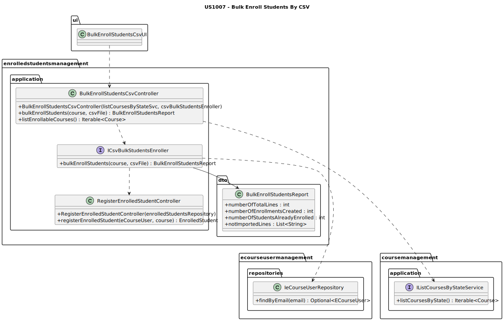
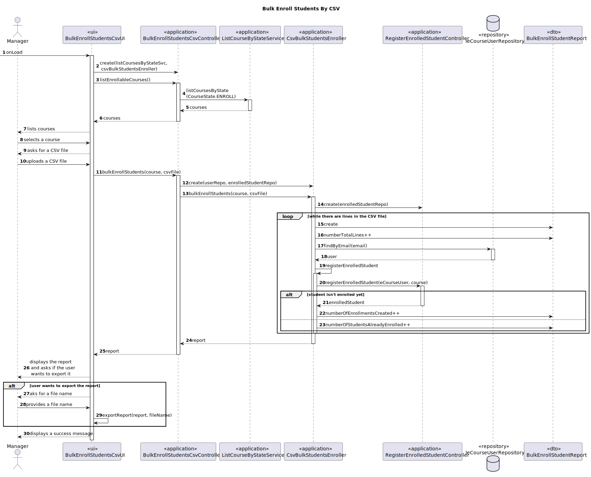

# US1007 —  As Manager, I want to bulk enroll students by importing their data using a csv file

## 1. Context

Courses have students enrolled in them.
The manager should be able to enroll students in bulk, by importing their data using a csv file.

## 2. Requirements

In order to bulk enroll students, the manager must be able to:

- 1: See the list of courses that are in the **enroll** state, and select one of them.
- 2: Import a csv file with the students' data.

### Client Clarifications

#### System Specifications Document

- FRC06 - Bulk Enroll Students in Course This can be made by importing a csv file
  with students. 
- Only managers are able to execute this functionality

#### Forum

- **Q:** Will we have a csv file example for the students' data?
- **A:** No, the client did not prepare any csv example. CSV is a standard file format.
You should support the bulk enrolment of students in a course by have their identification in a csv file.

## 3. Analysis/Breakdown
    
In order to fulfill the requirements, the following use cases must be assured:
- List courses in the **enroll** state;
- Import students from a csv file;
- Create enrolled students in the selected course.

The listing of the courses in the **enroll** state is already implemented in the US1004, as a service to list courses
by state was created. Our controller will use that service to get the list of courses in the **enroll** state.

The creation of the enrolled students is already implemented in the US1009, as that user story is related to the 
management of enrollment requests, and when the manager approves an enrollment request, the enrollment is created.

Which leaves "us" with the import of students from a csv file.
The focal point will be to actually import the students from the csv file, and integrate that with the other use cases.  

### CSV File Format

As stated by the client, the csv file must have the identification of the students.  
As the email is enough to identify a student, the csv file must have the email of the students.  
It should also contain a header, with the word "student":

````text
student
**email**
**email**
**email**
````

The user must be already registered in the system, otherwise the import of the student will fail.

### Importing the CSV File

The import of the csv file could be done in two ways:
- The manager pastes the path of the file;
- The manager selects the file in the file explorer.

Since the second option is more user-friendly, it was chosen to be implemented.

### Report

This is not a requirement, but it can be really helpful to have a report after the process is done.

The report should have the following information:
- Number of lines;
- Number of enrollments that were created;
- Number of enrollments that were already enrolled;
- Number of lines that were not imported;
- A list with the lines that were not imported, and the reason why they were not imported.

An example of what a report should look like is shown below:

````text
##################### REPORT #####################
Nº of lines: 10
Nº of enrollments created: 6
Nº of students already enrolled: 1
Nº of lines not imported: 3:
    - Line 1: Invalid email format
    - Line 4: Invalid tax number
    - Line 9: Invalid last name
````

##### Notes:
- If the file does not have a header, no report should be generated;
- The number of enrollments created + number of students already enrolled + number of lines not imported should be equal
to the number of lines.

The report will be shown in the view, and it will be possible to save it as a file.

## 4. Design

Since other US are already implemented, and properly documented, in this design section abstractions related to those
will be made, by only representing the controllers of the respective US, as they provide the necessary methods to
perform the use cases.  
All the following logic of the controllers can be found in the respective US documentation.

### 4.1. Class Diagram

Beyond the already existing classes, and the normal classes that are created for the use cases, three more classes are
needed to perform the bulk enrollment of students by csv file, and to generate the report:
- **BulkEnrollStudentsByCsvService:** *This service is responsible for importing the csv file, and communicating with
the other system components to perform the bulk enrollment.*
- **BulkEnrollStudentsReport:** *DTO that exports the information about a bulk enrollment of students into a course.*



### 4.2. Sequence Diagram



*Notes:*
- To simplify the diagram it was not represented, but when there is any problem with the import of a line
it is added in the list of not imported lines along with the reason why it was not imported is added to the report.

### 4.3. Applied Patterns

Some main patterns used in this user story as a whole are:

* **Pure Fabrication:** *The IcsvBulkStudentsEnroller is a pure fabrication, since it is not a real world concept, it
was created to help the bulk enrollment of students by csv file, having the responsibility of importing the csv file, 
and communicating with the other system components to perform the bulk enrollment.*
* **Dependency Injection:** *Instead of instantiating the repositories or services that will be used inside the classes,
they are received by parameter.* *
* **Single Responsibility + High Cohesion:** *The classes have a single responsibility, and they are highly cohesive,
as they only have methods related to their responsibility.*

*The dependency injection should be made with the help of a framework, such as Spring, but since the project is not
using any framework, it was decided to use the constructor injection, which is the most basic form of dependency
injection. By using dependency injection, the code is more scalable, flexible, and it is easier to test.  
*Since we are using the controller from another US, it would be nice to have an interface for the controller, so that
we could inject the dependency of the controller, instead of instantiating it inside the class. But since this is a
rather simple application, and the controller is not a complex class, it was decided to instantiate it inside the
class, and not create an interface for it. This note serves as a reminder that, in a real world application, this
should be done, to reduce the coupling even more.

### 4.4. Tests

Since, for now, there is only required to make unit tests and this user story does not have any units to test, no tests
were implemented.

It would be good to have integration tests to assure that the csv file is imported correctly, and that enrollments are
created in the database.

This doesn't change the fact that it is possible to test the application manually, and assuring the correct behavior
of the feature in the different scenarios.

## 5. Demonstration

### Video of a fully succesfull bulk enroll:

https://user-images.githubusercontent.com/103595766/235802070-9cd81e51-295e-41d1-8217-b5d08de4f7b8.mp4

### Video of a bulk enroll with problems detailed in the report:

https://user-images.githubusercontent.com/103595766/235802491-c5738571-e5f8-4872-a55c-b487c7a5ac18.mp4

The video does not show the changes being made in the file but here is the content of the file on the second video:


(the first email does not exist in the database and the third one is not in a valid email format)

## 6. Implementation

Here is a list of the main classes and their responsibilities:

- **CsvBulkStudentsEnroller:** Implementation of the service responsible for importing the csv file, and trying to
enroll the students in the course.

````java
public class CsvBulkStudentsEnroller implements IcsvBulkStudentsEnroller {
    private final String HEADER = "student";
    private final String EMAIL_REGEX = "^[A-Za-z0-9+_.-]+@(.+)$";
    private final IeCourseUserRepository eCourseUserRepository;
    private final RegisterEnrolledStudentController registerEnrolledStudentController;

    /**
     * Instantiates a service to bulk enroll students from a CSV file.
     *
     * @param eCourseUserRepository the eCourseUser repository
     */
    public CsvBulkStudentsEnroller(IeCourseUserRepository eCourseUserRepository, EnrolledStudentRepository enrolledStudentRepository) {
        // Assure that the eCourseUserRepository is not null
        if (eCourseUserRepository == null) {
            throw new IllegalArgumentException("A User repository must be provided.");
        }
        this.eCourseUserRepository = eCourseUserRepository;

        // Assure that the enrolledStudentRepository is not null
        if (enrolledStudentRepository == null) {
            throw new IllegalArgumentException("An EnrolledStudent repository must be provided.");
        }
        this.registerEnrolledStudentController = new RegisterEnrolledStudentController(enrolledStudentRepository);
    }


    @Override
    public BulkEnrollStudentsReport bulkEnrollStudents(Course course, File csvFile) {
        BulkEnrollStudentsReport report = new BulkEnrollStudentsReport();

        try {
            BufferedReader reader = new BufferedReader(new FileReader(csvFile));
            assureTheFileIsValid(reader);

            String line;
            while ((line = reader.readLine()) != null) {
                report.numberOfTotalLines++;
                if (!isLineContentAnEmail(line)) {
                    report.addNotImportedLine("Invalid email format.");
                    continue;
                }

                // Check if there is a student with the provided email
                ECourseUser student = eCourseUserRepository.findByEmail(line).orElse(null);
                if (student == null) {
                    report.addNotImportedLine("There is no student with the provided email.");
                    continue;
                }

                // Try to enroll the student
                try {
                    registerEnrolledStudentController.registerEnrolledStudent(course, student);
                    report.numberOfEnrollmentsCreated++;
                } catch (Exception e) {
                    if (e.getMessage().equals("The student is already enrolled in the course.")) {
                        report.numberOfStudentsAlreadyEnrolled++;
                    } else {
                        report.addNotImportedLine((e.getMessage()));
                    }
                }
            }
        } catch (IOException e) {
            throw new RuntimeException("There is a problem with the provided file.");
        }

        return report;
    }

    private boolean isLineContentAnEmail(String line) {
        return line.matches(EMAIL_REGEX);
    }

    private void assureTheFileIsValid(BufferedReader reader) {
        try {
            String header = reader.readLine();
            if (!header.equals(HEADER)) {
                throw new RuntimeException("The provided file is not valid.");
            }
        } catch (IOException e) {
            throw new RuntimeException("There is a problem with the provided file.");
        }
    }
}
````

- **BulkEnrollStudentsCsvController:** Controller of the US.

````java
public class BulkEnrollStudentsCsvController {
  private final ListCourseByStateService listCourseByStateService;
  private final IcsvBulkStudentsEnroller csvBulkStudentsEnroller;

  /**
   * Instantiates a new Bulk enroll students csv controller.
   *
   * @param listCourseByStateService the list course by state service
   * @param csvBulkStudentsEnroller  the csv bulk students enroller
   */
  public BulkEnrollStudentsCsvController(ListCourseByStateService listCourseByStateService, IcsvBulkStudentsEnroller csvBulkStudentsEnroller) {
    if (listCourseByStateService == null)
      throw new IllegalArgumentException("A listCourseByStateService must be provided");
    this.listCourseByStateService = listCourseByStateService;

    if (csvBulkStudentsEnroller == null)
      throw new IllegalArgumentException("A csvBulkStudentsEnroller must be provided");
    this.csvBulkStudentsEnroller = csvBulkStudentsEnroller;
  }

  /**
   * List enrollable courses.
   *
   * @return the iterable
   */
  public Iterable<Course> listEnrollableCourses() {
    return listCourseByStateService.findCoursesByState(CourseState.ENROLL);
  }

  /**
   * Bulk enroll students bulk enroll students.
   *
   * @param course  the course
   * @param csvFile the csv file
   * @return the report of the bulk enroll students
   */
  public BulkEnrollStudentsReport bulkEnrollStudents(Course course, File csvFile) {
    return csvBulkStudentsEnroller.bulkEnrollStudents(course, csvFile);
  }
}
````


