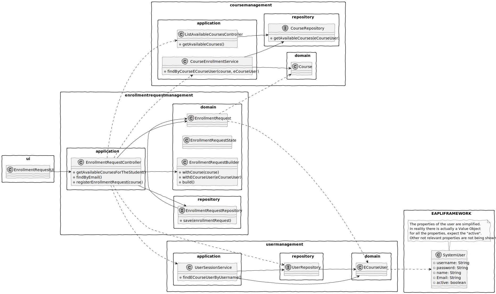
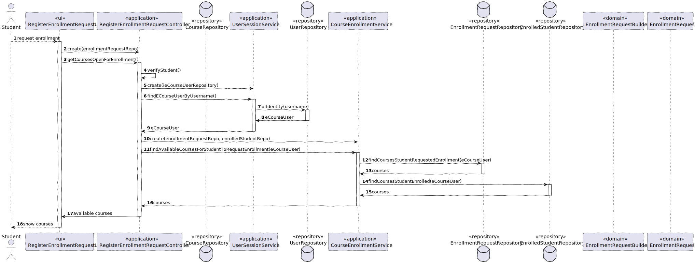
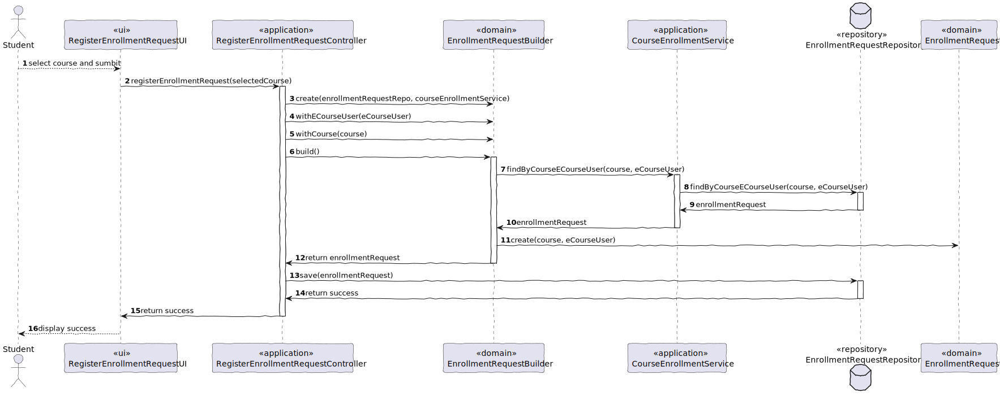

# US 1008

## 1. Context

This is the first time this task has been assigned (sprint 2).
It is expected to be completed in this sprint.

## 2. Requirements

This feature will allow students to request enrollment in a course.

**US 1008** As Student, I Want to request my enrollment in a course.

### *Constraints*

---

Students can only enroll in courses that are available to them, meaning, courses that are open for enrollment and also courses that they aren't already enrolled in.
To note that the student, must also not have multiple requests to the same course.

### *Dependencies*

---

It is intimately related to the feature that displays all available courses to the student.

## 3. Analysis

*As this is one of the first user story of the sprint, no comparisons were possible to be made.
Having this in mind, the taken decisions were solely based current team knowledge.*

*The .md file is followed by a Class Diagram and a Sequence Diagram, with the purpose of illustrating the design decisions.*

*Serving as an overview, here will be presented some of the main concerns:*

- Which classes must be accessed in order to implement this functionality?
- Which classes must be created in order to implement this functionality?
- Who has the responsibility of creating the EnrollmentRequest?
- Are there any required validations?
- Who has the responsibility of saving the EnrollmentRequest?

## 4. Design

### 4.1. Class Diagram



### 4.2. Sequence Diagram

    As the sequence diagram proportions could get a bit messy, it was decided to split it into two parts.

#### Part 1



    The first part illustrates the required steps to find and display the available courses to the student.
    From the student perspective, the user interface is displayed, and the student is able to select the course he wants to enroll in.

#### Part 2



    The second part illustrates the required steps to create the enrollment request.
    From the student perspective, the user interface is displayed, and the student is able to receive a confirmation message.

### 4.3. Applied Patterns

* **Single Responsibility Principle + High Cohesion:** *Every class has only one responsibility, which leads to higher cohesion.*
* **Open/Closed Principle:** *By using interfaces, we are allowing classes to extend the behavior, but never modify the previous implementation.*
* **Dependency Injection:** *Instead of instantiating the repositories that will be used inside the classes, they are injected as a parameter. Allowing for more flexible approaches.* *
* **Information Expert:** *A clear example would be the EnrollmentRequestController, that by following the referred pattern, as well as the creator pattern, is responsible for creating enrollment request.*
* **Low Coupling:** *All the classes are loosely coupled, not depending on concrete classes, rather depending on interfaces.*
* **Controller:** *The controller serves as a bridge between the user interface and the domain.*

### 4.4. Tests

| Test Case | Description                                                         | Expected Result                  |
|:---------:|:--------------------------------------------------------------------|:---------------------------------|
|     1     | Create an enrollment request with valid data                        | Enrollment request is created    |
|     2     | Create an enrollment request with invalid course                    | Exception is thrown              |
|     3     | Create an enrollment request with invalid eCourse user              | Exception is thrown              |
|     4     | Create an enrollment request with invalid course and eCourse user   | Exception is thrown              |
|     5     | Expect an enrollment request to be create with pending state        | Truthful comparison              |
|     6     | Expect an enrollment request to be create without decision reason   | Truthful comparison              |
|     7     | Create a duplicate enrollment request                               | Exception is thrown              |

**Each test is coupled with a setup to provide a more flexible and understandable test environment**

* Create an enrollment request with valid data

````java
    public void setUpValidCourseAndECourseUser() {
        // Valid Student
        this.userStud = UserDataSource.getTestStudent1();

        // Valid Course
        this.course = new Course("Test Course", "Test Course Name",
        "Test Course Description");
        }

@Test
public void ensureValidEnrollmentRequestIsCreated() {
        // Arrange
        setUpValidCourseAndECourseUser();

// Act
final EnrollmentRequest enrollmentRequest = new EnrollmentRequest(this.course, this.userStud);

        // Assert
        Assertions.assertNotNull(enrollmentRequest);
        }
````

* Create a duplicate enrollment request

````java
    public void setUpValidCourseAndECourseUserButDuplicateRequest() {
        // Valid Repositories
        this.enrollmentRequestRepo = mock(EnrollmentRequestRepository.class);

        // Valid Service
        this.courseEnrollmentService = new CourseEnrollmentService(this.enrollmentRequestRepo);

        // Invalid Student
        this.userStud = UserDataSource.getTestStudent1();

        // Valid Course
        this.course = new Course("Test Course", "Test Course Name",
        "Test Course Description");

        // Duplicate Request
        EnrollmentRequest enrollmentRequest = new EnrollmentRequestBuilder(this.enrollmentRequestRepo,
        this.courseEnrollmentService)
        .withECourseUser(this.userStud)
        .withCourse(this.course)
        .build();

        // Add Duplicate Request
        when(this.courseEnrollmentService.findByCourseECourseUser(this.course, this.userStud))
        .thenReturn(Optional.ofNullable(enrollmentRequest));
        }

@Test
public void ensureValidEnrollmentRequestIsNotCreatedDueToDuplicateRequest() {
        // Arrange
        setUpValidCourseAndECourseUserButDuplicateRequest();

        // Assert
        Assertions.assertThrows(IllegalArgumentException.class, () -> new EnrollmentRequestBuilder(
        this.enrollmentRequestRepo,
        this.courseEnrollmentService)
        .withECourseUser(this.userStud)
        .withCourse(this.course)
        .build());
        }
````

    By using a mock repository, we are able to simulate the creation of a duplicate enrollment request.
    Therefore, we are able to test the behavior of the class when this situation occurs.

## 5. Demonstration

**Step 1:** *In order to run this functionality you must first run the Student program.*
**Step 2:** *Then, you must log in, and select the option to "Request Enrollment".*

https://github.com/Departamento-de-Engenharia-Informatica/sem4pi-22-23-16-1/assets/106761319/b61e0614-fe99-4d9d-8cf6-daced9e8aaaf

**Important**

*In the demonstration, we can see some key points about this User Story.*
*It is visible that the "student" request enrollment in two different courses (each time the selected course is removed
from the list of available courses to request enrollment)."*

## 6. Implementation

### User Interface

* Responsible for displaying and requiring the necessary information to the user.

````java
public class RegisterEnrollmentRequestUI extends AbstractUI {

    private final RegisterEnrollmentRequestController registerEnrollmentRequestController = new RegisterEnrollmentRequestController(PersistenceContext.repositories().enrollmentRequests());

    @Override
    protected boolean doShow() {
        // 1 second = 1000 milliseconds
        int ONE_SECOND = 1000;

        try {
            // Courses in "ENROLL" state, to select from
            ListSelector<Course> enrollStateCourses =
                    new ListSelector<>("Available Enroll State Courses:",
                            (Collection<Course>) registerEnrollmentRequestController.getCoursesOpenForEnrollment());

            if (enrollStateCourses.isEmpty()) {
                infoMessage("There are no courses in _enroll_ state");
                Sleeper.sleep(1000);
                return false;
            }

            if (!enrollStateCourses.showAndSelectWithExit()) return false;

            Course selectedCourse = enrollStateCourses.getSelectedElement();

            registerEnrollmentRequestController.registerEnrollmentRequest(selectedCourse);
        }
        catch (IllegalArgumentException e) {
            errorMessage(e.getMessage());
            Sleeper.sleep(ONE_SECOND);
            return false;
        }

        successMessage("Enrollment request registered successfully");
        Sleeper.sleep(ONE_SECOND);

        return false;

    }

}
````

### Controller

* Responsible for managing the whole process of creating an enrollment request.

````java
public class RegisterEnrollmentRequestController {

    private final EnrollmentRequestRepository enrollmentRequestRepository;

    private final UserSessionService userSessionService;

    private final CourseEnrollmentService courseEnrollmentService;

    private ECourseUser student;

    /**
     * Instantiates a new Enrollment request controller.
     *
     * @param enrollmentRequestRepository the enrollment request repository
     */
    public RegisterEnrollmentRequestController(EnrollmentRequestRepository enrollmentRequestRepository) {
        // verify if the enrollmentRequestRepository is null
        if (enrollmentRequestRepository == null) {
            throw new IllegalArgumentException("The enrollmentRequestRepository cannot be null.");
        }

        this.enrollmentRequestRepository = enrollmentRequestRepository;

        this.userSessionService = new UserSessionService(PersistenceContext.repositories().eCourseUsers());

        this.courseEnrollmentService = new CourseEnrollmentService(enrollmentRequestRepository,
                PersistenceContext.repositories().enrolledStudents(),
                new ListCourseByStateService(PersistenceContext.repositories().courses()));

    }

    private void verifyStudent() {
        Optional<ECourseUser> eCourseUserOptional = userSessionService.findECourseUserByUsername();

        eCourseUserOptional.ifPresentOrElse(
                eCourseUser -> this.student = eCourseUser,
                () -> {
                    throw new IllegalStateException("No eCourse user found. Make sure you are registered.");
                }
        );
    }

    /**
     * Gets courses that are open for enrollment and that the student has not yet requested enrollment or is already enrolled.
     *
     * @return the available courses
     */
    public Iterable<Course> getCoursesOpenForEnrollment() {
        // Make sure the student is logged in
        verifyStudent();

        return courseEnrollmentService.findAvailableCoursesForStudentToRequestEnrollment(student);
    }

    /**
     * Register enrollment request, using the EnrollmentRequestBuilder.
     * Must first verify if the eCourse user exists (UserSessionService).
     *
     * @param selectedCourse the selected course
     */
    public void registerEnrollmentRequest(final Course selectedCourse) {

        final EnrollmentRequest enrollmentRequest =
                new EnrollmentRequestBuilder(enrollmentRequestRepository, courseEnrollmentService)
                        .withCourse(selectedCourse)
                        .withECourseUser(student)
                        .build();

        enrollmentRequestRepository.save(enrollmentRequest);
    }

}
````

### Domain

* Responsible for creating the enrollment request.

````java
public class EnrollmentRequestBuilder {

    final EnrollmentRequestRepository enrollmentRequestRepository;

    final CourseEnrollmentService courseEnrollmentService;

    private Course course;

    private ECourseUser eCourseUser;

    /**
     * Instantiates a new Enrollment request builder.
     *
     * @param enrollmentRequestRepository the enrollment request repository
     */
    public EnrollmentRequestBuilder(EnrollmentRequestRepository enrollmentRequestRepository, CourseEnrollmentService courseEnrollmentService) {
        // verify if the enrollmentRequestRepository is null
        if (enrollmentRequestRepository == null) {
            throw new IllegalArgumentException("The repo cannot be null.");
        }

        this.enrollmentRequestRepository = enrollmentRequestRepository;

        // verify if the courseEnrollmentService is null
        if (courseEnrollmentService == null) {
            throw new IllegalArgumentException("The courseEnrollmentService cannot be null.");
        }

        this.courseEnrollmentService = courseEnrollmentService;
    }

    /**
     * With course enrollment request builder.
     *
     * @param course the selected course
     * @return the enrollment request builder
     */
    public EnrollmentRequestBuilder withCourse(Course course) {
        this.course = course;
        return this;
    }

    /**
     * With eCourse user enrollment request builder.
     *
     * @param eCourseUser the e course user
     * @return the enrollment request builder
     */
    public EnrollmentRequestBuilder withECourseUser(ECourseUser eCourseUser) {
        this.eCourseUser = eCourseUser;
        return this;
    }

    public EnrollmentRequest build() {
        // verify if there is already an enrollment request for the selected course and eCourse user
        if (courseEnrollmentService.findByCourseECourseUser(this.course, this.eCourseUser).isPresent())
            throw new IllegalArgumentException("Enrollment request already exists");

        return new EnrollmentRequest(this.course, this.eCourseUser);
    }

}
````

### Service

* Responsible for verifying if the enrollment request already exists.

````java
public class CourseEnrollmentService {

    private final EnrollmentRequestRepository enrollmentRequestRepository;

    private final EnrolledStudentRepository enrolledStudentRepository;

    private final ListCourseByStateService listCourseByStateService;

    /**
     * Instantiates a new Course enrollment service.
     *
     * @param enrollmentRequestRepository the enrollment request repository, using dependency injection
     */
    public CourseEnrollmentService(EnrollmentRequestRepository enrollmentRequestRepository,
                                   EnrolledStudentRepository enrolledStudentRepository,
                                   ListCourseByStateService listCourseByStateService) {
        // verify if the enrollmentRequestRepository is null
        if (enrollmentRequestRepository == null) {
            throw new IllegalArgumentException("The enrollmentRequestRepository cannot be null.");
        }

        this.enrollmentRequestRepository = enrollmentRequestRepository;

        // verify if the enrolledStudentRepository is null
        if (enrolledStudentRepository == null) {
            throw new IllegalArgumentException("The enrolledStudentRepository cannot be null.");
        }

        this.enrolledStudentRepository = enrolledStudentRepository;

        this.listCourseByStateService = listCourseByStateService;
    }

    /**
     * Find by course and eCourse user.
     *
     * @param course the course
     * @param student the student
     * @return the boolean (success or failure)
     */
    public Optional<EnrollmentRequest> findByCourseECourseUser(Course course, ECourseUser student) {
        return enrollmentRequestRepository.findByCourseECourseUser(course, student);
    }

    private Iterable<Course> findCoursesStudentRequestedEnrollment(ECourseUser student) {
        return enrollmentRequestRepository.findCoursesStudentRequestedEnrollment(student);
    }

    private Iterable<Course> findCoursesStudentEnrolled(ECourseUser student) {
        return enrolledStudentRepository.findCoursesStudentEnrolled(student);
    }

    /**
     * Find available courses for student to request enrollment (student is not enrolled and has not requested enrollment)
     *
     * @param student the student
     * @return the iterable
     */
    public Iterable<Course> findAvailableCoursesForStudentToRequestEnrollment(ECourseUser student) {
        // All courses that are open for enrollment
        List<Course> enrollStateCourses = (List<Course>) listCourseByStateService.findCoursesByState(CourseState.ENROLL);

        // All courses that the student has requested enrollment or is already enrolled
        List<Course> coursesStudentRequestedEnrollment = (List<Course>) findCoursesStudentRequestedEnrollment(student);
        List<Course> coursesStudentEnrolled = (List<Course>) findCoursesStudentEnrolled(student);

        // Must remove the courses that the student has requested enrollment or is already enrolled
        enrollStateCourses.removeAll(coursesStudentRequestedEnrollment);
        enrollStateCourses.removeAll(coursesStudentEnrolled);

        return enrollStateCourses;
    }

}
````
