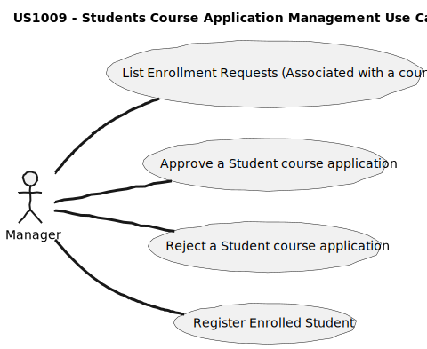
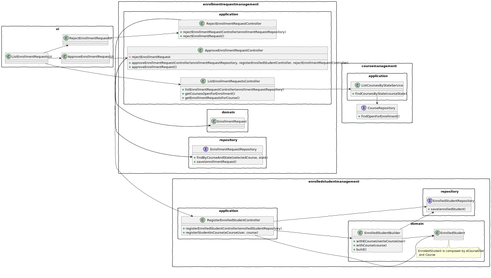
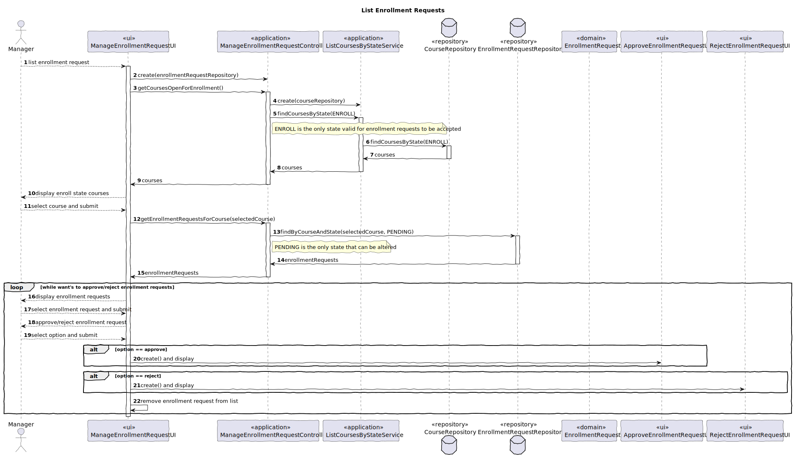
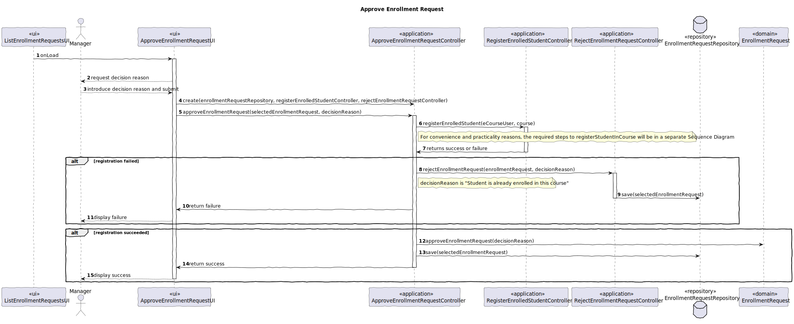
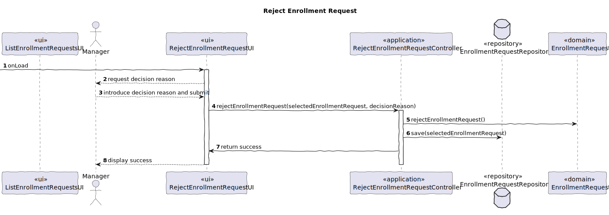
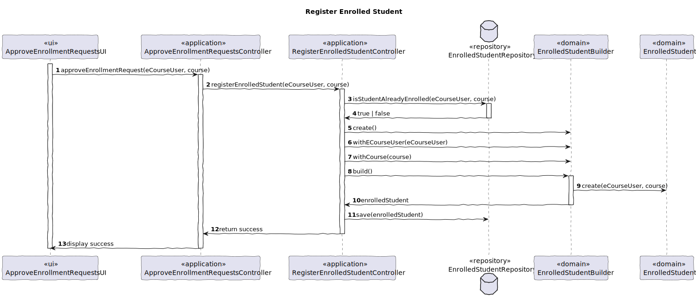

# US1009 — As a Manager, I want to approve or reject students applications to courses

## 1. Context

---

The system should allow the manager to approve or reject students enrollment requests to courses.
This is one of the possible paths to enroll definitively a student in a course, the other being by *bulk enroll through a csv file*.

## 2. Requirements

---

It is required that the following use cases are implemented:

* **UC 1009.1** As a Manager, I want to list enrollment request to a course.
* **UC 1009.2** As a Manager, I want to approve a student enrollment request to a course.
* **UC 1009.3** As a Manager, I want to reject a student enrollment request to a course.
* **UC 1009.4** As System, I want to register the approved student in the course.

The first Use Case is highly dependent on the third one, as it is a direct consequence of the first one.

### Client Clarifications

#### Forum (Doubts)

* **Doubt 1:** "We would like to know what are the requirements for a student to be accepted or rejected from an application to a course."

  **Answer:** "[...] I think the system should only register the reason for the decision."

## 3. Analysis

---

Enrollment requests have a course, a student (eCourseUser) and a state (approved, rejected, pending).
Having this in mind, we must follow this steps:

1. The manager must be able to select a course (In "ENROLL" state);
2. The manager must be able to select a student request (In "PENDING" state);
3. The manager must be able to approve or reject the student request;
4. The system must register the decision and change the state of the request to "APPROVED" or "REJECTED".
5. The system must register the student in the course.

As we know, a student can frequent multiple courses, but can only enroll into the same course once.
This is only problematic in the "Approve Student Request" case, as the request would lead to a duplicate enrollment.
To prevent this situation to happen, before fully approving the request, the system checks if the student is already enrolled in the course.

A clear example to demonstrate this possibility:

**Scenario:**
1. A student is enrolled in a course through the Bulk Enrollment feature;
2. The same student, had a pending request to enroll in the same course;
3. The manager approves the request;
4. The system wouldn't be able to register the student in the course, because the student is already enrolled in the course.

### 3.1. Use Case Diagram

A use case diagram was created to represent the use cases that are related to this user story.



## 4. Design

There is a common class diagram for all the use cases.

As for the sequence diagrams, they're different for each use case.
*Reminding that due to the dependency level between UC.1 and UC.3, the sequence diagrams work as a whole.*

### 4.1. Class Diagram



### 4.2. Sequence Diagrams

**[UC1009.1] As a Manager, I want to list students enrollment requests to a course**



**Special Considerations**

* "ListCoursesByStateService" is used to find the courses that are currently in "enroll" state.
* The loop is used to allow the selection of multiple enrollment requests, without being redirected to the main menu again.
* As mentioned in the diagram, both "alts" (alternatives) represented in the diagram are represented with further detail in the upcoming sequence diagrams.

---

**[UC1009.2] As a Manager, I want to approve a student enrollment request to a course**



**Special Considerations**

* The system must first try to register the student as a now participant of the course selected in the enrollment request.
* The above situation has two possible outcomes, being the first success meaning that the student was registered and the other being the opposite.
* If the registration was successful, the enrollment request will also be updated and should become -> "ACCEPTED".
* The manager has to provide a reason for approving the student's enrollment request to the course (if none is provided, the system will by default mark it has "No reason provided!").

---

**[UC1009.3] As a Manager, I want to reject a student enrollment request to a course**



**Special Considerations**

* The enrollment request will be updated and should become -> "REJECTED".
* The manager has to provide a reason for rejecting the student's enrollment request to the course (if none is provided, the system will by default mark it has "No reason provided!").

---

**[UC1009.4] As System, I want to register the approved student in the course**



**Special Considerations**

* Related to the process above referred, to be considered as a valid candidate for the registration, the student must not be already enrolled in the course.

---

### 4.3. Applied Patterns

Some main patterns used in this user story as a whole are:

* **Single Responsibility Principle + High Cohesion:** *Every class has only one responsibility, which leads to higher
  cohesion.*
* **Open/Closed Principle:** *We could've considered the first 2-use cases to be one and share a controller, but that
  would lead to possible hard times in the future if we wanted to have more flexibility with what to do with the enrollment requests.*
* **Dependency Injection:** *Instead of instantiating the repositories or services that will be used inside the classes,
  they are received by parameter.*
* **Information Expert:** *The EnrolledStudentRepository is the IE of the EnrolledStudents.*
* **Low Coupling + Dependency Inversion:** *All the classes are loosely coupled, not depending on concrete classes,
  rather depending on interfaces.*

Overall, the SOLID and GRASP principles were applied.

---

### 4.4. Tests

##### 4.4.1. UC1001.1 - Test Cases

| Test Case | Description                                          | Expected Result               |
|:---------:|:-----------------------------------------------------|:------------------------------|
|     1     | Create an enrolled student with valid data           | Enrollment student is created |
|     2     | Create an enrolled student with invalid course       | Exception is thrown           |
|     3     | Create an enrolled student with invalid eCourse user | Exception is thrown           |
|     4     | Create a duplicate enrollment request                | Exception is thrown           |
|     5     | Ensure enrollment request can become accepted        | Truthful comparison           |
|     6     | Ensure enrollment request can become rejected        | Truthful comparison           |

**Each test is coupled with a setup to provide a more flexible and understandable test environment**

* Register a duplicated enrolled student

````java
 public void setUpValidButStudentIsAlreadyEnrolled() {
        // Valid Repositories
        this.enrolledStudentRepo = mock(EnrolledStudentRepository.class);

        this.enrollmentRequestRepo = mock(EnrollmentRequestRepository.class);

        // Valid Student
        this.user = UserDataSource.getTestStudent1();

        // Valid Course
        this.course = new Course("Test Course", "Test Course Name",
        "Test Course Description");

        // Valid Enrollment Request
        enrollmentRequest = new EnrollmentRequest(course, user);

        // "Save" the Enrollment Request
        when(enrollmentRequestRepo.findByCourseECourseUser(course, user)).thenReturn(Optional.of(enrollmentRequest));

        // Valid Enrolled Student
        enrolledStudent = new EnrolledStudent(course, user);

        // "Save" the Enrolled Student
        when(enrolledStudentRepo.findByCourseECourseUser(course, user)).thenReturn(Optional.of(enrolledStudent));
}

@Test
public void ensureValidEnrolledStudentIsNotCreatedByTheBuilderWhenStudentIsAlreadyEnrolled() {
        // Arrange
        setUpValidButStudentIsAlreadyEnrolled();

        // Act
        Assertions.assertThrows(IllegalArgumentException .class, () -> new EnrolledStudentBuilder(enrolledStudentRepo)
        .withECourseUser(user)
        .withCourse(course)
        .build());
}
````

* Ensure enrollment request can become accepted

````java
public void setUpValidCourseAndECourseUser() {
        // Valid Student
        // this.userStud = UserDataSource.getTestStudent1();

        // Valid Course
      this.course = new Course("Test Course", "Test Course Name",
        "Test Course Description");
}
@Test
public void ensureEnrollmentRequestStateCanBecomeApproved() {
        // Arrange
        setUpValidCourseAndECourseUser();

// Act
final EnrollmentRequest enrollmentRequest = new EnrollmentRequest(this.course, this.userStud);
        enrollmentRequest.approveEnrollmentRequest("Test Reason");

        // Assert
        Assertions.assertTrue(enrollmentRequest.approvedEnrollmentRequest());
}
````

## 5. Demonstration

https://github.com/Departamento-de-Engenharia-Informatica/sem4pi-22-23-16-1/assets/106761319/f91207f0-7f0b-43f2-b25a-62060992a481

**Important**

*In the demonstration, we can see some key points about this User Story.*
*It is visible that the "manager" managing enrollment requests can either accept or reject the available requests.*

## 6. Implementation

### List Enrollment Requests Controller

* Responsible for managing the whole process of creating an enrollment request.

````java
public class ListEnrollmentRequestController {

    private final ListCourseByStateService listCourseByStateService;

    private final EnrollmentRequestRepository enrollmentRequestRepository;

    /**
     * Instantiates a new Manage enrollment request controller.
     *
     * @param enrollmentRequestRepository the enrollment request repository
     */
    public ListEnrollmentRequestController(EnrollmentRequestRepository enrollmentRequestRepository) {

        this.listCourseByStateService = new ListCourseByStateService(PersistenceContext.repositories().courses());

        // verify if the enrollmentRequestRepository is null
        if (enrollmentRequestRepository == null) {
            throw new IllegalArgumentException("The enrollmentRequestRepository cannot be null.");
        }

        this.enrollmentRequestRepository = enrollmentRequestRepository;
    }

    /**
     * Gets courses in "ENROLL" state.
     *
     * @return the courses open for enrollment
     */
    public Iterable<Course> getCoursesOpenForEnrollment() {
        return listCourseByStateService.findCoursesByState(CourseState.ENROLL);
    }

    /**
     * Gets enrollment requests in "PENDING" state.
     *
     * @param selectedCourse the selected course
     * @return the pending enrollment requests
     */
    public Iterable<EnrollmentRequest> getEnrollmentRequestsForCourse(Course selectedCourse) {
        return enrollmentRequestRepository.findByCourseAndState(selectedCourse, EnrollmentRequestState.PENDING);
    }

}
````

----

### Approve Enrollment Request Controller

* Responsible for managing the whole process of approving an enrollment request.

````java
public class ApproveEnrollmentRequestController {

    private final EnrollmentRequestRepository enrollmentRequestRepository;

    private final RegisterEnrolledStudentController registerEnrolledStudentController;

    private final RejectEnrollmentRequestController rejectEnrollmentRequestController;

    /**
     * Instantiates a new Approve enrollment request controller.
     *
     * @param enrollmentRequestRepository the enrollment request repository
     */
    public ApproveEnrollmentRequestController(EnrollmentRequestRepository enrollmentRequestRepository,
                                              RegisterEnrolledStudentController registerEnrolledStudentController,
                                              RejectEnrollmentRequestController rejectEnrollmentRequestController) {
        // Verify if the enrollmentRequestRepository is null
        if (enrollmentRequestRepository == null) {
            throw new IllegalArgumentException("The enrollmentRequestRepository cannot be null.");
        }

        this.enrollmentRequestRepository = enrollmentRequestRepository;

        // Verify if the registerEnrolledStudentController is null
        if (registerEnrolledStudentController == null) {
            throw new IllegalArgumentException("The registerEnrolledStudentController cannot be null.");
        }

        this.registerEnrolledStudentController = registerEnrolledStudentController;

        // Verify if the rejectEnrollmentRequestController is null
        if (rejectEnrollmentRequestController == null) {
            throw new IllegalArgumentException("The rejectEnrollmentRequestController cannot be null.");
        }

        this.rejectEnrollmentRequestController = rejectEnrollmentRequestController;
    }

    private void rejectEnrollmentRequest(EnrollmentRequest enrollmentRequest, String enrollmentDecisionReason) {
        // verify if the enrollmentRequest is null
        if (enrollmentRequest == null) {
            throw new IllegalArgumentException("The enrollmentRequest cannot be null.");
        }

        // reject the enrollment request and save back to the repository
        rejectEnrollmentRequestController.rejectEnrollmentRequest(enrollmentRequest, enrollmentDecisionReason);
    }

    /**
     * Approve enrollment request.
     * The system checks if there is not a previous enrollment in a course from the same student.
     *
     * @param enrollmentRequest        the enrollment request
     * @param enrollmentDecisionReason the enrollment decision reason
     */
    public void approveEnrollmentRequest(EnrollmentRequest enrollmentRequest, String enrollmentDecisionReason) {
        // verify if the enrollmentRequest is null
        if (enrollmentRequest == null) {
            throw new IllegalArgumentException("The enrollmentRequest cannot be null.");
        }

        // Verify if the enrolled student was created
        if (registerEnrolledStudentController.registerEnrolledStudent(enrollmentRequest.requestedCourse(), enrollmentRequest.author()).isPresent()) {
            enrollmentRequest.approveEnrollmentRequest(enrollmentDecisionReason);
            enrollmentRequestRepository.save(enrollmentRequest);
        }

        else {
            rejectEnrollmentRequest(enrollmentRequest, enrollmentDecisionReason);
        }
    }

}
````

----

### Reject Enrollment Request Controller

* Responsible for managing the whole process of rejecting an enrollment request.

````java
public class RejectEnrollmentRequestController {

    private final EnrollmentRequestRepository enrollmentRequestRepository;

    /**
     * Instantiates a new Reject enrollment request controller.
     *
     * @param enrollmentRequestRepository the enrollment request repository
     */
    public RejectEnrollmentRequestController(EnrollmentRequestRepository enrollmentRequestRepository) {
        // verify if the enrollmentRequestRepository is null
        if (enrollmentRequestRepository == null) {
            throw new IllegalArgumentException("The enrollmentRequestRepository cannot be null.");
        }

        this.enrollmentRequestRepository = enrollmentRequestRepository;
    }

    /**
     * Reject enrollment request (change the enrollment request state to REJECTED).
     *
     * @param enrollmentRequest        the enrollment request
     * @param enrollmentDecisionReason the enrollment decision reason
     */
    public void rejectEnrollmentRequest(EnrollmentRequest enrollmentRequest, String enrollmentDecisionReason) {
        if (enrollmentRequest == null) {
            throw new IllegalArgumentException("The enrollmentRequest cannot be null.");
        }

        // Reject the enrollment request and save back to the repository
        enrollmentRequest.rejectEnrollmentRequest(enrollmentDecisionReason);
        enrollmentRequestRepository.save(enrollmentRequest);
    }

}
````

----

### Register Enrolled Student Controller

* Responsible for managing the whole process of registering an enrolled student.

````java
public class RegisterEnrolledStudentController {

    private final EnrolledStudentRepository enrolledStudentRepository;

    /**
     * Instantiates a new Register enrolled student controller.
     *
     * @param enrolledStudentRepository the enrolled student repository
     */
    public RegisterEnrolledStudentController(EnrolledStudentRepository enrolledStudentRepository) {
        // verify if the enrolledStudentRepository is null
        if (enrolledStudentRepository == null) {
            throw new IllegalArgumentException("The enrolledStudentRepository cannot be null.");
        }

        this.enrolledStudentRepository = enrolledStudentRepository;
    }

    /**
     * Register enrolled student.
     *
     * @param course      the course
     * @param eCourseUser the e course user
     * @return the optional to the enrolled student
     */
    public Optional<EnrolledStudent> registerEnrolledStudent(Course course, ECourseUser eCourseUser) {
        // Create the enrolled student
        final EnrolledStudent enrolledStudent =
                new EnrolledStudentBuilder(enrolledStudentRepository)
                        .withECourseUser(eCourseUser)
                        .withCourse(course)
                        .build();

        // Verify if the enrolled student was created
        if (enrolledStudent == null) return Optional.empty();

        // Save the enrolled student
        enrolledStudentRepository.save(enrolledStudent);
        return Optional.of(enrolledStudent);
    }

}
````

### Enrolled Student Builder

* Responsible for creating an enrolled student.

````java
public class EnrolledStudentBuilder {

    final EnrolledStudentRepository enrolledStudentRepository;

    private Course course;

    private ECourseUser eCourseUser;

    /**
     * Instantiates a new Enrollment request builder.
     *
     * @param enrolledStudentRepository the enrollment request repository
     */
    public EnrolledStudentBuilder(EnrolledStudentRepository enrolledStudentRepository) {
        // verify if the enrollmentRequestRepository is null
        if (enrolledStudentRepository == null) {
            throw new IllegalArgumentException("The repo cannot be null.");
        }

        this.enrolledStudentRepository = enrolledStudentRepository;

    }

    /**
     * With course enrolled student builder.
     *
     * @param course the course
     * @return the enrolled student builder
     */
    public EnrolledStudentBuilder withCourse(Course course) {
        this.course = course;
        return this;
    }

    /**
     * With e course user enrolled student builder.
     *
     * @param eCourseUser the e course user
     * @return the enrolled student builder
     */
    public EnrolledStudentBuilder withECourseUser(ECourseUser eCourseUser) {
        this.eCourseUser = eCourseUser;
        return this;
    }

    /**
     * Build enrolled student, with course and eCourse user.
     * This method is also making sure that the enrolled student is not already enrolled in the course.
     *
     * @return the enrolled student
     */
    public EnrolledStudent build() {
        // verify if there is already an enrolled student for the selected course and eCourse user
        if (enrolledStudentRepository.isStudentAlreadyEnrolled(this.course, this.eCourseUser)) {
            throw new IllegalArgumentException("The student is already enrolled in the course.");
        }

        return new EnrolledStudent(this.course, this.eCourseUser);
    }

}
````

### Enrolled Student

* Responsible for representing an enrolled student.

````java
public class EnrolledStudent implements AggregateRoot<Integer> {

    // For ORM serialization
    private static final long serialVersionUID = 1L;

    @Id
    @GeneratedValue(strategy = GenerationType.AUTO)
    private int id;

    @OneToOne
    private Course course;

    @OneToOne
    private ECourseUser eCourseUser;

    protected EnrolledStudent() {
        // for ORM
    }

    /**
     * Instantiates a new Enrolled student.
     *
     * @param course      the course
     * @param eCourseUser the eCourse user
     */
    public EnrolledStudent(final Course course, final ECourseUser eCourseUser) {

        // verify if the course is not null
        if (course == null) {
            throw new IllegalArgumentException("Course can't be null");
        }

        this.course = course;

        // verify if the eCourseUser is not null
        if (eCourseUser == null) {
            throw new IllegalArgumentException("ECourseUser can't be null");
        }

        this.eCourseUser = eCourseUser;

    }

    @Override
    public String toString() {
        return "Course: " + course +
                " | eCourseUser=" + eCourseUser;
    }

    @Override
    public boolean sameAs(Object other) {
        if (!(other instanceof EnrolledStudent)) {
            return false;
        }

        final EnrolledStudent that = (EnrolledStudent) other;

        return this.course.sameAs(that.course) && this.eCourseUser.sameAs(that.eCourseUser);
    }

    @Override
    public Integer identity() {
        return this.id;
    }
}
````
