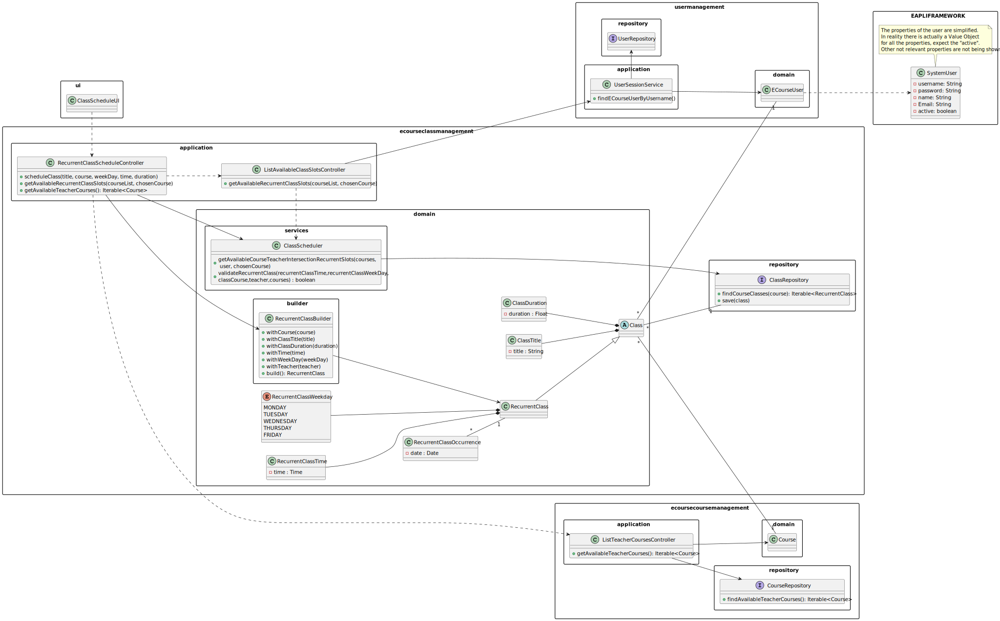

# US1010 - As Teacher, I want to schedule a class

## 1. Context

This requirement is related to the <span style="color: #d0734c"> scheduling of classes</span>, which is a very important feature of the system.
In this US we focus on the scheduling of recurrent classes, which are classes that happen every week, at the same time and day.

## 2. Requirements

There is 3 different Use Cases related to the scheduling of classes:

* **UC1010.1** As a Teacher, I want to be able to see my active courses.
* **UC1010.2** As a Teacher, I want to be able to see the available slots to schedule a class in a course.
* **UC1010.3** As a Teacher, I want to be able to schedule a class.


In order to schedule a class, the teacher must then provide the following information:

- The class Title.
- The course of the class.
- The day of the week of the class.
- The time of the class.
- The class duration.

This information will then be validated, and if it is valid, the class will be scheduled.


## 3. Analysis

This User Story is complex, it is important to note that it is only possible to schedule a class if the <span style="color: #d0734c"> course does not have a class scheduled at the same time and day</span>,
and the <span style="color: #d0734c"> teacher also must not have a class for the same time and day in another course</span>.

While analyzing this US, we noticed that it has a <span style="color: #d0734c"> dependency on the US1002</span>, which 
allows the manager to <span style="color: #d0734c">create courses</span>, and to schedule a class, the teacher must provide the course so the 
system can check if the course already has a class scheduled at the same time and day.

This US also has a <span style="color: #d0734c">dependency on US1006</span>, which allows <span style="color: #d0734c">the teacher to see their available courses</span>, 
this is important because<span style="color: #d0734c"> It's what makes possible the ability for the teacher to choose the course he wants to create the class on.</span>

To make sure the class is scheduled correctly, when the teacher finishes selecting all the requested data from the menus on the UI, <span style="color: #d0734c">the system verifies once again if everything is still available</span>.The course where
the class is being scheduled must still be available, and the teacher must still be available at that time and day in all the other courses he is involved. This will be useful to<span style="color: #d0734c">avoid concurrency problems</span>.

To make the <span style="color: #d0734c">user experience better, a type of calendar was created</span>, that shows in green the available slots to schedule a class, and in red the unavailable slots, for each time for every week day.

Also, to make the user experience better, <span style="color: #d0734c">the system will only show all the valid options</span> for the schedule so <span style="color: #d0734c">all the teacher has to do is select options from menus</span>, avoiding the need to type anything apart from the class title.

This US also works based on a config file, where the client can change the following settings:

- The start time of the classes.
- The end time of the classes.
- The max duration of the classes.
- The class slot duration.

````
## CLASS SLOT DURATION IN MINUTES (15, 30, 45 OR 60)
slotDurationTime=30

## MAX CLASS DURATION IN MINUTES (make sure it is a multiple of slotDurationTime)
maxClassDuration=180

## Start Time to be able to schedule a class (eg: you can only schedule classes from 8am -> MIN 0 - MAX 23H)
startTime=08:00

## End Time to be able to schedule a class (eg: you can only schedule classes until 8pm -> MIN 1 - MAX 24H)
endTime=20:00

````
- **Class Slots explanation:**
<br></br>A class slot is a time interval where a class can be scheduled.
<br></br>

**Example:**
<br></br>
For startTime = 8am, endTime = 10am, slotDuration = 30
<br></br>
The class slots are: 8am-8:30am, 8:30am-9am, 9am-9:30am, 9:30am-10am.
<br></br>
Meaning that a class can only be scheduled at 8am, 8:30am, 9am or 9:30am.

## 4. Design

### 4.1. Class Diagram


To reduce the complexity of the diagram, some relationships between the controller and the other classes were omitted.
<br><br>
Beeing represented only the most important relationships.

### 4.2. Sequence Diagram

This sequence diagram represents the case of a successful scheduling of a class.


### 4.3. Applied Patterns

Some main patterns used in this functionality are:

* **Single Responsibility Principle:** *Every class has only one responsibility*
* **Creator:** *The RecurrentClassBuilder is a creator, since it creates the class and returns it.*
* **Information Expert:** *The ClassRepository is the IE of the Classes. The CourseRepository is the IE of the Courses.*
* **Low Coupling:** *All the classes are loosely coupled, not depending on concrete classes.*
* **High Cohesion:** *All the classes have a high cohesion, since they have only one responsibility.*

### 4.4. Tests

| Test Case | Description                                                                                                 | Expected Result                  |
|:---------:|:------------------------------------------------------------------------------------------------------------|:---------------------------------|
|     1     | Create a recurrent class with valid data                                                                    | Recurrent Class is created       |
|     2     | Create a recurrent class with invalid title                                                                 | Exception is thrown              |
|     3     | Create a recurrent class with a non unique title                                                            | Exception is thrown              |
|     4     | Create a recurrent class with invalid duration                                                              | Exception is thrown              |
|     5     | Create a recurrent class with invalid time                                                                  | Exception is thrown              |
|     6     | Create a recurrent class with invalid week day                                                              | Exception is thrown              |
|     7     | Create a recurrent class with invalid teacher                                                               | Exception is thrown              |
|     8     | Create a recurrent class with invalid course                                                                | Exception is thrown              |  
|     9     | Create a valid class duration                                                                               | Class duration is created        |
|    10     | Create a class duration with 0 duration time                                                                | Exception is thrown              |
|    11     | Create a class duration with negative duration                                                              | Exception is thrown              |
|    12     | Create a valid class title                                                                                  | Class title is created           |
|    13     | Create a empty class title                                                                                  | Exception is thrown              |
|    14     | Create a invalid class title                                                                                | Exception is thrown              |
|    15     | Create a valid recurrent class time                                                                         | Recurrent Class time is created  |
|    16     | Create a invalid recurrent class time                                                                       | Exception is thrown              |
|    17     | Create a negative recurrent class time                                                                      | Exception is thrown              |
|    18     | Create a recurrent class time greater than 24:00                                                            | Exception is thrown              |
|    19     | Create a recurrent class time with invalid format                                                           | Exception is thrown              |
|    20     | Schedule a recurrent class where in that time and day, the teacher and the course are both free             | Recurrent Class is scheduled     |
|    21     | Schedule a recurrent class where there is already a class at the same time and day                          | Recurrent Class is not scheduled |
|    22     | Schedule a recurrent class in a course where the teacher is occupied in another course at that time and day | Recurrent Class is not scheduled |

<span style="color: #d0734c">Here are a few examples of the implemented tests for this US:</span>

- **Ensure A Valid Recurrent Class Is Created**:
````java
    @Test
    public void ensureBuilderReturnsValidRecurrentClass() {
        //Arrange
        Course course = new CourseBuilder(courseRepository).withCourseCode("123").withCourseName("Test").withCourseDescription("Test a a").build();


        // Act
        RecurrentClass recurrentClass = recurrentClassBuilder.withCourse(course)
        .withClassTitle("Test")
        .withClassDuration(15)
        .withRecurrentClassTime("10:00")
        .withRecurrentClassWeekDay(RecurrentClassWeekDay.MONDAY)
        .withTeacher(validTeacher)
        .build();


        // Assert
        Assertions.assertEquals("Test", recurrentClass.getClassTitle());
    }
````

- **Ensure Invalid Recurrent Class Times Are Rejected**:
````java
    @Test
    public void ensureRecurrentClassTimeWithInvalidFormatIsRejected() {

        //Arrange
        String startTime = "25:00:00";

        //Act
        Assertions.assertThrows(IllegalArgumentException.class, () -> new RecurrentClassTime(startTime));

    }

    @Test
    public void ensureRecurrentClassTimeWithLettersInsteadOfNumbersIsRejected() {

        //Arrange
        String startTime = "aa:0E";

        //Act
        Assertions.assertThrows(IllegalArgumentException.class, () -> new RecurrentClassTime(startTime));

    }
````


- **Ensure The Schedule Of a Recurrent Class Is Rejected When The Teacher is Unavailable In AnotherCourse**:
````java
    @Test
    public void ensureScheduleRecurrentClassWhenTeacherUnavailableInAnotherCourseIsRejected(){
        // get string of the start time
        String hour1 = START_TIME_HOUR+ ":" + START_TIME_MINUTE;
        String hour2 = (START_TIME_HOUR +1) + ":" + START_TIME_MINUTE;

        // Arrange

        // for teacher course where teacher will schedule
        RecurrentClass class1 = new RecurrentClass("ok", SLOT_DURATION, hour1, RecurrentClassWeekDay.MONDAY, validCourse,validTeacher);

        List<RecurrentClass> validRecurrentClasses = new ArrayList<>();
        validRecurrentClasses.add(class1);

        when(classRepository.findCourseRecurrentClasses("Course Title")).thenReturn(validRecurrentClasses);
        when(classRepository.findCourseRecurrentClassesWhereTeacherInvolved("Course Title", validTeacher)).thenReturn(validRecurrentClasses);


        // for the other course where teacher is unavailable
        RecurrentClass class3 = new RecurrentClass("yeet", SLOT_DURATION, hour2, RecurrentClassWeekDay.THURSDAY, validCourse2,validTeacher);

        List<RecurrentClass> validRecurrentClasses2 = new ArrayList<>();
        validRecurrentClasses2.add(class3);

        when(classRepository.findCourseRecurrentClasses("Course Title2")).thenReturn(validRecurrentClasses2);
        when(classRepository.findCourseRecurrentClassesWhereTeacherInvolved("Course Title2", validTeacher)).thenReturn(validRecurrentClasses2);


        //Act
        // trying to schedule in a time and day, where the teacher already has another class in another course at the same time

        boolean verify = classScheduler.scheduleRecurrentClass("valid title", SLOT_DURATION, hour2, RecurrentClassWeekDay.THURSDAY, validCourse,validTeacher, validCourses);

        Assertions.assertFalse(verify);
    }
````

- **Ensure Get Available Course Teacher Intersection Returns Correct Occupied Slots**:
````java
    @Test
    public void ensureGetAvailableCourseTeacherIntersectionReturnsCorrectOccupiedSlots(){

        // get string of the start time
        String hour1 = START_TIME_HOUR+ ":" + START_TIME_MINUTE;

        String hour2 = (START_TIME_HOUR + (SLOT_DURATION/60)) + ":" + START_TIME_MINUTE;

        // Arrange
        // for teacher course where teacher will schedule
        RecurrentClass class1 = new RecurrentClass("ok", SLOT_DURATION, hour1, RecurrentClassWeekDay.MONDAY, validCourse,validTeacher);

        List<RecurrentClass> validRecurrentClasses = new ArrayList<>();
        validRecurrentClasses.add(class1);

        when(classRepository.findCourseRecurrentClasses("Course Title")).thenReturn(validRecurrentClasses);
        when(classRepository.findCourseRecurrentClassesWhereTeacherInvolved("Course Title", validTeacher)).thenReturn(validRecurrentClasses);

        // for the other courses where teacher is unavailable

        RecurrentClass class2 = new RecurrentClass("yeet", SLOT_DURATION*2, hour2, RecurrentClassWeekDay.MONDAY, validCourse2,validTeacher);
        RecurrentClass class3 = new RecurrentClass("yeet", SLOT_DURATION, hour1, RecurrentClassWeekDay.THURSDAY, validCourse2,validTeacher);

        List<RecurrentClass> validRecurrentClasses2 = new ArrayList<>();
        validRecurrentClasses2.add(class2);
        validRecurrentClasses2.add(class3);

        when(classRepository.findCourseRecurrentClassesWhereTeacherInvolved("Course Title2", validTeacher)).thenReturn(validRecurrentClasses2);
        when(classRepository.findCourseRecurrentClassesWhereTeacherInvolved("Course Title3", validTeacher)).thenReturn(null);


        //Act
        Map<RecurrentClassWeekDay, Map<LocalTime, LocalTime>> availableRecurrentClassSlots = classScheduler.getAvailableCourseTeacherIntersectionRecurrentSlots(validCourses, validTeacher, validCourse);

        //Assert
        // Null because slot occupied in course where the teacher will schedule
        Assertions.assertNull(availableRecurrentClassSlots.get(RecurrentClassWeekDay.MONDAY).get(LocalTime.of(START_TIME_HOUR,START_TIME_MINUTE)));

        // Null because slot occupied in another course where the teacher is involved
        Assertions.assertNull(availableRecurrentClassSlots.get(RecurrentClassWeekDay.MONDAY).get(LocalTime.of(START_TIME_HOUR,SLOT_DURATION)));

        // Null because slot occupied in another course where the teacher is involved
        Assertions.assertNull(availableRecurrentClassSlots.get(RecurrentClassWeekDay.THURSDAY).get(LocalTime.of(START_TIME_HOUR,START_TIME_MINUTE)));
    }
````


## 5. Demonstration

https://user-images.githubusercontent.com/105438055/234995484-81b8e9e9-9dee-4e8e-9aee-c4a88a6cbcb7.mp4

- We can see that all the teacher has to do is to select a few options from some menus, and provide the class title.
- Before selecting the week day, we can see a calendar with green and red rectangles, the green retangles mean that the course, and the teacher scheduling, are available in that time and day. The red retangles mean the opposite, and the option to slect them in the menus does not appear.
- The reason why the 9h slot does not become red, is because the class ends at that hour, meaning that another class can start at 9.

## 6. Implementation

Here is a list of the main classes and their responsibilities:
- **Class:** Represents our domain abstract class 
<br></br>
- **RecurrentClass:** Represents our domain recurrent class that extends class

Class:
````java
@Entity
public abstract class Class implements AggregateRoot<Long>{

    @Id
    @GeneratedValue(strategy = GenerationType.IDENTITY)
    private Long id;

    @Embedded
    private ClassTitle classTitle;

    @Embedded
    private ClassDuration classDuration;

    @OneToOne(cascade = CascadeType.ALL)
    private Course classCourse;

    @OneToOne(cascade = CascadeType.ALL)
    private ECourseUser classTeacher;

    /**
     * Instantiates a new Class
     * @param classTitle the class title
     * @param classDuration the class duration
     * @param classCourse the class course
     * @param classTeacher the class teacher
     * @throws IllegalArgumentException if the classCourse is null
     */
    public Class(String classTitle, Integer classDuration, Course classCourse, ECourseUser classTeacher) {
        if(classCourse == null){
            throw new IllegalArgumentException("Invalid course");
        }

        if(classTeacher == null){
            throw new IllegalArgumentException("Invalid teacher");
        }

        this.classTitle = new ClassTitle(classTitle);
        this.classDuration = new ClassDuration(classDuration);
        this.classCourse = classCourse;
        this.classTeacher = classTeacher;
    }

    protected Class() {
        // for ORM
    }

    /**
     * Gets the class title
     * @return the class title
     */
    public Integer getClassDuration() {
        return classDuration.getClassDuration();
    }

    /**
     * Gets the class duration
     * @return the class duration
     */
    public String getClassTitle() {
        return classTitle.getClassTitle();
    }

    /**
     * Gets the class identity
     * @return the id
     */
    public Long identity() {
        return id;
    }

}
````
Recurrent Class:

````java
@Entity
public class RecurrentClass extends Class{

    @Enumerated(EnumType.STRING)
    private RecurrentClassWeekDay recurrentClassWeekDay;

    @Embedded
    private RecurrentClassTime recurrentClassTime;

    /**
     * Instantiates a new Recurrent class.
     *
     * @param classTitle            the class title
     * @param classDuration         the class duration
     * @param recurrentClassTime    the recurrent class time
     * @param recurrentClassWeekDay the recurrent class week day
     * @param classCourse           the class course
     * @throws IllegalArgumentException if the recurrentClassWeekDay is null
     */
    public RecurrentClass(String classTitle, Integer classDuration, String recurrentClassTime, RecurrentClassWeekDay recurrentClassWeekDay, Course classCourse, ECourseUser classTeacher) {
        super(classTitle, classDuration, classCourse, classTeacher);
        if(recurrentClassWeekDay == null)
            throw new IllegalArgumentException("Invalid recurrent Class Week Day");
        this.recurrentClassTime = new RecurrentClassTime(recurrentClassTime);
        this.recurrentClassWeekDay = recurrentClassWeekDay;
    }

    protected RecurrentClass() {
        // for ORM
    }

    /**
     * Gets recurrent class week day.
     *
     * @return the recurrent class week day
     */
    public RecurrentClassWeekDay getWeekDay() {
        return recurrentClassWeekDay;
    }

    /**
     * Gets recurrent class time.
     *
     * @return the recurrent class time
     */
    public LocalTime getClassTime() {
        return recurrentClassTime.getStartTime();
    }

    @Override
    public boolean sameAs(Object other) {return DomainEntities.areEqual(this, other);}
   
}
````

- **RecurrentClassBuilder:** Represents our domain recurrent class builder
````java
public class RecurrentClassBuilder {

    private final ClassRepository classRepository;

    private Course course;

    private String classTitle;

    private Integer classDuration;

    private String recurrentClassTime;

    private RecurrentClassWeekDay recurrentClassWeekDay;

    private ECourseUser teacher;

    /**
     * Instantiates a new Recurrent class builder.
     *
     * @param classRepository the class repository
     */
    public RecurrentClassBuilder(ClassRepository classRepository) {

        // check if the class repository is null
        if(classRepository == null)
            throw new IllegalArgumentException("The classRepository cannot be null.");

        this.classRepository = classRepository;
    }

    /**
     * With course recurrent class builder.
     *
     * @param course the course
     * @return the recurrent class builder
     */
    public RecurrentClassBuilder withCourse(Course course) {
        if (course == null)
            throw new IllegalArgumentException("The course cannot be null.");
        this.course = course;
        return this;
    }

    /**
     * With class title recurrent class builder.
     *
     * @param classTitle the class title
     * @return the recurrent class builder
     */
    public RecurrentClassBuilder withClassTitle(String classTitle) {
        if (classTitle == null || classTitle.isBlank())
            throw new IllegalArgumentException("The class title cannot be null or empty.");
        this.classTitle = classTitle;
        return this;
    }

    /**
     * With class duration recurrent class builder.
     *
     * @param classDuration the class duration
     * @return the recurrent class builder
     */
    public RecurrentClassBuilder withClassDuration(Integer classDuration) {
        if (classDuration == null || classDuration <= 0)
            throw new IllegalArgumentException("The class duration cannot be null or less than 0.");
        this.classDuration = classDuration;
        return this;
    }

    /**
     * With recurrent class time recurrent class builder.
     *
     * @param recurrentClassTime the recurrent class time
     * @return the recurrent class builder
     */
    public RecurrentClassBuilder withRecurrentClassTime(String recurrentClassTime) {
        if (recurrentClassTime == null || recurrentClassTime.isBlank())
            throw new IllegalArgumentException("The recurrent class time cannot be null or empty.");
        if(recurrentClassTime.split(":").length != 2)
            throw new IllegalArgumentException("The recurrent class time is not valid.");
        this.recurrentClassTime = recurrentClassTime;
        return this;
    }

    /**
     * With recurrent class week day recurrent class builder.
     *
     * @param recurrentClassWeekDay the recurrent class week day
     * @return the recurrent class builder
     */
    public RecurrentClassBuilder withRecurrentClassWeekDay(RecurrentClassWeekDay recurrentClassWeekDay) {
        if (recurrentClassWeekDay == null)
            throw new IllegalArgumentException("The recurrent class week day cannot be null.");
        this.recurrentClassWeekDay = recurrentClassWeekDay;
        return this;
    }

    /**
     * With teacher recurrent class builder.
     *
     * @param teacher the teacher
     * @return the recurrent class builder
     */
    public RecurrentClassBuilder withTeacher(ECourseUser teacher) {
        if (teacher == null)
            throw new IllegalArgumentException("The teacher cannot be null.");
        this.teacher = teacher;
        return this;
    }

    /**
     * Build recurrent class.
     * Checks if the class title is unique
     *
     * @return the recurrent class
     */
    public RecurrentClass build() {

        RecurrentClass recurrentClass = classRepository.findRecurrentClassByTitle(this.classTitle);
        ExtraClass extraClass = classRepository.findExtraClassByTitle(this.classTitle);
        if (recurrentClass != null || extraClass != null)
            throw new IllegalArgumentException("Class title must be unique");

        return new RecurrentClass(classTitle, classDuration, recurrentClassTime, recurrentClassWeekDay,course,teacher);
    }

}
````

- **ClassRepository:** Represents the interface for our class repository
````java
public interface ClassRepository extends DomainRepository<Long, Class> {

    /**
     * Find all recurrent classes of a course.
     *
     * @param courseCode the course code
     * @return the iterable of recurrent classes of the course
     */
    Iterable<RecurrentClass> findCourseRecurrentClasses(String courseCode);
    
    /**
     * Find by class title.
     * @param classTitle the class title
     * @return the optional
     */
    Optional<Object> findByClassTitle(String classTitle);

    /**
     * Find course recurrent classes where teacher involved.
     *
     * @param courseCode the course code
     * @param user the user
     * @return
     */
    Iterable<RecurrentClass> findCourseRecurrentClassesWhereTeacherInvolved(String courseCode, ECourseUser user);
}
````

- **JPAClassRepository:** Represents our class repository implementation
````java
public class JpaClassRepository extends eCourseJpaRepositoryBase<Class, Long, Long> implements ClassRepository {

    public JpaClassRepository() {
        super("id");
    }

    @Override
    public Iterable<RecurrentClass> findCourseRecurrentClasses(String courseCode) {
        final TypedQuery<RecurrentClass> query = entityManager().createQuery(
                "SELECT c FROM RecurrentClass c WHERE c.classCourse.courseCode.courseCode = :code", RecurrentClass.class);
        query.setParameter("code", courseCode);
        return query.getResultList();
    }
    

    @Override
    public Optional<Object> findByClassTitle(String classTitle) {
        final TypedQuery<Object> query = entityManager().createQuery(
                "SELECT c FROM Class c WHERE c.classTitle = :title", Object.class);
        query.setParameter("title", classTitle);
        return query.getResultList().stream().findFirst();
    }

    @Override
    public Iterable<RecurrentClass> findCourseRecurrentClassesWhereTeacherInvolved(String courseCode, ECourseUser user) {
        final TypedQuery<RecurrentClass> query = entityManager().createQuery(
                "SELECT c FROM RecurrentClass c WHERE c.classCourse.courseCode.courseCode = :code AND c.classTeacher = :user", RecurrentClass.class);
        query.setParameter("code", courseCode);
        query.setParameter("user", user);
        return query.getResultList();
    }
    
    ...
}

````

- **ClassScheduler:** Represents our domain class scheduler service
````java
public class ClassScheduler {

    private final ClassRepository classRepository;

    private final Integer SLOT_DURATION = Application.settings().getSlotDurationTime();

    private final Integer START_TIME_HOUR;

    private final Integer START_TIME_MINUTE;

    private final Integer END_TIME_HOUR;

    private final Integer END_TIME_MINUTE;

    public ClassScheduler(ClassRepository classRepository) {
        if (classRepository == null)
            throw new IllegalArgumentException("The class repository can not be null.");

        this.classRepository = classRepository;

        // Get the start and end time from the config file
        String[] start = Application.settings().getStartTime().split(":");
        String[] end = Application.settings().getEndTime().split(":");
        this.START_TIME_HOUR = Integer.parseInt(start[0]);
        this.START_TIME_MINUTE = Integer.parseInt(start[1]);
        this.END_TIME_HOUR = Integer.parseInt(end[0]);
        this.END_TIME_MINUTE = Integer.parseInt(end[1]);
    }

    /**
     * Calculates the available recurrence class slots for the given course + the given teacher.
     *
     * After calculating the available slots for the given course, it then removes from it the slots where the teacher is involved in other classes from other courses.
     *
     * @param courses the courses to retrieve the available recurrence class slots for
     * @param user the teacher to retrieve the available recurrence class slots for
     * @param course the course to schedule the recurrent class for
     * @return a Map containing the available recurrence class slots for each day of the week
     */
    public Map<RecurrentClassWeekDay, Map<LocalTime, LocalTime>> getAvailableCourseTeacherIntersectionRecurrentSlots(Iterable<Course> courses, ECourseUser user, Course course){

            if(courses == null || user == null || course == null)
                return null;
            // map of the available slots of the course the class will be scheduled for each da (eg. Monday: 10:00 - 11:00, 11:00 - 12:00)
            Map<RecurrentClassWeekDay, Map<LocalTime, LocalTime>> availableSlots = getAvailableRecurrentClassSlots(course.identity().toString());

            // for each course of the teacher removed the available slots where the teacher is involved in other classes from other courses
            for (Course c : courses) {
                // if the course is the same as the one the class will be scheduled for, skip it
                if(c.equals(course))
                    continue;

                // map of the available slots for the teacher (eg. Monday: 10:00 - 11:00, 11:00 - 12:00)
                Map<RecurrentClassWeekDay, Map<LocalTime, LocalTime>> teacherAvailableSlots = getAvailableTeacherRecurrentSlotsForCourse(user,c.identity().toString());

                if(teacherAvailableSlots == null)
                    continue;

                if(availableSlots.isEmpty())
                    availableSlots = teacherAvailableSlots;
                else
                    // remove the slots where the teacher is involved in other classes from other courses
                    removeSlotsIntersection(availableSlots, teacherAvailableSlots);
            }

            return availableSlots;
    }

    /**
     * This method checks in which classes the teacher is involved and then calculates the available slots for each day of the week
     *
     * @param user the teacher to retrieve the available recurrence class slots for
     * @param courseCode the course to schedule the recurrent class for
     * @return a Map containing the available recurrence class slots for each day of the week of the given teacher
     */
    private Map<RecurrentClassWeekDay, Map<LocalTime, LocalTime>> getAvailableTeacherRecurrentSlotsForCourse(ECourseUser user, String courseCode) {
        Iterable<RecurrentClass> classes;

        // GET THE TIMES OF THE TEACHER COURSE CLASSES
        try{
            classes = classRepository.findCourseRecurrentClassesWhereTeacherInvolved(courseCode, user);
        } catch (Exception e){
            return null;
        }

        if(classes == null)
            return null;

        // map of the used slots for each day (eg. Monday: 10:00 - 11:00, 11:00 - 12:00)
        Map<RecurrentClassWeekDay, Map<LocalTime, LocalTime>> usedSlots = new LinkedHashMap<>();

        // GET THE USED SLOTS FOR EACH DAY
        fillUsedClassSlots(classes,usedSlots);

        // map of the available slots for each day (eg. Monday: 10:00 - 11:00, 11:00 - 12:00)
        Map<RecurrentClassWeekDay, Map<LocalTime, LocalTime>> availableSlots = new LinkedHashMap<>();

        // GET THE AVAILABLE SLOTS FOR EACH DAY
        getAvailableRecurrentSlots(usedSlots, availableSlots);

        return availableSlots;
    }

    /**
     Calculates the available recurrence class slots for a given course.
     The method retrieves the recurrent classes for the course from the class repository and then
     calculates the used slots for each day of the week based on the recurrent classes' start and end times.
     It then initializes the available slots with all the slots for each day of the week and removes the used slots
     from the available slots, resulting in the available recurrent class slots for the course.
     @param classCourse the name of the course to retrieve the available recurrence class slots for
     @return a Map containing the available recurrence class slots for each day of the week, or null if an exception is thrown while retrieving the recurrent classes from the repository
     */
    public Map<RecurrentClassWeekDay, Map<LocalTime, LocalTime>> getAvailableRecurrentClassSlots(String classCourse) {
        Iterable<RecurrentClass> classes;

        // GET THE TIMES OF THE COURSE CLASSES
        try{
            classes = classRepository.findCourseRecurrentClasses(classCourse);
        } catch (Exception e){
            return null;
        }

        if(classes == null)
            return null;
        
        // map of the used slots for each day (eg. Monday: 10:00 - 11:00, 11:00 - 12:00)
        Map<RecurrentClassWeekDay, Map<LocalTime, LocalTime>> usedSlots = new LinkedHashMap<>();

        // GET THE USED SLOTS FOR EACH DAY
        fillUsedClassSlots(Iclasses,usedSlots);

        // map of the available slots for each day (eg. Monday: 10:00 - 11:00, 11:00 - 12:00)
        Map<RecurrentClassWeekDay, Map<LocalTime, LocalTime>> availableSlots = new LinkedHashMap<>();

        // GET THE AVAILABLE SLOTS FOR EACH DAY
        getAvailableRecurrentSlots(usedSlots, availableSlots);

        return availableSlots;
    }

    /**
     Calculates the available recurrent class slots based on the used slots and duration.
     The method initializes the available slots with all the slots for each day of the week.
     It then removes the used slots from the available slots and updates the available slots map accordingly.
     @param usedSlots a Map containing the used slots for each day of the week
     @param availableSlots a Map containing the available slots for each day of the week
     */
    private void getAvailableRecurrentSlots(Map<RecurrentClassWeekDay, Map<LocalTime, LocalTime>> usedSlots, Map<RecurrentClassWeekDay, Map<LocalTime, LocalTime>> availableSlots) {
        // initialize the available slots with all the slots
        initializeAvailableSlots(availableSlots);

        // if there are no used slots, return the slots as all available
        if (usedSlots.isEmpty()) {
            return;
        }

        // remove the used slots from the available slots
        removeUsedSlots(usedSlots, availableSlots);
    }
    
    /**
     * Schedule a Recurrent Class using Recurrent Class Builder.
     * @param classTitle the title of the class
     * @param classDuration the duration of the class
     * @param recurrentClassTime the time of the class (hour)
     * @param recurrentClassWeekDay the day of the week of the class
     * @param classCourse the course of the class
     * @param teacher the teacher of the class
     * @return true if the class was scheduled successfully, false otherwise
     */
    public boolean scheduleRecurrentClass(String classTitle, Integer classDuration, String recurrentClassTime, RecurrentClassWeekDay recurrentClassWeekDay, Course classCourse, ECourseUser teacher, Iterable<Course> courses){
            RecurrentClassBuilder builder = new RecurrentClassBuilder(classRepository);

            RecurrentClass recurrentClass = builder
                    .withCourse(classCourse)
                    .withClassTitle(classTitle)
                    .withClassDuration(classDuration)
                    .withRecurrentClassTime(recurrentClassTime)
                    .withRecurrentClassWeekDay(recurrentClassWeekDay)
                    .withTeacher(teacher)
                    .build();

            boolean verify = validateRecurrentClass(recurrentClassTime, recurrentClassWeekDay, classCourse, teacher, courses);

            if(!verify) return false;

            classRepository.save(recurrentClass);

            return true;
    }
    
    /**
     * Validates a Recurrent Class.
     * @param recurrentClassTime the time of the class (hour)
     * @param recurrentClassWeekDay the day of the week of the class
     * @param classCourse the course of the class
     * @param teacher the teacher of the class
     * @return true if the class is valid, false otherwise
     */
    private boolean validateRecurrentClass(String recurrentClassTime, RecurrentClassWeekDay recurrentClassWeekDay, Course classCourse, ECourseUser teacher, Iterable<Course> courses) {
        Map<RecurrentClassWeekDay, Map<LocalTime, LocalTime>> availableSlots = getAvailableCourseTeacherIntersectionRecurrentSlots(courses, teacher,classCourse);
        LocalTime time;
        if(recurrentClassTime.length() != 5){
            Integer hour = Integer.parseInt(recurrentClassTime.split(":")[0]);
            Integer minute = Integer.parseInt(recurrentClassTime.split(":")[1]);
            time = LocalTime.of(hour, minute);
        }else{
            time = LocalTime.parse(recurrentClassTime);
        }

        // null means the slot is not available
        if(availableSlots.get(recurrentClassWeekDay).get(time) == null) return false;

        return true;
    }
    
    ...
}

````
