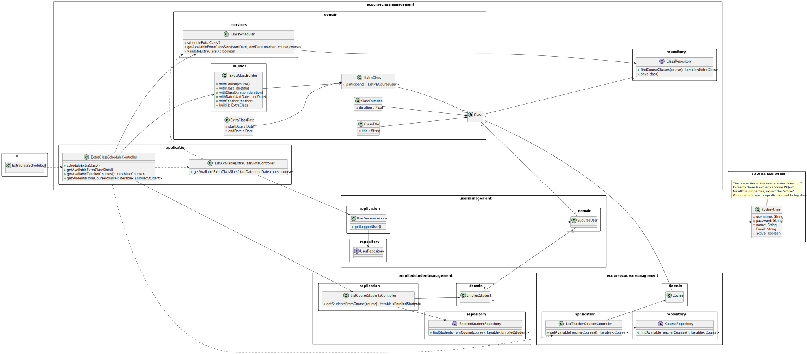

# US1011 - As Teacher, I want to schedule an extra class

## 1. Context

This requirement is related to the <span style="color: #d0734c"> scheduling of extra classes</span>, which is a very important feature of the system.
In this US we focus on the scheduling of extra classes, which are classes that that occurs one time only.

## 2. Requirements

There is 4 different Use Cases related to the scheduling of classes:

* **UC1011.1** As a Teacher, I want to be able to see my active courses.
* **UC1011.2** As a Teacher, I want to be able to see the available slots to schedule a extra class in a course.
* **UC1011.3** As a Teacher, I want to be able to schedule an extra class.
* **UC1011.4** As a Teacher, I want to be able to add participants to a extra class.


In order to schedule a class, the teacher must then <span style="color: #d0734c">provide the following information</span>:

- The title of the class.
- The course of the class.
- The date (with time) of the class.
- The class duration.

This information will then be validated, and if it is valid, the extra class will be scheduled.

The teacher also must <span style="color: #d0734c">be able to add participants to each extra class that is scheduled</span>.

## 3. Analysis

This User Story is not as simple as the schedule of recurrent classes, but it is important to note that it is <span style="color: #d0734c">only possible to schedule an extra class</span> if the <span style="color: #d0734c">course does not have another class(recurrent or extra) scheduled at the same time and day</span>.
Also, the system must make sure the <span style="color: #d0734c">teacher that is scheduling is available at the time and day of the class in other course</span>.

While analyzing this US, we noticed that this US has a <span style="color: #d0734c"> dependency on the US1002</span>, which is the US that 
allows the manager to <span style="color: #d0734c">create courses</span>, and to schedule an extra class, the teacher must provide the course so the 
system can check if the course already has a class scheduled at the same time and day.

This US also has a <span style="color: #d0734c">dependency on US1006</span>, which is the US that allows <span style="color: #d0734c">the teacher to see their available courses</span>, 
this is important because It's what makes possible the ability for the teacher to <span style="color: #d0734c"> choose the course he wants to create the class on.</span>

Since the teacher must be able to add participants to the extra class, he must be able to <span style="color: #d0734c">see the available participants</span>, and that's why we have
created the **UC1010.4**.

## 4. Design

### 4.1. Class Diagram



### 4.2. Sequence Diagram

This sequence diagram represents the case of a successful scheduling of an extra class.


### 4.3. Applied Patterns

Some main patterns used in this functionality are:

* **Single Responsibility Principle:** *Every class has only one responsibility*
* **Creator:** *The ExtraClassBuilder is a creator, since it creates the class and returns it.*
* **Information Expert:** *The ClassRepository is the IE of the Classes. The CourseRepository is the IE of the Courses.*
* **Low Coupling:** *All the classes are loosely coupled, not depending on concrete classes.*
* **High Cohesion:** *All the classes have a high cohesion, since they have only one responsibility.*

### 4.4. Tests

| Test Case | Description                                                                                        | Expected Result              |
|:---------:|:---------------------------------------------------------------------------------------------------|:-----------------------------|
|     1     | Create a extra class with valid data                                                               | Recurrent Class is created   |
|     2     | Create a extra class with invalid title                                                            | Exception is thrown          |
|     3     | Create a extra class with a non unique title                                                       | Exception is thrown          |
|     4     | Create a extra class with invalid duration                                                         | Exception is thrown          |
|     5     | Create a extra class with invalid date                                                             | Exception is thrown          |
|     6     | Create a extra class with invalid teacher                                                          | Exception is thrown          |
|     7     | Create a extra class with invalid course                                                           | Exception is thrown          |
|     8     | Create a extra class duration with 0 duration time                                                 | Exception is thrown          |
|     9     | Create a extra class duration with negative duration                                               | Exception is thrown          |
|    10     | Create a valid class title                                                                         | Class title is created       |
|    11     | Create a empty class title                                                                         | Exception is thrown          |
|    12     | Create a invalid class title                                                                       | Exception is thrown          |
|    13     | Create a valid extra class date                                                                    | Extra Class Date is created  |
|    14     | Create a invalid extra class date                                                                  | Exception is thrown          |
|    15     | Create a extra class date with a old date                                                          | Exception is thrown          |
|    16     | Create a extra class date with invalid format                                                      | Exception is thrown          |
|    17     | Schedule a valid extra class                                                                       | Extra class is scheduled     |
|    18     | Schedule a extra class where the course already has a recurrent class at the same time and day     | Extra Class is scheduled     |
|    19     | Schedule a extra class where the teacher is unavailable in another course at the same time and day | Extra Class is not scheduled |
|    20     | Schedule a extra class where the course already has another extra class at the same time and day   | Extra Class is not scheduled |
|    21     | Schedule a extra class where the date is greater than the finish date from the config files        | Extra Class is not scheduled |
|    22     | Schedule a extra class where the date is lower than the start date from the config files           | Extra Class is not scheduled |

<span style="color: #d0734c">Here are a few examples of the implemented tests for this US:</span>

- **Ensure Extra Class Is Not Created When Title Is Not Unique**:
````java
    @Test
    public void ensureBuilderDoesNotCreateClassWithSameTitleAsAnotherRecurrentClass(){
        Course validCourse = CourseDataSource.getTestCourse1();
        List<ECourseUser> validParticipants = new ArrayList<>();

        RecurrentClass recurrentClass = recurrentClassBuilder.withCourse(validCourse)
                .withClassTitle("Test")
                .withClassDuration(15)
                .withRecurrentClassTime("10:00")
                .withRecurrentClassWeekDay(RecurrentClassWeekDay.MONDAY)
                .withTeacher(validTeacher)
                .build();

        when(classRepository.findRecurrentClassByTitle("Test")).thenReturn(recurrentClass);

        Assertions.assertThrows(IllegalArgumentException.class, () -> {
            extraClassBuilder.withCourse(validCourse)
                    .withClassTitle("Test")
                    .withClassDuration(15)
                    .withTeacher(validTeacher)
                    .withExtraClassParticipants(validParticipants)
                    .withExtraClassDate(LocalDateTime.now().plusDays(1))
                    .build();
        });
    }
````

````java
@Test
    public void ensureBuilderDoesNotCreateClassWithSameTitleAsAnotherExtraClass() {
        Course validCourse = CourseDataSource.getTestCourse1();
        List<ECourseUser> validParticipants = new ArrayList<>();

        ExtraClass extraClass = extraClassBuilder.withCourse(validCourse)
                .withClassTitle("Test")
                .withClassDuration(15)
                .withTeacher(validTeacher)
                .withExtraClassParticipants(validParticipants)
                .withExtraClassDate(LocalDateTime.now().plusDays(1))
                .build();

        when(classRepository.findExtraClassByTitle("Test")).thenReturn(extraClass);

        Assertions.assertThrows(IllegalArgumentException.class, () -> {
            extraClassBuilder.withCourse(validCourse)
                    .withClassTitle("Test")
                    .withClassDuration(15)
                    .withTeacher(validTeacher)
                    .withExtraClassParticipants(validParticipants)
                    .withExtraClassDate(LocalDateTime.now().plusDays(1))
                    .build();
        });
    }
````

- **Ensure The Schedule Of a Extra Class Is Rejected When The Teacher is Unavailable In AnotherCourse**:
````java
    @Test
    public void ensureScheduleExtraClassIsRejectedWhenTeacherUnavailableInAnotherCourse(){
        // get string of the start time
        String hour1 = START_TIME_HOUR+ ":" + START_TIME_MINUTE;
        String hour2 = (START_TIME_HOUR +1) + ":" + START_TIME_MINUTE;

        // Arrange
        LocalDateTime startDay = LocalDateTime.now();
        LocalDateTime endDay = LocalDateTime.now().plusDays(1);
        List<ECourseUser> validParticipants = new ArrayList<>();

        // for teacher course where teacher will schedule
        when(classRepository.findCourseRecurrentClasses("EAPLI")).thenReturn(new ArrayList<>());
        when(classRepository.findCourseRecurrentClassesWhereTeacherInvolved("EAPLI", validTeacher)).thenReturn(new ArrayList<>());
        when(classRepository.findExtraClassByDateRangeAndTeacherWithNonMatchingCourse("EAPLI",startDay,endDay,validTeacher)).thenReturn(new ArrayList<>());
        when(classRepository.findExtraClassByCourseCodeAndDateRange("EAPLI",startDay,endDay)).thenReturn(new ArrayList<>());


        // for the other course where teacher is unavailable
        RecurrentClass class3 = new RecurrentClass("yeet", SLOT_DURATION, hour2, RecurrentClassWeekDay.THURSDAY, validCourse2,validTeacher);

        List<RecurrentClass> validRecurrentClasses2 = new ArrayList<>();
        validRecurrentClasses2.add(class3);

        when(classRepository.findCourseRecurrentClasses("APROG")).thenReturn(validRecurrentClasses2);
        when(classRepository.findCourseRecurrentClassesWhereTeacherInvolved("APROG", validTeacher)).thenReturn(validRecurrentClasses2);
        when(classRepository.findExtraClassByDateRangeAndTeacherWithNonMatchingCourse("EAPLI",startDay,endDay,validTeacher)).thenReturn(new ArrayList<>());
        when(classRepository.findExtraClassByCourseCodeAndDateRange("EAPLI",startDay,endDay)).thenReturn(new ArrayList<>());


        //Act
        // trying to schedule in a time and day, where the teacher already has another class in another course at the same time (class3)
        boolean verify = classScheduler.scheduleExtraClass(validCourses,validCourse,startDay,endDay,RecurrentClassWeekDay.THURSDAY,LocalTime.of(START_TIME_HOUR+1,START_TIME_MINUTE),SLOT_DURATION,"TITLE_TEST",validParticipants,validTeacher);

        Assertions.assertFalse(verify);
    }
````
## 5. Demonstration

https://user-images.githubusercontent.com/105438055/236492523-323cd2a4-655a-451d-98d2-6b9b276a0c00.mp4

- Before selecting the week day, we can see a calendar with green and red rectangles, the green retangles mean that the course, and the teacher scheduling, are available in that time and day. The red retangles mean the opposite, and the option to slect them in the menus does not appear.
- As we can see, all the slots on the day we are scheduling that are before the current time are occupied(red), because the teacher can't schedule
for a time before the current time.
- The reason why the class slot 17:30h isn't red, it's because the class will end at that time, meaning another class can start there, so it's displayed as green.


## 6. Implementation

Here is a list of the main classes and their responsibilities:
- **Class:** Represents our domain abstract class
  <br></br>
- **ExtraClass:** Represents our domain extra class that extends class

Class:
````java
@Entity
public abstract class Class implements AggregateRoot<Long>{

    @Id
    @GeneratedValue(strategy = GenerationType.IDENTITY)
    private Long id;

    @Embedded
    private ClassTitle classTitle;

    @Embedded
    private ClassDuration classDuration;

    @OneToOne(cascade = CascadeType.ALL)
    private Course classCourse;

    @OneToOne(cascade = CascadeType.ALL)
    private ECourseUser classTeacher;

    /**
     * Instantiates a new Class
     * @param classTitle the class title
     * @param classDuration the class duration
     * @param classCourse the class course
     * @param classTeacher the class teacher
     * @throws IllegalArgumentException if the classCourse is null
     */
    public Class(String classTitle, Integer classDuration, Course classCourse, ECourseUser classTeacher) {
        if(classCourse == null){
            throw new IllegalArgumentException("Invalid course");
        }

        if(classTeacher == null){
            throw new IllegalArgumentException("Invalid teacher");
        }

        this.classTitle = new ClassTitle(classTitle);
        this.classDuration = new ClassDuration(classDuration);
        this.classCourse = classCourse;
        this.classTeacher = classTeacher;
    }

    protected Class() {
        // for ORM
    }

    /**
     * Gets the class title
     * @return the class title
     */
    public Integer getClassDuration() {
        return classDuration.getClassDuration();
    }

    /**
     * Gets the class duration
     * @return the class duration
     */
    public String getClassTitle() {
        return classTitle.getClassTitle();
    }

    /**
     * Gets the class identity
     * @return the id
     */
    public Long identity() {
        return id;
    }

}
````

ExtraClass:

````java
@Entity
public class ExtraClass extends Class{

    @Embedded
    private ExtraClassDate extraClassDate;

    @OneToMany (cascade = CascadeType.ALL, fetch = FetchType.LAZY)
    private List<ECourseUser> extraClassParticipants;
    
    /**
     * Instantiates a new Extra class.
     *
     * @param classTitle the class title
     * @param classDuration the class duration
     * @param extraClassDate the extra class date
     * @param classCourse the class course
     * @param classTeacher the class teacher
     */
    public ExtraClass(String classTitle,Integer classDuration, LocalDateTime extraClassDate, Course classCourse, ECourseUser classTeacher, List<ECourseUser> extraClassParticipants) {
        super(classTitle, classDuration, classCourse, classTeacher);
        if(extraClassDate == null)
            throw new IllegalArgumentException("The extra class date cannot be null.");
        if(extraClassParticipants == null)
            throw new IllegalArgumentException("The extra class participants cannot be null.");
        this.extraClassDate = new ExtraClassDate(extraClassDate);
        this.extraClassParticipants = extraClassParticipants;
    }

    protected ExtraClass() {
        // for ORM
    }

    /**
     * Gets the extra class date.
     *
     * @return the extra class date
     */
    public LocalDateTime getsDate() {
        return extraClassDate.getDate();
    }

    @Override
    public boolean sameAs(Object other) {
        return DomainEntities.areEqual(this, other);
    }
}
````

**ExtraClassBuilder**- responsible for building the extra class

````java
public class ExtraClassBuilder {

    private final ClassRepository classRepository;

    private String classTitle;

    private Integer classDuration;

    private ECourseUser teacher;

    private Course course;

    private LocalDateTime extraClassDate;

    private List<ECourseUser> extraClassParticipants;

    public ExtraClassBuilder(ClassRepository classRepository) {

        // check if the class repository is null
        if(classRepository == null)
            throw new IllegalArgumentException("The classRepository cannot be null.");

        this.classRepository = classRepository;
    }


    /**
     * With class title recurrent class builder.
     * @param classTitle the class title
     * @return the extra class builder
     */
    public ExtraClassBuilder withClassTitle(String classTitle) {
        if(classTitle == null || classTitle.isBlank())
            throw new IllegalArgumentException("The class title cannot be null or empty.");
        this.classTitle = classTitle;
        return this;
    }

    /**
     * With class duration extra class builder.
     * @param classDuration the class duration
     * @return the extra class builder
     */
    public ExtraClassBuilder withClassDuration(Integer classDuration) {
        if(classDuration == null || classDuration <= 0)
            throw new IllegalArgumentException("The class duration cannot be null or empty.");
        this.classDuration = classDuration;
        return this;
    }

    /**
     * With teacher extra class builder.
     * @param teacher the teacher
     * @return the extra class builder
     */
    public ExtraClassBuilder withTeacher(ECourseUser teacher) {
        if(teacher == null)
            throw new IllegalArgumentException("The teacher cannot be null.");
        this.teacher = teacher;
        return this;
    }

    /**
     * With course extra class builder.
     * @param course the course
     * @return the extra class builder
     */
    public ExtraClassBuilder withCourse(Course course) {
        if(course == null)
            throw new IllegalArgumentException("The course cannot be null.");
        this.course = course;
        return this;
    }

    /**
     * With extra class date extra class builder.
     * @param extraClassDate the extra class date
     * @return the extra class builder
     */
    public ExtraClassBuilder withExtraClassDate(LocalDateTime extraClassDate) {
        if(extraClassDate == null)
            throw new IllegalArgumentException("The extra class date cannot be null.");
        if(extraClassDate.isBefore(LocalDateTime.now()))
            throw new IllegalArgumentException("The extra class date cannot be in the past.");
        this.extraClassDate = extraClassDate;
        return this;
    }

    /**
     * With the class participants with extra class builder.
     * @param extraClassParticipants the extra class week day
     * @return the extra class builder
     */
    public ExtraClassBuilder withExtraClassParticipants(List<ECourseUser> extraClassParticipants) {
        if(extraClassParticipants == null)
            throw new IllegalArgumentException("The extra class participants cannot be null or empty.");
        this.extraClassParticipants = extraClassParticipants;
        return this;
    }

    /**
     * Build extra class.
     * @return the extra class
     */
    public ExtraClass build() {
        RecurrentClass recurrentClass = classRepository.findRecurrentClassByTitle(this.classTitle);
        ExtraClass extraClass = classRepository.findExtraClassByTitle(this.classTitle);
        if (recurrentClass != null || extraClass != null)
            throw new IllegalArgumentException("Class title must be unique");

        return new ExtraClass(classTitle, classDuration, extraClassDate, course, teacher, extraClassParticipants);
    }

}
````

- **ClassRepository:** Represents the interface for our class repository
````java
public interface ClassRepository extends DomainRepository<Long, Class> {

    /**
     * Find all recurrent classes of a course.
     *
     * @param courseCode the course code
     * @return the iterable of recurrent classes of the course
     */
    Iterable<RecurrentClass> findCourseRecurrentClasses(String courseCode);
    
    /**
     * Find by class title.
     * @param classTitle the class title
     * @return the optional
     */
    Optional<Object> findByClassTitle(String classTitle);

    /**
     * Find course recurrent classes where teacher involved.
     *
     * @param courseCode the course code
     * @param user the user
     * @return
     */
    Iterable<RecurrentClass> findCourseRecurrentClassesWhereTeacherInvolved(String courseCode, ECourseUser user);
}
````

- **JPAClassRepository:** Represents our class repository implementation
````java
public class JpaClassRepository extends eCourseJpaRepositoryBase<Class, Long, Long> implements ClassRepository {

    public JpaClassRepository() {
        super("id");
    }

    @Override
    public Iterable<RecurrentClass> findCourseRecurrentClasses(String courseCode) {
        final TypedQuery<RecurrentClass> query = entityManager().createQuery(
                "SELECT c FROM RecurrentClass c WHERE c.classCourse.courseCode.courseCode = :code", RecurrentClass.class);
        query.setParameter("code", courseCode);
        return query.getResultList();
    }


    @Override
    public RecurrentClass findRecurrentClassByTitle(String classTitle) {
        final TypedQuery<RecurrentClass> query = entityManager().createQuery(
                "SELECT c FROM RecurrentClass c WHERE c.classTitle.title = :title", RecurrentClass.class);
        query.setParameter("title", classTitle);
        return query.getResultList().stream().findFirst().orElse(null);
    }

    @Override
    public Iterable<RecurrentClass> findCourseRecurrentClassesWhereTeacherInvolved(String courseCode, ECourseUser user) {
        final TypedQuery<RecurrentClass> query = entityManager().createQuery(
                "SELECT c FROM RecurrentClass c JOIN c.classCourse co " +
                        "WHERE co.courseCode = :code " +
                        "AND c.classTeacher = :user " +
                        "AND co.courseState != 'Closed'",
                RecurrentClass.class);

        query.setParameter("code", courseCode);
        query.setParameter("user", user);
        return query.getResultList();
    }

    @Override
    public Iterable<ExtraClass> findExtraClassByCourseCodeAndDateRange(String courseCode, LocalDateTime startDay, LocalDateTime endDay) {
        TypedQuery<ExtraClass> query = entityManager().createQuery(
                "SELECT c FROM ExtraClass c " +
                        "WHERE c.classCourse.courseCode.courseCode = :courseCode " +
                        "AND c.extraClassDate.extraClassDate >= :startDay " +
                        "AND c.extraClassDate.extraClassDate <= :endDay", ExtraClass.class);
        query.setParameter("courseCode", courseCode);
        query.setParameter("startDay", startDay);
        query.setParameter("endDay", endDay);
        return query.getResultList();
    }

    @Override
    public Iterable<ExtraClass> findExtraClassByDateRangeAndTeacherWithNonMatchingCourse(String courseCode, LocalDateTime startDay, LocalDateTime endDay, ECourseUser teacher) {
        TypedQuery<ExtraClass> query = entityManager().createQuery(
                "SELECT c FROM ExtraClass c " +
                        "WHERE c.classCourse.courseCode.courseCode <> :courseCode " +
                        "AND c.extraClassDate.extraClassDate >= :startDay " +
                        "AND c.extraClassDate.extraClassDate <= :endDay " +
                        "AND c.classTeacher = :teacher", ExtraClass.class);
        query.setParameter("courseCode", courseCode);
        query.setParameter("startDay", startDay);
        query.setParameter("endDay", endDay);
        query.setParameter("teacher", teacher);
        return query.getResultList();
    }
    
    @Override
    public ExtraClass findExtraClassByTitle(String title) {
        final TypedQuery<ExtraClass> query = entityManager().createQuery(
                "SELECT c FROM ExtraClass c WHERE c.classTitle.title = :title", ExtraClass.class);
        query.setParameter("title", title);
        return query.getResultList().stream().findFirst().orElse(null);
    }
    
    ...
}
````

- **ClassScheduler:** Represents our domain class scheduler service
````java
public class ClassScheduler {

    private final ClassRepository classRepository;

    private final Integer SLOT_DURATION = Application.settings().getSlotDurationTime();

    private final Integer START_TIME_HOUR;

    private final Integer START_TIME_MINUTE;

    private final Integer END_TIME_HOUR;

    private final Integer END_TIME_MINUTE;

    public ClassScheduler(ClassRepository classRepository) {
        if (classRepository == null)
            throw new IllegalArgumentException("The class repository can not be null.");

        this.classRepository = classRepository;

        // Get the start and end time from the config file
        String[] start = Application.settings().getStartTime().split(":");
        String[] end = Application.settings().getEndTime().split(":");
        this.START_TIME_HOUR = Integer.parseInt(start[0]);
        this.START_TIME_MINUTE = Integer.parseInt(start[1]);
        this.END_TIME_HOUR = Integer.parseInt(end[0]);
        this.END_TIME_MINUTE = Integer.parseInt(end[1]);
    }

    /**
     * Calculates the available recurrence class slots for the given course + the given teacher.
     *
     * After calculating the available slots for the given course, it then removes from it the slots where the teacher is involved in other classes from other courses.
     *
     * @param courses the courses to retrieve the available recurrence class slots for
     * @param user the teacher to retrieve the available recurrence class slots for
     * @param course the course to schedule the recurrent class for
     * @return a Map containing the available recurrence class slots for each day of the week
     */
    public Map<RecurrentClassWeekDay, Map<LocalTime, LocalTime>> getAvailableCourseTeacherIntersectionRecurrentSlots(Iterable<Course> courses, ECourseUser user, Course course){

            if(courses == null || user == null || course == null)
                return null;
            // map of the available slots of the course the class will be scheduled for each da (eg. Monday: 10:00 - 11:00, 11:00 - 12:00)
            Map<RecurrentClassWeekDay, Map<LocalTime, LocalTime>> availableSlots = getAvailableRecurrentClassSlots(course.identity().toString());

            // for each course of the teacher removed the available slots where the teacher is involved in other classes from other courses
            for (Course c : courses) {
                // if the course is the same as the one the class will be scheduled for, skip it
                if(c.equals(course))
                    continue;

                // map of the available slots for the teacher (eg. Monday: 10:00 - 11:00, 11:00 - 12:00)
                Map<RecurrentClassWeekDay, Map<LocalTime, LocalTime>> teacherAvailableSlots = getAvailableTeacherRecurrentSlotsForCourse(user,c.identity().toString());

                if(teacherAvailableSlots == null)
                    continue;

                if(availableSlots.isEmpty())
                    availableSlots = teacherAvailableSlots;
                else
                    // remove the slots where the teacher is involved in other classes from other courses
                    removeSlotsIntersection(availableSlots, teacherAvailableSlots);
            }

            return availableSlots;
    }

    /**
     * This method checks in which classes the teacher is involved and then calculates the available slots for each day of the week
     *
     * @param user the teacher to retrieve the available recurrence class slots for
     * @param courseCode the course to schedule the recurrent class for
     * @return a Map containing the available recurrence class slots for each day of the week of the given teacher
     */
    private Map<RecurrentClassWeekDay, Map<LocalTime, LocalTime>> getAvailableTeacherRecurrentSlotsForCourse(ECourseUser user, String courseCode) {
        Iterable<RecurrentClass> classes;

        // GET THE TIMES OF THE TEACHER COURSE CLASSES
        try{
            classes = classRepository.findCourseRecurrentClassesWhereTeacherInvolved(courseCode, user);
        } catch (Exception e){
            return null;
        }

        if(classes == null)
            return null;

        // map of the used slots for each day (eg. Monday: 10:00 - 11:00, 11:00 - 12:00)
        Map<RecurrentClassWeekDay, Map<LocalTime, LocalTime>> usedSlots = new LinkedHashMap<>();

        // GET THE USED SLOTS FOR EACH DAY
        fillUsedRecurrentClassSlots(classes,usedSlots);

        // map of the available slots for each day (eg. Monday: 10:00 - 11:00, 11:00 - 12:00)
        Map<RecurrentClassWeekDay, Map<LocalTime, LocalTime>> availableSlots = new LinkedHashMap<>();

        // GET THE AVAILABLE SLOTS FOR EACH DAY
        getAvailableSlots(usedSlots, availableSlots);

        return availableSlots;
    }

    /**
     Calculates the available recurrence class slots for a given course.
     The method retrieves the recurrent classes for the course from the class repository and then
     calculates the used slots for each day of the week based on the recurrent classes' start and end times.
     It then initializes the available slots with all the slots for each day of the week and removes the used slots
     from the available slots, resulting in the available recurrent class slots for the course.
     @param classCourse the name of the course to retrieve the available recurrence class slots for
     @return a Map containing the available recurrence class slots for each day of the week, or null if an exception is thrown while retrieving the recurrent classes from the repository
     */
    public Map<RecurrentClassWeekDay, Map<LocalTime, LocalTime>> getAvailableRecurrentClassSlots(String classCourse) {
        Iterable<RecurrentClass> Iclasses;

        // GET THE TIMES OF THE COURSE CLASSES
        try{
            Iclasses = classRepository.findCourseRecurrentClasses(classCourse);
        } catch (Exception e){
            return null;
        }

        if(Iclasses == null)
            return null;

        // map of the used slots for each day (eg. Monday: 10:00 - 11:00, 11:00 - 12:00)
        Map<RecurrentClassWeekDay, Map<LocalTime, LocalTime>> usedSlots = new LinkedHashMap<>();

        // GET THE USED SLOTS FOR EACH DAY
        fillUsedRecurrentClassSlots(Iclasses,usedSlots);

        // map of the available slots for each day (eg. Monday: 10:00 - 11:00, 11:00 - 12:00)
        Map<RecurrentClassWeekDay, Map<LocalTime, LocalTime>> availableSlots = new LinkedHashMap<>();

        // GET THE AVAILABLE SLOTS FOR EACH DAY
        getAvailableSlots(usedSlots, availableSlots);

        return availableSlots;
    }

    /**
     Calculates the available recurrent class slots based on the used slots and duration.
     The method initializes the available slots with all the slots for each day of the week.
     It then removes the used slots from the available slots and updates the available slots map accordingly.
     @param usedSlots a Map containing the used slots for each day of the week
     @param availableSlots a Map containing the available slots for each day of the week
     */
    private void getAvailableSlots(Map<RecurrentClassWeekDay, Map<LocalTime, LocalTime>> usedSlots, Map<RecurrentClassWeekDay, Map<LocalTime, LocalTime>> availableSlots) {
        // initialize the available slots with all the slots
        initializeAvailableSlots(availableSlots);

        // if there are no used slots, return the slots as all available
        if (usedSlots.isEmpty()) {
            return;
        }

        // remove the used slots from the available slots
        removeUsedSlots(usedSlots, availableSlots);
    }

    /**
     * Gets the available slots for an extra class in a time period.
     *
     * @param courses the teacher's courses
     * @param chosenCourse the chosen course
     * @param startDay the start day of the interval
     * @param endDay the end day of the interval
     * @return a map with the available slots
     */
    public Map<RecurrentClassWeekDay, Map<LocalTime, LocalTime>> getAvailableExtraClassSlots(Iterable<Course> courses, Course chosenCourse, LocalDateTime startDay, LocalDateTime endDay, ECourseUser teacher) {

            List<DayOfWeek> daysOfWeek = new ArrayList<>();
            getDaysOfWeekBetween(startDay, endDay, daysOfWeek);

            Map<RecurrentClassWeekDay, Map<LocalTime, LocalTime>> availableSlots = getAvailableCourseTeacherIntersectionRecurrentSlots(courses, teacher, chosenCourse);

            Iterable<ExtraClass> extraClasses = getAllExtraClassesFromCourseAndTeacher(chosenCourse, teacher, startDay, endDay);

            Map<RecurrentClassWeekDay, Map<LocalTime,LocalTime>> availableExtraSlotsForDay = getAvailableExtraSlots(extraClasses);

            if(availableExtraSlotsForDay == null) return null;

            removeSlotsIntersection(availableSlots, availableExtraSlotsForDay);
            removeUnecessaryDaySlots(availableSlots, daysOfWeek, startDay);

            return availableSlots;
    }

    /**
     *  Gets the times of the teacher and course classes for a week day.
     *
     * @param classes the classes of the teacher and course
     * @return a map with the available slots
     */
    private Map<RecurrentClassWeekDay, Map<LocalTime, LocalTime>> getAvailableExtraSlots(Iterable<ExtraClass> classes){

        if(classes == null) return null;

        // map of the used slots for each day (eg. Monday: 10:00 - 11:00, 11:00 - 12:00)
        Map<RecurrentClassWeekDay, Map<LocalTime, LocalTime>> usedSlots = new LinkedHashMap<>();

        // GET THE USED SLOTS FOR EACH DAY
        fillUsedExtraClassSlots(classes,usedSlots);

        // map of the available slots for each day (eg. Monday: 10:00 - 11:00, 11:00 - 12:00)
        Map<RecurrentClassWeekDay, Map<LocalTime, LocalTime>> availableSlots = new LinkedHashMap<>();

        // GET THE AVAILABLE SLOTS FOR EACH DAY
        getAvailableSlots(usedSlots, availableSlots);

        return availableSlots;
    }

    /**
     * Schedule extra class with extra class builder.
     * @param courses the teacher courses
     * @param chosenCourse the chosen course
     * @param startWeekDay the start week day of the chosen week
     * @param endWeekDay the end week day of the chosen week
     * @param weekDay the chosen week day
     * @param startTime the chosen start time
     * @param duration the chosen duration
     * @param title the chosen title
     * @param participants the chosen participants
     * @param eCourseUser the chosen teacher
     * @return true if the extra class was scheduled, false otherwise
     */
    public boolean scheduleExtraClass(Iterable<Course> courses, Course chosenCourse, LocalDateTime startWeekDay, LocalDateTime endWeekDay, RecurrentClassWeekDay weekDay, LocalTime startTime, Integer duration, String title, Iterable<ECourseUser> participants, ECourseUser eCourseUser) {
        boolean verify = validateExtraClass(startTime,weekDay,chosenCourse,eCourseUser,courses,startWeekDay,endWeekDay);

        if(!verify) return false;

        LocalDateTime classDate = getLocalDateTimeFromRecurrentClassWeekDayAndTime(weekDay,startTime, startWeekDay, endWeekDay);

        List<ECourseUser> participantsList = new ArrayList<>();
        participants.forEach(participantsList::add);

        ExtraClassBuilder extraClassBuilder = new ExtraClassBuilder(classRepository);
        ExtraClass extraClass;
        try{
            extraClass = extraClassBuilder.withCourse(chosenCourse)
                    .withClassTitle(title)
                    .withClassDuration(duration)
                    .withTeacher(eCourseUser)
                    .withExtraClassParticipants(participantsList)
                    .withExtraClassDate(classDate)
                    .build();
        } catch (Exception e) {
            return false;
        }

        classRepository.save(extraClass);

        return true;
    }

    /**
     * Validates the title of the class.
     *
     * @param title the title of the class
     * @return true if the title is valid, false otherwise
     */
    public boolean validateClassTitle(String title) {
        if (title == null || title.isEmpty()) {
            return false;
        }

        try {
            RecurrentClass rc = classRepository.findRecurrentClassByTitle(title);
            ExtraClass ec = classRepository.findExtraClassByTitle(title);

            if (rc != null || ec != null) {
                return false;
            }

        }catch (Exception e) {
            return false;
        }
        return true;
    }

    /**
     * Validates a Extra CLass
     * @param extraClassTime the time of the extra class
     * @param extraClassWeekDay the day of the extra class
     * @param classCourse the course of the extra class
     * @param teacher the teacher of the extra class
     * @param courses the courses of the teacher
     * @param startDay the start day of the extra class
     * @param endDay the end day of the extra class
     * @return true if the extra class is valid, false otherwise
     */
    public boolean validateExtraClass(LocalTime extraClassTime, RecurrentClassWeekDay extraClassWeekDay, Course classCourse, ECourseUser teacher, Iterable<Course> courses, LocalDateTime startDay,LocalDateTime endDay){

        Map<RecurrentClassWeekDay, Map<LocalTime, LocalTime>> availableSlots = getAvailableExtraClassSlots(courses, classCourse,startDay,endDay,teacher);

        if(availableSlots == null) return false;

        // null means the slot is not available
        if(availableSlots.get(extraClassWeekDay) == null) return false;
        if(availableSlots.get(extraClassWeekDay).get(extraClassTime) == null) return false;

        return true;
    }
    
  ...
}
````
