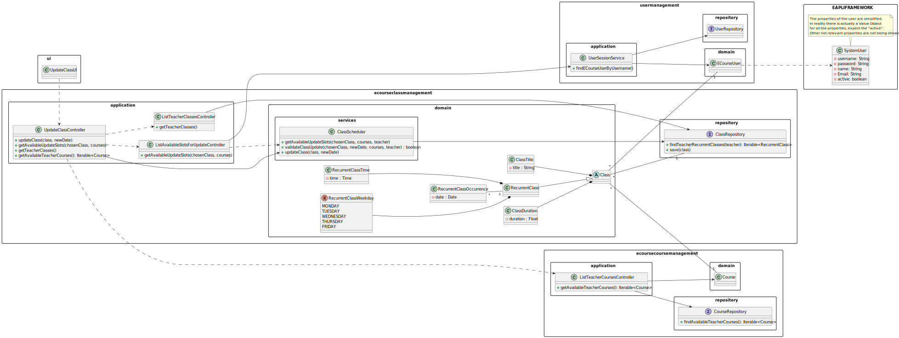
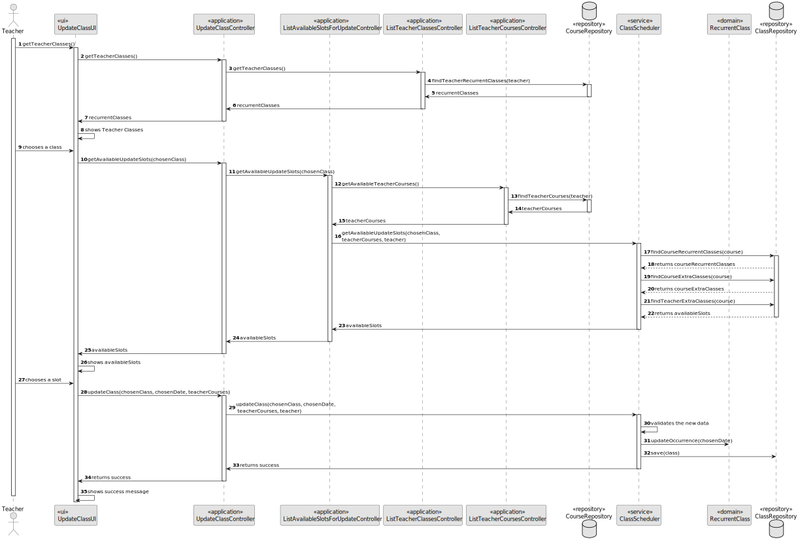

# US1012 - As Teacher, I want to update the schedule of a class

## 1. Context

This requirement is related to the <span style="color: #d0734c"> rescheduling a single occurrence of a recurrent class</span>, which is a very important feature of the system.

## 2. Requirements

There is 3 different Use Cases related to updating the schedule of a class, which are:

* **UC1012.1** As a Teacher, I want to be able to see my classes.
* **UC1012.2** As a Teacher, I want to be able to see the available slots to reschedule a single occurrence of a recurrent class.
* **UC1012.3** As a Teacher, I want to be able to reschedule a single occurrence of a recurrent class.


In order to reschedule the occurrence, the teacher must then <span style="color: #d0734c">provide the following information</span>:

- The class title.
- The new date (with time) of the class.

This information will then be validated, and if it is valid, the occurrence will be rescheduled.

## 3. Analysis

This User Story is at the same level of difficulty of the scheduling ones, since the occurrence we are changing <span style="color: #d0734c"> is not overlapping with another occurrence, or extra class</span>.
Also, the system must make sure the <span style="color: #d0734c">teacher that is scheduling is available at the time and day of the class in other courses</span>.

While analyzing this US, we noticed that this US has a <span style="color: #d0734c"> dependency on the US1002</span>, which is the US that 
allows the manager to <span style="color: #d0734c">create courses</span>, and to reschedule an occurrence, the teacher must have classes in them.

This US also has a <span style="color: #d0734c">dependency on US1010</span>, which is the US that allows <span style="color: #d0734c">the teacher to schedule the recurrent classes</span>, and without
it, the teacher wouldn't be able to reschedule the occurrence.

## 4. Design

### 4.1. Class Diagram



### 4.2. Sequence Diagram

This sequence diagram represents the case of a successful update to a single occurrence of a recurrent class.



### 4.3. Applied Patterns

Some main patterns used in this functionality are:

* **Single Responsibility Principle:** *Every class has only one responsibility*
* **Information Expert:** *The ClassRepository is the IE of the Classes. The CourseRepository is the IE of the Courses.*
* **Low Coupling:** *All the classes are loosely coupled, not depending on concrete classes.*
* **High Cohesion:** *All the classes have a high cohesion, since they have only one responsibility.*

### 4.4. Tests

| Test Case | Description                                                                                        | Expected Result                 |
|:---------:|:---------------------------------------------------------------------------------------------------|:--------------------------------|
|     1     | Update a class with valid data                                                                     | Recurrent Class is updated      |
|     2     | Update a class with a invalid new date                                                             | Exception is thrown             |
|     3     | Update a class with a invalid new duration                                                         | Exception is thrown             |
|     4     | Reschedule a occurrence where teacher unavailable in other course at the same time and day         | Recurrent Class is not updated  |
|     5     | Reschedule a occurrence where course already has another occurrence at the same time and day       | Recurrent Class is not updated  |
|     6     | Reschedule a occurrence where course already has another extra class at the same time and day      | Recurrent Class is not updated  |
|     7     | Reschedule a occurrence where the date is greater than the finish date from the config files       | Recurrent Class is not updated  |
|     8     | Reschedule a occurrence where the date is lower than the start date from the config files          | Recurrent Class is not updated  |
|     9     | Reschedule a occurrence where the date is lower than the current date                              | Recurrent Class is not updated  |

<span style="color: #d0734c">Here are a few examples of the implemented tests for this US:</span>

- **Ensure Update Date With Date Before Now Is Rejected**

```java
@Test
    public void ensureUpdateDateWithDateBeforeNowIsRejected(){
        //Arrange
        LocalDateTime date = LocalDateTime.of(6000, 12, 12, 12, 12);
        LocalDateTime oldDate = LocalDateTime.of(5000, 12, 12, 12, 12);
        LocalDateTime newDate = LocalDateTime.now().minusDays(1);

        //Act
        ClassOccurrence classOccurrence = new ClassOccurrence(date, oldDate,1);

        //Assert
        Assertions.assertThrows(IllegalArgumentException.class, () -> classOccurrence.update(newDate,1));
    }
````

- **Ensure Get Available Update Slots Returns Right Occurrences**

````java
  @Test
    public void ensureGetAvailableUpdateSlotsReturnsRightOccurrences(){
        //Arrange
        LocalDateTime startDay = LocalDateTime.now().with(TemporalAdjusters.next(DayOfWeek.MONDAY)).with(LocalTime.of(0,0,0));
        LocalDateTime endDay = startDay.with(TemporalAdjusters.next(DayOfWeek.SATURDAY)).with(LocalTime.of(0,0,0));

        // recurrent class with changed occurrence from tuesday to friday
        RecurrentClass class1 = new RecurrentClass("ok", SLOT_DURATION*2, START_TIME_HOUR+ ":" + START_TIME_MINUTE, RecurrentClassWeekDay.TUESDAY, validCourse,validTeacher);
        LocalDateTime newDate = startDay.with(TemporalAdjusters.next(DayOfWeek.FRIDAY)).with(LocalTime.of(START_TIME_HOUR,START_TIME_MINUTE));
        LocalDateTime oldDate = startDay.with(TemporalAdjusters.next(DayOfWeek.TUESDAY)).with(LocalTime.of(START_TIME_HOUR,START_TIME_MINUTE));
        ClassOccurrence occurrence = new ClassOccurrence(newDate, oldDate, SLOT_DURATION);
        class1.updateClassOccurrence(occurrence);

        List<RecurrentClass> validRecurrentClasses = new ArrayList<>();
        validRecurrentClasses.add(class1);


        when(classRepository.findCourseRecurrentClasses("EAPLI")).thenReturn(validRecurrentClasses);
        when(classRepository.findCourseRecurrentClassesWhereTeacherInvolved("EAPLI", validTeacher)).thenReturn(validRecurrentClasses);

        when(classRepository.findCourseRecurrentClassesWhereTeacherInvolved("APROG", validTeacher)).thenReturn(new ArrayList<>());
        when(classRepository.findCourseRecurrentClassesWhereTeacherInvolved("MDS", validTeacher)).thenReturn(new ArrayList<>());

        when(classRepository.findExtraClassByDateRangeAndTeacherWithNonMatchingCourse("EAPLI",startDay,endDay,validTeacher)).thenReturn(new ArrayList<>());
        when(classRepository.findExtraClassByCourseCodeAndDateRange("EAPLI",startDay,endDay)).thenReturn(new ArrayList<>());

        when(classRepository.findClassOccurrencesFromClass(class1)).thenReturn(class1.getUpdatedOccurrences());


        //Act
        Map<RecurrentClassWeekDay, Map<LocalTime, LocalTime>> availableRecurrentClassSlots = classScheduler.getAvailableUpdateSlots(validCourses,class1,startDay,endDay,startDay.with(TemporalAdjusters.next(DayOfWeek.TUESDAY)).with(LocalTime.of(START_TIME_HOUR,START_TIME_MINUTE)),validTeacher);

        //Assert

        // check if tuesday at time of the oldDate from the recurrent Class is available since it was updated to friday
        Assertions.assertEquals(LocalTime.of(START_TIME_HOUR,0,0).plusMinutes(SLOT_DURATION),availableRecurrentClassSlots.get(RecurrentClassWeekDay.TUESDAY).get(LocalTime.of(START_TIME_HOUR,0,0)));

        // check if friday at time of the newDate is occupied (non-existent in the map)
        Assertions.assertNull(availableRecurrentClassSlots.get(RecurrentClassWeekDay.FRIDAY).get(LocalTime.of(START_TIME_HOUR,START_TIME_MINUTE,0)));

    }
  ````

## 5. Demonstration


https://github.com/Departamento-de-Engenharia-Informatica/sem4pi-22-23-16-1/assets/105438055/09618fe4-05e8-49c3-b7b0-f0564851712c


- As we can see, the "slot" from the occurrence selected is presented as available, since the class can be placed at the same time but for a longer duration for example.
- Also on the menu that allows the teacher to select the occurrence we can see that it only shows the occurrences 10 weeks from now, this is set in a configuration file, so
it can be changed to whatever number the client wants to.

## 6. Implementation

Here is a list of the main classes and their responsibilities:
- **Class:** Represents our domain abstract class
  <br></br>
- **Recurrent Class:** Represents our domain recurrent class that extends class
  <br></br>
- **Class Occurrence:** Represents a single occurrence of a recurrent class
  <br></br>

Class Occurrence:
````java
@Entity
public class ClassOccurrence {

    @Id
    @GeneratedValue(strategy = GenerationType.IDENTITY)
    private Long id;

    private LocalDateTime newDate;

    private LocalDateTime oldDate;

    private Integer newDuration;

    /**
     * Instantiates a new Class occurrence.
     *
     */
    public ClassOccurrence(LocalDateTime newDate, LocalDateTime oldDate, Integer newDuration) {
        if(newDate == null)
            throw new IllegalArgumentException("The new date cannot be null.");

        if(oldDate == null)
            throw new IllegalArgumentException("The old date cannot be null.");

        if(newDate.isBefore(LocalDateTime.now()))
            throw new IllegalArgumentException("The new date cannot be before the old date.");

        if(newDuration == null)
            throw new IllegalArgumentException("The new duration cannot be null.");

        if(newDuration <= 0)
            throw new IllegalArgumentException("The new duration cannot be negative or zero.");
        
        this.newDate = newDate;
        this.oldDate = oldDate;
        this.newDuration = newDuration;
    }

    protected ClassOccurrence() {
        // for ORM
    }

    public void update(LocalDateTime newDate, Integer newDuration) {
        if(newDate == null)
            throw new IllegalArgumentException("The new date cannot be null.");

        if(newDate.isBefore(LocalDateTime.now()))
            throw new IllegalArgumentException("The new date cannot be before the old date.");

        if(newDuration == null)
            throw new IllegalArgumentException("The new duration cannot be null.");

        if(newDuration <= 0)
            throw new IllegalArgumentException("The new duration cannot be negative or zero.");

        this.newDate = newDate;
        this.newDuration = newDuration;
    }

    public LocalDateTime getNewDate() {
        return newDate;
    }

    public LocalDateTime getOldDate() {
        return oldDate;
    }

    public Integer getNewDuration() {
        return newDuration;
    }

    @Override
    public String toString() {
        return "Class Occurrence From " + newDate;
    }

}
````

Class Scheduler:
````java
public class ClassScheduler {

    private final ClassRepository classRepository;

    private final Integer SLOT_DURATION = Application.settings().getSlotDurationTime();

    private final Integer START_TIME_HOUR;

    private final Integer START_TIME_MINUTE;

    private final Integer END_TIME_HOUR;

    private final Integer END_TIME_MINUTE;

    private final Integer NUMBER_OF_WEEKS_FROM_NOW;

    public ClassScheduler(ClassRepository classRepository) {
        if (classRepository == null)
            throw new IllegalArgumentException("The class repository can not be null.");

        this.classRepository = classRepository;

        // Get the start and end time from the config file
        String[] start = Application.settings().getStartTime().split(":");
        String[] end = Application.settings().getEndTime().split(":");
        this.START_TIME_HOUR = Integer.parseInt(start[0]);
        this.START_TIME_MINUTE = Integer.parseInt(start[1]);
        this.END_TIME_HOUR = Integer.parseInt(end[0]);
        this.END_TIME_MINUTE = Integer.parseInt(end[1]);
        this.NUMBER_OF_WEEKS_FROM_NOW = Integer.parseInt(Application.settings().getNumberOfWeeksFromNow());
    }

    /**
     * Calculates the available recurrence class slots for the given course + the given teacher.
     *
     * After calculating the available slots for the given course, it then removes from it the slots where the teacher is involved in other classes from other courses.
     *
     * @param courses the courses to retrieve the available recurrence class slots for
     * @param user the teacher to retrieve the available recurrence class slots for
     * @param course the course to schedule the recurrent class for
     * @return a Map containing the available recurrence class slots for each day of the week
     */
    public Map<RecurrentClassWeekDay, Map<LocalTime, LocalTime>> getAvailableCourseTeacherIntersectionRecurrentSlots(
            Iterable<Course> courses, ECourseUser user, Course course){

            if(courses == null || user == null || course == null)
                return null;
            // map of the available slots of the course the class will be scheduled for each da (eg. Monday: 10:00 - 11:00, 11:00 - 12:00)
            Map<RecurrentClassWeekDay, Map<LocalTime, LocalTime>> availableSlots = getAvailableRecurrentClassSlots(course.identity().toString());

            // for each course of the teacher removed the available slots where the teacher is involved in other classes from other courses
            for (Course c : courses) {
                // if the course is the same as the one the class will be scheduled for, skip it
                if(c.equals(course))
                    continue;

                // map of the available slots for the teacher (eg. Monday: 10:00 - 11:00, 11:00 - 12:00)
                Map<RecurrentClassWeekDay, Map<LocalTime, LocalTime>> teacherAvailableSlots = getAvailableTeacherRecurrentSlotsForCourse(user,c.identity().toString());

                if(teacherAvailableSlots == null)
                    continue;

                if(availableSlots.isEmpty())
                    availableSlots = teacherAvailableSlots;
                else
                    // remove the slots where the teacher is involved in other classes from other courses
                    removeSlotsIntersection(availableSlots, teacherAvailableSlots);
            }

            return availableSlots;
    }

    /**
     Calculates the available recurrence class slots for a given course.
     The method retrieves the recurrent classes for the course from the class repository and then
     calculates the used slots for each day of the week based on the recurrent classes' start and end times.
     It then initializes the available slots with all the slots for each day of the week and removes the used slots
     from the available slots, resulting in the available recurrent class slots for the course.
     @param classCourse the name of the course to retrieve the available recurrence class slots for
     @return a Map containing the available recurrence class slots for each day of the week, or null if an exception is thrown while retrieving the recurrent classes from the repository
     */
    public Map<RecurrentClassWeekDay, Map<LocalTime, LocalTime>> getAvailableRecurrentClassSlots(String classCourse) {
        Iterable<RecurrentClass> Iclasses;

        // GET THE TIMES OF THE COURSE CLASSES
        try{
            Iclasses = classRepository.findCourseRecurrentClasses(classCourse);
        } catch (Exception e){
            return null;
        }

        if(Iclasses == null)
            return null;

        // map of the used slots for each day (eg. Monday: 10:00 - 11:00, 11:00 - 12:00)
        Map<RecurrentClassWeekDay, Map<LocalTime, LocalTime>> usedSlots = new LinkedHashMap<>();

        // GET THE USED SLOTS FOR EACH DAY
        fillUsedRecurrentClassSlots(Iclasses,usedSlots);

        // map of the available slots for each day (eg. Monday: 10:00 - 11:00, 11:00 - 12:00)
        Map<RecurrentClassWeekDay, Map<LocalTime, LocalTime>> availableSlots = new LinkedHashMap<>();

        // GET THE AVAILABLE SLOTS FOR EACH DAY
        getAvailableSlots(usedSlots, availableSlots);

        return availableSlots;
    }

    /**
     * Gets the available slots for an extra class in a time period.
     *
     * @param courses the teacher's courses
     * @param chosenCourse the chosen course
     * @param startDay the start day of the interval
     * @param endDay the end day of the interval
     * @return a map with the available slots
     */
    public Map<RecurrentClassWeekDay, Map<LocalTime, LocalTime>> getAvailableExtraClassSlots(Iterable<Course> courses,
                                                                                             Course chosenCourse,
                                                                                             LocalDateTime startDay,
                                                                                             LocalDateTime endDay,
                                                                                             ECourseUser teacher) {

            List<DayOfWeek> daysOfWeek = new ArrayList<>();
            getDaysOfWeekBetween(startDay, endDay, daysOfWeek);

            Map<RecurrentClassWeekDay, Map<LocalTime, LocalTime>> availableSlots = getAvailableCourseTeacherIntersectionRecurrentSlots(courses, teacher, chosenCourse);
            removeOccurrencesThatWereUpdated(availableSlots,courses, teacher, chosenCourse, startDay, endDay);

            Iterable<ExtraClass> extraClasses = getAllExtraClassesFromCourseAndTeacher(chosenCourse, teacher, startDay, endDay);

            Map<RecurrentClassWeekDay, Map<LocalTime,LocalTime>> availableExtraSlotsForDay = getAvailableExtraSlots(extraClasses);

            if(availableExtraSlotsForDay == null) return null;

            removeSlotsIntersection(availableSlots, availableExtraSlotsForDay);
            removeUnnecessaryDaySlots(availableSlots, daysOfWeek, startDay);


            return availableSlots;
    }

    private void removeOccurrencesThatWereUpdated(Map<RecurrentClassWeekDay, Map<LocalTime, LocalTime>> availableSlots,
                                                  Iterable<Course> courses, ECourseUser teacher, Course chosenCourse,
                                                  LocalDateTime startDay, LocalDateTime endDay) {

        // get all recurrent classes
        List<RecurrentClass> allClasses = getAllRecurrentClassesFromCourseAndTeacher(chosenCourse, teacher, courses);

        Map<RecurrentClassWeekDay,Map<LocalTime, LocalTime>> usedSlots = new LinkedHashMap<>();

        // for every class, check for occurrences from the start day to the end day, and remove them from the available slots
        for(RecurrentClass recurrent : allClasses){
            List<ClassOccurrence> occurrences = recurrent.getUpdatedOccurrences();

            if(occurrences.isEmpty()) continue;

            for(ClassOccurrence occurrence : occurrences) {
                RecurrentClassWeekDay day = getRecurrentWeekDayFromDayOfWeek(occurrence.getOldDate().getDayOfWeek());
                LocalTime startTime = occurrence.getOldDate().toLocalTime();

                if (occurrence.getOldDate().isAfter(startDay) && occurrence.getOldDate().isBefore(endDay)) {
                    // add the available slot back

                    if (availableSlots.get(day) == null) availableSlots.put(day, new LinkedHashMap<>());
                    while (!startTime.isAfter(occurrence.getOldDate().toLocalTime().plusMinutes(recurrent.getClassDuration()))) {
                        availableSlots.get(day).put(startTime, startTime.plusMinutes(SLOT_DURATION));
                        startTime = startTime.plusMinutes(SLOT_DURATION);
                    }
                }

                // add slot if in the current week
                if (occurrence.getNewDate().isAfter(startDay) && occurrence.getNewDate().isBefore(endDay)) {


                    // add the new used slot to the map
                    RecurrentClassWeekDay classWeekDay = getRecurrentWeekDayFromDayOfWeek(occurrence.getNewDate().getDayOfWeek());
                    // get the start and end time of the class
                    LocalTime classStartTime = occurrence.getNewDate().toLocalTime();
                    Integer classDuration = occurrence.getNewDuration();
                    LocalTime classEndTime = classStartTime.plusMinutes(classDuration);

                    // check if the weekday is already in the map
                    if (usedSlots.containsKey(classWeekDay)) {
                        Map<LocalTime, LocalTime> usedSlotsForDay = usedSlots.get(classWeekDay);

                        // check if the class start time is already in the map
                        if (usedSlotsForDay.containsKey(classStartTime)) {
                            LocalTime usedClassEndTime = usedSlotsForDay.get(classStartTime);

                            // check if the end time of the class that is already in the map, is before the end time of the class we are checking
                            if (usedClassEndTime.isBefore(classEndTime)) {
                                usedSlotsForDay.replace(classStartTime, classEndTime);
                            }
                        } else {
                            usedSlotsForDay.put(classStartTime, classEndTime);
                        }
                    } else {
                        usedSlots.put(classWeekDay, new LinkedHashMap<>());
                        usedSlots.get(classWeekDay).put(classStartTime, classEndTime);
                    }

                }
            }

        }

        // remove the used slots from the available slots
        removeUsedSlots(usedSlots, availableSlots);

    }

    /**
     * Updates a Occurrence of a recurrent class
     * @param teacherCourses the teacher courses
     * @param selectedClass the chosen recurrent class
     * @param startDay the start day of the chosen week
     * @param endDay the end day of the chosen week
     * @param day the chosen week day
     * @param startTime the chosen start time
     * @param classOldDate the old date of the class
     * @param teacher the chosen teacher
     * @return  true if the class was updated, false otherwise
     */
    public boolean updateClass(Iterable<Course> teacherCourses, RecurrentClass selectedClass, LocalDateTime startDay,
                               LocalDateTime endDay, RecurrentClassWeekDay day, LocalTime startTime,
                               LocalDateTime classOldDate, ECourseUser teacher, Integer duration) {

        boolean verify = validateExtraClass(startTime, day, selectedClass.getClassCourse(),teacher,teacherCourses,startDay,endDay);

        if(!verify) return false;

        LocalDateTime classDate = getLocalDateTimeFromRecurrentClassWeekDayAndTime(day,startTime,startDay,endDay);

        updateClassOccurrence(selectedClass, classOldDate, classDate, duration);

        classRepository.save(selectedClass);

        return true;
    }

    /**
     * Gets the occurrences of a recurrent class.
     * @param selectedClass the chosen recurrent class
     * @return the occurrences of the recurrent class
     */
    public List<LocalDateTime> getClassOccurrences(RecurrentClass selectedClass) {

        List<LocalDateTime> classOccurrences = getDatesForDayOfWeekAndTime(getDayOfWeekFromRecurrentClassWeekDay(selectedClass.getWeekDay()), selectedClass.getClassTime());

        // remove occurrences that were changed
        List<ClassOccurrence> updatedOccurrences = selectedClass.getUpdatedOccurrences();

        for (ClassOccurrence occurrence : updatedOccurrences) {
            classOccurrences.remove(occurrence.getOldDate());
            classOccurrences.add(occurrence.getNewDate());
        }

        return classOccurrences;
    }

    /**
     * Gets the available slots to update an occurrence of a recurrent class to.
     * @param courses the courses of the teacher
     * @param selectedClass the selected recurrent class
     * @param startDay the start of week
     * @param endDay the end of week
     * @param classOldDate the old date of the class
     * @return the available slots
     */
    public Map<RecurrentClassWeekDay, Map<LocalTime, LocalTime>> getAvailableUpdateSlots(Iterable<Course> courses,
                                                                                         RecurrentClass selectedClass,
                                                                                         LocalDateTime startDay,
                                                                                         LocalDateTime endDay,
                                                                                         LocalDateTime classOldDate,
                                                                                         ECourseUser teacher) {

            Map<RecurrentClassWeekDay, Map<LocalTime, LocalTime>> availableSlots = getAvailableExtraClassSlots(courses, selectedClass.getClassCourse(),startDay,endDay,teacher);

            if(availableSlots == null) return null;

            // remove the slots occupied by the selected occurrence, since it is being updated
            if(!(classOldDate.isBefore(startDay) || classOldDate.isAfter(endDay))){
                 AddOccupiedClassSlotsToAvailableSlots(availableSlots, selectedClass, classOldDate);
            }

            return availableSlots;

    }
    
  ...
    
}

````
