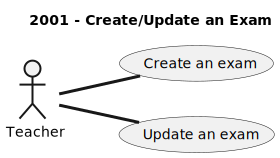
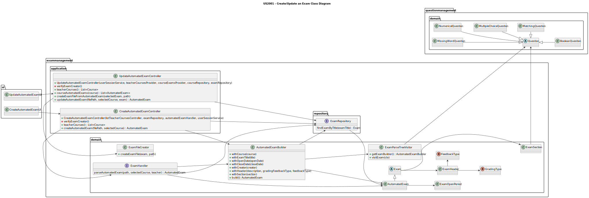
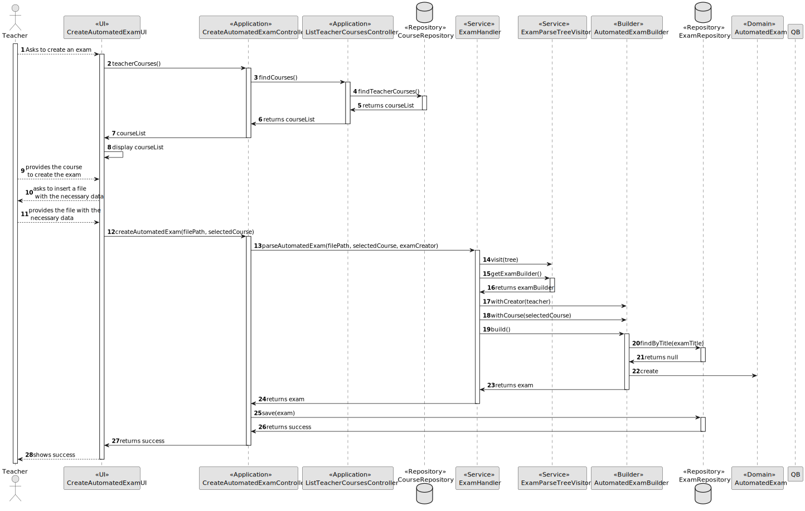
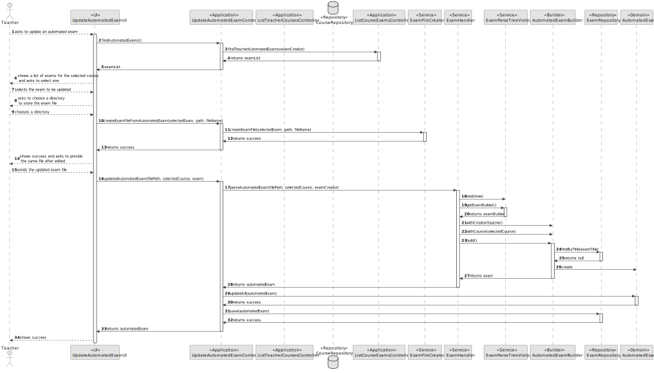

# US2001 - As a Teacher I want to create/update an exam.

## 1. Context
This US is being developed for the first time, since it was assigned in this sprint (sprint 2).
This requirement is placed in the context of creating or updating an [exam](../MainDocs/glossary.md).

An [exam](../MainDocs/glossary.md) consists of set of questions used by a teacher to grade students.

## 2. Requirements

The following Use Cases are required to be implemented:

* **UC2001.1** As a Teacher, I want to create an exam.
* **UC2001.2** As a Teacher, I want to update an exam.

* The following Acceptance Criteria must be followed:

* **AC2001.1** The US includes the specification of the exam (i.e, its structure, in accordance with a grammar for exams that is used to validate the specification of the exam).
* **AC2001.2** The support for exams (its design, feedback and grading) must follow specific technical requirements, specified in LPROG.
* **AC2001.3** The ANTLR tool should be used.

* The **exam title** must be unique.

---

## 3. Analysis

* To satisfy all the requirements, it will be necessary to create and update the structure of an exam itself, and the possibilities it can take for its specification, and the components that support it such as its design, feedback and grading.
* The ANTLR tool will be used to validate the specification of an exam. Regarding an input text, it will be necessary to validate a grammar for exams, and if it is valid, the exam will be created, and it can be updated in the future.
* The exam attributes and data will be saved in the database using a JPA Repository.
* Since this is a US directly applied to a Teacher, it will be necessary to know who is the Teacher wanting to create/update an exam, and for that, the already developed service *UserSessionService* will be used.
* A builder will be used to create the exam, and a service will be used to update it.

* In terms of direct interaction with the user and in order to input the necessary data to create/update an exam, a text file with the following exact structure will be required:


* Every **Token** (ex: 'TITLE:'), need to be in the exact order you are seeing above.
* To define a **section** you need to type 'SECTIONHEADER:'. The following questions will belong to the specified header until a new one is found. A section must have at least one question.
* The only thing that can be differnet or modified regarding the example file is the number and order of the questions.

* To define **questions** in an exam there are some strict rules you must follow:

* Short Answer Question: The tokens must be defined in the order - 'SHORT_ANSWER:' > 'ANSW:' > 'GRADE:'
* Multiple Choice Question: The tokens must be defined in the order - 'MULTIPLE_CHOICE:' > 'CONANSW:' > 'GRADE:' > 'ANSW:' (this token must be defined at least 2 times)
* Matching Question: The tokens must be defined in the order - 'MATCHING:' > 'MATCHES:' > 'GRADE:'
* Numerical Question: The tokens must be defined in the order - 'NUMERICAL:' > 'ANSW:' > 'GRADE:'
* Boolean Question: The tokens must be defined in the order - 'BOOLEAN:' > 'ANSW:' > 'GRADE:' (the 'ANSW:' must either be TRUE or FALSE)
* Missing Word Question: The tokens must be defined in the order - 'MissingWord:' > 'GRADE:' > 'CORANSW:' > 'ANSW:' ---> For each 'CORANSW:' there is a set of 'ANSW:' (>1), and to specify a "gap" corresponding to where the user must choose their answer, you must type '[[n]]' (consult ExamStructure image for a better understanding).  

### 3.1. Use case Diagram

Since this US was split in three Use Cases, the following Use Case Diagram was created:



## 4. Design

### 4.1. Class Diagram


---

### 4.2. Sequence Diagram

#### 4.2.1. Create Exam Sequence Diagram



* There are some important things to consider in the sequence diagram, that are not represented directly to simplify its viewing and understanding.

* The *UserSessionService* is used to get the current logged user, to know what courses the user is associated with.

#### 4.2.2. Update Exam Sequence Diagram



### 4.3. Applied Patterns

Some main patterns used in this functionality are:

* **Model-View-Controller:** *This pattern separates the application into three main components: model (data and business logic), view (user interface), and controller (mediates between the model and view).* 
* **Single Responsibility Principle:** *Every class has only one responsibility.*
* **Information Expert:** *An example would be the ExamRepository being the exams information expert.*
* **Low Coupling:** *All the classes are loosely coupled, not depending on concrete classes, but interfaces instead.*
* **High Cohesion:** *All the classes have a high cohesion, since they have only one responsibility.*
* **Dependency Injection** *As a "solution" for instantiating the used repositories/services, these are injected as a parameter providing flexibility.*

### 4.4. Tests

##### 4.4.1. ExamHandlerTest
```
public class ExamHandlerTest {

    private ExamRepository examRepository;

    private ExamHandler examHandler;

    private ECourseUser validTeacher;

    private Course validCourse;

    @BeforeEach
    public void setUp() {
        examRepository = mock(ExamRepository.class);
        examHandler = new ExamHandler(examRepository);

        validCourse = CourseDataSource.getTestCourse1();
        validTeacher = UserDataSource.getTestTeacher1();
    }

    @Test
    public void ensureExamHandlerReturnsAutomatedExamFromFile() throws IOException, URISyntaxException {
        // Arrange
        String filename = "examfiles/validexam.txt";
        Class<?> clazz = ExamHandlerTest.class; // Replace with your actual test class
        ClassLoader classLoader = clazz.getClassLoader();
        URL resourceUrl = classLoader.getResource(filename);
        Path filePath = Paths.get(resourceUrl.toURI());

        // Act

        AutomatedExam exam = examHandler.parseAutomatedExam(filePath.toString(),validCourse, validTeacher);

        // Assert
        Assertions.assertTrue(exam.toString().contains("Teste de Perguntas"));
    }

    @Test
    public void ensureExamHandlerRejectsInvalidHeader() throws URISyntaxException {
        // Arrange
        String filename = "examfiles/invalidexamheader.txt";
        Class<?> clazz = ExamHandlerTest.class; // Replace with your actual test class
        ClassLoader classLoader = clazz.getClassLoader();
        URL resourceUrl = classLoader.getResource(filename);
        Path filePath = Paths.get(resourceUrl.toURI());

        // Act & Assert
        Assertions.assertThrows(Exception.class, () -> {
            AutomatedExam exam = examHandler.parseAutomatedExam(filePath.toString(),validCourse, validTeacher);
        });

    }

    @Test
    public void ensureExamHandlerRejectsInvalidFeedBack() throws URISyntaxException {
        // Arrange
        String filename = "examfiles/invalidexamfeedback.txt";
        Class<?> clazz = ExamHandlerTest.class; // Replace with your actual test class
        ClassLoader classLoader = clazz.getClassLoader();
        URL resourceUrl = classLoader.getResource(filename);
        Path filePath = Paths.get(resourceUrl.toURI());

        // Act & Assert
        Assertions.assertThrows(Exception.class, () -> {
            AutomatedExam exam = examHandler.parseAutomatedExam(filePath.toString(),validCourse, validTeacher);
        });

    }

    @Test
    public void ensureExamHandlerRejectsInvalidSectionHeader() throws URISyntaxException {
        // Arrange
        String filename = "examfiles/invalidexamsectionheader.txt";
        Class<?> clazz = ExamHandlerTest.class; // Replace with your actual test class
        ClassLoader classLoader = clazz.getClassLoader();
        URL resourceUrl = classLoader.getResource(filename);
        Path filePath = Paths.get(resourceUrl.toURI());

        // Act & Assert
        Assertions.assertThrows(Exception.class, () -> {
            AutomatedExam exam = examHandler.parseAutomatedExam(filePath.toString(),validCourse, validTeacher);
        });

    }

    @Test
    public void ensureExamHandlerRejectsInvalidSection() throws URISyntaxException {
        // Arrange
        String filename = "examfiles/invalidexamsection.txt";
        Class<?> clazz = ExamHandlerTest.class; // Replace with your actual test class
        ClassLoader classLoader = clazz.getClassLoader();
        URL resourceUrl = classLoader.getResource(filename);
        Path filePath = Paths.get(resourceUrl.toURI());

        // Act & Assert
        Assertions.assertThrows(Exception.class, () -> {
            AutomatedExam exam = examHandler.parseAutomatedExam(filePath.toString(),validCourse, validTeacher);
        });

    }

    @Test
    public void ensureExamHandlerRejectsInvalidBooleanQuestion() throws URISyntaxException {
        // Arrange
        String filename = "examfiles/invalidexambquest.txt";
        Class<?> clazz = ExamHandlerTest.class; // Replace with your actual test class
        ClassLoader classLoader = clazz.getClassLoader();
        URL resourceUrl = classLoader.getResource(filename);
        Path filePath = Paths.get(resourceUrl.toURI());

        // Act & Assert
        Assertions.assertThrows(Exception.class, () -> {
            AutomatedExam exam = examHandler.parseAutomatedExam(filePath.toString(),validCourse, validTeacher);
        });

    }

    @Test
    public void ensureExamHandlerRejectsInvalidShortAnswerQuestion() throws URISyntaxException {
        // Arrange
        String filename = "examfiles/invalidexamsquest.txt";
        Class<?> clazz = ExamHandlerTest.class; // Replace with your actual test class
        ClassLoader classLoader = clazz.getClassLoader();
        URL resourceUrl = classLoader.getResource(filename);
        Path filePath = Paths.get(resourceUrl.toURI());

        // Act & Assert
        Assertions.assertThrows(Exception.class, () -> {
            AutomatedExam exam = examHandler.parseAutomatedExam(filePath.toString(),validCourse, validTeacher);
        });

    }

    @Test
    public void ensureExamHandlerRejectsInvalidMultipleChoiceQuestion() throws URISyntaxException {
        // Arrange
        String filename = "examfiles/invalidexammcquest.txt";
        Class<?> clazz = ExamHandlerTest.class; // Replace with your actual test class
        ClassLoader classLoader = clazz.getClassLoader();
        URL resourceUrl = classLoader.getResource(filename);
        Path filePath = Paths.get(resourceUrl.toURI());

        // Act & Assert
        Assertions.assertThrows(Exception.class, () -> {
            AutomatedExam exam = examHandler.parseAutomatedExam(filePath.toString(),validCourse, validTeacher);
        });

    }

    @Test
    public void ensureExamHandlerRejectsInvalidNumericalQuestion() throws URISyntaxException {
        // Arrange
        String filename = "examfiles/invalidexamnquest.txt";
        Class<?> clazz = ExamHandlerTest.class; // Replace with your actual test class
        ClassLoader classLoader = clazz.getClassLoader();
        URL resourceUrl = classLoader.getResource(filename);
        Path filePath = Paths.get(resourceUrl.toURI());

        // Act & Assert
        Assertions.assertThrows(Exception.class, () -> {
            AutomatedExam exam = examHandler.parseAutomatedExam(filePath.toString(),validCourse, validTeacher);
        });

    }

    @Test
    public void ensureExamHandlerRejectsInvalidMissingWordQuestion() throws URISyntaxException {
        // Arrange
        String filename = "examfiles/invalidexammwquest.txt";
        Class<?> clazz = ExamHandlerTest.class; // Replace with your actual test class
        ClassLoader classLoader = clazz.getClassLoader();
        URL resourceUrl = classLoader.getResource(filename);
        Path filePath = Paths.get(resourceUrl.toURI());

        // Act & Assert
        Assertions.assertThrows(Exception.class, () -> {
            AutomatedExam exam = examHandler.parseAutomatedExam(filePath.toString(),validCourse, validTeacher);
        });

    }

    @Test
    public void ensureExamHandlerRejectsInvalidMatchingQuestion() throws URISyntaxException {
        // Arrange
        String filename = "examfiles/invalidexammquest.txt";
        Class<?> clazz = ExamHandlerTest.class; // Replace with your actual test class
        ClassLoader classLoader = clazz.getClassLoader();
        URL resourceUrl = classLoader.getResource(filename);
        Path filePath = Paths.get(resourceUrl.toURI());

        // Act & Assert
        Assertions.assertThrows(Exception.class, () -> {
            AutomatedExam exam = examHandler.parseAutomatedExam(filePath.toString(),validCourse, validTeacher);
        });

    }


}
```

##### 4.2. ExamSectionTest
```java
public class ExamSectionTest {

    @Test
    public void ensureValidExamSectionIsAccepted() {

        // Arrange
        String description = "Description";
        List<Question> questions = new ArrayList<>();
        questions.add(new BooleanQuestion("Question", true, 0.5f, 1f));

        // Act
        ExamSection examSection = new ExamSection(description, questions);

        String expected = "Description";

        // Assert
        Assertions.assertTrue(examSection.toString().contains(expected));
    }

    @Test
    public void ensureNullDescriptionIsRejected() {

        // Arrange
        String description = null;
        List<Question> questions = new ArrayList<>();
        questions.add(new BooleanQuestion("Question", true, 0.5f, 1f));

        // Act
        Assertions.assertThrows(IllegalArgumentException.class, () -> {
            new ExamSection(description, questions);
        });

    }

    @Test
    public void ensureNullQuestionsIsRejected() {

        // Arrange
        String description = "Description";
        List<Question> questions = null;

        // Act
        Assertions.assertThrows(IllegalArgumentException.class, () -> {
            new ExamSection(description, questions);
        });

    }

    @Test
    public void ensureEmptyQuestionsIsRejected() {

        // Arrange
        String description = "Description";
        List<Question> questions = new ArrayList<>();

        // Act
        Assertions.assertThrows(IllegalArgumentException.class, () -> {
            new ExamSection(description, questions);
        });

    }


}
```

##### 4.3. ExamTest
```java
public class ExamTest {

    @Test
    public void ensureValidExamIsAccepted() {

        // Arrange

        // create ExamSection
        String description = "Description";
        List<Question> questions = new ArrayList<>();
        questions.add(new BooleanQuestion("Question", true, 0.5f, 1f));

        ExamSection examSection = new ExamSection(description, questions);
        List<ExamSection> sections = new ArrayList<>();
        sections.add(examSection);

        ECourseUser teacher = UserDataSource.getTestTeacher1();
        Course course = CourseDataSource.getTestCourse1();

        // create Open Period
        LocalDateTime openDate = LocalDateTime.now().plusDays(1);
        LocalDateTime closeDate = LocalDateTime.now().plusDays(2);

        // create ExamHeader
        String description2 = "Exam Description";
        GradingType gradingFeedBackType = GradingType.NONE;
        FeedBackType feedbackType = FeedBackType.NONE;
        ExamHeader examHeader = new ExamHeader(description2, gradingFeedBackType, feedbackType);

        String examTitle = "Exam Title";

        // Act
        AutomatedExam exam = new AutomatedExam(sections,examHeader,openDate, closeDate, examTitle, teacher, course);

        String expected = "Exam Description";

        // Assert
        Assertions.assertTrue(exam.toString().contains(expected));

    }

    @Test
    public void ensureNullSectionsIsRejected() {
        // Arrange
        List<ExamSection> sections = null;

        // create Open Period
        LocalDateTime openDate = LocalDateTime.now().plusDays(1);
        LocalDateTime closeDate = LocalDateTime.now().plusDays(2);

        // create ExamHeader
        String description2 = "Exam Description";
        GradingType gradingFeedBackType = GradingType.NONE;
        FeedBackType feedbackType = FeedBackType.NONE;
        ExamHeader examHeader = new ExamHeader(description2, gradingFeedBackType, feedbackType);

        String examTitle = "Exam Title";

        // Creator and Course
        ECourseUser teacher = UserDataSource.getTestTeacher1();
        Course course = CourseDataSource.getTestCourse1();

        // Act
        Assertions.assertThrows(IllegalArgumentException.class, () -> {
            new AutomatedExam(sections, examHeader, openDate, closeDate, examTitle, teacher, course);
        });

    }

    @Test
    public void ensureNullExamHeaderIsRejected() {

        // Arrange
        // create ExamSection
        String description = "Description";
        List<Question> questions = new ArrayList<>();
        questions.add(new BooleanQuestion("Question", true, 0.5f, 1f));

        ExamSection examSection = new ExamSection(description, questions);
        List<ExamSection> sections = new ArrayList<>();
        sections.add(examSection);

        // Creator and Course
        ECourseUser teacher = UserDataSource.getTestTeacher1();
        Course course = CourseDataSource.getTestCourse1();

        // create Open Period
        LocalDateTime openDate = LocalDateTime.now().plusDays(1);
        LocalDateTime closeDate = LocalDateTime.now().plusDays(2);

        ExamHeader examHeader = null;

        String examTitle = "Exam Title";

        // Act
        Assertions.assertThrows(IllegalArgumentException.class, () -> {
            new AutomatedExam(sections, examHeader, openDate, closeDate, examTitle, teacher, course);
        });

    }

    @Test
    public void ensureNullOpenDateIsRejected() {

        // Arrange
        // create ExamSection
        String description = "Description";
        List<Question> questions = new ArrayList<>();
        questions.add(new BooleanQuestion("Question", true, 0.5f, 1f));

        ExamSection examSection = new ExamSection(description, questions);
        List<ExamSection> sections = new ArrayList<>();
        sections.add(examSection);

        // create ExamHeader
        String description2 = "Exam Description";
        GradingType gradingFeedBackType = GradingType.NONE;
        FeedBackType feedbackType = FeedBackType.NONE;
        ExamHeader examHeader = new ExamHeader(description2, gradingFeedBackType, feedbackType);

        LocalDateTime openDate = null;
        LocalDateTime closeDate = LocalDateTime.now().plusDays(2);

        String examTitle = "Exam Title";

        // Creator and Course
        ECourseUser teacher = UserDataSource.getTestTeacher1();
        Course course = CourseDataSource.getTestCourse1();

        // Act
        Assertions.assertThrows(IllegalArgumentException.class, () -> {
            new AutomatedExam(sections, examHeader, openDate, closeDate, examTitle, teacher, course);
        });

    }

    @Test
    public void ensureNullCloseDateIsRejected() {

        // Arrange
        // create ExamSection
        String description = "Description";
        List<Question> questions = new ArrayList<>();
        questions.add(new BooleanQuestion("Question", true, 0.5f, 1f));

        ExamSection examSection = new ExamSection(description, questions);
        List<ExamSection> sections = new ArrayList<>();
        sections.add(examSection);

        // create ExamHeader
        String description2 = "Exam Description";
        GradingType gradingFeedBackType = GradingType.NONE;
        FeedBackType feedbackType = FeedBackType.NONE;
        ExamHeader examHeader = new ExamHeader(description2, gradingFeedBackType, feedbackType);

        LocalDateTime openDate = LocalDateTime.now().plusDays(1);
        LocalDateTime closeDate = null;

        String examTitle = "Exam Title";

        // Creator and Course
        ECourseUser teacher = UserDataSource.getTestTeacher1();
        Course course = CourseDataSource.getTestCourse1();

        // Act
        Assertions.assertThrows(IllegalArgumentException.class, () -> {
            new AutomatedExam(sections, examHeader, openDate, closeDate, examTitle, teacher, course);
        });

    }

    @Test
    public void ensureNullExamTitleIsRejected() {

        // Arrange
        // create ExamSection
        String description = "Description";
        List<Question> questions = new ArrayList<>();
        questions.add(new BooleanQuestion("Question", true, 0.5f, 1f));

        ExamSection examSection = new ExamSection(description, questions);
        List<ExamSection> sections = new ArrayList<>();
        sections.add(examSection);

        // create ExamHeader
        String description2 = "Exam Description";
        GradingType gradingFeedBackType = GradingType.NONE;
        FeedBackType feedbackType = FeedBackType.NONE;
        ExamHeader examHeader = new ExamHeader(description2, gradingFeedBackType, feedbackType);

        LocalDateTime openDate = LocalDateTime.now().plusDays(1);
        LocalDateTime closeDate = LocalDateTime.now().plusDays(2);

        String examTitle = null;

        // Creator and Course
        ECourseUser teacher = UserDataSource.getTestTeacher1();
        Course course = CourseDataSource.getTestCourse1();

        // Act
        Assertions.assertThrows(IllegalArgumentException.class, () -> {
            new AutomatedExam(sections, examHeader, openDate, closeDate, examTitle, teacher, course);
        });

    }

    @Test
    public void ensureEmptyExamTitleIsRejected() {

        // Arrange
        // create ExamSection
        String description = "Description";
        List<Question> questions = new ArrayList<>();
        questions.add(new BooleanQuestion("Question", true, 0.5f, 1f));

        ExamSection examSection = new ExamSection(description, questions);
        List<ExamSection> sections = new ArrayList<>();
        sections.add(examSection);

        // create ExamHeader
        String description2 = "Exam Description";
        GradingType gradingFeedBackType = GradingType.NONE;
        FeedBackType feedbackType = FeedBackType.NONE;
        ExamHeader examHeader = new ExamHeader(description2, gradingFeedBackType, feedbackType);

        LocalDateTime openDate = LocalDateTime.now().plusDays(1);
        LocalDateTime closeDate = LocalDateTime.now().plusDays(2);

        String examTitle = "";

        // Creator and Course
        ECourseUser teacher = UserDataSource.getTestTeacher1();
        Course course = CourseDataSource.getTestCourse1();

        // Act
        Assertions.assertThrows(IllegalArgumentException.class, () -> {
            new AutomatedExam(sections, examHeader, openDate, closeDate, examTitle, teacher, course);
        });

    }

    @Test
    public void ensureExamTitleWithOnlySpacesIsRejected() {

        // Arrange
        // create ExamSection
        String description = "Description";
        List<Question> questions = new ArrayList<>();
        questions.add(new BooleanQuestion("Question", true, 0.5f, 1f));

        ExamSection examSection = new ExamSection(description, questions);
        List<ExamSection> sections = new ArrayList<>();
        sections.add(examSection);

        // create ExamHeader
        String description2 = "Exam Description";
        GradingType gradingFeedBackType = GradingType.NONE;
        FeedBackType feedbackType = FeedBackType.NONE;
        ExamHeader examHeader = new ExamHeader(description2, gradingFeedBackType, feedbackType);

        LocalDateTime openDate = LocalDateTime.now().plusDays(1);
        LocalDateTime closeDate = LocalDateTime.now().plusDays(2);

        String examTitle = "   ";

        // Creator and Course
        ECourseUser teacher = UserDataSource.getTestTeacher1();
        Course course = CourseDataSource.getTestCourse1();

        // Act
        Assertions.assertThrows(IllegalArgumentException.class, () -> {
            new AutomatedExam(sections, examHeader, openDate, closeDate, examTitle, teacher, course);
        });

    }


}
```

##### 4.4. ExamHeaderTest
```
public class ExamHeaderTest {

    @Test
    public void ensureValidExamHeaderIsAccepted() {

        // Arrange
        String description = "Exam Description";
        GradingType gradingFeedBackType = GradingType.NONE;
        FeedBackType feedbackType = FeedBackType.NONE;

        // Act
        ExamHeader examHeader = new ExamHeader(description, gradingFeedBackType, feedbackType);

        String expected = "Exam Description";

        // Assert
        Assertions.assertEquals(examHeader.toString().contains(expected), true);
    }

    @Test
    public void ensureNullDescriptionIsRejected() {

        // Arrange
        String description = null;
        GradingType gradingFeedBackType = GradingType.NONE;
        FeedBackType feedbackType = FeedBackType.NONE;

        // Act
        Assertions.assertThrows(IllegalArgumentException.class, () -> {
            new ExamHeader(description, gradingFeedBackType, feedbackType);
        });

    }

    @Test
    public void ensureNullGradingFeedBackTypeIsRejected() {

        // Arrange
        String description = "Exam Description";
        GradingType gradingFeedBackType = null;
        FeedBackType feedbackType = FeedBackType.NONE;

        // Act
        Assertions.assertThrows(IllegalArgumentException.class, () -> {
            new ExamHeader(description, gradingFeedBackType, feedbackType);
        });

    }

    @Test
    public void ensureNullFeedbackTypeIsRejected() {

        // Arrange
        String description = "Exam Description";
        GradingType gradingFeedBackType = GradingType.NONE;
        FeedBackType feedbackType = null;

        // Act
        Assertions.assertThrows(IllegalArgumentException.class, () -> {
            new ExamHeader(description, gradingFeedBackType, feedbackType);
        });

    }
}
```

## 5. Demonstration

**In this demo video, both success cases are presented for creating and updating an automated exam.**

https://github.com/Departamento-de-Engenharia-Informatica/sem4pi-22-23-16-1/assets/105438055/73520d76-b966-4be5-bfd6-cbfdfb2c8128


---
## 6. Implementation

##### 6.1. CreateAutomatedExamController

```java
public class CreateAutomatedExamController {

    private final ListTeacherCoursesController listTeacherCoursesController;

    private final ExamRepository examRepository;

    private final ExamHandler examHandler;

    private ECourseUser examCreator;

    private final UserSessionService userSessionService;

    public CreateAutomatedExamController(ListTeacherCoursesController listTeacherCoursesController, ExamRepository examRepository, ExamHandler automatedExamHandler, UserSessionService userSessionService) {
        this.listTeacherCoursesController = listTeacherCoursesController;

        if(examRepository == null)
            throw new IllegalArgumentException("The exam repository can not be null.");
        this.examRepository = examRepository;

        if(automatedExamHandler == null)
            throw new IllegalArgumentException("The automated exam handler can not be null.");
        this.examHandler = automatedExamHandler;

        if(userSessionService == null)
            throw new IllegalArgumentException("The User must be logged in the system.");
        this.userSessionService = userSessionService;

        verifyExamCreator();
    }

    /**
     * Verifies if the user is logged in the system.
     */
    private void verifyExamCreator() {
        Optional<ECourseUser> eCourseUserOptional = userSessionService.getLoggedUser();

        eCourseUserOptional.ifPresentOrElse(
                eCourseUser -> this.examCreator = eCourseUser,
                () -> {
                    throw new IllegalStateException("No eCourse user found. Make sure you are registered.");
                }
        );
    }

    /**
     * Returns all available courses for the logged teacher.
     *
     * @return all available courses for the logged teacher.
     */
    public List<Course> teacherCourses(){
        return (List<Course>) listTeacherCoursesController.findCourses();
    }

    /** Creates an automated exam.
     *
     * @param filePath the file path.
     * @param selectedCourse the selected course.
     * @throws IOException if an error occurs.
     */
    public AutomatedExam createAutomatedExam(String filePath, Course selectedCourse) throws IOException {
        AutomatedExam automatedExam = examHandler.parseAutomatedExam(filePath, selectedCourse, examCreator);
        examHandler.validateExamTitle(automatedExam.title());
        examRepository.save(automatedExam);
        return automatedExam;
    }
}
```

##### 6.2. ExamFileCreator

```java
public class ExamFileCreator {

    /**
     * Creates the exam file.
     *
     * @param exam the exam to be parsed to a file
     * @param path the path where the exam file will be created
     */
    public void createExamFile(Exam exam, String path) {
        String content = exam.stringToFile();

        try {
            File file = new File(path, "ecourse_exam.txt");
            FileWriter writer = new FileWriter(file);
            writer.write(content);
            writer.close();
        } catch (IOException e) {
            e.printStackTrace();
            throw new RuntimeException("Error creating the exam file");
        }
    }

}
```

##### 6.3. ExamHandler

```java
public class ExamHandler {

    private final ExamParseTreeVisitor visitor;

    private final ExamRepository examRepository;

    public ExamHandler(ExamRepository examRepository) {

        if(examRepository == null) {
            throw new IllegalArgumentException("Exam repository cannot be null");
        }

        this.examRepository = examRepository;

        this.visitor = new ExamParseTreeVisitor(examRepository);
    }

    /**
     * Parses an automated exam from a file
     *
     * @param path the path to the file
     * @return the parsed exam to an AutomatedExam object
     * @throws IOException if the file cannot be read
     */
    public AutomatedExam parseAutomatedExam(String path, Course selectedCourse, ECourseUser teacher) throws IOException {

        AutomatedExamBuilder builder;

        try {
            // Create a CharStream from the file
            CharStream charStream = CharStreams.fromPath(Paths.get(path));

            // Create a lexer using the CharStream
            ExamLexer lexer = new ExamLexer(charStream);

            // Create a token stream from the lexer
            CommonTokenStream tokenStream = new CommonTokenStream(lexer);

            // Create a parser using the token stream
            ExamParser parser = new ExamParser(tokenStream);

            // Generate a parse tree by starting at the exam rule
            ParseTree tree = parser.exam();

            // Traverse the parse tree using your visitor
            visitor.visit(tree);

            // Get the builder from the visitor, which is missing the course and the teacher creating it
            builder = visitor.getExamBuilder();
        } catch (IOException e) {
            throw new IOException("Could not read file");
        } catch (Exception e) {
            throw new IOException("Invalid Exam, please check the if it contains the correct format");
        }

        // Build the exam
        builder.withCreator(teacher);
        builder.withCourse(selectedCourse);
        AutomatedExam exam = builder.build();

        return exam;

    }


    /**
     * Parses a single exam question from a file
     *
     * @param path the path to the file
     * @return the parsed question
     * @throws IOException if the file cannot be read
     */
    public Question parseExamQuestion(String path) throws IOException {
        Question question;

        try {
            // Create a CharStream from the file
            CharStream charStream = CharStreams.fromPath(Paths.get(path));

            // Create a lexer using the CharStream
            ExamLexer lexer = new ExamLexer(charStream);

            // Create a token stream from the lexer
            CommonTokenStream tokenStream = new CommonTokenStream(lexer);

            // Create a parser using the token stream
            ExamParser parser = new ExamParser(tokenStream);

            // Generate a parse tree by starting at Question rule
            ExamParser.QuestionContext tree = parser.question();

            // Traverse the parse tree using your visitor
            visitor.visitQuestion(tree);

            // Get question from visitor
            question = visitor.getQuestion();
        } catch (IOException e) {
            throw new IOException("Could not read file");
        } catch (Exception e) {
            throw new IOException("Invalid Exam, please check the if it contains the correct format");
        }

        return question;

    }

    /**
     * Validates the title of an exam
     * @param title the title to validate
     * @return true if the title is valid
     */
    public boolean validateExamTitle(String title) {
        if(examRepository.findExamByTitle(title) != null){
            throw new IllegalStateException("Exam with this title already exists.");
        }
        return true;
    }

}
```

##### 6.4. ExamParseTreeVisitor

```java
public class ExamParseTreeVisitor extends ExamBaseVisitor<Void> {

    private AutomatedExamBuilder examBuilder;

    private Question question;

    public ExamParseTreeVisitor(ExamRepository examRepository) {
        this.examBuilder = new AutomatedExamBuilder(examRepository);
    }

    public Question getQuestion() {
        return question;
    }


    public AutomatedExamBuilder getExamBuilder() {
        return examBuilder;
    }

    @Override
    public Void visitExam(ExamParser.ExamContext ctx) {
        //Visit title
        examBuilder.withExamTitle(ctx.title().TEXT().getText());

        // Visit header
        visitExamHeader(ctx.header(), ctx.feedbacktype(), ctx.gradingtype());

        // Visit openDate
        visitOpenPeriod(ctx.openDate(), ctx.closeDate());

        // Visit sections
        for (ExamParser.SectionContext section : ctx.section()) {
            examBuilder.withSection(visitExamSection(section));
        }

        return null;
    }


    public void visitExamHeader(ExamParser.HeaderContext ctx, ExamParser.FeedbacktypeContext ctx2, ExamParser.GradingtypeContext ctx3) {
        String description = ctx.TEXT().getText();
        FeedBackType feedbackType = FeedBackType.valueOf(ctx2.TEXT().getText());
        GradingType gradingType = GradingType.valueOf(ctx3.TEXT().getText());
        examBuilder.withHeader(description, gradingType, feedbackType);

    }

    public void visitOpenPeriod(ExamParser.OpenDateContext ctx, ExamParser.CloseDateContext ctx2) {

        DateTimeFormatter formatter = DateTimeFormatter.ofPattern("dd/MM/yyyy HH-mm");


        LocalDateTime openDate = LocalDateTime.parse(ctx.TEXT().getText(), formatter);
        LocalDateTime closeDate = LocalDateTime.parse(ctx2.TEXT().getText(), formatter);


        examBuilder.withOpenDate(openDate);
        examBuilder.withCloseDate(closeDate);

    }

    public ExamSection visitExamSection(ExamParser.SectionContext ctx) {

        // Visit Section Header
        String description = ctx.sectionheader().TEXT().getText();

        // Visit Questions
        List<Question> questions = new ArrayList<>();

        for (ExamParser.QuestionContext question : ctx.question()) {
            if(question.squest() != null) {
                ShortAnswerQuestion sa = visitShortAnswerQuestion(question.squest());
                questions.add(sa);
            } else if (question.mcquest() != null) {
                MultipleChoiceQuestion mc = visitMultipleChoiceQuestion(question.mcquest());
                questions.add(mc);
            } else if (question.mquest() != null) {
                MatchingQuestion m = visitMatchingQuestion(question.mquest());
                questions.add(m);
            } else if (question.bquest() != null) {
                BooleanQuestion b = visitBooleanQuestion(question.bquest());
                questions.add(b);
            } else if (question.nquest() != null) {
                NumericalQuestion n = visitNumericalQuestion(question.nquest());
                questions.add(n);
            } else if (question.mwquest() != null) {
                MissingWordQuestion mw = visitMissingWordQuestion(question.mwquest());
                questions.add(mw);
            } else {
                throw new IllegalArgumentException("Question type is not supported");
            }
        }

        return new ExamSection(description, questions);
    }

    /**
     * Visits a question
     * @param ctx the question
     * @return the question object that was visited
     */
    @Override
    public Void visitQuestion(ExamParser.QuestionContext ctx) {
        if(ctx.squest() != null) {
             question = visitShortAnswerQuestion(ctx.squest());
        } else if (ctx.mcquest() != null) {
            question = visitMultipleChoiceQuestion(ctx.mcquest());
        } else if (ctx.mquest() != null) {
            question = visitMatchingQuestion(ctx.mquest());
        } else if (ctx.bquest() != null) {
            question = visitBooleanQuestion(ctx.bquest());
        } else if (ctx.nquest() != null) {
            question = visitNumericalQuestion(ctx.nquest());
        } else if (ctx.mwquest() != null) {
            question = visitMissingWordQuestion(ctx.mwquest());
        } else {
            throw new IllegalArgumentException("Question type is not supported");
        }
        return null;
    }

    /**
     * Visit a missing word question
     * @param mwquest the missing word question
     * @return the missing word question
     */
    public MissingWordQuestion visitMissingWordQuestion(ExamParser.MwquestContext mwquest) {

            String question = mwquest.TEXT(0).getText();

            Float quotation = Float.parseFloat(mwquest.TEXT(1).getText());

            List<MissingWordOption> options = new ArrayList<>();

            for(int i = 0; i < mwquest.mwoptions().size(); i++){
                options.add(visitMissingWordOption(mwquest.mwoptions(i)));
            }

            return new MissingWordQuestion(question, options, 1.0f, quotation);
    }

    /**
     * Visits a missing word option
     * @param mwoptions the missing word option
     * @return the missing word option
     */
    private MissingWordOption visitMissingWordOption(ExamParser.MwoptionsContext mwoptions) {

            String answer = mwoptions.TEXT().getText();

            List<String> options = new ArrayList<>();

            for(int i = 0; i < mwoptions.mwoption().size(); i++){
                options.add(mwoptions.mwoption(i).TEXT().getText());
            }

            return new MissingWordOption(options, answer);
    }

    /**
     * Visit a numerical question
     * @param nquest the numerical question
     * @return the numerical question
     */
    public NumericalQuestion visitNumericalQuestion(ExamParser.NquestContext nquest) {

            String question = nquest.TEXT(0).getText();

            String answer = nquest.TEXT(1).getText();

            Float quotation = Float.parseFloat(nquest.TEXT(2).getText());

            return new NumericalQuestion(question, answer,  1.0f, quotation);

    }

    /**
     * Visit a boolean question
     * @param bquest the boolean question
     * @return the boolean question
     */
    public BooleanQuestion visitBooleanQuestion(ExamParser.BquestContext bquest) {

        String question = bquest.TEXT(0).getText();

        Boolean answer = Boolean.parseBoolean(bquest.TEXT(1).getText());

        Float quotation = Float.parseFloat(bquest.TEXT(2).getText());

        return new BooleanQuestion(question, answer, 1.0f, quotation);
    }

    /**
     * Visit a matching question
     * @param mquest the matching question
     * @return the matching question
     */
    public MatchingQuestion visitMatchingQuestion(ExamParser.MquestContext mquest) {

        List<String> leftOptions = new ArrayList<>();

        List<String> rightOptions = new ArrayList<>();

        String question = mquest.TEXT(0).toString();

        String matches = mquest.TEXT(1).toString();

        List<String> matchingwordsList = Arrays.asList(matches.split(","));

        for(String matchingword : matchingwordsList){
            String[] parts = matchingword.split("-");
            leftOptions.add(parts[0]);
            rightOptions.add(parts[1]);
        }

        Float quotation = Float.parseFloat(mquest.TEXT(2).toString());


        return new MatchingQuestion(question, 1.0f, quotation, leftOptions, rightOptions);
    }

    /**
     * Visit a multiple choice question
     * @param mcquest the multiple choice question
     * @return the multiple choice question
     */
    public MultipleChoiceQuestion visitMultipleChoiceQuestion(ExamParser.McquestContext mcquest) {

        String question = mcquest.TEXT(0).getText();

        String answer = mcquest.TEXT(1).getText();

        Float quotation = Float.parseFloat(mcquest.TEXT(2).getText());

        List<String> options = new ArrayList<>();
        for (int i = 0; i < mcquest.mcanswers().size(); i++) {
            String option = mcquest.mcanswers(i).TEXT().getText();
            options.add(option);
        }

        return new MultipleChoiceQuestion(question, options, answer, 1.0f, quotation);
    }

    /**
     * Visit a short answer question
     * @param squest the short answer question
     * @return the short answer question
     */
    public ShortAnswerQuestion visitShortAnswerQuestion(ExamParser.SquestContext squest) {

        String question = squest.TEXT(0).getText();

        String answer = squest.TEXT(1).getText();

        Float quotation = Float.parseFloat(squest.TEXT(2).getText());

        return new ShortAnswerQuestion(question, answer, 1.0f, quotation);
    }


}
```

##### 6.5. Exam
```java
@Entity
public abstract class Exam implements AggregateRoot<Long> {

    @Id
    @GeneratedValue(strategy = GenerationType.IDENTITY)
    private Long id;

    @OneToOne
    private ECourseUser creator;

    @OneToOne
    private Course course;

    @OneToMany (cascade = CascadeType.ALL)
    private List<ExamSection> sections;

    @Embedded
    private ExamHeader header;

    @Column (unique = true)
    private String title;


    public Exam(List<ExamSection> sections, ExamHeader header, String title, ECourseUser creator, Course course) {

        if(sections == null || header == null ||  title == null){
            throw new IllegalArgumentException("All fields must be filled when creating an exam.");
        }

        if(title.isEmpty() || title.isBlank()){
            throw new IllegalArgumentException("Title must not be empty.");
        }

        if(sections.isEmpty()){
            throw new IllegalArgumentException("An exam must have at least one section.");
        }

        if (creator == null) {
            throw new IllegalArgumentException("Creator must not be null.");
        }

        if (course == null) {
            throw new IllegalArgumentException("Course must not be null.");
        }

        this.sections = sections;
        this.header = header;
        this.title = title;
        this.creator = creator;
        this.course = course;
    }

    protected Exam() {
        // for ORM only
    }

    @Override
    public boolean sameAs(Object other) {
        if (other == this) {
            return true;
        }
        if (!(other instanceof Exam)) {
            return false;
        }
        Exam otherExam = (Exam) other;
        return this.id != null && this.id.equals(otherExam.id);
    }

    /**
     * The creator of the exam.
     *
     * @return the eCourse user
     */
    public ECourseUser creator() {
        return this.creator;
    }

    /**
     * The course of which the exam belongs to.
     *
     * @return the course
     */
    public Course belongsToCourse() {
        return this.course;
    }

    /**
     * Header exam header.
     *
     * @return the exam header
     */
    public String title() {
        return this.title;
    }

    /**
     * Header exam header.
     *
     * @return the exam header
     */
    public ExamHeader header() {
        return this.header;
    }

    /**
     * The Exam's section
     *
     * @return the exam's section
     */
    public List<ExamSection> sections() {
        return this.sections;
    }

    /**
     * Updates the title of the exam.
     *
     * @param newTitle the new title
     */
    public void updateTitle(String newTitle) {
        Preconditions.nonNull(newTitle, "Title must not be null.");
        Preconditions.nonEmpty(newTitle, "Title must not be empty.");

        this.title = newTitle;
    }

    /**
     * Updates the header of the exam.
     *
     * @param newHeader the new header
     */
    public void updateHeader(ExamHeader newHeader) {
        Preconditions.nonNull(newHeader, "Header must not be null.");

        this.header = newHeader;
    }

    public void updateSectionDescription(ExamSection section, String newDescription) {
        Preconditions.nonNull(section, "Section must not be null.");
        Preconditions.nonNull(newDescription, "Description must not be null.");
        Preconditions.nonEmpty(newDescription, "Description must not be empty.");

        section.updateDescription(newDescription);
    }


    /**
     * @return the exam's string to file
     */
    public abstract String stringToFile();


    @Override
    public Long identity() {
        return id;
    }
    @Override
    public String toString() {
        StringBuilder sb = new StringBuilder();

        String line = "__________________________________________________________________________\n";
        sb.append(line);

        Integer titleLength = title.length();
        Integer lineLength = line.length();

        Integer spaces = (lineLength - titleLength) / 2;

        for (int i = 0; i < spaces; i++) {
            sb.append(" ");
        }

        sb.append(title).append("\n\n");


        // Exam Header
        sb.append(header.toString()).append("\n");

        sb.append(line);

        // Exam Sections
        int sectionNumber = 1;
        for (ExamSection section : sections) {
            sb.append("\n").append("Section ").append(sectionNumber).append(" : ");
            sb.append(section.toString()).append("\n");
            sb.append(line);
            sectionNumber++;
        }

        return sb.toString();
    }

    public void updateAll(AutomatedExam automatedExam) {
        this.title = automatedExam.title();
        this.header = automatedExam.header();
        this.sections = automatedExam.sections();
    }
}
```

##### 6.6. AutomatedExam
```java
@Entity
public class AutomatedExam extends Exam{

    @Embedded
    private ExamOpenPeriod openPeriod;

    public AutomatedExam(List<ExamSection> sections, ExamHeader header, LocalDateTime openDate, LocalDateTime closeDate, String title, ECourseUser creator, Course course) {
        super(sections, header, title, creator, course);

        if(openDate == null || closeDate == null){
            throw new IllegalArgumentException("Open and close dates must not be null.");
        }

        this.openPeriod = new ExamOpenPeriod(openDate, closeDate);
    }

    protected AutomatedExam() {
        // for ORM only
    }

    @Override
    public String stringToFile(){
        StringBuilder sb = new StringBuilder();


        // Exam Header
        sb.append("TITLE:" + super.title()).append("\n").append(super.header().stringToFile()).append("\n");

        // Open Period
        sb.append(openPeriod.stringToFile()).append("\n");


        // Exam Sections
        for (ExamSection section : super.sections()) {
            sb.append("\n").append(section.stringToFile()).append("\n");
        }

        return sb.toString();

    }

    @Override
    public void updateAll(AutomatedExam automatedExam) {
        super.updateAll(automatedExam);
        this.openPeriod = automatedExam.openPeriod;
    }
}
```

##### 6.7. ExamSection
```java
@Entity
public class ExamSection {

    @Id
    @GeneratedValue(strategy = GenerationType.IDENTITY)
    private Long id;

    @Column
    private String description;

    @OneToMany(cascade = CascadeType.ALL)
    private List<Question> questions;

    /**
     * @param description the description of the exam section
     * @param questions the questions that are part of this section
     */
    public ExamSection(String description, List<Question> questions) {

        if(description == null) {
            throw new IllegalArgumentException("Description cannot be null");
        }

        this.description = description;

        if(questions == null || questions.isEmpty()) {
            throw new IllegalArgumentException("Questions cannot be null or empty");
        }

        for(Question question : questions) {
            validateQuestion(question);
        }

        this.questions = questions;
    }

    /**
     * Validates if the question is valid for this section
     *
     * @param question the question to validate
     */
    private void validateQuestion(Question question) {
        if(question == null) {
            throw new IllegalArgumentException("Question cannot be null");
        }

    }

    protected ExamSection() {
        // for ORM only
    }

    /**
     * The Section's questions
     * @return the questions
     */
    public List<Question> questions() {
        return questions;
    }


    /**
     * Updates the description of the exam section
     * @param newDescription the new description
     */
    public void updateDescription(String newDescription) {
        Preconditions.nonNull(newDescription);
        Preconditions.nonEmpty(newDescription);

        this.description = newDescription;
    }

    @Override
    public String toString() {
        StringBuilder sb = new StringBuilder();

        sb.append("Description: ").append(description).append("\n\n").append("__________________________________________________________________________\n\n");

        Integer number = 1;
        for (Question question : questions) {
            sb.append("\t" + number + "-").append(question.toString()).append("\n");
            number++;
        }

        return sb.toString();
    }


    public String stringToFile() {
        StringBuilder sb = new StringBuilder();

        sb.append("SECTIONHEADER:").append(description).append("\n");

        for (Question question : questions) {
            sb.append("\n").append(question.stringToFile()).append("\n");
        }

        return sb.toString();
    }
}
```

##### 6.8 UpdateAutomatedExamController
```java
public class UpdateAutomatedExamController {

    private final ListCourseExamsController listCourseExamsController;

    private final ListTeacherCoursesController listTeacherCoursesController;

    private final ExamHandler examHandler;

    private final ExamRepository examRepository;

    private final UserSessionService userSessionService;

    private ECourseUser examCreator;

    public UpdateAutomatedExamController(UserSessionService userSessionService,
                                         TeacherCoursesProvider teacherCoursesProvider,
                                         ICourseExamsProvider courseExamsProvider,
                                         CourseRepository courseRepository,
                                         ExamRepository examRepository
                                        ) {

        // Verify if userSessionService is null
        if (userSessionService == null) {
            throw new IllegalArgumentException("userSessionService cannot be null.");
        }

        // Verify if teacherCoursesProvider is null
        if (teacherCoursesProvider == null) {
            throw new IllegalArgumentException("teacherCoursesProvider cannot be null.");
        }

        // Verify if courseExamsProvider is null
        if (courseExamsProvider == null) {
            throw new IllegalArgumentException("courseExamsProvider cannot be null.");
        }

        // Verify if courseRepository is null
        if (courseRepository == null) {
            throw new IllegalArgumentException("courseRepository cannot be null.");
        }

        // Verify if examRepository is null
        if (examRepository == null) {
            throw new IllegalArgumentException("examRepository cannot be null.");
        }

        this.userSessionService = userSessionService;

        this.examRepository = examRepository;

        this.examHandler = new ExamHandler(examRepository);

        this.listTeacherCoursesController = new ListTeacherCoursesController(courseRepository, userSessionService);

        this.listCourseExamsController = new ListCourseExamsController(userSessionService, teacherCoursesProvider, courseExamsProvider);

        verifyExamCreator();
    }

    /**
     * Verifies if the user is logged in the system.
     */
    private void verifyExamCreator() {
        Optional<ECourseUser> eCourseUserOptional = userSessionService.getLoggedUser();

        eCourseUserOptional.ifPresentOrElse(
                eCourseUser -> this.examCreator = eCourseUser,
                () -> {
                    throw new IllegalStateException("No eCourse user found. Make sure you are registered.");
                }
        );
    }
    /**
     * Returns all available courses for the logged teacher.
     *
     * @return all available courses for the logged teacher.
     */
    public List<Course> teacherCourses(){
        return (List<Course>) listTeacherCoursesController.findCourses();
    }
    /**
     * Course exams iterable.
     *
     * @param course the course
     * @return the iterable
     */
    public Iterable<AutomatedExam> courseAutomatedExams(Course course) {
        return listCourseExamsController.courseAutomatedExams(course);
    }


    public void createExamFileFromAutomatedExam(AutomatedExam selectedExam, String path) {
        ExamFileCreator examFileCreator = new ExamFileCreator();
        examFileCreator.createExamFile(selectedExam, path);
    }

    /**
     * Updated an automated exam.
     *
     * @param filePath the file path
     * @param selectedCourse the selected course
     * @param exam the exam to update
     * @return the updated automated exam
     *
     */
    public AutomatedExam updatedAutomatedExam(String filePath, Course selectedCourse, AutomatedExam exam) throws IOException {
        AutomatedExam automatedExam = examHandler.parseAutomatedExam(filePath, selectedCourse, examCreator);
        exam.updateAll(automatedExam);
        return exam;
    }
}
```

##### 6.9. Repositories

###### 6.9.1. ExamRepository
```java
public interface ExamRepository extends DomainRepository<Long, Exam> {

    /**
     * Finds an exam by its title.
     * @param examTitle the title of the exam
     * @return the exam
     */
    Exam findExamByTitle(String examTitle);

    /**
     * Find automated exams referring to a course.
     *
     * @param course the course which the exam refers to
     * @return the iterable containing the exams
     */
    Iterable<AutomatedExam> findAutomatedExamByCourse(Course course);

    /**
     * Find active exams referring to a course.
     *
     * @param course the course which the exam refers to
     * @return the iterable containing the exams
     */
    Iterable<AutomatedExam> findFutureAutomatedExamsByCourse(Course course);
```

###### 6.9.2. JPAExamRepository
```java
public class JpaExamRepository extends eCourseJpaRepositoryBase<Exam, Long, Long> implements ExamRepository {

    public JpaExamRepository() {
            super("id");
        }
    @Override
    public Exam findExamByTitle(String examTitle) {
        final TypedQuery<Exam> query = entityManager().createQuery("SELECT ex " +
                        "FROM Exam ex WHERE ex.title = :examTitle ",
                Exam.class);
        query.setParameter("examTitle", examTitle);

        try {
            return query.getSingleResult();
        } catch (NoResultException e) {
            return null;
        }
    }

    @Override
    public Iterable<AutomatedExam> findAutomatedExamByCourse(Course course) {
        final TypedQuery<AutomatedExam> query = entityManager().createQuery("SELECT ex " +
                        "FROM AutomatedExam ex WHERE ex.course.courseCode = :courseCode ",
                AutomatedExam.class);
        query.setParameter("courseCode", course.identity());

        try {
            return query.getResultList();
        } catch (NoResultException e) {
            return null;
        }
    }

    @Override
    public Iterable<AutomatedExam> findFutureAutomatedExamsByCourse(Course course) {
        final TypedQuery<AutomatedExam> query = entityManager().createQuery("SELECT ex " +
                        "FROM AutomatedExam ex WHERE ex.course.courseCode = :courseCode AND ex.openPeriod.closeDate > CURRENT_DATE ",
                AutomatedExam.class);
        query.setParameter("courseCode", course.identity());

        try {
            return query.getResultList();
        } catch (NoResultException e) {
            return null;
        }
    }
}
```

