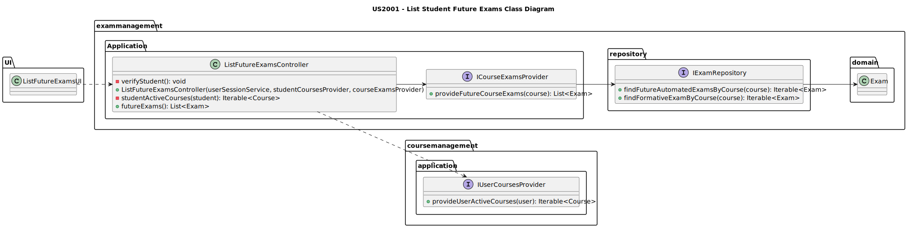
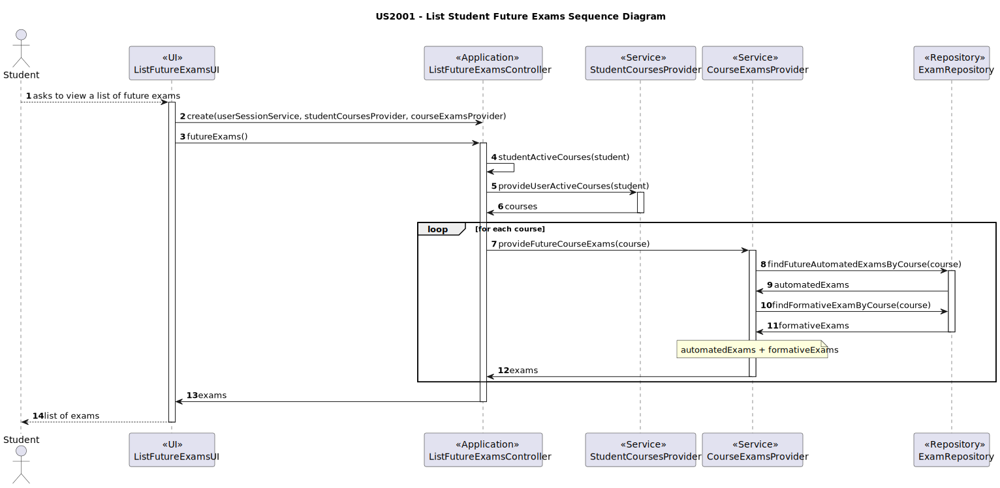

# US2002 — As a Student, I want to view a list of my future exams.

## 1. Context

This US is being developed for the first time, since it was assigned in this sprint (sprint B).
This requirement is placed in the context of listing the future [exams](../MainDocs/glossary.md) of a [student](../MainDocs/glossary.md).

---

## 2. Requirements

The only requirement is to have a student registered in the system, belonging to at least one course that's not in **_CLOSED_** state.

#### System Specifications Document

* FRE02 - List Exams The system displays to a student his/her future exams

---

## 3. Analysis

To view all exams of a course, there are pre-conditions that need to be met:

* The Student must be logged in.

After verifying the Student is logged in, it is necessary for them to ask the system to view a list of their future exams.
Once that is required, the system will iterate all courses the student belongs to, and list all the exams that have an opening period superior to the actual time the request was made.

---

## 4. Design

### 4.1. Class Diagram



### 4.2. Sequence Diagrams



**IMPORTANT THINGS TO CONSIDER:**


* The CourseExamsProvider is a service responsible for retrieving a list of exams from a certain course.
It was thought to be recyclable, since for this US it will need to be updated to match the requirements.
* Besides not being directly represented, the **UserSessionService** will be injected in the controller to verify if the user is logged in and get their identity.

### 4.3. Applied Patterns

Some main patterns used in this user story as a whole are:

* **Controller:** *The controller is responsible for handling the user input, and orchestrating (controlling) the use
  cases.*

* **Single Responsibility Principle + High Cohesion:** *Every class has only one responsibility, which leads to higher
  cohesion.*

* **Dependency Injection:** *Instead of instantiating the repositories or services that will be used inside the classes,
  they are received by parameter.*

* **Information Expert:** *The ExamRepository is the IE of exams.*

* **Low Coupling + Dependency Inversion:** *All the classes are loosely coupled, not depending on concrete classes,
  rather depending on interfaces.*

### 4.4. Tests

##### 4.4.1 Integration Tests

* Since this is a US that only requires the listing of existing data on the system, there are no unity tests required, and since integration tests are not truly required, there are none.
---

## 5. Demonstration

* The following demonstration video consists of a success case of listing a student's future exams.

https://github.com/Departamento-de-Engenharia-Informatica/sem4pi-22-23-16-1/assets/107274763/77265ec7-5525-426c-a75c-a21c698f0f36

---

## 6. Implementation

### 6.1. ListFutureExamsController
```java
public class ListFutureExamsController {

    private final UserSessionService userSessionService;
    private final StudentCoursesProvider studentCoursesProvider;
    private final CourseExamsProvider courseExamsProvider;
    private ECourseUser student;

    public ListFutureExamsController(UserSessionService userSessionService, StudentCoursesProvider studentCoursesProvider, CourseExamsProvider courseExamsProvider) {
        if(userSessionService == null)
            throw new IllegalStateException("eCourse User must be registered.");

        this.userSessionService = userSessionService;

        verifyUser();

        if(studentCoursesProvider == null)
            throw new IllegalArgumentException("studentCoursesProvider cannot be null.");
        this.studentCoursesProvider = studentCoursesProvider;

        if(courseExamsProvider == null)
            throw new IllegalArgumentException("courseExamsProvider cannot be null.");

        this.courseExamsProvider = courseExamsProvider;
    }

    /**
     * Verify user.
     */
    private void verifyUser() {
        Optional<ECourseUser> eCourseUserOptional = userSessionService.getLoggedUser();

        eCourseUserOptional.ifPresentOrElse(
                eCourseUser -> this.student = eCourseUser,
                () -> {
                    throw new IllegalStateException("No eCourse user found. Make sure you are registered.");
                }
        );
    }


    /**
     * Student active courses iterable.
     *
     * @param user the user
     * @return the iterable
     */
    private Iterable<Course> studentActiveCourses(ECourseUser user){
        return studentCoursesProvider.provideUserActiveCourses(user);
    }

    /**
     * Course exams iterable.
     *
     * @return the iterable
     */
    public List<Exam> courseExams() {
        List<Exam> futureExams = new ArrayList<>();
        for (Course course : studentActiveCourses(student)) {
            futureExams.addAll(courseExamsProvider.provideFutureCourseExams(course));
        }
        return futureExams;
    }
}
```

### 6.2. StudentCoursesProvider
```java
public class StudentCoursesProvider implements IUserCoursesProvider {
    // This is the only used method for this US
    @Override
    public Iterable<Course> provideUserActiveCourses(ECourseUser user) {
        return enrolledStudentRepository.findStudentActiveCourses(user);
    }
}
```

### 6.3. CourseExamsProvider
```java
public class CourseExamsProvider implements ICourseExamsProvider {
    // This is the only used method for this US
    @Override
    public List<Exam> provideFutureCourseExams(Course course) {
        List<AutomatedExam> automatedExams = (List<AutomatedExam>) examRepository.findFutureAutomatedExamsByCourse(course);
        List<FormativeExam> formativeExams = (List<FormativeExam>) examRepository.findFormativeExamByCourse(course);

        List<Exam> exams = new ArrayList<>();

        exams.addAll(automatedExams);
        exams.addAll(formativeExams);

        return exams;
    }
}
```

### 6.4. Repository

#### 6.4.1. ExamRepository

```java
public interface ExamRepository extends DomainRepository<Long, Exam> {
  /**
   * Find automated exams referring to a course.
   *
   * @param course the course which the exam refers to
   * @return the iterable containing the exams
   */
  Iterable<AutomatedExam> findAutomatedExamByCourse(Course course);

  /**
   * Find active exams referring to a course.
   *
   * @param course the course which the exam refers to
   * @return the iterable containing the exams
   */
  Iterable<AutomatedExam> findFutureAutomatedExamsByCourse(Course course);
}
```

#### 6.4.2. JPAExamRepository
```java
public class JpaExamRepository extends eCourseJpaRepositoryBase<Exam, Long, Long> implements ExamRepository {
    // The following methods are the only ones used for this US
    @Override
    public Iterable<FormativeExam> findFormativeExamByCourse(Course course) {
        final TypedQuery<FormativeExam> query = entityManager().createQuery("SELECT ex " +
                        "FROM FormativeExam ex WHERE ex.course.courseCode = :courseCode ",
                FormativeExam.class);
        query.setParameter("courseCode", course.identity());

        try {
            return query.getResultList();
        } catch (NoResultException e) {
            return null;
        }
    }

    @Override
    public Iterable<AutomatedExam> findFutureAutomatedExamsByCourse(Course course) {
        final TypedQuery<AutomatedExam> query = entityManager().createQuery("SELECT ex " +
                        "FROM AutomatedExam ex WHERE ex.course.courseCode = :courseCode AND ex.openPeriod.closeDate > CURRENT_DATE ",
                AutomatedExam.class);
        query.setParameter("courseCode", course.identity());

        try {
            return query.getResultList();
        } catch (NoResultException e) {
            return null;
        }
    }
}
```
---
