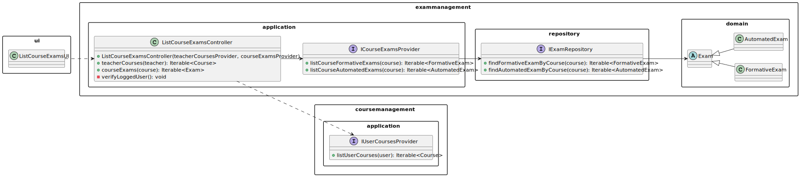
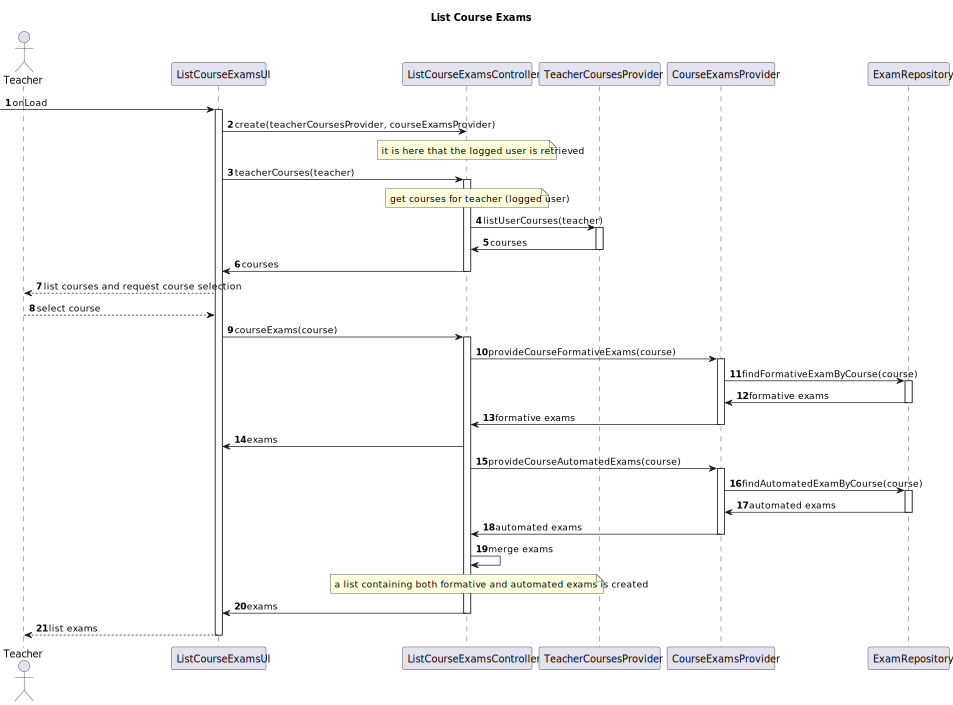

# US2003 — As a Teacher, I want to view all the exams of a course

## 1. Context

Only a teacher can view all the exams of a course.
The only requirement is that the teacher lectures the course.

---

## 2. Requirements

It is required that the following use case is implemented:

* **UC2003.1** As a Teacher, I want to view all the exams of a course.

### Client Clarifications

#### System Specifications Document

- FRE03 - List Course Exams The system displays to a teacher of a course all the exams of the course.

- It is only required that the teacher lectures the course.

---

## 3. Analysis

To view all exams of a course, there are pre-conditions that need to be met:

* The teacher must be logged in.

After verifying that the user is logged in, it is required that the teacher selects a course.
Once the course is selected, the system will present a list of all the exams of that course.
Keep in mind that the list will contain both formative and automated exams.

---

## 4. Design

### 4.1. Class Diagram



### 4.2. Sequence Diagrams

**[US2003] As a Teacher, I want to view all the exams of a course.**



#### 4.2.1. Sequence Diagram Decisions

*UserSessionService was not represented as a participant in the sequence diagram, since it has been portrayed multiple 
times in other sequence diagrams.*

*The process of obtaining the courses using TeacherCoursesProvider was also omitted due to the fact that there are also
previous diagrams picturing the whole process.*

*The CourseExamsProvider is a service responsible for retrieving a list of exams from a certain course.
It was thought to be recyclable, meaning that if in the future it is required to list a variation of course exams, 
it is just a question of updating this service.*

### 4.3. Applied Patterns

Some main patterns used in this user story as a whole are:

* **Controller:** *The controller is responsible for handling the user input, and orchestrating (controlling) the use
  cases.*

* **Single Responsibility Principle + High Cohesion:** *Every class has only one responsibility, which leads to higher
  cohesion.*

* **Dependency Injection:** *Instead of instantiating the repositories or services that will be used inside the classes,
  they are received by parameter.*

* **Information Expert:** *The ExamRepository is the IE of exams.*

* **Low Coupling + Dependency Inversion:** *All the classes are loosely coupled, not depending on concrete classes,
  rather depending on interfaces.*

### 4.4. Tests

*Since this User Story is only displaying Domain classes, there is no need for unit testing.*

---

## 5. Demonstration

**To Do.**

---

## 6. Implementation

**List Course Exams Controller**

This controller is responsible for handling the user input, and orchestrating (controlling) the process of listing 
all the exams of a course.

````java
public class ListCourseExamsController {

  private final UserSessionService userSessionService;

  private final TeacherCoursesProvider teacherCoursesProvider;

  private final ICourseExamsProvider courseExamsProvider;

  private ECourseUser loggedTeacher;

  /**
   * Instantiates a new List courses exams controller.
   *
   * @param teacherCoursesProvider the teacher courses provider
   * @param courseExamsProvider    the course exams provider
   */
  public ListCourseExamsController(UserSessionService userSessionService,
                                   TeacherCoursesProvider teacherCoursesProvider,
                                   ICourseExamsProvider courseExamsProvider) {
    // Verify if userSessionService is null
    if (userSessionService == null) {
      throw new IllegalArgumentException("userSessionService cannot be null.");
    }

    this.userSessionService = userSessionService;

    verifyLoggedUser();

    // Verify if teacherCoursesProvider is null
    if (teacherCoursesProvider == null) {
      throw new IllegalArgumentException("teacherCoursesProvider cannot be null.");
    }

    this.teacherCoursesProvider = teacherCoursesProvider;

    // Verify if courseExamsProvider is null
    if (courseExamsProvider == null) {
      throw new IllegalArgumentException("courseExamsProvider cannot be null.");
    }

    this.courseExamsProvider = courseExamsProvider;
  }

  private void verifyLoggedUser() {
    Optional<ECourseUser> eCourseUserOptional = userSessionService.getLoggedUser();

    eCourseUserOptional.ifPresentOrElse(
            eCourseUser -> this.loggedTeacher = eCourseUser,
            () -> {
              throw new IllegalStateException("No eCourse user found. Make sure you are registered.");
            }
    );
  }

  /**
   * Teacher active courses iterable.
   *
   * @return the iterable with the teacher active courses
   */
  public Iterable<Course> teacherCourses() {
    return teacherCoursesProvider.listUserCourses(loggedTeacher);
  }

  /**
   * Course exams iterable.
   *
   * @param course the course
   * @return the iterable
   */
  public Iterable<Exam> courseExams(Course course) {
    // List to return
    List<Exam> courseExams = new ArrayList<>();
    courseExams.addAll((Collection<? extends Exam>) courseExamsProvider.listCourseFormativeExams(course));
    courseExams.addAll((Collection<? extends Exam>) courseExamsProvider.listCourseAutomatedExams(course));

    return courseExams;
  }

}
````

**ICourseExamsProvider**

This interface is responsible for providing a list of exams from a certain course.
By implementing this interface, it is possible to list all the exams of a course, or just the formative or automated.

````java
public interface ICourseExamsProvider {

    /**
     * List course formative exams iterable.
     *
     * @param course the course
     * @return the iterable
     */
    Iterable<FormativeExam> listCourseFormativeExams(Course course);

    /**
     * List course automated exams iterable.
     *
     * @param course the course
     * @return the iterable
     */
    Iterable<AutomatedExam> listCourseAutomatedExams(Course course);

    /**
     * List future automated exams iterable.
     *
     * @param course the course
     * @return the iterable
     */
    Iterable<AutomatedExam> listFutureAutomatedExams(Course course);

    /**
     * Provides the future exams for a specified course.
     *
     * @param course the specified course
     * @return the iterable of the exams for the specified course
     */
    List<Exam> provideFutureCourseExams(Course course);

}
````

**CourseExamsProvider**

This specific implementation of ICourseExamsProvider is responsible for providing a list of both formative and automated
exams of a certain course.

````java
public class CourseExamsProvider implements ICourseExamsProvider {

    private final ExamRepository examRepository;

    /**
     * Instantiates a new Course exams provider.
     *
     * @param examRepository the exam repository
     */
    public CourseExamsProvider(ExamRepository examRepository) {
        // Verify if examRepository is null
        if (examRepository == null) {
            throw new IllegalArgumentException("examRepository cannot be null.");
        }

        this.examRepository = examRepository;
    }

    @Override
    public Iterable<FormativeExam> listCourseFormativeExams(Course course) {
        return examRepository.findFormativeExamByCourse(course);
    }

    @Override
    public Iterable<AutomatedExam> listCourseAutomatedExams(Course course) {
        return examRepository.findAutomatedExamByCourse(course);
    }

    @Override
    public Iterable<AutomatedExam> listFutureAutomatedExams(Course course){
        return examRepository.findFutureAutomatedExamsByCourse(course);
    }

    @Override
    public List<Exam> provideFutureCourseExams(Course course) {
        List<AutomatedExam> automatedExams = (List<AutomatedExam>) examRepository.findFutureAutomatedExamsByCourse(course);
        List<FormativeExam> formativeExams = (List<FormativeExam>) examRepository.findFormativeExamByCourse(course);

        List<Exam> exams = new ArrayList<>();

        exams.addAll(automatedExams);
        exams.addAll(formativeExams);

        return exams;
    }
}
````

**ExamRepository**

This repository is responsible for storing all the exams of the application.
So it is here that the queries to the database are made.

````java
public class JpaExamRepository extends eCourseJpaRepositoryBase<Exam, Long, Long> implements ExamRepository {

    public JpaExamRepository() {
            super("id");
    }
        
    @Override
    public Iterable<FormativeExam> findFormativeExamByCourse(Course course) {
        final TypedQuery<FormativeExam> query = entityManager().createQuery("SELECT ex " +
                        "FROM FormativeExam ex WHERE ex.course.courseCode = :courseCode ",
                FormativeExam.class);
        query.setParameter("courseCode", course.identity());

        try {
            return query.getResultList();
        } catch (NoResultException e) {
            return null;
        }
    }

    @Override
    public Iterable<AutomatedExam> findAutomatedExamByCourse(Course course) {
        final TypedQuery<AutomatedExam> query = entityManager().createQuery("SELECT ex " +
                        "FROM AutomatedExam ex WHERE ex.course.courseCode = :courseCode ",
                AutomatedExam.class);
        query.setParameter("courseCode", course.identity());

        try {
            return query.getResultList();
        } catch (NoResultException e) {
            return null;
        }
    }
}
````