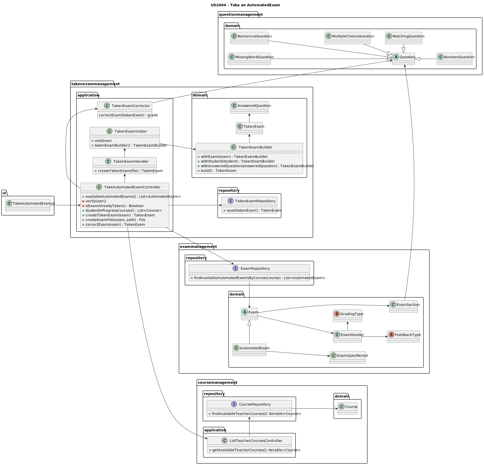
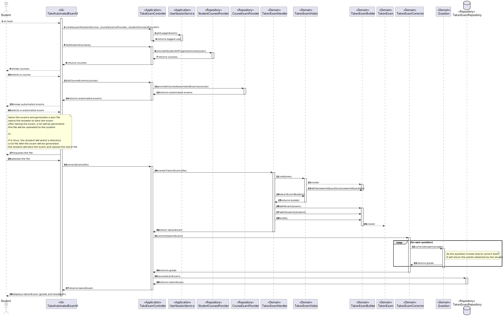

# US2004 - As a Student, I want to take an Exam.

## 1. Context
This requirement is placed in the context of taking an [exam](../MainDocs/glossary.md).

An [exam](../MainDocs/glossary.md) consists of set of questions used by a teacher to grade students.

## 2. Requirements

The following Use Cases are required to be implemented:

* **<span style="color: #d0734c">UC2004.1</span>** As a Student, I want to take an exam.

The following Acceptance Criteria must be followed:

* **<span style="color: #d0734c">AC2001.1</span>** A Student takes an exam and answer its questions.
* **<span style="color: #d0734c">AC2001.2</span>** At the end of the exam, the system should display the feedback and result (i.e., grade) of the exam.
* **<span style="color: #d0734c">AC2001.3</span>** The feedback and grade of the exam should be automatically calculated by a parser based on the grammar defined for exams structure.


## 3. Analysis

* To satisfy all the requirements, it will be necessary to update the grammar, so it can also validate a taken exam.
* The ANTLR tool will be used to validate the taken exam. Regarding an input text, the ANTLR tool will generate a parse tree, and if the input text is valid, a visitor will be used to validate the answers and return the feedback and the grade.
* The taken exam attributes and data will be saved in the database using a JPA Repository.
* Since this is a US directly applied to a Student, it will be necessary to know who is the Student wanting to take an exam, and for that, the already developed service *UserSessionService* will be used.

* In terms of direct interaction with the user and in order to input the necessary data to take an exam, we will be displaying the exam in web, creating a more friendly interface.

## 4. Design

### 4.1. Class Diagram



- To simplify the diagram, the CourseProviders and StudentExamsProvider were not included in this diagram, but they are used in the implementation. Also represented on the SD.
---

### 4.2. Sequence Diagram



### 4.3. Applied Patterns

Some main patterns used in this functionality are:

* **Model-View-Controller:** *This pattern separates the application into three main components: model (data and business logic), view (user interface), and controller (mediates between the model and view).* 
* **Single Responsibility Principle:** *Every class has only one responsibility.*
* **Information Expert:** *An example would be the ExamRepository being the exams information expert.*
* **Low Coupling:** *All the classes are loosely coupled, not depending on concrete classes, but interfaces instead.*
* **High Cohesion:** *All the classes have a high cohesion, since they have only one responsibility.*
* **Dependency Injection** *As a "solution" for instantiating the used repositories/services, these are injected as a parameter providing flexibility.*

### 4.4. Tests

| Test Case | Description                                  | Expected Result                |
|:---------:|:---------------------------------------------|:-------------------------------|
|     1     | Take an valid exam                           | Taken Exam is created          |
|     2     | Take an invalid exam                         | Exception is thrown            |
|     3     | Take an invalid question                     | Exception is thrown            |
|     4     | User is not on the exam course               | Exception is thrown            |
|     5     | Taken exam has different number of questions | Exception is thrown            |

- Here are some examples of tests implemented:

```java

    //valid exam has 1 question
    @Test
    public void ensureTakenExamIsCreatedWithValidParameters(){
        // Arrange
        List<AnsweredQuestion> answeredQuestions = new ArrayList<>();
        AnsweredQuestion answeredQuestion = new AnsweredQuestion("Is the sun a star?", "true",1,1);
        answeredQuestions.add(answeredQuestion);

        // Act
        TakenExam takenExam = new TakenExam(answeredQuestions, student, validExam);

        // Assert
        Assertions.assertEquals(answeredQuestions, takenExam.answeredQuestions());
        Assertions.assertEquals(student, takenExam.student());
        Assertions.assertEquals(validExam, takenExam.exam());
        Assertions.assertEquals(0f, takenExam.grade());
    }

    //valid exam has 1 question
    @Test
    public void ensureDifferentNumberOfQuestionsIsRejected(){
            // Arrange
            List<AnsweredQuestion> answeredQuestions = new ArrayList<>();
            AnsweredQuestion answeredQuestion = new AnsweredQuestion("is the sun a star?", "true",1,1);
            AnsweredQuestion answeredQuestion2 = new AnsweredQuestion("is gamava the est group?", "true",1,1);
            answeredQuestions.add(answeredQuestion);
            answeredQuestions.add(answeredQuestion2);

            // Assert
            Assertions.assertThrows(IllegalArgumentException.class, () -> {
            new TakenExam(answeredQuestions, student, validExam);
            });
    }

```

## 5. Demonstration

**In this demo video, a success take of an automated exam is shown.**


https://github.com/Departamento-de-Engenharia-Informatica/sem4pi-22-23-16-1/assets/105438055/c790e3e7-1b36-4775-ad54-4efc415326c5


---
## 6. Implementation

### 6.1. TakenExam Domain Class

```java
@Entity
public class TakenExam implements AggregateRoot<Long> {

    @Id
    @GeneratedValue(strategy = GenerationType.IDENTITY)
    private Long id;

    @OneToMany(cascade = CascadeType.ALL)
    private List<AnsweredQuestion> answeredQuestions;

    @Column
    private Float grade;

    @OneToOne (cascade = CascadeType.ALL)
    private ECourseUser student;

    @OneToOne (cascade = CascadeType.ALL)
    private Exam exam;

    protected TakenExam() {
        // For ORM
    }

    /**
     * Creates a new TakenExam object
     * @param answeredQuestions the list of answered questions
     * @param student the student who took the exam
     * @param exam the exam that was taken
     */
    public TakenExam(List<AnsweredQuestion> answeredQuestions, ECourseUser student, Exam exam) {

        if (answeredQuestions == null || answeredQuestions.isEmpty())
            throw new IllegalArgumentException("Answered questions cannot be null or empty");

        if (student == null)
            throw new IllegalArgumentException("Student cannot be null");

        if (exam == null)
            throw new IllegalArgumentException("Exam cannot be null");

        if(answeredQuestions.size() != exam.numberOfQuestions())
            throw new IllegalArgumentException("Answered questions must be the same size as the exam questions");

        this.answeredQuestions = answeredQuestions;

        ordersAnsweredQuestions();

        this.student = student;
        this.exam = exam;
        this.grade = 0f;
    }

    /**
     * Orders the answered questions by section and question number
     */
    private void ordersAnsweredQuestions() {
        answeredQuestions.sort((o1, o2) -> {
            if(o1.sectionIndex() == o2.sectionIndex()) {
                return o1.questionIndex().compareTo(o2.questionIndex());
            }
            return o1.sectionIndex().compareTo(o2.sectionIndex());
        });
    }

    /**
     * adds a quotation to the grade
     */
    public void addQuotation(Float quotation) {
        this.grade += quotation;
    }


    /**
     * Adjusts the grade to a 20 point scale
     */
    public void ajustGrade() {
        Float maxGrade = exam.maxGrade();
        grade *= 20 / maxGrade;
    }

    /**
     * Returns the grade of the TakenExam
     * @return the grade of the TakenExam
     */
    public Float grade() {
        return grade;
    }

    /**
     * Returns the student of the TakenExam
     * @return the student of the TakenExam
     */
    public ECourseUser student() {
        return student;
    }

    /**
     * Returns the exam of the TakenExam
     * @return the exam of the TakenExam
     */
    public Exam exam() {
        return exam;
    }


    /**
     * Returns the user's answer
     * @return a list of the user's answers
     */
    public List<AnsweredQuestion> answeredQuestions() {
        return answeredQuestions;
    }

    /**
     * Returns the identity of the TakenExam
     * @return the identity of the TakenExam
     */
    public Long identity() {
        return id;
    }

    @Override
    public boolean sameAs(Object other) {
        if (!(other instanceof TakenExam)) {
            return false;
        }

        final TakenExam that = (TakenExam) other;
        if (this == that) {
            return true;
        }

        if(this.id != null && that.id != null)
            return this.id.equals(that.id);

        return false;
    }

    @Override
    public String toString() {
        return "Exam" + exam.title() + " - Taken by " + student.identity() + '\n' +
                "Grade: " + grade + '\n' +
                "Answered Questions: " + answeredQuestions;
    }

}
```

### 6.2. TakenExamCorrector

```java
public class TakenExamCorrector {

    public TakenExamCorrector() {
    }

    /**
     * Corrects the exam
     * @param takenExam the exam to correct
     * @return the corrected exam
     */
    public TakenExam correctExam(TakenExam takenExam) {

        Exam exam = takenExam.exam();

        for(AnsweredQuestion answeredQuestion : takenExam.answeredQuestions()) {

            int sectionIndex = answeredQuestion.sectionIndex();

            int questionIndex = answeredQuestion.questionIndex();

            Question question = exam.obtainQuestion(sectionIndex, questionIndex);

            float obtainedQuotation = question.correctStudentAnswer(answeredQuestion.answer());
            if(obtainedQuotation > 0) {
                takenExam.addQuotation(question.quotation());
                answeredQuestion.addFeedback("You got it right! Well done.\n");
            }
            else {
                answeredQuestion.addFeedback("You got it wrong, the correct answer was -> " + question.correctAnswer() + ".\n");
            }

        }

        takenExam.ajustGrade();

        return takenExam;
    }

}

```

### 6.3. TakenExamHandler

```java
public class TakenExamHandler {

    private final TakenExamVisitor visitor;
    private final TakenExamCorrector corrector;

    public TakenExamHandler(TakenExamVisitor visitor, TakenExamCorrector corrector) {
        Preconditions.noneNull(visitor, corrector);
        this.visitor = visitor;
        this.corrector = corrector;
    }

    /**
     * Parses a taken exam from a file
     *
     * @param path the path to the file
     * @return the parsed taken exam object
     * @throws IOException if the file cannot be read
     */
    public TakenExam createTakenExam(String path, Exam exam, ECourseUser student) throws IOException {

        TakenExamBuilder builder;

        try {
            // Create a CharStream from the file
            CharStream charStream = CharStreams.fromPath(Paths.get(path));

            // Create a lexer using the CharStream
            ExamLexer lexer = new ExamLexer(charStream);

            // Create a token stream from the lexer
            CommonTokenStream tokenStream = new CommonTokenStream(lexer);

            // Create a parser using the token stream
            ExamParser parser = new ExamParser(tokenStream);

            // Generate a parse tree by starting at the exam rule
            ParseTree tree = parser.exam();

            // Traverse the parse tree using your visitor
            visitor.visit(tree);

            // Get the builder from the visitor, which is missing the course and the teacher creating it
            builder = visitor.takenExamBuilder();
        } catch (IOException e) {
            throw new IOException("Could not read file");
        } catch (Exception e) {
            throw new IOException("Invalid Exam, please check the if it contains the correct format");
        }

        // Build the exam
        builder.withExam(exam);
        builder.withStudent(student);

        // Return the corrected exam
        return corrector.correctExam(builder.build());
    }

}
```

### 6.4. TakenExamVisitor

```java
public class TakenExamVisitor extends ExamBaseVisitor<Void> {

    private TakenExamBuilder takenExamBuilder;

    public TakenExamVisitor() {
        this.takenExamBuilder = new TakenExamBuilder();
    }

    public TakenExamBuilder takenExamBuilder() {
        return takenExamBuilder;
    }

    @Override
    public Void visitExam(ExamParser.ExamContext ctx) {

        //Visit the questions
        for(ExamParser.QuestionContext question : ctx.question()) {
            AnsweredQuestion answeredQuestion = visitAnsweredQuestion(question);
            takenExamBuilder.addAnsweredQuestion(answeredQuestion);
        }


        return null;
    }

    /**
     * Visit a answered question
     * @param question the answered question to visit
     * @return the answered question object
     */
    private AnsweredQuestion visitAnsweredQuestion(ExamParser.QuestionContext question) {

        if(question.squest() != null){
            return visitShortAnswerQuestion(question.squest());
        } else if(question.mcquest() != null){
            return visitMultipleChoiceQuestion(question.mcquest());
        } else if(question.nquest() != null){
            return visitNumericalQuestion(question.nquest());
        } else if(question.bquest() != null){
            return visitBooleanQuestion(question.bquest());
        } else if(question.mwquest() != null){
            return visitMissingWordQuestion(question.mwquest());
        } else if(question.mquest() != null){
            return visitMatchingQuestion(question.mquest());
        } else{
            throw new IllegalArgumentException("Question type not supported");
        }

    }

    private AnsweredQuestion visitMissingWordQuestion(ExamParser.MwquestContext mwquest) {
        //Get the question text
        String questionText = mwquest.TEXT(0).getText();

        //Get the question answer
        StringBuilder answer = null;
        boolean first = true;
        for(ExamParser.MwoptionContext option : mwquest.mwoption()){
            if(first){
                answer = new StringBuilder(option.TEXT().getText().trim());
                first = false;
                continue;
            }
            answer.append(",").append(option.TEXT().getText().trim());
        }

        if(answer == null)
            throw new IllegalArgumentException("Missing word question must have at least one answer");

        //Get the question position
        String position = mwquest.TEXT(1).getText();

        //Get section number
        Integer section = Integer.parseInt(String.valueOf(position.charAt(3)));

        //Get question number
        Integer questionNumber = Integer.parseInt(String.valueOf(position.charAt(5)));

        return new AnsweredQuestion(questionText, answer.toString(), section, questionNumber);
    }

    private AnsweredQuestion visitMatchingQuestion(ExamParser.MquestContext mquest) {
        //Get the question text
        String questionText = mquest.TEXT(0).getText();

        //Get the question answer
        String answer = mquest.TEXT(1).getText().trim();

        //Get the question position
        String position = mquest.TEXT(2).getText();

        //Get section number
        Integer section = Integer.parseInt(String.valueOf(position.charAt(3)));

        //Get question number
        Integer questionNumber = Integer.parseInt(String.valueOf(position.charAt(5)));

        return new AnsweredQuestion(questionText, answer, section, questionNumber);
    }

    private AnsweredQuestion visitBooleanQuestion(ExamParser.BquestContext bquest) {
        //Get the question text
        String questionText = bquest.TEXT(0).getText();

        //Get the question answer
        String answer = bquest.TEXT(1).getText().trim();

        //Get the question position
        String position = bquest.TEXT(2).getText();

        //Get section number
        Integer section = Integer.parseInt(String.valueOf(position.charAt(3)));

        //Get question number
        Integer questionNumber = Integer.parseInt(String.valueOf(position.charAt(5)));

        return new AnsweredQuestion(questionText, answer, section, questionNumber);
    }

    private AnsweredQuestion visitNumericalQuestion(ExamParser.NquestContext nquest) {
        //Get the question text
        String questionText = nquest.TEXT(0).getText();

        //Get the question answer
        String answer = nquest.TEXT(1).getText().trim();

        //Get the question position
        String position = nquest.TEXT(2).getText();

        //Get section number
        Integer section = Integer.parseInt(String.valueOf(position.charAt(3)));

        //Get question number
        Integer questionNumber = Integer.parseInt(String.valueOf(position.charAt(5)));

        return new AnsweredQuestion(questionText, answer, section, questionNumber);
    }

    private AnsweredQuestion visitMultipleChoiceQuestion(ExamParser.McquestContext mcquest) {
        //Get the question text
        String questionText = mcquest.TEXT(0).getText();

        //Get the question answer
        String answer = mcquest.TEXT(1).getText().trim();

        //Get the question position
        String position = mcquest.TEXT(2).getText();

        //Get section number
        Integer section = Integer.parseInt(String.valueOf(position.charAt(3)));

        //Get question number
        Integer questionNumber = Integer.parseInt(String.valueOf(position.charAt(5)));

        return new AnsweredQuestion(questionText, answer, section, questionNumber);
    }

    private AnsweredQuestion visitShortAnswerQuestion(ExamParser.SquestContext squest) {
        //Get the question text
        String questionText = squest.TEXT(0).getText();

        //Get the question answer
        String answer = squest.TEXT(1).getText().trim();

        //Get the question position
        String position = squest.TEXT(2).getText();

        //Get section number
        Integer section = Integer.parseInt(String.valueOf(position.charAt(3)));

        //Get question number
        Integer questionNumber = Integer.parseInt(String.valueOf(position.charAt(5)));

        return new AnsweredQuestion(questionText, answer, section, questionNumber);
    }

}

```
