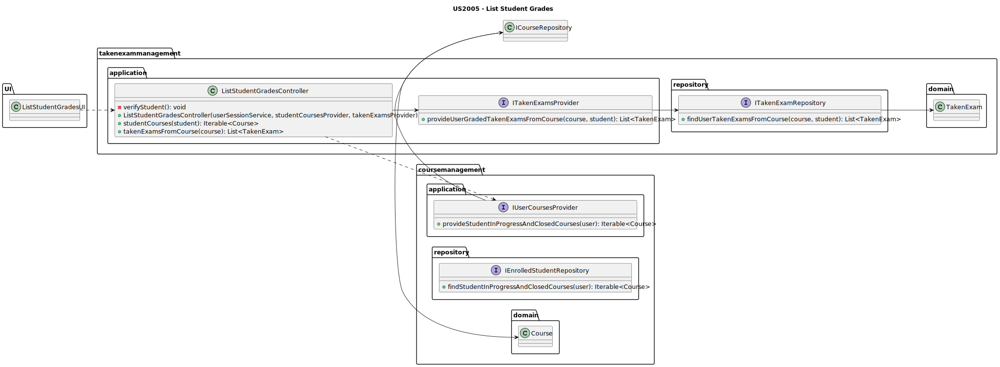
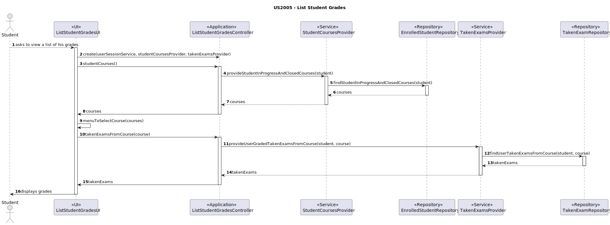
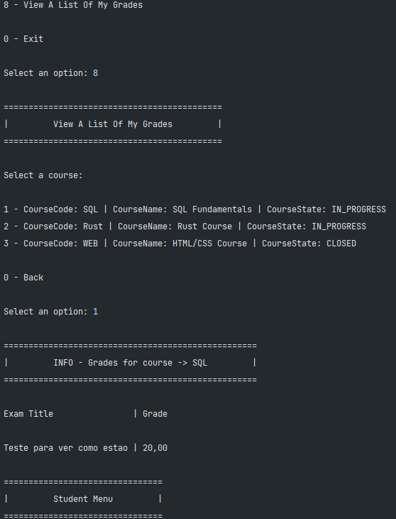

# US2005 — As a Student, I want to view a list of my grades.

## 1. Context

This US is being developed for the first time, since it was assigned in this sprint (sprint C).
This requirement is placed in the context of listing the student grades.

---

## 2. Requirements

The only requirement is to have a student registered in the system, belonging to at least one course with at least one taken exam.

#### System Specifications Document

 - The system displays to a student his/her grades.

---

## 3. Analysis

To view all grades of a course, there are pre-conditions that need to be met:

* The Student must be logged in.

After verifying the Student is logged in, it is necessary for them to ask the system to view a list of their grades.
Once that is required, the system will iterate all courses the student belongs to, asks the user to select one, and then displays all the grades of that course.

---

## 4. Design

### 4.1. Class Diagram



### 4.2. Sequence Diagrams



**IMPORTANT THINGS TO CONSIDER:**


* The TakenExamsProvider is a service responsible for retrieving a list of taken exams from a certain course.
It was thought to be recyclable, since for this US it will need to be updated to match the requirements.
* Besides not being directly represented, the **UserSessionService** will be injected in the controller to verify if the user is logged in and get their identity.

### 4.3. Applied Patterns

Some main patterns used in this user story as a whole are:

* **Controller:** *The controller is responsible for handling the user input, and orchestrating (controlling) the use
  cases.*

* **Single Responsibility Principle + High Cohesion:** *Every class has only one responsibility, which leads to higher
  cohesion.*

* **Dependency Injection:** *Instead of instantiating the repositories or services that will be used inside the classes,
  they are received by parameter.*

* **Information Expert:** *The TakenExamRepository is the IE of taken exams.*

* **Low Coupling + Dependency Inversion:** *All the classes are loosely coupled, not depending on concrete classes,
  rather depending on interfaces.*

### 4.4. Tests

##### 4.4.1 Integration Tests

* Since this is a US that only requires the listing of existing data on the system, there are no unity tests required, and since integration tests are not truly required, there are none.
---

## 5. Demonstration




## 6. Implementation

* **ListStudentGradesController**: *This class is responsible for controlling the use case, and it is used in this use case to list the student's grades.*

```java
public class ListStudentGradesController {

    private final UserSessionService userSessionService;
    private final StudentCoursesProvider studentCoursesProvider;
    private final TakenExamProvider takenExamProvider;
    private ECourseUser student;

    public ListStudentGradesController(UserSessionService userSessionService, StudentCoursesProvider studentCoursesProvider, TakenExamProvider takenExamProvider){
        if(userSessionService == null)
            throw new IllegalStateException("eCourse User must be registered.");

        this.userSessionService = userSessionService;

        verifyUser();

        if(studentCoursesProvider == null)
            throw new IllegalArgumentException("studentCoursesProvider cannot be null.");
        this.studentCoursesProvider = studentCoursesProvider;

        if (takenExamProvider == null)
            throw new IllegalArgumentException("takenExamProvider cannot be null.");

        this.takenExamProvider = takenExamProvider;

    }

    /**
     * Verify user.
     */
    private void verifyUser() {
        Optional<ECourseUser> eCourseUserOptional = userSessionService.getLoggedUser();

        eCourseUserOptional.ifPresentOrElse(
                eCourseUser -> this.student = eCourseUser,
                () -> {
                    throw new IllegalStateException("No eCourse user found. Make sure you are registered.");
                }
        );
    }


    /**
     * Lists student's active and closed courses.
     *
     * @return an Iterable the student's active courses
     */
    public Iterable<Course> studentCourses(){
        return studentCoursesProvider.provideStudentInProgressAndClosedCourses(student);
    }

    /**
     * List the students taken exams for a given course.
     * @param course the course
     * @return an Iterable of the student's taken exams
     */
    public List<TakenExam> takenExamsFromCourse(Course course) {
        List<TakenExam> takenExams = takenExamProvider.provideUserGradedTakenExamsFromCourse(course, student);

        return takenExams;
    }

}
```

* **TakenExamProvider**: *This class is responsible for providing the taken exams of a certain course, and it is used in this use case to provide the taken exams of a certain course for a certain student.* 

````java
public class TakenExamProvider implements ITakenExamProvider {

    private final TakenExamRepository takenExamRepository;

    public TakenExamProvider(TakenExamRepository takenExamRepository) {
        Preconditions.noneNull(takenExamRepository);
        this.takenExamRepository = takenExamRepository;
    }

    @Override
    public Iterable<TakenExam> provideTakenExams(Exam exam) {
        return takenExamRepository.findByExam(exam);
    }

    @Override
    public List<TakenExam> provideUserGradedTakenExamsFromCourse(Course course, ECourseUser user) {
        List<TakenExam> takenExams = (List<TakenExam>) takenExamRepository.findByCourseAndStudent(course, user);

        // removes the taken exams where the grading type is None
        takenExams.removeIf(takenExam -> takenExam.exam().header().gradingFeedBackType().equals(GradingType.NONE));

        // removes the taken exams where the grade type is after closing and the exam is not closed yet
        takenExams.removeIf(takenExam -> {
            if(takenExam.exam().header().gradingFeedBackType().equals(GradingType.AFTER_CLOSING)) {
                if(!(takenExam.exam() instanceof AutomatedExam))
                    return false;
                AutomatedExam automatedExam = (AutomatedExam) takenExam.exam();
                return automatedExam.openPeriod().closeDate().isAfter(LocalDateTime.now());
            }
            return false;
        });

        return takenExams;
    }
}
````

