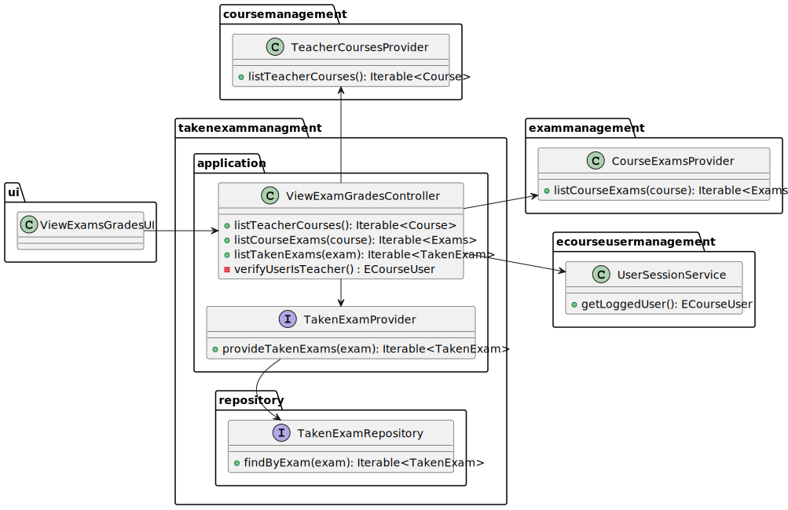
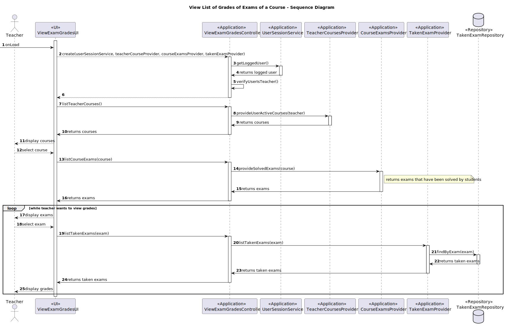

# US2006 - As Teacher, I want to view a list of the grades of exams of my course

## 1. Context

This requirement consists in viewing a list of the grades of exams of a course, as a teacher.
A Teacher can select a course and view the list of grades of the exams of that course.

So, if a teacher is working in various courses, he/she can view the list of grades of exams of every of those courses.

---

## 2. Requirements

In order to view the list of grades of exams of a course, the teacher must be logged in.
Then, he/she must select the course.
After that, he teacher is able to select an exam, until he/she wants to leave, and view the list of grades of it. 

He/she will view the student's name and the corresponding grade.

---

## 3. Analysis

This User Story consists in just showing the list of grades of exams of a course, to a teacher.
The teacher must be logged in, and then he/she can select the course. 
After choosing, he/she will be presented with a list of exams of that course.
Then, the teacher can select the exam he/she wants to view the list of grades of.

To have a better ovewview, we will present, to the teacher, the grade and the student's name.

---

## 4. Design

### 4.1. Class Diagram





### 4.2. Sequence Diagram





### 4.3. Applied Patterns

Some main patterns used in this functionality are:

* **Single Responsibility Principle:** *Every class has only one responsibility.*
* **Information Expert:** *The ExamRepository is the IE of the Exams.*
* **Dependency Injection:** *The ViewExamGradesController will receive a various services and repositories, not depending on a specific implementation*
* **Low Coupling:** *All the classes are loosely coupled, not depending on concrete classes.*
* **High Cohesion:** *All the classes have a high cohesion, since they have only one responsibility.*

### 4.4. Tests

They are no tests for this functionality

## 5. Demonstration

In order to run this functionality, you must first run the Teacher program.
Then, you must log in, and select the option to _view exam grades_
You will then be prompted to select a course, and then an exam.
After that, you will be presented with a list of grades of that exam.

---

## 6. Implementation

### 6.1. UI Class

```java
public class ViewExamGradesUI extends AbstractUI {

    private final ViewExamGradesController controller = new ViewExamGradesController(
            new UserSessionService(PersistenceContext.repositories().eCourseUsers()),
            new TeacherCoursesProvider(PersistenceContext.repositories().courses()),
            new CourseExamsProvider(PersistenceContext.repositories().exams()),
            new TakenExamProvider(PersistenceContext.repositories().takenExams())
    );

    @Override
    protected boolean doShow() {

        Course selectedCourse = menuToSelectCourse((List<Course>) controller.listTeacherCourses());

        if (selectedCourse == null)
            return false;

        boolean wantsToExit;
        do {
            Exam selectedExam = menuToSelectExam((List<Exam>) controller.listCourseExams(selectedCourse));

            if (selectedExam == null)
                return false;

            List<TakenExam> takenExams = (List<TakenExam>) controller.listTakenExams(selectedExam);

            if (takenExams.isEmpty()) {
                infoMessage("The exam has not been taken yet.");
                Sleeper.sleep(1500);
            }

            displayGrades((List<TakenExam>) controller.listTakenExams(selectedExam));

            wantsToExit = checkIfWantsToExit();
        } while (!wantsToExit);


        return false;
    }


    /**
     * Show the grades and the student's name of the selected exam.
     *
     * @param takenExams the taken exams
     */
    private void displayGrades(List<TakenExam> takenExams) {
        System.out.printf("%-20s | %s\n", "Student", "Grade");
        for (TakenExam takenExam : takenExams)
            System.out.printf("%-20s | %s\n", takenExam.student().username(), takenExam.grade());
        System.out.println();
        Sleeper.sleep(2000);
    }
}
```

### 6.2. Controller Class

```java
public class ViewExamGradesController {

    private final UserSessionService userSessionService;
    private final TeacherCoursesProvider courseProvider;
    private final CourseExamsProvider examsProvider;
    private final ITakenExamProvider takenExamProvider;

    public ViewExamGradesController(UserSessionService userSessionService, TeacherCoursesProvider courseProvider,
                                    CourseExamsProvider examsProvider, ITakenExamProvider takenExamProvider) {
        Preconditions.noneNull(userSessionService, courseProvider, examsProvider, takenExamProvider);

        this.userSessionService = userSessionService;
        this.courseProvider = courseProvider;
        this.examsProvider = examsProvider;
        this.takenExamProvider = takenExamProvider;

        verifyUserIsTeacher();
    }

    private ECourseUser verifyUserIsTeacher() {
        ECourseUser user;
        Optional<ECourseUser> eCourseUserOptional = userSessionService.getLoggedUser();

        if (eCourseUserOptional.isPresent())
            user = eCourseUserOptional.get();
        else
            throw new IllegalStateException("No eCourse user found. Make sure you are registered.");

        if (!user.isTeacher())
            throw new IllegalStateException("Only teachers can create exams.");


        return eCourseUserOptional.get();
    }

    /**
     * List teacher courses.
     *
     * @return the iterable containing the courses
     */
    public Iterable<Course> listTeacherCourses() {
        return courseProvider.provideUserActiveCourses(verifyUserIsTeacher());
    }

    public Iterable<Exam> listCourseExams(Course course) {
        return examsProvider.provideSolvedExams(course);
    }

    public Iterable<TakenExam> listTakenExams(Exam exam) {
        return takenExamProvider.provideTakenExams(exam);
    }
}
```

### 6.3. TakenExamProvider Class

```java
public class TakenExamProvider implements ITakenExamProvider {

    private final TakenExamRepository takenExamRepository;

    public TakenExamProvider(TakenExamRepository takenExamRepository) {
        Preconditions.noneNull(takenExamRepository);
        this.takenExamRepository = takenExamRepository;
    }

    @Override
    public Iterable<TakenExam> provideTakenExams(Exam exam) {
        return takenExamRepository.findByExam(exam);
    }
}
```

### 6.4. TakenExamRepository Class

```java
public class JpaTakenExamRepository extends eCourseJpaRepositoryBase<TakenExam, Long, Long> implements TakenExamRepository {

    public JpaTakenExamRepository() {
        super("long");
    }

    @Override
    public Iterable<TakenExam> findByExam(Exam exam) {
        final TypedQuery<TakenExam> query = entityManager().createQuery("SELECT ex " +
                        "FROM TakenExam ex WHERE ex.exam.id = :examId ",
                TakenExam.class);
        query.setParameter("examId", exam.identity());

        try {
            return query.getResultList();
        } catch (NoResultException e) {
            return null;
        }
    }
}
```