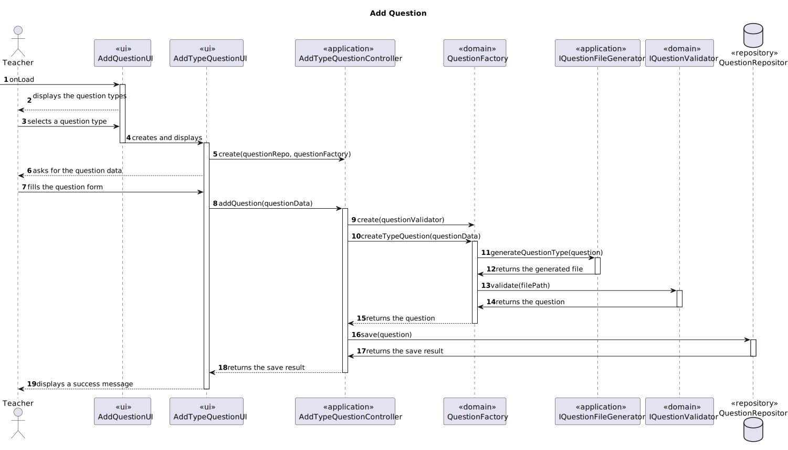

# US2007 - As Teacher I want to add/update exam questions to a repository of exam questions to be used in automatic formative exams

## 1. Context

Exams have questions.
Teachers may create or update questions that will be saved in a repository of exam questions,
that later can be used in automatic formative exams.

## 2. Requirements

In order to create/update questions in the repository of exam questions, the following UCs must be assured:

- UC2007.1 - Add exam question to repository of exam questions
- UC2007.2 - Update exam question in repository of exam questions

## 3. Analysis/Breakdown
    
Both to create and to update the question structure must be validated. For this validation the ANTLR tool will be used.

To add a question to the repository of exam questions, the user must choose the type of question and then insert the data
for the question, accordingly.

To update a question in the repository a list of the existing questions must be presented to the user, so that he can choose one.
Then the user must insert the new data for the question.


## 4. Design

Since all the question types require different data both to create them and to update them, it was decided to create a
separate UI and Controller for each one.

To simplify the diagrams, and to not create 6 different diagrams for the adding and 6 for the updating, only one diagram
was created for each one, and the data that is inserted by the user is represented by a single variable, questionData.
Also, the UI's and Controllers will be represented by Add/UpdateTypeQuestionUI and Add/UpdateTypeQuestionController,
respectively. 

This way it is only necessary to change for the type that is being used, e.g. MultipleChoiceQuestion, and the process
is exactly the same for the other types.

### 4.1. Class Diagram

Beyond the already existing classes, and the normal classes that are created for the use cases, the following interfaces,
and respective implementations were created to support this user story:
- **IQuestionFactory:** *This class is responsible for creating the questions, according to the type of question that is
chosen by the user.*
- **IQuestionValidator:** *This class is responsible for validating the question structure, using the ANTLR tool.*


### 4.2. Sequence Diagram

As usual, the sequence diagrams only represent the success case of the use cases.

#### Starting Point


#### 4.2.1. UC2007.1 - Add exam question to repository of exam questions



#### 4.2.2. UC2007.2 - Update exam question in repository of exam questions


**Note:** Every TypeQuestion has a method to update its data, it receives the new data, and updates the question.
If no data is provided, the question is not updated. If the data is invalid, the question is not updated either, and
if only some of the fields are provided, only those are updated, keeping the other old ones.

### 4.3. Applied Patterns

Some main patterns used in this user story as a whole are:

* **Single Responsibility:** *The classes have a single responsibility, and they are highly cohesive, as they only have
one responsibility.*
* **Pure Fabrication:** *The IQuestionFactory is a pure fabrication, since it is not a real world concept, it
was created to have the responsibility of creating the questions according to their type.*
* **Dependency Injection:** *Instead of instantiating the repository, the validator and the factory that will be used
inside the classes, they are received by parameter.* 
* **Single Responsibility + High Cohesion:** *The classes have a single responsibility, and they are highly cohesive,
as they only have methods related to their responsibility.*

*The dependency injection should be made with the help of a framework, such as Spring, but since the project is not
using any framework, it was decided to use the constructor injection, which is the most basic form of dependency
injection. By using dependency injection, the code is more scalable, flexible, and it is easier to test.  
*Since we are using the controller from another US, it would be nice to have an interface for the controller, so that
we could inject the dependency of the controller, instead of instantiating it inside the class. But since this is a
rather simple application, and the controller is not a complex class, it was decided to instantiate it inside the
class, and not create an interface for it. This note serves as a reminder that, in a real world application, this
should be done, to reduce the coupling even more.

### 4.4. Tests

#### 4.4.1. Unit Tests

There must be created unit tests for the successful creation of each type of question, and for the successful update
of each type of question.
And then there must be created unit tests for the unsuccessful creation of each type of question, and for the
unsuccessful update of each type of question.

The unsuccessful tests must include ALL the possible ways that the creation/update must fail.

Some examples of the tests realized:

````java
    @Test
    public void ensureValidBooleanQuestionIsAccepted() {

        // Arrange
        String question = "Question";
        Float penalty = 0.5f;
        Float quotation = 1f;
        Boolean correctAnswer = true;

        // Act
        BooleanQuestion booleanQuestion = new BooleanQuestion(question, correctAnswer, penalty, quotation);

        String expected = "Question";

        // Assert
        Assertions.assertTrue(booleanQuestion.toString().contains(expected));
    }

    @Test
    public void ensureValidMatchingQuestionIsAccepted() {
    
            // Arrange
            String question = "Question";
            Float penalty = 0.5f;
            Float quotation = 1f;
            List<String> leftOptions = List.of("1", "2", "3");
            List<String> rightOptions = List.of("a", "b", "c");
    
            // Act
            MatchingQuestion matchingQuestion = new MatchingQuestion(question, penalty, quotation, leftOptions, rightOptions);
    
            String expected = "Question";
    
            // Assert
            Assertions.assertTrue(matchingQuestion.toString().contains(expected));
    }

    @Test
    public void ensureValidMissingWordOptionIsAccepted() {
    
            // Arrange
            List<String> optionAnswers = List.of("Answer", "Answer2");
    
            // Act
            MissingWordOption missingWordOption = new MissingWordOption(optionAnswers, "Answer");
    
            // Assert
            Assertions.assertNotNull(missingWordOption);
    }

    @Test
    public void ensureValidMissingWordQuestionIsAccepted() {
    
            // Arrange
            String question = "Question";
            Float penalty = 0.5f;
            Float quotation = 1f;
            List<MissingWordOption> answerOptions = List.of(new MissingWordOption(List.of("Answer", "Answer2"), "Answer"));
    
            // Act
            MissingWordQuestion missingWordQuestion = new MissingWordQuestion(question, answerOptions, penalty, quotation);
    
            String expected = "Question";
    
            // Assert
            Assertions.assertTrue(missingWordQuestion.toString().contains(expected));
    }

    @Test
    public void ensureValidMultipleChoiceQuestionIsAccepted() {
        // Arrange
        MultipleChoiceQuestion multipleChoiceQuestion = QuestionDataSource.multipleChoiceQuestion2();

        // Act
        String expected = "What is the capital of Spain?";

        // Assert
        Assertions.assertTrue(multipleChoiceQuestion.toString().contains(expected));
    }

    @Test
    public void ensureValidNumericalQuestionIsAccepted() {

        // Arrange
        String question = "Question";
        Float penalty = 0.5f;
        Float quotation = 1f;
        String correctAnswer = "1";

        // Act
        NumericalQuestion numericalQuestion = new NumericalQuestion(question, correctAnswer, penalty, quotation);

        String expected = "Question";

        // Assert
        Assertions.assertTrue(numericalQuestion.toString().contains(expected));
    }

    @Test
    public void ensureValidShortAnswerQuestionIsAccepted() {

        // Arrange
        String question = "Question";
        Float penalty = 0.5f;
        Float quotation = 1f;
        String correctAnswer = "Answer";

        // Act
        ShortAnswerQuestion shortAnswerQuestion = new ShortAnswerQuestion(question, correctAnswer, penalty, quotation);

        String expected = "Question";

        // Assert
        Assertions.assertTrue(shortAnswerQuestion.toString().contains(expected));
    }
    
````

## 5. Demonstration

### Videos of the successful adding of the different type of questions:

#### Multiple Choice Question


https://github.com/Departamento-de-Engenharia-Informatica/sem4pi-22-23-16-1/assets/103595766/306f7084-2918-4a4d-8f05-bbde76dbd8ff


#### Short Answer Question


https://github.com/Departamento-de-Engenharia-Informatica/sem4pi-22-23-16-1/assets/103595766/cac7d0a2-16bf-4656-acad-dc9a3bb17f57


#### Matching Question


https://github.com/Departamento-de-Engenharia-Informatica/sem4pi-22-23-16-1/assets/103595766/335c1a8d-53f1-49c1-916b-116550eb2190


#### Numerical Question


https://github.com/Departamento-de-Engenharia-Informatica/sem4pi-22-23-16-1/assets/103595766/348e3172-2ae0-435b-b9a1-c9a147357479


#### Boolean Question


https://github.com/Departamento-de-Engenharia-Informatica/sem4pi-22-23-16-1/assets/103595766/ff348d50-2670-423a-b09e-abe2c31bd597


#### Missing Word Question


https://github.com/Departamento-de-Engenharia-Informatica/sem4pi-22-23-16-1/assets/103595766/442f30be-22ac-4963-b572-0a114cd7533c


### Video of the successful updating of a question:


https://github.com/Departamento-de-Engenharia-Informatica/sem4pi-22-23-16-1/assets/103595766/978c7453-d464-426d-9388-369bf2290949


## 6. Implementation

Here is a list of the main classes and their responsibilities:

- **Question:** Domain abstract class for the questions, it has the common attributes and methods for all the
  questions.

````java
@Entity
public abstract class Question implements AggregateRoot<Long> {

    @Id
    @GeneratedValue(strategy = GenerationType.IDENTITY)
    private Long id;

    @Column
    private String question;

    @Column
    private Float penalty;

    @Column
    private Float quotation;

    @Enumerated(EnumType.STRING)
    private QuestionType questionType;

    public Question(String question, Float penalty, Float quotation, QuestionType questionType) {

        if(question == null || question.isEmpty() || question.isBlank()){
            throw new IllegalArgumentException("Invalid question");
        }

        if(penalty == null || penalty < 0){
            throw new IllegalArgumentException("Invalid penalty");
        }

        if(quotation == null || quotation < 0){
            throw new IllegalArgumentException("Invalid quotation");
        }

        if(questionType == null){
            throw new IllegalArgumentException("Invalid question type");
        }

        this.question = question;
        this.penalty = penalty;
        this.quotation = quotation;
        this.questionType = questionType;
    }

    protected Question() {
        // for ORM
    }

    /**
     * Gets the question
     * @return the question
     */
    public String question() {
        return question;
    }


    /**
     * Gets the question type
     * @return the question type
     */
    public QuestionType type() {
        return questionType;
    }

    /**
     * Gets the quotation
     * @return the quotation
     */
    public Float quotation() {
        return quotation;
    }

    public abstract String toString();


    @Override
    public boolean sameAs(Object other) {
        if (!(other instanceof Question)) {
            return false;
        }

        final Question that = (Question) other;
        if (this.equals(that)) {
            return true;
        }

        return identity().equals(that.identity());
    }

    @Override
    public Long identity() {
        return id;
    }


    /**
     * Update a question
     */
    protected void updateQuestion(String question, Float quotation, Float penalty) {
        if(question == null || question.isEmpty() || question.isBlank()){
            throw new IllegalArgumentException("Invalid question");
        }

        if(penalty == null || penalty < 0){
            throw new IllegalArgumentException("Invalid penalty");
        }

        if(quotation == null || quotation < 0){
            throw new IllegalArgumentException("Invalid quotation");
        }

        this.question = question;
        this.penalty = penalty;
        this.quotation = quotation;
    }
    public abstract String stringToFile();
}
````

- **BooleanQuestion:** Domain class for the boolean questions, it has the specific attributes and methods for this type
  of questions.

````java
@Entity
public class BooleanQuestion extends Question {

    @Column
    private Boolean booleanAnswer;

    /**
     * Instantiates a new Boolean question
     * @param question the question
     * @param correctAnswer the correct answer
     * @param penalty the penalty
     * @param quotation the quotation
     */
    public BooleanQuestion(String question, Boolean correctAnswer, Float penalty, Float quotation) {
        super(question, penalty, quotation, QuestionType.BOOLEAN);

        if(correctAnswer == null){
            throw new IllegalArgumentException("Invalid boolean correct answer");
        }

        this.booleanAnswer = correctAnswer;
    }

    protected BooleanQuestion() {
        // for ORM
    }


    /**
     * Gets the correct answer
     */
    public BooleanQuestion updateQuestion(String question, Float quotation, Float penalty, Boolean correctAnswer) {
        if(correctAnswer == null){
            throw new IllegalArgumentException("Invalid boolean correct answer");
        }

        super.updateQuestion(question, quotation, penalty);
        this.booleanAnswer = correctAnswer;
        return this;
    }

    @Override
    public String toString() {
        StringBuilder sb = new StringBuilder();

        sb.append("Boolean: ").append(super.question()).append("\n");

        return sb.toString();
    }

    @Override
    public String stringToFile() {
        StringBuilder sb = new StringBuilder();

        sb.append("BOOLEAN:").append(super.question()).append("\n");
        sb.append("ANSW:").append(booleanAnswer.toString().toUpperCase()).append("\n");
        sb.append("GRADE:").append(super.quotation()).append("\n");

        return sb.toString();
    }

    @Override
    public boolean sameAs(Object other) {
        return DomainEntities.areEqual(this, other);
    }
}

````

- **MatchingQuestion:** Domain class for the matching questions, it has the specific attributes and methods for this
  type of questions.

````java
@Entity
public class MatchingQuestion extends Question {

    @ElementCollection
    private List<String> leftOptions;

    @ElementCollection
    private List<String> rightOptions;

    /**
     * Instantiates a new Matching question
     * @param question the question
     * @param penalty the penalty
     * @param quotation the quotation
     * @param leftOptions the left options
     * @param rightOptions the right options
     * @throws IllegalArgumentException if the matchingQuestionMap is null or if the matchingQuestionMap is empty or if the matchingQuestionMap contains null or empty values
     */
    public MatchingQuestion(String question, Float penalty, Float quotation, List<String> leftOptions, List<String> rightOptions) {
        super(question, penalty, quotation, QuestionType.MATCHING);

        if (leftOptions == null || rightOptions == null) {
            throw new IllegalArgumentException("The matchingQuestion options cannot be null");
        }

        if (leftOptions.isEmpty() || rightOptions.isEmpty()) {
            throw new IllegalArgumentException("The matchingQuestion options cannot be empty");
        }

        for (String leftOption : leftOptions) {
            if (leftOption == null || leftOption.isEmpty() || leftOption.isBlank()) {
                throw new IllegalArgumentException("The matchingQuestion options cannot contain null or empty values");
            }
        }

        for (String rightOption : rightOptions) {
            if (rightOption == null || rightOption.isEmpty() || rightOption.isBlank()) {
                throw new IllegalArgumentException("The matchingQuestion options cannot contain null or empty values");
            }
        }

        if(leftOptions.size() != rightOptions.size()){
            throw new IllegalArgumentException("The matchingQuestion options must have the same size");
        }

        this.leftOptions = leftOptions;
        this.rightOptions = rightOptions;

    }

    protected MatchingQuestion() {
        // for ORM
    }


    /**
     * Updates the question
     * @param question the question
     * @param penalty the penalty
     * @param quotation the quotation
     * @param leftOptions the left options
     * @param rightOptions the right options
     * @throws IllegalArgumentException if the matchingQuestionMap is null or if the matchingQuestionMap is
     * empty or if the matchingQuestionMap contains null or empty values
     */
    public MatchingQuestion updateQuestion(String question, Float penalty, Float quotation, List<String> leftOptions, List<String> rightOptions) {
        super.updateQuestion(question, penalty, quotation);

        if (leftOptions == null || rightOptions == null) {
            throw new IllegalArgumentException("The matchingQuestion options cannot be null");
        }

        if (leftOptions.isEmpty() || rightOptions.isEmpty()) {
            throw new IllegalArgumentException("The matchingQuestion options cannot be empty");
        }

        for (String leftOption : leftOptions) {
            if (leftOption == null || leftOption.isEmpty() || leftOption.isBlank()) {
                throw new IllegalArgumentException("The matchingQuestion options cannot contain null or empty values");
            }
        }

        for (String rightOption : rightOptions) {
            if (rightOption == null || rightOption.isEmpty() || rightOption.isBlank()) {
                throw new IllegalArgumentException("The matchingQuestion options cannot contain null or empty values");
            }
        }

        if(leftOptions.size() != rightOptions.size()){
            throw new IllegalArgumentException("The matchingQuestion options must have the same size");
        }

        this.leftOptions = leftOptions;
        this.rightOptions = rightOptions;

        return this;
    }

    @Override
    public String toString() {
        StringBuilder sb = new StringBuilder();

        sb.append("Matching Question: ").append(super.question()).append("\n");

        // Create a copy of the left and right options lists
        List<String> randomizedLeftOptions = new ArrayList<>(leftOptions);
        List<String> randomizedRightOptions = new ArrayList<>(rightOptions);

        // Randomize the order of the left and right options
        Collections.shuffle(randomizedLeftOptions);
        Collections.shuffle(randomizedRightOptions);

        for (int i = 0; i < randomizedLeftOptions.size(); i++) {
            String leftOption = randomizedLeftOptions.get(i);
            String rightOption = randomizedRightOptions.get(i);
            sb.append("\n\t LEFT =").append(leftOption).append("     RIGHT = ").append(rightOption).append("\n");
        }

        return sb.toString();
    }

    @Override
    public String stringToFile() {
        StringBuilder sb = new StringBuilder();

        sb.append("MATCHING:").append(super.question()).append("\n");

        sb.append("MATCHES:");

        for(int i = 0; i < leftOptions.size(); i++){
            sb.append(leftOptions.get(i)).append("-").append(rightOptions.get(i));
            if(i != leftOptions.size() - 1){
                sb.append(",");
            }
        }

        sb.append("\n").append("GRADE:").append(super.quotation()).append("\n");


        return sb.toString();
    }


    @Override
    public boolean sameAs(Object other) {
        return DomainEntities.areEqual(this, other);
    }
}
````

- **MissingWordOption:** Domain class for the missing word options, it has the specific attributes and methods for
  each option of a missing word question.

````java
@Entity
public class MissingWordOption implements ValueObject {

    @Id
    @GeneratedValue(strategy = GenerationType.IDENTITY)
    private Long id;

    @Column
    private String answer;

    @ElementCollection
    private List<String> optionAnswers;

    /**
     *
     * @param optionAnswers the list of answers for the option
     * @throws IllegalArgumentException if any of the arguments is invalid
     */
    public MissingWordOption(List<String> optionAnswers, String answer) {

        if(optionAnswers == null || optionAnswers.isEmpty() || optionAnswers.size() < 2)
            throw new IllegalArgumentException("Invalid option answers");

        for (String optionAnswer : optionAnswers) {
            if(optionAnswer == null || optionAnswer.isEmpty() || optionAnswer.isBlank())
                throw new IllegalArgumentException("Invalid option answer");
        }

        if(answer == null || answer.isEmpty() || answer.isBlank())
            throw new IllegalArgumentException("Invalid answer");

        this.answer = answer;

        this.optionAnswers = optionAnswers;

        if(!optionAnswers.contains(answer))
            throw new IllegalArgumentException("Answer must be one of the option answers");

    }

    protected MissingWordOption() {
        // for ORM
    }


    /**
     * Returns the answer
     * @return the answer
     */
    public String answer() {
        return answer;
    }

    /**
     * Returns the option answers
     * @return the option answers
     */
    public List<String> optionAnswers() {
        return optionAnswers;
    }

    @Override
    public String toString() {
        StringBuilder sb = new StringBuilder();

        for (int i = 0; i < optionAnswers.size(); i++) {
            sb.append("\t").append((char) ('a' + i)).append(") ").append(optionAnswers.get(i)).append("\n");
        }
        return sb.toString();
    }

    public String stringToFile() {
        StringBuilder sb = new StringBuilder();

        sb.append("CORANSW:").append(answer).append("\n");

        for (int i = 0; i < optionAnswers.size(); i++) {
            sb.append("ANSW:").append(optionAnswers.get(i)).append("\n");
        }

        return sb.toString();
    }
}
````

- **MissingWordQuestion:** Domain class for the missing word questions, it has the specific attributes and methods
  for this type of questions.

````java
@Entity
public class MissingWordQuestion extends Question {

    @OneToMany(cascade = CascadeType.ALL)
    private List<MissingWordOption> missingOptions;

    public MissingWordQuestion(String question, List<MissingWordOption> options,Float penalty, Float quotation) {
        super(question, penalty, quotation, QuestionType.MISSING_WORD);


        if(options == null || options.isEmpty()) {
            throw new IllegalArgumentException("Options cannot be null or empty");
        }


        this.missingOptions = options;
    }

    protected MissingWordQuestion() {
        // for ORM
    }


    /**
     * Updates the question
     * @param question the question
     * @param penalty the penalty
     * @param quotation the quotation
     * @param options the options
     * @throws IllegalArgumentException if the options is null or if the options is empty
     */
    public MissingWordQuestion updateQuestion(String question, Float penalty, Float quotation, List<MissingWordOption> options) {
        super.updateQuestion(question, penalty, quotation);

        if (options == null || options.isEmpty()) {
            throw new IllegalArgumentException("Options cannot be null or empty");
        }

        this.missingOptions = options;

        return this;
    }

    @Override
    public String toString() {
        StringBuilder sb = new StringBuilder();

        sb.append("Missing Word: ").append(super.question()).append("\n");

        Integer number = 1;
        for(MissingWordOption option : missingOptions) {
            sb.append("\n\tFor " + number + " :\n").append(option.toString());
            number++;
        }

        return sb.toString();
    }

    @Override
    public String stringToFile() {
        StringBuilder sb = new StringBuilder();

        sb.append("MISSING_WORD:").append(super.question()).append("\n");

        sb.append("GRADE:").append(super.quotation()).append("\n");


        for(MissingWordOption option : missingOptions) {
            sb.append(option.stringToFile()).append("\n");
        }

        sb.append("\n");

        return sb.toString();

    }

    @Override
    public boolean sameAs(Object other) {
        return DomainEntities.areEqual(this, other);
    }
}
````

- **MultipleChoiceQuestion:** Domain class for the multiple choice questions, it has the specific attributes and methods
  for this type of questions.

````java
@Entity
public class MultipleChoiceQuestion extends Question {

    @ElementCollection
    private List<String> options;

    @Column
    private String correctOption;


    public MultipleChoiceQuestion(String question, List<String> options, String correctOption,Float penalty, Float quotation) {
        super(question, penalty, quotation, QuestionType.MULTIPLE_CHOICE);

        if(options == null || options.isEmpty()) {
            throw new IllegalArgumentException("A multiple choice question mustn't have null options or feedbacks");
        }


        if(options.size() < 2) {
            throw new IllegalArgumentException("A multiple choice question must have at least 2 options");
        }

        if(correctOption == null || correctOption.isEmpty()) {
            throw new IllegalArgumentException("A multiple choice question must have a correct option");
        }

        if(!options.contains(correctOption)) {
            throw new IllegalArgumentException("A multiple choice question must have a correct option");
        }

        this.options = options;
        this.correctOption = correctOption;
    }

    protected MultipleChoiceQuestion() {
        // for ORM
    }


    /**
     * Updates the question
     * @param question the question
     * @param penalty the penalty
     * @param quotation the quotation
     * @param options the options
     * @param correctOption the correct option
     * @throws IllegalArgumentException if the options is null or if the options is empty or
     * if the options contains null or empty values
     */
    public MultipleChoiceQuestion updateQuestion(String question, Float penalty, Float quotation, List<String> options, String correctOption) {
        super.updateQuestion(question, penalty, quotation);

        if (options == null || options.isEmpty()) {
            throw new IllegalArgumentException("Options cannot be null or empty");
        }

        if(options.size() < 2) {
            throw new IllegalArgumentException("A multiple choice question must have at least 2 options");
        }

        if(correctOption == null || correctOption.isEmpty()) {
            throw new IllegalArgumentException("A multiple choice question must have a correct option");
        }

        if(!options.contains(correctOption)) {
            throw new IllegalArgumentException("A multiple choice question must have a correct option");
        }

        this.options = options;
        this.correctOption = correctOption;

        return this;
    }

    @Override
    public String toString() {
        StringBuilder sb = new StringBuilder();

        sb.append("Multiple Choice: ").append(super.question()).append("\n");

        // Display the options with their corresponding numbers
        List<String> options = this.options;
        for (int i = 0; i < options.size(); i++) {
            sb.append("\t" + (char) ('a' + i)).append(") ").append(options.get(i)).append("\n");
        }

        return sb.toString();
    }

    @Override
    public String stringToFile() {
        StringBuilder sb = new StringBuilder();

        sb.append("MULTIPLE_CHOICE:").append(super.question()).append("\n");

        sb.append("CORANSW:").append(correctOption).append("\n");

        sb.append("GRADE:").append(super.quotation()).append("\n");

        for (int i = 0; i < options.size(); i++) {
            sb.append("ANSW:").append(options.get(i)).append("\n");
        }

        return sb.toString();
    }

    @Override
    public boolean sameAs(Object other) {
        return DomainEntities.areEqual(this, other);
    }
}
````

- **NumericalQuestion:** Domain class for the numeric questions, it has the specific attributes and methods
  for this type of questions.

````java
@Entity
public class NumericalQuestion extends Question {

    @Column
    private String numericalAnswer;

    public NumericalQuestion(String question, String answer, Float penalty, Float quotation) {
        super(question, penalty, quotation, QuestionType.NUMERICAL);

        if(answer == null || answer.isEmpty() || answer.isBlank()){
            throw new IllegalArgumentException("Invalid answer");
        }

        this.numericalAnswer = answer;
    }


    /**
     * Updates the question
     * @param question the question
     * @param penalty the penalty
     * @param quotation the quotation
     * @param answer the answer
     * @throws IllegalArgumentException if the answer is null or if the answer is empty or if the answer is blank
     */
    public NumericalQuestion updateQuestion(String question, Float penalty, Float quotation, String answer) {
        super.updateQuestion(question, penalty, quotation);

        if(answer == null || answer.isEmpty() || answer.isBlank()){
            throw new IllegalArgumentException("Invalid answer");
        }

        this.numericalAnswer = answer;

        return this;
    }


    protected NumericalQuestion() {
        // for ORM
    }

    @Override
    public String toString() {
        StringBuilder sb = new StringBuilder();

        sb.append("Numerical: ").append(super.question()).append("\n");

        return sb.toString();
    }

    @Override
    public String stringToFile() {
        StringBuilder sb = new StringBuilder();

        sb.append("NUMERICAL:").append(super.question()).append("\n");

        sb.append("ANSW:").append(this.numericalAnswer).append("\n");

        sb.append("GRADE:").append(super.quotation()).append("\n");

        return sb.toString();
    }


    @Override
    public boolean sameAs(Object other) {
        return DomainEntities.areEqual(this, other);
    }
}
````

- **ShortAnswerQuestion:** Domain class for the short answer questions, it has the specific attributes and methods
  for this type of questions.

````java
@Entity
public class ShortAnswerQuestion extends Question {

    @Column
    @Lob
    private String shortAnswer;


    public ShortAnswerQuestion(String question, String correctAnswer, Float penalty, Float quotation) {
        super(question, penalty, quotation, QuestionType.SHORT_ANSWER);

        if(correctAnswer == null || correctAnswer.isEmpty() || correctAnswer.isBlank()){
            throw new IllegalArgumentException("Invalid correct answer");
        }

        this.shortAnswer = correctAnswer;
    }

    protected ShortAnswerQuestion() {
        // for ORM
    }


    /**
     * Updates the question
     * @param question the question
     * @param penalty the penalty
     * @param quotation the quotation
     * @param correctAnswer the correct answer
     * @throws IllegalArgumentException if the correct answer is null or
     * if the correct answer is empty or if the correct answer is blank
     */
    public ShortAnswerQuestion updateQuestion(String question, Float penalty, Float quotation, String correctAnswer) {
        super.updateQuestion(question, penalty, quotation);

        if(correctAnswer == null || correctAnswer.isEmpty() || correctAnswer.isBlank()){
            throw new IllegalArgumentException("Invalid correct answer");
        }

        this.shortAnswer = correctAnswer;

        return this;
    }

    @Override
    public String toString() {
        StringBuilder sb = new StringBuilder();

        sb.append("Short Answer: ").append(super.question()).append("\n");

        return sb.toString();
    }

    @Override
    public String stringToFile() {
        StringBuilder sb = new StringBuilder();

        sb.append("SHORT_ANSWER:").append(super.question()).append("\n");

        sb.append("ANSW:").append(this.shortAnswer).append("\n");

        sb.append("GRADE:").append(super.quotation()).append("\n");

        return sb.toString();
    }

    @Override
    public boolean sameAs(Object other) {
        return DomainEntities.areEqual(this, other);
    }
}
````

- **IQuestionFactory:** Interface for the question factory, it has the methods to create the different types of questions.

````java
public interface IQuestionFactory {


    /**
     * Creates a Matching Question
     * @param question the question
     * @param penalty the penalty for wrong answer
     * @param leftOptions the left options
     * @param rightOptions the right options
     * @return a new matching question
     */
    MatchingQuestion createMatchingQuestion(String question, Float quotation, Float penalty, List<String> leftOptions, List<String> rightOptions);


    /**
     * Creates a Multiple Choice Question
     * @param question the question
     * @param options the options
     * @param correctOption the correct option
     * @param penalty the penalty for wrong answer
     * @param quotation the quotation
     * @return a new multiple choice question
     */
    MultipleChoiceQuestion createMultipleChoiceQuestion(String question, Float quotation, Float penalty, List<String> options, String correctOption);


    /**
     * Creates a Short Answer Question
     * @param question the question
     * @param correctAnswer the correct answer
     * @param penalty the penalty for wrong answer
     * @param quotation the quotation
     * @return a new short answer question
     */
    ShortAnswerQuestion createShortAnswerQuestion(String question, Float quotation, Float penalty, String correctAnswer);


    /**
     * Creates a Numeric Question
     * @param question the question
     * @param correctAnswer the correct answer
     * @param penalty the penalty for wrong answer
     * @param quotation the quotation
     * @return a new numeric question
     */
    NumericalQuestion createNumericalQuestion(String question, Float quotation, Float penalty, String correctAnswer);


    /**
     * Creates a Missing Word Question
     * @param question the question
     * @param options the options for the missing word
     * @param penalty the penalty for wrong answer
     * @param quotation the quotation
     * @return a new missing word question
     */
    MissingWordQuestion createMissingWordQuestion(String question, Float quotation, Float penalty, List<MissingWordOption> options);


    /**
     * Creates a True or False Question
     * @param question the question
     * @param correctAnswer the correct answer
     * @param penalty the penalty for wrong answer
     * @param quotation the quotation
     * @return a new true or false question
     */
    BooleanQuestion createBooleanQuestion(String question, Float quotation, Float penalty, boolean correctAnswer);
}
````

- **IQuestionValidator:** Interface for the question validator, it has the methods to validate the different types of questions.

````java
public interface IQuestionValidator {

    /**
     * Validates a question
     * @param path the path of the file containing the question
     * @return question
     */
    Question validate(String path);
}
````

