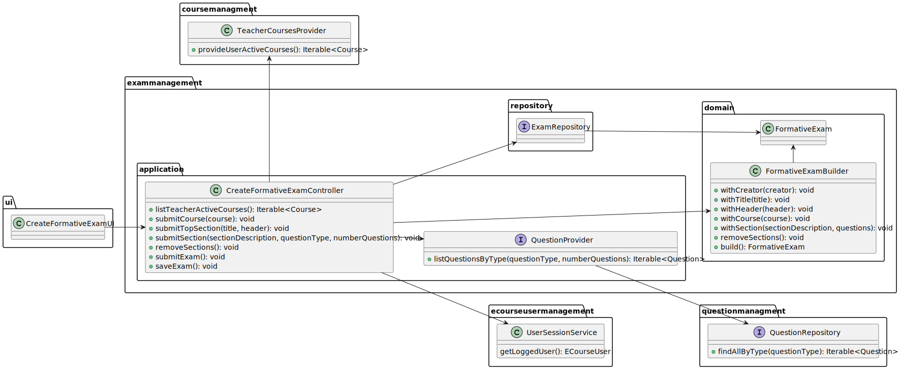
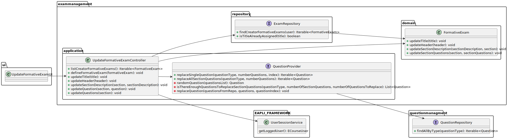
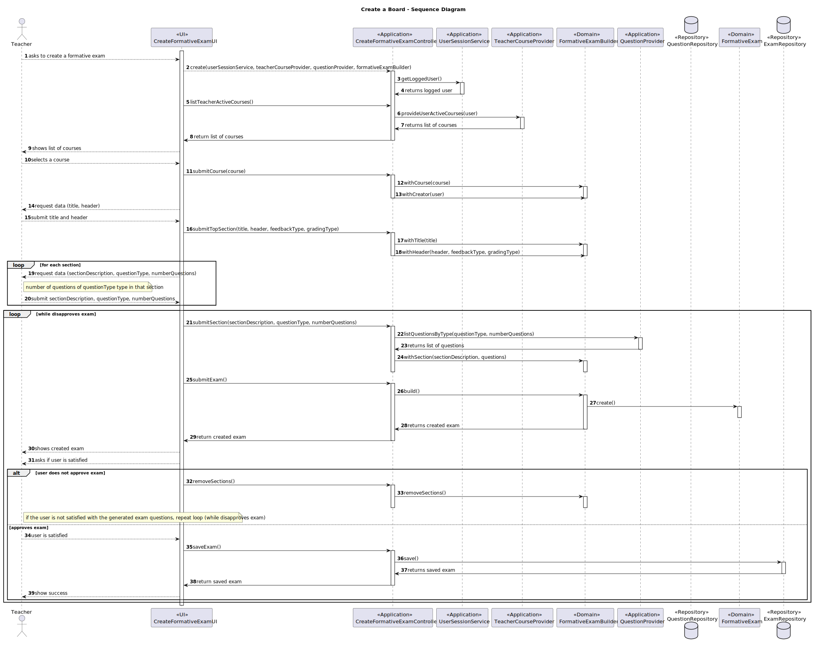
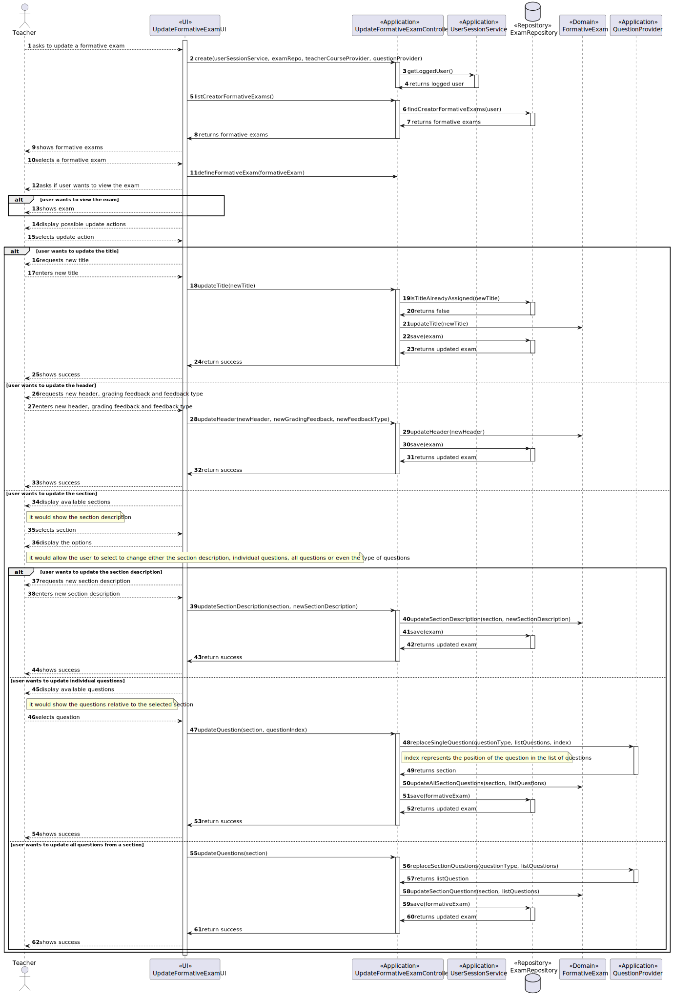

# US2008 - As Teacher, I want to create/update a formative exam

## 1. Context

This requirement is related to the creation/update of a formative exam.
A [Formative Exame](../MainDocs/glossary.md) is an exam where the system, automatically generates its questions 
based on the Teacher's specifications for the various sections.
It has a unique title, header, configuration, list of sections which are constituted by a list of questions. 
There are several types of questions, each one with its own configuration. 
* Macthing Question
* Multiple Choice Question
* Numerical Question
* Short Answer Question
* True or False Question
* Missing Word Question

---

## 2. Requirements

In order to create/update a formative exam, the teacher must be logged in the system.
The teacher must be lecturing a course, and the course must be in a different state than _closed_.
Then, he/she provides the following information:
- The title of the exam.
- The header of the exam.
- The configuration of the exam.
- The sections of the exam.
- The questions and answers of the exam.

---

## 3. Analysis

Having in mind that the user may want to either create or update a formative exam, it was decided to create a single 
use case for both functionalities.

* **UC2008.1** As a Teacher, I want to create a formative exam.
* **UC2008.2** As a Teacher, I want to update a formative exam.

---

## 4. Design

*Both Use Cases have separate Class and Sequence Diagrams, to fully encompass all the differences and key points
in each of them.*

### 4.1. Class Diagram

* **UC2008.1** As a Teacher, I want to create a formative exam.



* **UC2008.2** As a Teacher, I want to update a formative exam.




### 4.2. Sequence Diagram

This sequence diagram represents successful creation of a formative exam.

* **UC2008.1** As a Teacher, I want to create a formative exam.



*To reduce the complexity of the diagram, it was decided to omit some parts of the UserSessionService, and also from,
TeacherCoursesProvider,
since they are not relevant for the understanding of the diagram and have already been represented
in previous diagrams.*

*As expected, some design decisions were made, being one of them the creation of IQuestionsProvider, a service that acts
as the middleman to obtain questions from the IQuestionsRepository, in this specific case, providing them randomly.*

*Another design decision was the creation of FormativeExamBuilder, a class that is responsible for the creation of a
FormativeExam, allowing the creation of a FormativeExam in a step-by-step fashion.*

* **UC2008.2** As a Teacher, I want to update a formative exam.

The following sequence diagram represents a successful update of a formative exam.



*To improve code flexibility and usability, it was decided to use IQuestionsProvider again, with a slight adaptation,
allowing the user to replace single questions, or even entire sections, with new ones.*

*Regarding the updates themselves, the user has a wide range of possible upgrades that will allow a bigger 
customization for the formative exam.*

### 4.3. Applied Patterns

Some main patterns used in this functionality are:

* **Single Responsibility Principle:** *Every class has only one responsibility.*
* **Information Expert:** *The ExamRepository is the IE of the Exams.*
* **Dependency Injection:** *The CreateFormativeExamController will receive a IQuestionProvider, not depending on a specific implementation*
* **Low Coupling:** *All the classes are loosely coupled, not depending on concrete classes.*
* **High Cohesion:** *All the classes have a high cohesion, since they have only one responsibility.*

### 4.4. Tests

| Test Case | Description                          | Expected Result     |
|:---------:|:-------------------------------------|:--------------------|
|     1     | Create a exam with valid information | Exam is created     |
|     2     | Create a exam with invalid header    | Exam is not created |
|     3     | Create a exam with invalid title     | Exam is updated     |
|     4     | Create a exam with invalid sections  | Exam is not created |
|     5     | Update an exam with invalid title    | Exam is not updated |

---

## 5. Demonstration

In order to run this functionality, you must first run the Teacher program.
Then, you must log in, and select the option to create/update a formative exam.
You will then be prompted to provide the information needed to create/update a formative exam.

**Create Formative Exam**

https://github.com/Departamento-de-Engenharia-Informatica/sem4pi-22-23-16-1/assets/106761319/f5a07591-2490-4ed9-ac15-36fdc5ee7be3

**Update Formative Exam**

https://github.com/Departamento-de-Engenharia-Informatica/sem4pi-22-23-16-1/assets/106761319/fdcedcac-d5d7-4d57-bbe8-fe69c082c23b

---

## 6. Implementation

### 6.1. Create Formative Exam

````java
public class CreateFormativeExamController implements ICreateFormativeExamController {

    private ECourseUser examCreator;

    private final UserSessionService userSessionService;

    private final TeacherCoursesProvider teacherCoursesProvider;

    private final IQuestionProvider questionProvider;

    private final FormativeExamBuilder formativeExamBuilder;

    private final ExamRepository examRepository;

    /**
     * Instantiates a new CreateFormativeExamController.
     *
     * @param userSessionService     the user session service
     * @param teacherCoursesProvider the teacher courses provider
     * @param questionProvider       the question provider
     * @param formativeExamBuilder   the formative exam builder
     */
    public CreateFormativeExamController(final UserSessionService userSessionService,
                                         final TeacherCoursesProvider teacherCoursesProvider,
                                         final IQuestionProvider questionProvider,
                                         final FormativeExamBuilder formativeExamBuilder,
                                         final ExamRepository examRepository) {
        // Verify if UserSessionService is not null
        if (userSessionService == null) {
            throw new IllegalArgumentException("UserSessionService cannot be null.");
        }

        this.userSessionService = userSessionService;

        // Verify if the logged user is valid
        verifyUserIsTeacher();

        // Verify if IUserCoursesProvider is not null
        if (teacherCoursesProvider == null) {
            throw new IllegalArgumentException("IUserCoursesProvider cannot be null.");
        }

        this.teacherCoursesProvider = teacherCoursesProvider;

        // Verify if IQuestionProvider is not null
        if (questionProvider == null) {
            throw new IllegalArgumentException("IQuestionProvider cannot be null.");
        }

        this.questionProvider = questionProvider;

        // Verify if FormativeExamBuilder is not null
        if (formativeExamBuilder == null) {
            throw new IllegalArgumentException("FormativeExamBuilder cannot be null.");
        }

        this.formativeExamBuilder = formativeExamBuilder;

        // Verify if ExamRepository is not null
        if (examRepository == null) {
            throw new IllegalArgumentException("ExamRepository cannot be null.");
        }

        this.examRepository = examRepository;
    }

    @Override
    public void submitCourse(Course course) {
        formativeExamBuilder.withCourse(course);
        formativeExamBuilder.withCreator(examCreator);
    }

    @Override
    public void submitTopSection(String examTitle, String examHeaderDescription, FeedBackType examFeedBackType,
                                 GradingType examGradingType) {
        formativeExamBuilder.withTitle(examTitle);
        formativeExamBuilder.withHeader(examHeaderDescription, examFeedBackType, examGradingType);
    }

    @Override
    public void submitSection(String sectionDescription, QuestionType sectionQuestionType, int sectionQuestionAmount) {
        // Random questions generated for the exam section
        List<Question> randomSectionQuestions =
                (List<Question>) questionProvider.listQuestionsByType(sectionQuestionType, sectionQuestionAmount);

        formativeExamBuilder.withSection(sectionDescription, randomSectionQuestions);
    }

    @Override
    public void removeSections() {
        formativeExamBuilder.removeSections();
    }

    @Override
    public FormativeExam submitExam() {
        return formativeExamBuilder.build();
    }

    private void verifyUserIsTeacher() {
        Optional<ECourseUser> eCourseUserOptional = userSessionService.getLoggedUser();

        eCourseUserOptional.ifPresentOrElse(
                eCourseUser -> this.examCreator = eCourseUser,
                () -> {
                    throw new IllegalStateException("No eCourse user found. Make sure you are registered.");
                }
        );

        if (!examCreator.isTeacher()) {
            throw new IllegalStateException("Only teachers can create exams.");
        }
    }

    /**
     * This method returns the list of courses that the teacher is lecturing, that are not in closed state.
     *
     * @return the iterable containing the courses
     */
    public Iterable<Course> listTeacherActiveCourses() {
        return teacherCoursesProvider.provideUserActiveCourses(examCreator);
    }

    /**
     * This method returns true if the question provider has enough questions of the given type.
     *
     * @return the boolean
     */
    public boolean isThereEnoughQuestionsForType(QuestionType questionType, int questionAmount) {
        return !questionProvider.isThereEnoughQuestionsForType(questionType, questionAmount);
    }

    public void saveExam(FormativeExam exam) {
        examRepository.save(exam);
    }
}
````
### 6.2. Update Formative Exam

````java
public class UpdateFormativeExamController {

    private final UserSessionService userSessionService;
    private final ExamRepository examRepo;
    private final QuestionProvider questionProdiver;
    private ECourseUser examOwner;
    private FormativeExam selectedFormativeExam;

    public UpdateFormativeExamController(UserSessionService userSessionService,
                                         ExamRepository examRepo, QuestionProvider questionProdiver) {
        Preconditions.nonNull(userSessionService);
        this.userSessionService = userSessionService;

        Preconditions.nonNull(examRepo);
        this.examRepo = examRepo;

        Preconditions.nonNull(questionProdiver);
        this.questionProdiver = questionProdiver;

        verifyUser();
    }

    public void verifyUser() {
        Optional<ECourseUser> eCourseUserOptional = userSessionService.getLoggedUser();
        eCourseUserOptional.ifPresentOrElse(eCourseUser -> this.examOwner = eCourseUser, () -> {
            throw new IllegalStateException("eCourse User must be registered.");
        });
    }

    public Iterable<FormativeExam> listCreatorFormativeExams() {
        return examRepo.findFormativeExamsByCreator(examOwner);
    }

    public void defineFormativeExam(FormativeExam selectedFormativeExam) {
        Preconditions.nonNull(selectedFormativeExam);

        this.selectedFormativeExam = selectedFormativeExam;
    }

    public boolean updateTitle(String newTitle) {

        if (examRepo.isTitleAlreadyAssigned(newTitle))
            return false;

        selectedFormativeExam.updateTitle(newTitle);

        submitExam();
        return true;
    }


    /**
     * Updates the header of the selected formative exam.
     * @param newHeader the new header
     * @param newGradingType the new grading type
     * @param newFeedBackType the new feedback type
     */
    public void updateHeader(String newHeader, GradingType newGradingType, FeedBackType newFeedBackType) {
        selectedFormativeExam.updateHeader(new ExamHeader(newHeader, newGradingType, newFeedBackType));

        submitExam();
    }


    /**
     * Updates the sections of the selected formative exam.
     */
    public List<ExamSection> examSections() {
        return selectedFormativeExam.sections();
    }


    /**
     * Updates the description of the selected section.
     * @param section the selected section
     * @param newDescription the new description
     */
    public void updateSectionDescription(ExamSection section, String newDescription) {
        selectedFormativeExam.updateSectionDescription(section, newDescription);

        submitExam();
    }


    /**
     * Updates the questions of the selected section.
     * @param section the selected section
     * @param questionIndex the position of the question to be updated
     */
    public void updateQuestion(ExamSection section, int questionIndex, QuestionType questionType) {
        questionProdiver.updateSingleQuestion(questionType, section.questions(), questionIndex);
        selectedFormativeExam.updateSectionQuestions(section, section.questions());

        submitExam();
    }


    /**
     * Updates all questions of a selected section.
     * @param section the selected section
     */
    public void updateQuestions(ExamSection section) {
        questionProdiver.updateAllSectionQuestions(section.questions().get(0).type(), section.questions());
        selectedFormativeExam.updateSectionQuestions(section, section.questions());

        submitExam();
    }


    public FormativeExam submitExam() {
        return examRepo.save(selectedFormativeExam);
    }
}
````

### 6.3. Questio Provider (Common to both use cases)

````java
public class QuestionProvider implements IQuestionProvider {

    private final QuestionRepository questionRepo;

    public QuestionProvider(QuestionRepository questionRepo) {
        this.questionRepo = questionRepo;
    }

    @Override
    public boolean isThereEnoughQuestionsForType(QuestionType questionType, int numberOfQuestions) {
        // Obtain the questions from the repository
        List<Question> questionsFromRepo = (List<Question>) questionRepo.findAllByType(questionType);

        // Check if there are enough questions to generate the questions for the section
        return questionsFromRepo.size() >= numberOfQuestions;
    }

    @Override
    public Iterable<Question> listQuestionsByType(QuestionType questionType, int numberOfQuestions) {
        // Obtain the questions from the repository
        List<Question> questionsFromRepo = (List<Question>) questionRepo.findAllByType(questionType);

        if (questionsFromRepo.size() == 0)
            throw new IllegalStateException("There are no questions of the type " + questionType + " in the repository.");

        // Check if there are enough questions to generate the questions for the section
        if (questionsFromRepo.size() < numberOfQuestions) {
            throw new
                    IllegalStateException("There are not enough questions to generate the questions for the section.");
        }

        // Generate the questions for the section
        List<Question> questionsForSection = new ArrayList<>();

        do {
            // Generate the random question
            Question randomQuest = randomQuestion(questionsFromRepo);

            if (!questionsForSection.contains(randomQuest)) {
                // Remove from the old question and add the newer one
                questionsFromRepo.remove(randomQuest);
                questionsForSection.add(randomQuest);
            } else questionsFromRepo.remove(randomQuest);

            numberOfQuestions--;

        } while (numberOfQuestions > 0);

        return questionsForSection;
    }

    @Override
    public void updateSingleQuestion(QuestionType questionType, List<Question> questions, int questionIndex) {
        List<Question> questionsByType = isThereEnoughQuestionsToReplaceSectionQuestions(questionType,
                questions.size(), questions.size() - 1);

        questionsByType.remove(questions.get(questionIndex));
        replaceQuestion(questionsByType, questions, questionIndex);
    }

    @Override
    public void updateAllSectionQuestions(QuestionType questionType, List<Question> questions) {
        List<Question> questionsByType =
                isThereEnoughQuestionsToReplaceSectionQuestions(questionType, questions.size(), 1);

        int size = questions.size();
        questionsByType.removeAll(questions);
        for (int questionIndex = 0; questionIndex < size; questionIndex++) {
            replaceQuestion(questionsByType, questions, 0);
        }
    }

    /**
     * Replaces the unwanted questions with a newer one
     *
     * @param questions the list of questions
     */
    private void replaceQuestion(List<Question> questionsFromRepo, List<Question> questions, int questionIndex) {
        // Generate the random question
        Question randomQuestion = randomQuestion(questionsFromRepo);

        // Remove old question and add the new question to the list of questions
        questions.remove(questionIndex);
        questions.add(randomQuestion);
        questionsFromRepo.remove(randomQuestion);
    }

    private List<Question> isThereEnoughQuestionsToReplaceSectionQuestions(
            QuestionType questionType, int numberOfSectionQuestions, int numberOfQuestionsToReplace) {
        List<Question> questionsFromRepo = (List<Question>) questionRepo.findAllByType(questionType);

        if (questionsFromRepo.size() - numberOfSectionQuestions <= Math.multiplyExact(numberOfQuestionsToReplace, 2)) {
            throw new IllegalStateException("There are not enough questions to replace the section questions.");
        }

        return questionsFromRepo;
    }

    /**
     * Returns a random question from the list of questions.
     *
     * @param questions the list of questions
     * @return a random question
     */
    private Question randomQuestion(List<Question> questions) {
        if (questions.size() == 1)
            return questions.get(0);

        Random intRand = new Random();
        return questions.get(intRand.nextInt(questions.size() - 1));
    }

}
````
