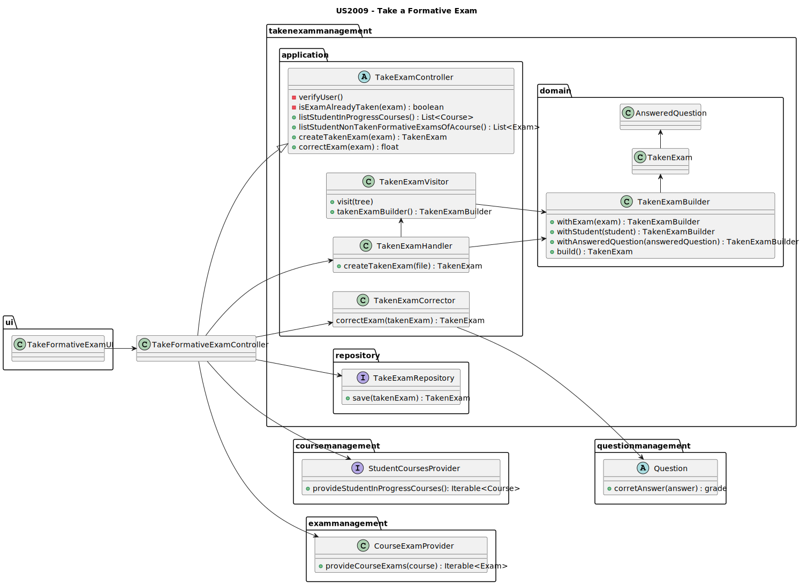
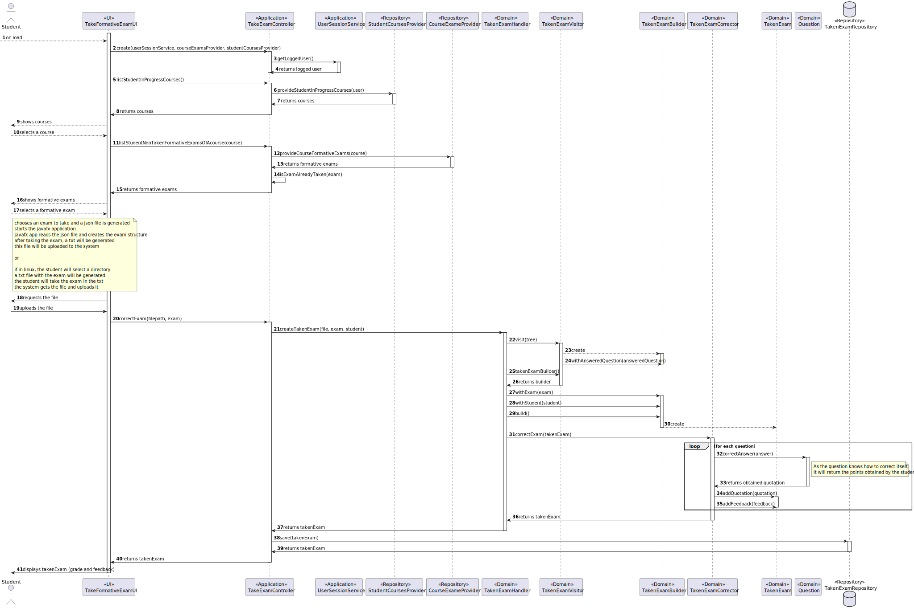

# US2009 - As Teacher, I want to take an automatic formative exam

## 1. Context

This requirement is related to taking a formative exam. It's heavily related to 
[US2008](../US2006_ViewGradesOfExam/readme.md), the creation of a formative exam.
A [Formative Exam](../MainDocs/glossary.md) is an exam where the system, automatically generates its questions 
based on the Teacher's specifications for the various sections.
Once the exam is created, it's ready to be taken by the students. 
After a student takes the exam, the system automatically corrects it, and provides the student with the results.

As we consider this requirement to be a complex one to be developed and use in the console, 
we decided to develop a user interface for it.
A user selects a formative exam to take, and the system will open the interface automatically.

---

## 2. Requirements

In order to take a formative exam, a user needs to be logged in as a student.
Then, they must select the option to take a formative exam.
The user will then be prompted to select the exam he/she wants to take. 
This means the course has to have at least one formative exam created.

After selecting the exam, the user will be presented with the exam's questions.
The user will then answer the questions, and submit the exam.
The system will then correct the exam, and present the user with the results.

---

## 3. Analysis

This User Story is heavily related to the US [US2004](../US2004_TakeAutomatedExam/readme.md), which consists of taking
an automated exam. The main difference between the two is that the automated exam has a defined period to be taken and 
the way the questions are obtained. 
So, in terms of solving the exam, the process is the same.

For this reason, both US will have separate UI and Controllers, but will share the same services and repositories.

Another important aspect to state is regarding the <span style="color: #d0734c">**exam correction**</span>.
A TakenExam object is related to an <span style="color: #d0734c">**exam**</span>, the exam which was taken. 
This object has a list of questions. 
Now each question knows its <span style="color: #d0734c">**correct answer**</span>. 
For this reason, the question object is responsible to <span style="color: #d0734c">**correct itself**</span>.
It will receive the student's answer, compare it to the correct answer and 
return the <span style="color: #d0734c">**points obtained**</span>.

However, there needs to be something that controls the exam correction process, and the class responsible 
for that is the <span style="color: #d0734c">**TakenExamCorrector**</span>. It's a service which sole purpose is to
correct a TakenExam object. It will receive the TakenExam, and for each question, it will call the
<span style="color: #d0734c">**correctStudentAnswer**</span> method, and sum the points obtained.

---

## 4. Design


### 4.1. Class Diagram





### 4.2. Sequence Diagram

This sequence diagram represents successful taking of a formative exam.




### 4.3. Applied Patterns

Some main patterns used in this functionality are:

* **Single Responsibility Principle:** *Every class has only one responsibility.*
* **Information Expert:** *The ExamRepository is the IE of the Exams.*
* **Dependency Injection:** *The TakeFormativeExamController will receive various services, not depending on 
a specific implementation*
* **Low Coupling:** *All the classes are loosely coupled, not depending on concrete classes.*
* **High Cohesion:** *All the classes have a high cohesion, since they have only one responsibility.*

### 4.4. Tests

| Test Case | Description                                  | Expected Result                     |
|:---------:|:---------------------------------------------|:------------------------------------|
|     1     | Take an exam and get everything right        | Taken exam is created and corrected |
|     2     | Take an exam and get some things wrong       | Taken exam is created and corrected |
|     3     | Take an exam and get everything wrong        | Taken exam is created and corrected |
|     4     | Submit non existing file                     | Taken exam is not created           |
|     5     | Submit a valid file but for a different exam | Taken exam is not created           |
|     6     | Submit file with invalid structure           | Taken exam is not created           |

---

## 5. Demonstration

In order to run this functionality, you must first run the Teacher program.
Then, you must log in, and select the option to take a formative exam.
After, a web broswer will open, and you will be able to take the exam.

**Take Formative Exam Demo**

https://github.com/Departamento-de-Engenharia-Informatica/sem4pi-22-23-16-1/assets/116153853/f1cdbda8-dd24-4107-9c01-25494f603f92


---

## 6. Implementation

### 6.1. Take Formative Exam

````java
public class TakeFormativeExamController {

    private final UserSessionService userSessionService;
    private final StudentCoursesProvider courseProvider;
    private final CourseExamsProvider examsProvider;
    private final TakenExamRepository takenExamRepo;
    private final TakenExamHandler takenExamHandler;
    private ECourseUser student;

    /**
     * Constructor of the controller
     * @param userSessionService the user session service
     * @param courseProvider the course provider
     * @param examsProvider the exams provider
     * @param takenExamRepo the taken exam repository
     * @param takenExamHandler the taken exam handler
     */
    public TakeFormativeExamController(
            UserSessionService userSessionService, StudentCoursesProvider courseProvider,
            CourseExamsProvider examsProvider, TakenExamRepository takenExamRepo, TakenExamHandler takenExamHandler) {
        Preconditions.noneNull(userSessionService, courseProvider, examsProvider, takenExamRepo, takenExamHandler);

        this.userSessionService = userSessionService;
        this.courseProvider = courseProvider;
        this.examsProvider = examsProvider;
        this.takenExamRepo = takenExamRepo;
        this.takenExamHandler = takenExamHandler;

        verifyUser();
    }

    /**
     * Finds all courses a student is enrolled in that are in progress
     * @return the student
     */
    public Iterable<Course> listStudentInProgressCourses() {
        return courseProvider.provideStudentInProgressCourses(student);
    }


    /**
     * Finds all formative exams of a course
     * @return the student
     */
    public Iterable<FormativeExam> listCourseFormativeExams(Course course) {
        return examsProvider.provideCourseFormativeExams(course);
    }

    /**
     * Creates a taken exam from a file
     * @param path the path to the file
     * @param exam the exam to be taken
     * @return the created taken exam
     */
    public TakenExam correctExam(String path, Exam exam) {
        TakenExam takenExam = takenExamHandler.createTakenExam(path, exam, student);

        return takenExamRepo.save(takenExam);
    }
}
````

### 6.3. Taken Exam Corrector

````java
package takenexammanagement.application.service;

public class TakenExamCorrector {

    public TakenExamCorrector() {
    }

    /**
     * Corrects the exam
     * @param takenExam the exam to correct
     * @return the corrected exam
     */
    public TakenExam correctExam(TakenExam takenExam){

        Exam exam = takenExam.exam();

        for(AnsweredQuestion answeredQuestion : takenExam.answeredQuestions()) {

            int sectionIndex = answeredQuestion.sectionIndex();

            int questionIndex = answeredQuestion.questionIndex();

            Question question = exam.obtainQuestion(sectionIndex, questionIndex);

            float obtainedQuotation = question.correctStudentAnswer(answeredQuestion.answer());
            if(obtainedQuotation > 0) {
                takenExam.addQuotation(question.quotation());
                answeredQuestion.addFeedback("You got it right! Well done.\n");
            }
            else {
                answeredQuestion.addFeedback("You got it wrong, the correct answer was -> " + question.correctAnswer() + ".\n");
            }
        }
        return takenExam;
    }
}
````

### 6.4. Taken Exam Handler

````java
package takenexammanagement.application.service;

public class TakenExamHandler {

    private final TakenExamVisitor visitor;
    private final TakenExamCorrector corrector;

    public TakenExamHandler(TakenExamVisitor visitor, TakenExamCorrector corrector) {
        Preconditions.noneNull(visitor, corrector);
        this.visitor = visitor;
        this.corrector = corrector;
    }

    /**
     * Parses a taken exam from a file
     *
     * @param path the path to the file
     * @return the parsed taken exam object
     */
    public TakenExam createTakenExam(String path, Exam exam, ECourseUser student) {

        TakenExamBuilder builder;

        try {
            // Create a CharStream from the file
            CharStream charStream = CharStreams.fromPath(Paths.get(path));

            // Create a lexer using the CharStream
            ExamLexer lexer = new ExamLexer(charStream);

            // Create a token stream from the lexer
            CommonTokenStream tokenStream = new CommonTokenStream(lexer);

            // Create a parser using the token stream
            ExamParser parser = new ExamParser(tokenStream);

            // Generate a parse tree by starting at the exam rule
            ParseTree tree = parser.exam();

            // Traverse the parse tree using your visitor
            visitor.visit(tree);

            // Get the builder from the visitor, which is missing the course and the teacher creating it
            builder = visitor.takenExamBuilder();
        } catch (IOException e) {
            throw new IOException("Could not read file");
        } catch (Exception e) {
            throw new IOException("Invalid Exam, please check the if it contains the correct format");
        }

        // Build the exam
        builder.withExam(exam);
        builder.withStudent(student);

        // Return the corrected exam
        return corrector.correctExam(builder.build());
    }

}
````


## 7. Tests
