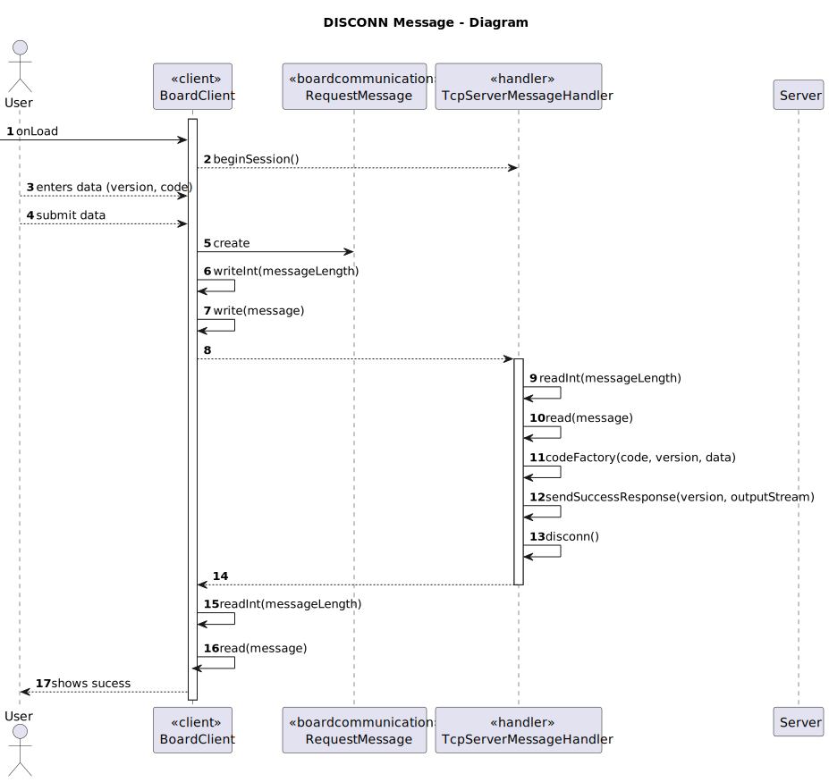

# US 3001 - Shared Board Communication

## 1. Context

The purpose of this application protocol is <span style="color: #d0734c">**facilitating data exchanges between the Shared Board App and the Shared Board Server**</span> network applications
Communication between these two components must follow specific protocol described in a document from RCOMP ("Application Protocol").

This user story will serve as the base for the SharedBoard App, as every user action will be translated into a message that will be sent to the server.

## 2. Requirements

In this US, it is required to implement a <span style="color: #d0734c">**client-server architecture**</span>, where communication between the two components, client and server, 
must follow the protocol described in the document "Application Protocol".
The document describes the protocol as follows:

* A <span style="color: #d0734c">**TCP connection**</span> must be established.
* Uses the <span style="color: #d0734c">**client-server model**</span>. 
  * The client application (Shared Board App) is the one that <span style="color: #d0734c">**takes the initiative of requesting a TCP connection**</span> establishment with the counterpart server
    application (Shared Board Server), which should <span style="color: #d0734c">**accept**</span> incoming connection requests.
* Once the TCP connection is established, the client-server is no longer mandatory, both the client
  application and the server application are allowed to take the initiative of sending data, a request.
* Every request (sent by the client or the server) has a <span style="color: #d0734c">**mandatory response**</span>, both requests and responses share a same general message format described ahead.
* Once established, the TCP connection between the client and the server should be kept alive and is used
  for all required data exchanges while the client application is running.


### 2.1. SBP Message Format

<table>
  <tr>
    <th>Field</th>
    <th>Offset (bytes)</th>
    <th>Length (bytes)</th>
    <th>Description</th>
  </tr>
  <tr>
    <td>VERSION</td>
    <td>0</td>
    <td>1</td>
    <td>Is a single byte and should be interpreted as an unsigned integer (0 to 255). The present message format version number is one</td>
  </tr>
  <tr>
    <td>CODE</td>
    <td>1</td>
    <td>1</td>
    <td>Identifies the type of request or response, it should be interpreted as an unsigned integer (0 to 255)</td>
  </tr>
  <tr>
    <td>D_LENGTH_1</td>
    <td>2</td>
    <td>1</td>
    <td  rowspan="2">Are used to specify the length in bytes of the DATA field.
        Both these fields are to be interpreted as unsigned integer numbers (0 to 255)
        The length of the DATA field is to be calculated as: <br><br>
        D_LENGTH = D_LENGTH_1 * 256 + D_LENGTH_2 <br><br>
        The length of the DATA field may be zero, meaning it does not exist.
</td>
  </tr>

<tr>
    <td>D_LENGTH_1</td>
    <td>3</td>
    <td>1</td>
  </tr>

<tr>
    <td>DATA</td>
    <td>4</td>
    <td>-</td>
    <td>Contains data to meet the specific needs of the participating applications, the content depends on the message code</td>
  </tr>
</table>


### 2.2. SBP Message Codes

| CODE | MEANING                                                                                                                                                                                                                                                                                                         |
|------|-----------------------------------------------------------------------------------------------------------------------------------------------------------------------------------------------------------------------------------------------------------------------------------------------------------------|
| 0    | **COMMTEST** - Communications test request with no other effect on the counterpart application than the response with a code two message (ACK). This request has no data.                                                                                                                                       |
| 1    | **DISCONN** - End of session request. The counterpart application is supposed to respond with a code two message, afterwards both applications are expected to close the session (TCP connection). This request has no data.                                                                                    |
| 2    | **ACK** - Generic acknowledgment and success response message. Used in response to successful requests. This response contains no data.                                                                                                                                                                         |
| 3    | **ERR** - Error response message. Used in response to unsuccessful requests that caused an error. This response message may carry a human readable phrase explaining the error. If used, the phrase explaining is carried in the DATA field as string of ASICII codes, it’s not required to be null terminated. |
| 4    | **AUTH** - User authentication request.                                                                                                                                                                                                                                                                         |


## 3. Analysis

Here, the goal is <span style="color: #d0734c">**not to implement the full communication version**</span> between the Shared Board App and Server, but a simplified version of it.
It is required to just send messages from a client to a server. The server will then respond, with a message, to the client.
As there are several types of messages, the client should be able to send any of them to the server, and the server, depending on the code of the message, should respond accordingly.

As we do not have the actual Shared Board App, we will <span style="color: #d0734c">**simulate the client**</span> by creating a simple console application that will send messages to the server.
However, even being a _simulation_, we will try to follow the real communication as much as possible, as it will be easier to implement the real communication later on.

Another important aspect, the user can send <span style="color: #d0734c">**messages with various codes**</span>, and, depending on this, the server does different things.
So, it is important that the server is able to identify the code of the message received, and act accordingly.
It also crucial that there is <span style="color: #d0734c">**flexibility in the code**</span>, so that it is <span style="color: #d0734c">**easy**</span> to add new codes and functionalities in the future.
Right now, a user can send messages with the following codes
* COMMTEST
* DISCONN
* AUTH

Then, it can receive as response messages from the server with the following codes
* ACK -> success
* ERR -> error
<br>

### Actions per Message Code

#### COMMTEST

This code is used to <span style="color: #d0734c">**test the communication**</span> between the client and the server.
This request has no data, and the server should respond with a code two message (ACK).

Steps: <br>
* Client sends a message with code 0
* Server receives the message, and sends a message with code 2
* Client received the message


#### DISCONN

This code is used to <span style="color: #d0734c">**end the sessions**</span>, both client and server applications.
Both applications are expected to close the session (TCP connection).
This request has no data, and the server should respond with a code two message (ACK).

Steps: <br>
* Client sends a message with code 1
* Server ends the session, and sends a message with code 2
* Client received the message and ends the session


#### AUTH

This code is used to <span style="color: #d0734c">**authenticate the user**</span>.
The client must provide a username and a password, then send a message with code 4 and the username and password in the data field.
The server should respond with a code two message (ACK) if the authentication was successful, or a code three message (ERR) otherwise.

Steps: <br>
* Client sends a message with code 4 and the username and password in the data field
* Server receives the message, and checks if the username and password are correct
* If success, the server sends a message with code 2, otherwise it sends a message with code 3
* Client received the message and acts upon it

## 4. Design

### 4.1. Class Diagram


### 4.2. Sequence Diagram

This sequence diagram represents the successful case of sending a message from the client to a server

Sending the message can fail for the following reasons:
- The manager provides a non-existing code.
- The manager provides a too large data field.
- The TCP connection is lost or not established.


### 4.2.1. COMMTEST Message Request


<br>


### 4.2.2. DISCONN Message Request




<br>


### 4.2.3. AUTH Message Request


### 4.3. Applied Patterns

* **Client Server:** *The communication with the board is made using a client-server architecture, where the board acts 
as the server and the clients are the application that sends messages to the board.*

## 5. Demonstration

Here is a video demonstrating the communication between the client and the server using two different machines, within the same network:


https://github.com/Departamento-de-Engenharia-Informatica/sem4pi-22-23-16-1/assets/103595766/91713c9f-9fb0-48ca-bae0-9d554c00c3e8


## 6. Implementation

Here is a list of the main classes and their responsibilities:

- **MessageCode:** Enum that represents the message codes available.

````java
public enum MessageCode {
    /**
     * Communication test code.
     */
    COMMTEST(0),
    /**
     * End of session request code.
     */
    DISCONN(1),
    /**
     * Success code.
     */
    ACK(2),
    /**
     * Error code.
     */
    ERR(3),
    /**
     * Auth request code.
     */
    AUTH(4);

    private final int code;

    MessageCode(int code) {
        this.code = code;
    }

    /**
     * Retrieves the int value of a code.
     *
     * @return the int
     */
    public int value() {
        return code;
    }
}
````

- **RequestMessage:** Class related to the message requests.

````java
  public class RequestMessage {

  private final byte version;
  private final byte code;
  private byte d_lenght_1;
  private byte d_lenght_2;
  private final byte[] data;


  /**
   * Instantiates a new Request message, with data.
   *
   * @param version the version
   * @param code    the code
   * @param data    the data
   *
   * @throws IllegalArgumentException if the code is invalid
   */
  public RequestMessage(byte version, MessageCode code, String data) {
    byte codeByte = getCodeFromString(code);
    if (codeByte < 0 || codeByte > MessageCode.values().length)
      throw new IllegalArgumentException("Code is invalid");

    this.version = version;
    this.code = codeByte;
    this.data = data.getBytes();
    dLengths();
  }

  /**
   * Instantiates a new Request message with no data.
   *
   * @param version the version
   * @param code    the code
   *
   * @throws IllegalArgumentException if the code is invalid
   */
  public RequestMessage(byte version, MessageCode code) {
    byte codeByte = getCodeFromString(code);
    if (codeByte < 0 || codeByte > MessageCode.values().length)
      throw new IllegalArgumentException("Code is invalid");

    this.version = version;
    this.code = codeByte;
    this.data = new byte[0];
    dLengths();
  }

  /**
   * Instantiates a new Request message, with a byte array.
   *
   * @param message the message
   */
  public RequestMessage(byte[] message) {
    if (message[1] < 0 || message[1] > 4)
      throw new IllegalArgumentException("Code is invalid");

    this.version = message[0];
    this.code = message[1];
    this.d_lenght_1 = message[2];
    this.d_lenght_2 = message[3];
    this.data = Arrays.copyOfRange(message, 4, message.length);
  }

  private void dLengths() {
    int dataLength = data.length;

    // Split the length into two bytes in network byte order
    d_lenght_1 = (byte) (dataLength >> 8);
    d_lenght_2 = (byte) (dataLength & 0xFF);
  }

  /**
   * Gets the code byte from the enum.
   *
   * @param code the code
   * @return the code from string
   */
  public static byte getCodeFromString(MessageCode code) {
    byte codeByte = -1;
    switch (code) {
      case COMMTEST:
        return 0;
      case DISCONN:
        return 1;
      case ACK:
        return 2;
      case ERR:
        return 3;
      case AUTH:
        return 4;
      default:
        return codeByte;
    }
  }

  /**
   * Retrieves the list of codes that the client can send
   *
   * @return the list
   */
  public static List<MessageCode> clientCodes() {
    return Arrays.asList(MessageCode.COMMTEST, MessageCode.DISCONN, MessageCode.AUTH);
  }

  /**
   * Transforms the message into a byte array
   *
   * @return the byte array of the message
   */
  public byte[] getBytes() {
    int messageLength;
    messageLength = 4 + data.length;
    byte[] message = new byte[messageLength];

    message[0] = version;
    message[1] = code;
    message[2] = d_lenght_1;
    message[3] = d_lenght_2;

    System.arraycopy(data, 0, message, 4, data.length);

    return message;
  }

  @Override
  public String toString() {
    if (code < 3) {
      return "Code: " + code + "\n";
    }
    return "Code: " + code + "\n" +
            "Data: " + new String(data) + "\n";
  }
}
````

- **TcpServerMessageHandler:** Server side message handler.

````java
public class TcpServerMessageHandler implements Runnable {
    private final Socket socket;
    private DataOutputStream out;
    private DataInputStream in;

    public TcpServerMessageHandler(Socket clientSocket) {
        socket = clientSocket;
    }

    public void run() {
        InetAddress clientIP;

        clientIP = socket.getInetAddress();
        System.out.println("New client connection from " + clientIP.getHostAddress() +
                ", port number " + socket.getPort());

        try {
            out = new DataOutputStream(socket.getOutputStream());
            in = new DataInputStream(socket.getInputStream());

            // Read the length of the message
            int length = in.readInt();

            // Read the message
            byte[] message = in.readNBytes(length);
            byte version = message[0];
            byte code = message[1];
            String data = new String(Arrays.copyOfRange(message, 4, message.length), StandardCharsets.UTF_8);
            System.out.println("Version: " + version);
            System.out.println("Code: " + code);
            System.out.println("Data: " + data);

            // Act upon the code
            codeFactory(code, version, data);

            // Disconnect the client
            System.out.println("Client " + clientIP.getHostAddress() + ", port number: " + socket.getPort() +
                    " disconnected");

            socket.close();
        } catch (IOException ex) {
            System.out.println("IOException");
        }
    }


    /**
     * Acts upon the code received from the client
     *
     * @param code    - Message's code
     * @param version - Message's version
     * @param data    - Message's data
     * @throws IOException - If an I/O error occurs
     */
    private void codeFactory(byte code, byte version, String data) throws IOException {
        switch (code) {
            case 0:
                // COMMTEST
                sendSuccessResponse(version, out);
                break;
            case 1:
                // DISCONN
                sendSuccessResponse(version, out);
                disconn();
                break;
            case 4:
                // AUTH
                authenticationHandler(version, data);
                break;

            default:
                sendErrorResponse(version, "Invalid Option", out);
        }
    }


    /**
     * Handles the authentication request
     *
     * @throws IOException - If an I/O error occurs
     */
    private void authenticationHandler(byte version, String data) throws IOException {
        // Handle the received data
        String[] dataSplit;
        try {
            dataSplit = data.split(";");
            if (dataSplit.length != 2) {
                throw new Exception();
            }
        } catch (Exception e) {
            sendErrorResponse(version, "Invalid data for authentication", out);
            return;
        }

        // Split by username and password
        final String username = dataSplit[0];
        final String password = dataSplit[1];


        try {
            // Authenticate the user
            boolean result = authenticate(username, password);

            // Send the response
            if (result) {
                sendSuccessResponse(version, out);
            } else {
                sendErrorResponse(version, "Authentication failed", out);
            }
        } catch (Exception e) {
            sendErrorResponse(version, e.getMessage(), out);
        }

    }

    // Method responsible for authenticating the user
    private boolean authenticate(String username, String password) {
        // Initialize the authentication handler and the user management service
        final AuthenticationCredentialHandler handler = new AuthenticationCredentialHandler();
        final UserManagementService service = AuthzRegistry.userService();

        // Check if the user exists
        final SystemUser user = service.userOfIdentity(Username.valueOf(username)).orElse(null);
        if (user == null) {
            throw new IllegalArgumentException("User does not exist");
        }

        // Authenticate the user
        Role userRole;
        try {
            userRole = (Role) user.roleTypes().toArray()[0];
        } catch (Exception e) {
            throw new IllegalArgumentException("User does not have a role!");
        }

        // Return the result
        return handler.authenticated(username, password, userRole);
    }


    /**
     * Disconnect the client and the server
     */
    private void disconn() {
        try {
            System.out.println("Disconnecting client");
            socket.close();
            System.out.println("Disconnected server");
            System.exit(0);
        } catch (IOException ex) {
            System.out.println("Error disconnecting client");
        }
    }


    /**
     * Send a response to the client - success
     *
     * @param version Version of the message
     * @param out     Output stream
     * @throws IOException If an I/O error occurs
     */
    private void sendSuccessResponse(byte version, DataOutputStream out) throws IOException {
        // Create a success response
        RequestMessage response = new RequestMessage(version, MessageCode.ACK);

        // Send response
        byte[] responseBytes = response.getBytes();
        out.writeInt(responseBytes.length);
        out.write(responseBytes);
    }


    /**
     * Send a response to the client - error
     *
     * @param version Version of the message
     * @param out     Output stream
     * @param data    Data to send
     * @throws IOException If an I/O error occurs
     */
    private void sendErrorResponse(byte version, String data, DataOutputStream out) throws IOException {
        // Create an error response
        RequestMessage response = new RequestMessage(version, MessageCode.ERR, data);

        // Send response
        byte[] responseBytes = response.getBytes();
        out.writeInt(responseBytes.length);
        out.write(responseBytes);
    }
}
````

- **BoardClient:** Client side application base class. Used to establish a connection with the server, and send the requests.

````java
public class BoardClient {
  static InetAddress serverIP;
  static Socket socket;
  static BufferedReader br = new BufferedReader(new InputStreamReader(System.in));

  private static int SERVER_PORT;
  private static String SERVER_HOST;

  public void sendRequest() throws IOException {
    // read from config file
    readConfigFile();
    // Connection
    connection();

    // Create input and output streams to communicate with the server
    OutputStream outputStream = socket.getOutputStream();
    DataOutputStream out = new DataOutputStream(outputStream);

    InputStream inputStream = socket.getInputStream();
    DataInputStream in = new DataInputStream(inputStream);


    // Request data from the user
    RequestMessage message = getUserInput();
    if (message == null)
      return;


    // Send the message to the server
    byte[] messageBytes = message.getBytes();
    out.writeInt(messageBytes.length);
    out.write(messageBytes);

    // Receive the server response
    int responseLength = in.readInt();
    byte[] responseBytes = in.readNBytes(responseLength);
    RequestMessage response = new RequestMessage(responseBytes);
    System.out.println(response);

    try {
      sleep(1500);
    } catch (InterruptedException e) {
      throw new RuntimeException(e);
    }

    // Close the streams and the socket
    socket.close();
  }

  /**
   * Read the config file
   */
  private void readConfigFile() {
    SERVER_PORT = Application.settings().getServerPort();
    SERVER_HOST = Application.settings().getServerHost();
  }

  /**
   * Establishes a TCP connection with the server
   */
  private void connection() {
    // Establish a TCP connection with the server
    try {
      serverIP = InetAddress.getByName(SERVER_HOST);
    } catch (UnknownHostException ex) {
      System.out.println("Invalid server specified: " + SERVER_HOST);
      System.exit(1);
    }

    try {
      socket = new Socket(serverIP, SERVER_PORT);
    } catch (IOException ex) {
      System.out.println("Failed to establish TCP connection");
      System.exit(1);
    }
  }

  /**
   * Get the user input
   *
   * @return Request message
   */
  private static RequestMessage getUserInput() {
    byte version = 1;

    // Select the message code to send
    ListSelector<MessageCode> codes = new ListSelector<>("Select a Message Code", RequestMessage.clientCodes());
    codes.showAndSelect();
    MessageCode code = codes.getSelectedElement();

    // If code is 0 or 1, then the message has no data
    if (code.value() <= 1) {
      return new RequestMessage(version, code);
    }
    else {
      System.out.print("Enter the message: ");
      String data;
      try {
        data = br.readLine();
      } catch (IOException e) {
        System.out.println("Error reading input");
        return null;
      }
      return new RequestMessage(version, code, data);
    }
  }
}
````
## 7. Observations

A good addition for this feature is to have a retry mechanism for the client.
If the client fails to connect to the server, it should retry to connect to the server after a certain amount of time,
the number of retries could be specified in the config file.
This would make the client more robust, as it would be able to handle temporary server failures.
