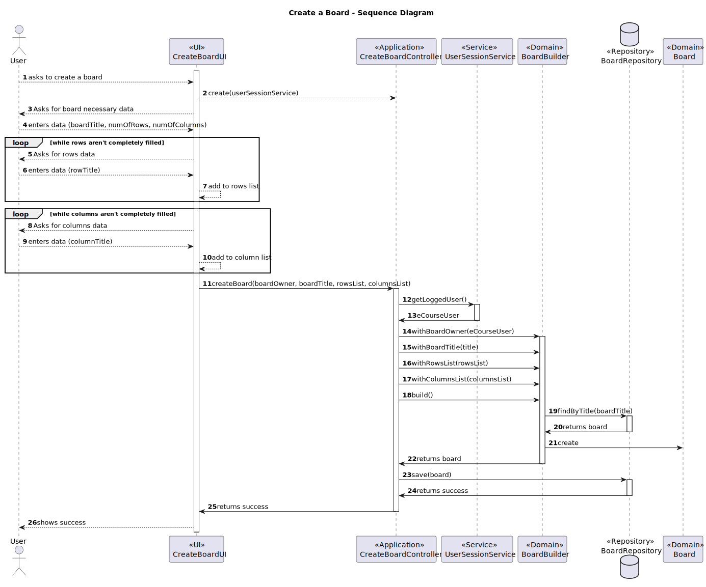

# US3002 - As User, I want to create a board.

## 1. Context
This US is being developed for the first time, since it was assigned in this sprint (sprint 2).
This requirement is placed in the context of creating a shared board.

A [board](../MainDocs/glossary.md) consists of a digital implementation of a post-it board, and it can be managed by Users.
It has a unique title, a number of rows, a number of columns, titles for both rows and columns, a permission and a state which can either be:

* **Active:** - *The board is active and can be used.*
* **Archived:** - *The board was archived and cannot be used.*

---

## 2. Requirements

In order to create a board, there must be a user logged in the system. The user must then provide the following information:

* **Title of the board**
* **Number of rows**
* **Number of columns**
* **Titles for the rows**
* **Titles for the columns**

Another important thing to notice is that for this specific problem there is an established limit of rows:

* Maximum of **20 rows**
* Maximum of **10 columns**

This limits must be set in a property file.

There must be a permission associated with the board users, which can be:

* **Write**
* **Read**
* **Owner**

---

## 3. Analysis

For this user story, a user will log in the system and then provide the needed information to create a board.

This information will be validated, and if valid, a board will be created.
As said before, the board title must be unique and because of that, a communication between the repository and the board title class is needed.
Since the board title is a value object, it wouldn't make such sense to have it communicating directly with the repository, so as a solution for that problem, a BoardBuilder must be created.
Besides communicating with the repository, this class will also have the responsibility of creating a board, when given the necessary information for its creation.
Another thing that's important to add is the fact that there will be a list of rows and a list of columns each saving the titles and numbers of both the rows and the columns. 
A cell will be a list containing an intersection of the numbers of the rows and columns when possible.

To give a brief understanding of the patterns that will be applied in this solution, the repositories and services needed will be injected in the controller, to follow the **Dependency Injection** pattern. Other patterns will be applied as you can understand in topic **4.3**.

---

## 4. Design

### 4.1. Class Diagram


---

### 4.2. Sequence Diagram

The following diagram represents the case of a successful creation of a board.

The creation can fail for the following reasons:

* **Invalid title:** *The title is null or empty.*
* **Invalid number of rows:** *The number of rows is greater than the predefined maximum or less than one.*
* **Invalid number of columns:** *The number of columns is greater than the predefined maximum or less than one.*
* **Invalid User:** *The user is null or is not registered in the system.*



**IMPORTANT THINGS TO CONSIDER IN THIS DIAGRAM:**

* It is important to understand that since this US is related to the creation of a board, the only relevant thing related to the permissions is the permission that is given to the User who creates it (**OWNER**).

* Another thing that is important to understand is the fact that the BoardCell mentioned in the **_Analysis_** is shown in this diagram in a way where, by receiving a list of the rows and the columns, the Builder itself creates the cells.

* Besides not being represented in the Sequence Diagram, the BoardLog concept will still exist as you can see in the Class Diagram above.


---

### 4.3. Applied Patterns

Some main patterns used in this functionality are:

* **Model-View-Controller:** *This pattern separates the application into three main components: model (data and business logic), view (user interface), and controller (mediates between the model and view).*
* **Single Responsibility Principle:** *Every class has only one responsibility.*
* **Information Expert:** *An example would be the BoardRepository being the boards information expert.*
* **Low Coupling:** *All the classes are loosely coupled, not depending on concrete classes, but interfaces instead.*
* **High Cohesion:** *All the classes have a high cohesion, since they have only one responsibility.*
* **Dependency Injection** *As a "solution" for instantiating the used repositories/services, these are injected as a parameter providing flexibility.*

### 4.4. Tests

* Most of the tests will be about checking if the information is valid or not and if the methods are making the correct returns.

* In this section the most important tests will be shown for a better understanding of what has been done when implementing this US.

* All tests are **Unit Tests**, applied for the domain implemented classes.

* The class BoardDataSource was created to provide data for the tests and it has the following implementation:

#### 4.4.1 BoardDataSource
```java
public class BoardDataSource {
    public static List<BoardRow> boardRowsTest(){
        BoardRow row1 = new BoardRow("Test Row", 1);
        BoardRow row2 = new BoardRow("Test Row", 1);
        BoardRow row3 = new BoardRow("Test Row", 1);

        List<BoardRow> boardRows = new ArrayList<>();

        boardRows.add(row1);
        boardRows.add(row2);
        boardRows.add(row3);

        return boardRows;
    }

    public static List<BoardColumn> boardColumnsTest(){
        BoardColumn colum1 = new BoardColumn("Test Row", 1);
        BoardColumn column2 = new BoardColumn("Test Row", 1);
        BoardColumn column3 = new BoardColumn("Test Row", 1);

        List<BoardColumn> columns = new ArrayList<>();

        columns.add(colum1);
        columns.add(column2);
        columns.add(column3);

        return columns;
    }

    public static Board boardTest(){
        String boardTitle = "Test Board";
        List<BoardRow> boardRows = BoardDataSource.boardRowsTest();
        List<BoardColumn> boardColumns = BoardDataSource.boardColumnsTest();
        BoardPermission permission = new BoardPermission(UserDataSource.getTestStudent1(), BoardPermissionType.OWNER);

        return new Board(permission, boardTitle, boardRows, boardColumns);
    }

    public static BoardPermission boardPermissionTest(){
        BoardPermissionType permissionType = BoardPermissionType.OWNER;
        ECourseUser user = UserDataSource.getTestStudent1();
        return new BoardPermission(user, permissionType);
    }

    public static BoardCell boardCellTest(){
        BoardRow row = new BoardRow("Test Row", 1);
        BoardColumn column = new BoardColumn("Test Column", 1);
        return new BoardCell(row, column);
    }

    public static BoardLogTimestamp boardLogTimestampTest(){
        return new BoardLogTimestamp(LocalDateTime.now());
    }

}
```

* Finally, the following are the most important tests for this US:

#### 4.4.2. BoardBuilderTest

```java
public class BoardBuilderTest {
    IBoardRepository boardRepo;

    @BeforeEach
    void setUp() {
        boardRepo = mock(IBoardRepository.class);
    }

    @Test
    public void ensureBoardBuilderReturnsCorrectBoard(){
        // Arrange
        BoardBuilder boardBuilder = new BoardBuilder(boardRepo);
        String boardTitle = "Test Board";
        List<BoardRow> boardRows = BoardDataSource.boardRowsTest();
        List<BoardColumn> boardColumns = BoardDataSource.boardColumnsTest();
        ECourseUser user = UserDataSource.getTestStudent1();

        // Act
        Board board = boardBuilder
                .withBoardOwner(user)
                .withBoardTitle(boardTitle)
                .withRows(boardRows)
                .withColumns(boardColumns)
                .build();

       String boardString = "BoardTitle: " + boardTitle + "Board Dimensions: " + boardRows.size() + " lines x  " + boardColumns.size() + " columns" + "Board State: " + "ACTIVE";

       // Assert
        assertEquals(board.toString(), boardString);
    }

    @Test
    public void ensureBoardBuilderThrowsExceptionWhenBoardTitleAlreadyExists() {
        // Arrange
        BoardBuilder boardBuilder = new BoardBuilder(boardRepo);
        String boardTitle = "Test Board";
        List<BoardRow> boardRows = BoardDataSource.boardRowsTest();
        List<BoardColumn> boardColumns = BoardDataSource.boardColumnsTest();
        ECourseUser user = UserDataSource.getTestStudent1();
        BoardPermission permission = new BoardPermission(user, BoardPermissionType.OWNER);
        Board board = new Board(permission, boardTitle, boardRows, boardColumns);

        when(boardRepo.findByTitle(boardTitle)).thenReturn(board);

        // Act
        // Assert
        assertThrows(IllegalArgumentException.class, () -> {
            boardBuilder
                    .withBoardOwner(user)
                    .withBoardTitle(boardTitle)
                    .withRows(boardRows)
                    .withColumns(boardColumns)
                    .build();
        });
    }
}
```

#### 4.4.3. BoardTest
```java
public class BoardTest {
    @Test
    public void ensureBoardIsCreatedWithValidInformation() {
        // Arrange
        String boardTitle = "Test Board";
        List<BoardRow> boardRows = BoardDataSource.boardRowsTest();
        List<BoardColumn> boardColumns = BoardDataSource.boardColumnsTest();
        Board board = BoardDataSource.boardTest();

        // Act
        String boardString = "BoardTitle: " + boardTitle + "Board Dimensions: " + boardRows.size() + " lines x  " + boardColumns.size() + " columns" + "Board State: " + "ACTIVE";

        // Assert
        assertEquals(board.toString(), boardString);
    }

    @Test
    public void ensureBoardIsNotCreatedWithEmptyBoardTitle() {
        // Arrange
        String boardTitle = "";
        List<BoardRow> boardRows = BoardDataSource.boardRowsTest();
        List<BoardColumn> boardColumns = BoardDataSource.boardColumnsTest();
        BoardPermission permission = new BoardPermission(UserDataSource.getTestStudent1(), BoardPermissionType.OWNER);

        // Assert
        assertThrows(IllegalArgumentException.class, () -> new Board(permission, boardTitle, boardRows, boardColumns));
    }

    @Test
    public void ensureBoardIsNotCreatedWithNullBoardTitle() {
        // Arrange
        String boardTitle = null;
        List<BoardRow> boardRows = BoardDataSource.boardRowsTest();
        List<BoardColumn> boardColumns = BoardDataSource.boardColumnsTest();
        BoardPermission permission = new BoardPermission(UserDataSource.getTestStudent1(), BoardPermissionType.OWNER);

        // Assert
        assertThrows(IllegalArgumentException.class, () -> new Board(permission, boardTitle, boardRows, boardColumns));
    }

    @Test
    public void ensureBoardIsNotCreatedWithEmptyBoardRows() {
        // Arrange
        String boardTitle = "Test Board";
        List<BoardRow> boardRows = new ArrayList<>();
        List<BoardColumn> boardColumns = BoardDataSource.boardColumnsTest();
        BoardPermission permission = new BoardPermission(UserDataSource.getTestStudent1(), BoardPermissionType.OWNER);

        // Assert
        assertThrows(IllegalArgumentException.class, () -> new Board(permission, boardTitle, boardRows, boardColumns));
    }

    @Test
    public void ensureBoardIsNotCreatedWithEmptyBoardColumns() {
        // Arrange
        String boardTitle = "Test Board";
        List<BoardRow> boardRows = BoardDataSource.boardRowsTest();
        List<BoardColumn> boardColumns = new ArrayList<>();
        BoardPermission permission = new BoardPermission(UserDataSource.getTestStudent1(), BoardPermissionType.OWNER);

        // Assert
        assertThrows(IllegalArgumentException.class, () -> new Board(permission, boardTitle, boardRows, boardColumns));
    }
}
```

#### 4.4.4. BoardPermissionTest
```java
    public class BoardPermissionTest {
    @Test
    public void ensureBoardPermissionIsNotCreatedWithNullUser() {
        // Arrange
        BoardPermissionType permissionType = BoardPermissionType.OWNER;

        // Assert
        assertThrows(IllegalArgumentException.class, () -> new BoardPermission(null, permissionType));
    }

    @Test
    public void ensureBoardPermissionIsCreatedWithValidInformation(){
        // Arrange
        BoardPermission permission = BoardDataSource.boardPermissionTest();

        // Act
        String permissionString = "Permission: " + "OWNER";

        // Assert
        assertEquals(permission.toString(), permissionString);
    }
}
```

#### 4.4.5. BoardLineTest
```java
public class BoardLineTest {

    @Test
    public void ensureValidBoardLineIsAccepted() {
        // Arrange
        String boardLineTitle = "Board Line Test Title";
        int boardLineNumber = 2;

        // Act
        BoardLine boardLine = new BoardLine(boardLineTitle, boardLineNumber);

        String boardLineString = boardLineTitle;

        // Assert
        assertEquals(boardLine.toString(), boardLineString);
    }

    @Test
    public void ensureNullBoardLineTitleIsRejected() {
        // Arrange
        String boardLineTitle = null;
        int boardLineNumber = 2;

        // Assert
        assertThrows(IllegalArgumentException.class, () -> new BoardLine(boardLineTitle, boardLineNumber));
    }

    @Test
    public void ensureInvalidBoardLineNumberIsRejected() {
        // Arrange
        String boardLineTitle = "Board Line Test Title";
        int boardLineNumber = -2;

        // Assert
        assertThrows(IllegalArgumentException.class, () -> new BoardLine(boardLineTitle, boardLineNumber));
    }

    @Test
    public void ensureBoardLineReturnsCorrectBoardLineNumber(){
        // Arrange
        String boardLineTitle = "Board Line Test Title";
        int boardLineNumber = 2;

        // Act
        BoardLine boardLine = new BoardLine(boardLineTitle, boardLineNumber);

        // Assert
        assertEquals(boardLine.boardLineNumber(), boardLineNumber);
    }
}
```
---
## 5. Demonstration

https://github.com/Departamento-de-Engenharia-Informatica/sem4pi-22-23-16-1/assets/107274763/cea1e618-062f-420a-8e7b-b81fb1e95e29

---

## 6. Implementation

* In this section, the main classes and methods will be shown, and if necessary, some comments will be written along with them.

#### 6.1. Board
```java
@Entity
public class Board implements AggregateRoot<Long> {

    @Id
    @GeneratedValue(strategy = GenerationType.IDENTITY)
    private Long id;

    @Embedded
    private BoardTitle boardTitle;

    @OneToMany(cascade = CascadeType.ALL)
    private List<BoardRow> rows;
    @OneToMany(cascade = CascadeType.ALL)
    private List<BoardColumn> columns;
    @OneToOne(cascade = CascadeType.ALL)
    private BoardPermission boardOwner;
    @ManyToMany(cascade = CascadeType.ALL)
    private List<BoardPermission> boardUsersPermissions;
    @Enumerated(EnumType.STRING)
    private BoardState boardState;
    @OneToMany(cascade = CascadeType.ALL, fetch = FetchType.LAZY)
    private List<BoardCell> boardCells;

    public Board(final BoardPermission boardOwner, final String boardTitle, final List<BoardRow> rows, final List<BoardColumn> columns) {
        this.boardOwner = boardOwner;
        this.boardUsersPermissions = new ArrayList<>();
        this.boardUsersPermissions.add(boardOwner);
        this.boardTitle = new BoardTitle(boardTitle);
        if(rows.isEmpty() || columns.isEmpty()){
            throw new IllegalArgumentException("Board rows or columns cannot be empty.");
        }
        this.rows = rows;
        this.columns = columns;
        this.boardState = BoardState.ACTIVE;
    }

    /* Checks if the board is active
     *
     * @return true if the board is active
     */
    public boolean isActive() {
        return this.boardState == BoardState.ACTIVE;
    }

    /* Returns the rows of the board
     *
     * @return the list of rows
     */
    public List<BoardRow> rows(){
        return this.rows;
    }

    /* Returns the columns of the board
     *
     * @return the list of columns
     */
    public List<BoardColumn> columns(){
        return this.columns;
    }

    @Override
    public boolean sameAs(Object other) {
        return false;
    }

    @Override
    public Long identity() {
        return this.id;
    }

    @Override
    public String toString() {
        return "BoardTitle: " + boardTitle + "Board Dimensions: " + rows.size() + " lines x  " + columns.size() + " columns" + "Board State: " + boardState;
    }

    @Override
    public boolean equals(Object o){
        if (this == o) return true;
        if (!(o instanceof Board)) return false;

        Board board = (Board) o;

        return boardTitle.equals(board.boardTitle);
    }

    /* Defines the cells of the board
     *
     * @return the list of cells
     * DISCLAIMER: This method will be used in the future regarding the implementation of the post-it features.
     */
    public List<BoardCell> defineCells(){
        for(BoardRow row : rows){
            for(BoardColumn column : columns){
                boardCells.add(new BoardCell(row, column));
            }
        }
        return boardCells;
    }

    protected Board() {
        // for ORM
    }
}
```

#### 6.2. BoardBuilder
```java
public class BoardBuilder {

    private final IBoardRepository boardRepository;

    private String boardTitle;
    private List<BoardColumn> columns;
    private List<BoardRow> rows;
    private BoardPermission boardOwner;

    public BoardBuilder(IBoardRepository boardRepository) {
        if(boardRepository == null) {
            throw new IllegalArgumentException("A Board Repository is required.");
        }
        this.boardRepository = boardRepository;
    }

    public BoardBuilder withBoardOwner(ECourseUser eCourseUser){
        this.boardOwner = new BoardPermission(eCourseUser, BoardPermissionType.OWNER);
        return this;
    }

    public BoardBuilder withBoardTitle(String boardTitle) {
        this.boardTitle = boardTitle;
        return this;
    }

    public BoardBuilder withColumns(List<BoardColumn> columns) {
        this.columns = columns;
        return this;
    }

    public BoardBuilder withRows(List<BoardRow> rows) {
        this.rows = rows;
        return this;
    }

    public Board build() {
        //Since the title is unique, this verification is required
        if(boardRepository.findByTitle(boardTitle) != null) {
            throw new IllegalArgumentException("Board with the introduced title already exists.");
        }

        if(boardOwner == null) {
            throw new IllegalArgumentException("A Board owner is required.");
        }

        if(columns == null || columns.isEmpty()) {
            throw new IllegalArgumentException("More than one board columns are required.");
        }

        if(rows == null || rows.isEmpty()) {
            throw new IllegalArgumentException("More than one board rows are required.");
        }

        return new Board(boardOwner,boardTitle, rows, columns);
    }
}
```

#### 6.3. BoardLine
```java
@Entity
@Inheritance(strategy = InheritanceType.TABLE_PER_CLASS) // Used to separate the subclasses in different tables
public class BoardLine{
    @Id
    @GeneratedValue(strategy = GenerationType.AUTO) // The AUTO is used instead of the IDENTITY to allow the use of the TABLE_PER_CLASS inheritance
    private Long id;

    @Column
    private String boardLineTitle;
    @Column
    private int boardLineNumber;

    protected BoardLine(final String boardLineTitle, final int boardLineNumber) {
        if (boardLineTitle == null) {
            throw new IllegalArgumentException("Board Line Title can't have a null value");
        }
        if(boardLineNumber < 0){
            throw new IllegalArgumentException("Board Line Number shouldn't be negative");
        }
        this.boardLineTitle = boardLineTitle;
        this.boardLineNumber = boardLineNumber;
    }

    protected BoardLine() {
        // for ORM
    }

    public int boardLineNumber(){
        return this.boardLineNumber;
    }

    /**
     * @return the boardLineTitle as String
     */
    @Override
    public String toString() {
        return this.boardLineTitle;
    }
}
```
* This class has two subclasses: BoardRow and BoardColumn because of the inheritance existing between them.

#### 6.4. BoardPermission
```java
@Entity
public class BoardPermission{
    @Id
    @GeneratedValue(strategy = GenerationType.IDENTITY)
    private Long id;

    @OneToOne(fetch = FetchType.EAGER)
    private ECourseUser eCourseUser;

    @Enumerated(EnumType.STRING)
    private BoardPermissionType boardPermissionType;

    public BoardPermission(final ECourseUser eCourseUser, final BoardPermissionType boardPermission) {
        if(eCourseUser == null) {
            throw new IllegalArgumentException("eCourseUser cannot be null.");
        }
        this.eCourseUser = eCourseUser;
        this.boardPermissionType = boardPermission;
    }

    public BoardPermission(){
        // for ORM
    }

    @Override
    public String toString() {
        return "Permission: " + this.boardPermissionType.toString();
    }
}
```

#### 6.5. BoardTitle
```java
@Embeddable
public class BoardTitle implements Comparable<BoardTitle> {

    @Column(unique = true)
    private String boardTitle;

    protected BoardTitle(final String boardTitle) {
        if (StringPredicates.isNullOrEmpty(boardTitle)) {
            throw new IllegalArgumentException(
                    "Board Title should neither be null nor empty");
        }

        this.boardTitle = boardTitle;
    }

    protected BoardTitle() {
        // for ORM
    }

    /* Returns the board title
     *
     * @return the board title
     */
    public static BoardTitle valueOf(String boardTitle) {
        return new BoardTitle(boardTitle);
    }

    /* Returns the board title
     *
     * @return the board title
     */
    @Override
    public String toString() {
        return this.boardTitle;
    }

    /* Compares two board titles
     *
     * @param o the board title to compare
     * @return the comparison result
     */
    @Override
    public int compareTo(BoardTitle o) {
        return boardTitle.compareTo(o.boardTitle);
    }

    /*
     * @param o the board title to compare
     *
     * @return the comparison result
     */
    @Override
    public boolean equals(Object o) {
        if (this == o) return true;
        if (!(o instanceof BoardTitle)) return false;

        BoardTitle that = (BoardTitle) o;

        return boardTitle.equals(that.boardTitle);
    }
}
```

#### 6.6. Repositories 

##### 6.6.1 IBoardRepository

```java
public interface IBoardRepository  extends DomainRepository<Long, Board> {
    public Board findByTitle(String title);
}
```

##### 6.6.2 JpaBoardRepository

```java
public class JpaBoardRepository extends eCourseJpaRepositoryBase<Board, Long, Long> implements IBoardRepository{
    public JpaBoardRepository() {
        super("id");
    }

    @Override
    public Board findByTitle(String title) {
        final TypedQuery<Board> query = entityManager().createQuery(
                "SELECT c FROM Board c WHERE c.boardTitle.boardTitle = :title", Board.class);
        query.setParameter("title", title);

        try {
            return query.getSingleResult();
        } catch (Exception e) {
            return null;
        }
    }
}
```

#### 6.7. CreateBoardController

```java
public class CreateBoardController {
    private final IBoardRepository boardRepository;
    private final UserSessionService userSessionService;
    private  ECourseUser boardOwner;

    public CreateBoardController(IBoardRepository boardRepository, UserSessionService userSessionService) {
        Preconditions.nonNull(boardRepository);
        this.boardRepository = boardRepository;
        if (userSessionService.getLoggedUser().isEmpty())
            throw new IllegalStateException("eCourse User must be registered.");
        this.userSessionService = userSessionService;
    }

    public ECourseUser verifyUser() {
        Optional<ECourseUser> eCourseUserOptional = userSessionService.getLoggedUser();
        eCourseUserOptional.ifPresentOrElse(eCourseUser -> this.boardOwner = eCourseUser, () -> {
            throw new IllegalStateException("eCourse User must be registered.");
        });
        return this.boardOwner;
    }

    /*
     * Creates a new board and saves it to the database
     *
     * @param boardTitle - Board's Title
     * @param rows - Board's Rows
     * @param columns - Board's Columns
     */
    public Board createBoard(String boardTitle, List<BoardRow> rows, List<BoardColumn> columns) {
        Board board = new BoardBuilder(boardRepository)
                .withBoardOwner(verifyUser())
                .withBoardTitle(boardTitle)
                .withRows(rows)
                .withColumns(columns)
                .build();
        return boardRepository.save(board);
    }
}

```

#### 6.8. CreateBoardUI

```java
public class CreateBoardUI extends AbstractUI{

    private final CreateBoardController createBoardController =
            new CreateBoardController(PersistenceContext.repositories().boards(),
                    new UserSessionService(PersistenceContext.repositories().eCourseUsers()));


    private final Integer MAX_NUM_OF_ROWS = Application.settings().getMaxNumberOfRows();

    private final Integer MAX_NUM_OF_COLUMNS = Application.settings().getMaxNumberOfColumns();

    @Override
    protected  boolean doShow(){
        System.out.println("Please provide the board title\n");

        String boardTitle = Console.readLine("Board Title: ");
        if(boardTitle == null || boardTitle.isEmpty()){
            infoMessage("A board title is needed.");
            Sleeper.sleep(1000);
            return false;
        }
        System.out.println();


        int numberOfRows = Console.readPositiveInteger("Number of Rows: ");
        while(numberOfRows > MAX_NUM_OF_ROWS){
            infoMessage("The number of rows must be less than the max value defined in the properties file.\n");
            numberOfRows = Console.readInteger("Number of Rows: ");
        }
        System.out.println();

        int numberOfColumns = Console.readPositiveInteger("Number of Columns: ");
        while(numberOfColumns > MAX_NUM_OF_COLUMNS){
            infoMessage("The number of columns must be less than the max value defined in the properties file.\n");
            numberOfColumns = Console.readPositiveInteger("Number of Columns: ");
        }
        System.out.println();

        Sleeper.sleep(100);

        List<BoardRow> rows = fillRows(numberOfRows);

        Sleeper.sleep(100);

        List<BoardColumn> columns = fillColumns(numberOfColumns);

        try {
            createBoardController.createBoard(boardTitle, rows, columns);
        } catch (IllegalArgumentException e) {
            errorMessage(e.getMessage());
            Sleeper.sleep(1000);
            return false;
        }

        System.out.println("Board created successfully!\n");
        System.out.println();
        System.out.println("The Board Configuration is:\n");

        System.out.print("    ");
        for(BoardColumn column : columns){
            System.out.print(column.toString() + " ");
        }
        System.out.println();
        for(BoardRow row : rows){
            System.out.print(row.toString() + " ");
            for(int i = 0; i < columns.size(); i++){
                System.out.print("  -  ");
            }
            System.out.println();
        }

        System.out.println();

        Sleeper.sleep(1000);

        return false;
    }

    @Override
    public String headline(){
        return "Create Board";
    }

    public List<BoardRow> fillRows(int numOfRows){
         List<BoardRow> rows = new ArrayList<>();
       for(int i = 0; i < numOfRows; i++){
           System.out.printf("Please provide the row %d title\n", i+1);
           String rowTitle = Console.readLine("Row Title: ");
           System.out.println();

           BoardRow row = new BoardRow(rowTitle, i+1);
           rows.add(row);
       }
         return rows;
    }

    public List<BoardColumn> fillColumns(int numOfColumns){
        List<BoardColumn> columns = new ArrayList<>();
        for(int i = 0; i < numOfColumns; i++){
            System.out.printf("Please provide the column %d title\n", i+1);
            String columnTitle = Console.readLine("Column Title: ");
            System.out.println();

            BoardColumn column = new BoardColumn(columnTitle, i+1);
            columns.add(column);
        }
        return columns;
    }
}
```

* This class is responsible for receiving the user input and contribute for an agile creation of the board (i.e. the verifications made in the input to avoid treating wrong or invalid information).

---
