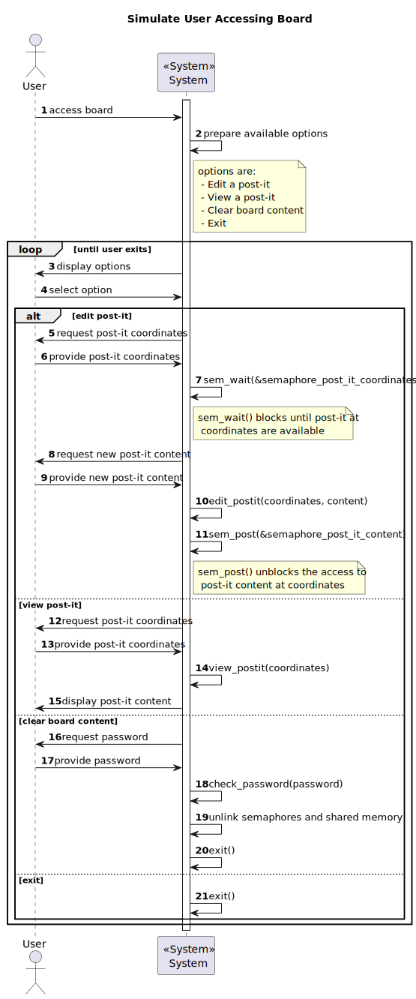

# US3003 — As Project Manager, I want the team to "explore" the synchronization problems related to the synchronization of shared boards.

## 1. Context

The project manager wants the team to explore the synchronization problems related to the synchronization of shared
boards.
Mainly due to the fact that multiple users can be editing the same board at the same time.
More precisely, altering the content of the same post-it simultaneously.

---

## 2. Requirements

It is required that the following use case is implemented:

* **UC3003.1** As Project Manager, I want the team to "explore" the synchronization problems related to the synchronization of shared boards.

### Client Clarifications

#### System Specifications Document

- NFR11 - Explore Shared Board Synchronization This functional part of the system
has very specific technical requirements, particularly some concerns about synchronization problems. 
In fact, several clients will try to concurrently update boards. As
such, to explore and study this concurrency scenario, a "model" of a solution must be implemented and evaluated 
exceptionally using the C programming language, and using
processes and semaphores. Specific requirements will be provided in SCOMP.

---

## 3. Analysis

To solve this user story, it was decided to use the reader-writer problem, since it is a classic synchronization
problem, and it is also a good fit for this use case.

The reader-writer problem is a classic synchronization problem that consists in having a data structure that is
accessed by multiple processes, where some of them only read the data, and others write to it.

In our context, the data structure is the shared board, and the processes are the users.
Each board supports multiple post-its, and each one has a specific content.
So to ensure that the data structure is not corrupted, we need to ensure that only one user can write to it at a time,
and that multiple users can read from it at the same time.

To do so, we used a mutex semaphore for each post-it.

To simulate the permissions on the board, only the user that has the board password can decide to clear it's content.

---

## 4. Design

### 4.1. Sequence Diagram

---

## 5. Demonstration

**To Do.**

---

## 6. Implementation

**To Do.**