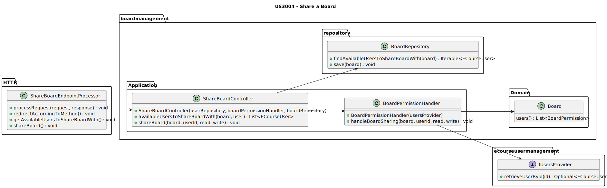
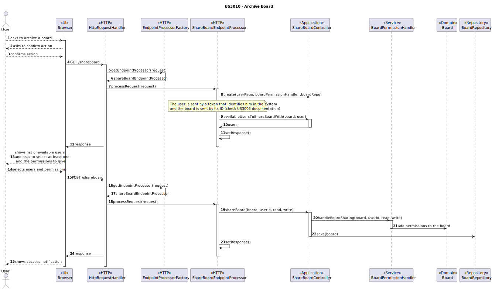

# US3004 — As User, I want to share a board

## 1. Context

This US is being developed for the first time, since it was assigned in this sprint (sprint C).
This requirement is placed in the context of sharing a [board](../MainDocs/glossary.md).

---

## 2. Requirements

The user must be registered in the system, have at least one board that's not archived.

#### System Specifications Document

* FRB02 - Share Board A user shares a board it owns with other users

---

## 3. Analysis

To share a board, there are pre-conditions that need to be met:

* The User must be logged in.
* The User must be the owner of at least one board that's not archived.
* There must exist at least one other user in the system that's not on the board.

Meeting all the preconditions, the User then must:

1 - Get inside the board they want to archive.

2 - Click on the button to share a board.

3 - Then, the system will show the user a list of all available users to give permission to.

4 - The User will then select the user/users they want to share the board with, and the permission those users will have
on the board (can either be write or read being this last one set by default if nothing is selected).

5 - A permission (or more depending on the user's will) will then be created giving the invited users access to the
board.

---

## 4. Design

### 4.1. Class Diagram



### 4.2. Sequence Diagrams



**IMPORTANT**

* It is important to consult the [US3005 readme file](../US3005_ViewBoardUpdates/readme.md) to understand how things are
  handled in the http subject.
* This means that the browser does not have direct access to the EndpointProcessor, it has a server handling it.

### 4.3. Applied Patterns

Some main patterns used in this user story as a whole are:

* **Controller:** *The controller is responsible for handling the user input, and orchestrating (controlling) the use
  cases.*

* **Single Responsibility Principle + High Cohesion:** *Every class has only one responsibility, which leads to higher
  cohesion.*

* **Dependency Injection:** *Instead of instantiating the repositories or services that will be used inside the classes,
  they are received by parameter.*

* **Information Expert:** *The BoardRepository is the IE of the boards.*

### 4.4. Tests

* The main test to be done is to check if the board actually gets shared with the users that were selected.

```java
public class BoardTest {
@Test
void ensureBoardIsShared(){
// Arrange
Board board = BoardDataSource.boardTest();
ECourseUser user = UserDataSource.getTestStudent2();
ECourseUser user2 = UserDataSource.getTestTeacher1();
BoardPermission permission = new BoardPermission(user, BoardPermissionType.WRITE);
BoardPermission permission2 = new BoardPermission(user, BoardPermissionType.READ);
BoardPermission permission3 = new BoardPermission(user2, BoardPermissionType.READ);
List<BoardPermission> expectedPermissions = new ArrayList<>();
expectedPermissions.add(new BoardPermission(UserDataSource.getTestStudent1(), BoardPermissionType.OWNER));
expectedPermissions.add(permission);
expectedPermissions.add(permission2);
expectedPermissions.add(permission3);

        // Act
        board.users().add(permission);
        board.users().add(permission2);
        board.users().add(permission3);

        // Assert
        assertEquals(expectedPermissions.toString(), board.users().toString());

}
}

```

---

## 5. Demonstration

#### 5.1 Demonstration Video of a Success Sharing of a Board

https://github.com/Departamento-de-Engenharia-Informatica/sem4pi-22-23-16-1/assets/107274763/1f373c2d-8d40-462f-a381-d91bb4593c6d

---

## 6. Implementation

#### 6.1 ShareBoardController
```java
public class ShareBoardController {
    private final IeCourseUserRepository userRepository;
    private final BoardPermissionHandler boardPermissionHandler;
    private final IBoardRepository boardRepository;

    public ShareBoardController(IeCourseUserRepository userRepository, BoardPermissionHandler boardPermissionHandler, IBoardRepository boardRepository) {
        if (userRepository == null)
            throw new IllegalArgumentException("User Repository cannot be null.");

        this.userRepository = userRepository;

        if (boardPermissionHandler == null)
            throw new IllegalArgumentException("Board Permission Handler cannot be null.");

        this.boardPermissionHandler = boardPermissionHandler;

        if (boardRepository == null)
            throw new IllegalArgumentException("Board Repository cannot be null.");

        this.boardRepository = boardRepository;
    }

    /**
     * Returns all users that are available to share a board with.
     *
     * @param board - the board
     * @return the list of users that are available to share a board with.
     */
    public List<ECourseUser> availableUsersToShareBoardWith(Board board, ECourseUser user) {
        if (!board.isBoardOwner(user)) {
            throw new IllegalArgumentException("User is not the owner of the board.");
        }
        return (List<ECourseUser>) userRepository.findAvailableUsersToShareBoardWith(board);
    }

    /**
     * Shares a board with a user.
     *
     * @param board - the board
     * @param userId  - the user
     * @param read  - whether the user can read the board
     * @param write - whether the user can write to the board
     */
    public void shareBoard(Board board, Long userId, boolean read, boolean write) {
        boardPermissionHandler.handleBoardSharing(board, userId, read, write);
        boardRepository.save(board);
    }
}
```

#### 6.2 BoardPermissionHandler
```java
public class BoardPermissionHandler {
    private final IUsersProvider usersProvider;
    public BoardPermissionHandler(IUsersProvider usersProvider) {
        if (usersProvider == null) {
            throw new IllegalArgumentException("The usersProvider cannot be null.");
        }
        this.usersProvider = usersProvider;
    }

    public void handleBoardSharing(Board board, Long userId, boolean read, boolean write) {
        usersProvider.retrieveUserById(userId).ifPresent(user -> {

            if (write) {
                board.users().add(new BoardPermission(user, BoardPermissionType.WRITE));
            }

            if (read) {
                board.users().add(new BoardPermission(user, BoardPermissionType.READ));
            }

        });
    }
}
```

#### 6.3 ShareBoardEndpointProcessor
```java
public class ShareBoardEndpointProcessor implements EndpointProcessor {

    private final RequestUserProvider requestUserProvider = new RequestUserProvider();
    private final ShareBoardController shareBoardController =
            new ShareBoardController(PersistenceContext.repositories().eCourseUsers(),
                    new BoardPermissionHandler(new UsersProvider(PersistenceContext.repositories().eCourseUsers())),
                    PersistenceContext.repositories().boards());
    private final BoardsProvider boardsProvider = new BoardsProvider(PersistenceContext.repositories().boards());
    private HTTPmessage request;
    private HTTPmessage response;
    private static final int SPECIFIC_BOARD_URI_LENGTH = 3;

    public void processRequest(HTTPmessage request, HTTPmessage response) {
        this.request = request;
        this.response = response;

        redirectAccordingToMethod();
    }

    private void redirectAccordingToMethod() {
        switch (request.getMethod()) {
            case "GET":
                getAvailableUsersToShareBoardWith();
                break;
            case "POST":
                shareBoard();
                break;
            default:
                response.setResponseStatus("404 Not Found");
                response.setContentFromString("Endpoint not found", "text");
                break;
        }
    }

    private void getAvailableUsersToShareBoardWith() {
        Optional<ECourseUser> user = requestUserProvider.getUserFromRequest(request);
        if (user.isPresent()) {
            String[] uriFields = request.getURI().split("/");
            // Get all users that are available to share a board with
            if (uriFields.length == SPECIFIC_BOARD_URI_LENGTH) {
                Optional<Board> board = boardsProvider.retrieveBoardById(Long.parseLong(uriFields[2]));
                if (board.isPresent()) {
                    if (board.get().isBoardOwner(user.get())) {
                        List<ECourseUser> availableUsers = shareBoardController.availableUsersToShareBoardWith(board.get(), user.get());
                        Gson gson = new GsonBuilder()
                                .registerTypeAdapter(LocalDate.class, new LocalDateAdapter())
                                .registerTypeAdapter(LocalDateTime.class, new LocalDateTimeAdapter())
                                .setPrettyPrinting()
                                .create();
                        String availableUsersJson = gson.toJson(availableUsers);
                        response.setResponseStatus("200 OK");
                        response.setContentFromString(availableUsersJson, "application/json");
                    } else {
                        response.setResponseStatus("403 Forbidden");
                        response.setContentFromString("The user is not the owner of this board", "text");
                    }
                } else {
                    response.setResponseStatus("404 Not Found");
                    response.setContentFromString("Board not found", "text");
                }
            } else {
                response.setResponseStatus("404 Not Found");
                response.setContentFromString("Endpoint not found", "text");
            }
        } else {
            response.setResponseStatus("401 Unauthorized");
            response.setContentFromString("Unauthorized", "text");
        }
    }

    private void shareBoard() {
        // Get the request content
        String requestContent = request.getContentAsString();

        // Transform the json into a java object
        Gson gson = new Gson();
        ShareBoardRequest shareBoardRequest = gson.fromJson(requestContent, ShareBoardRequest.class);

        Optional<ECourseUser> sessionUser = requestUserProvider.getUserFromRequest(request);
        if (sessionUser.isPresent()) {
            Optional<Board> board = boardsProvider.retrieveBoardById(Long.parseLong(shareBoardRequest.boardId));
            if (board.isPresent()) {
                for (ShareBoardRequest.User user : shareBoardRequest.users) {
                    shareBoardController.shareBoard(board.get(), Long.parseLong(user.userId), user.read, user.write);
                }
                response.setResponseStatus("200 OK");
                response.setContentFromString("Board shared", "text");
            } else {
                response.setResponseStatus("404 Not Found");
                response.setContentFromString("Board not found", "text");
            }
        } else {
            response.setResponseStatus("401 Unauthorized");
            response.setContentFromString("Unauthorized", "text");
        }
    }
}
```

#### 6.4 UsersProvider
```java
public class UsersProvider implements IUsersProvider{
    private final IeCourseUserRepository userRepository;
    public UsersProvider(IeCourseUserRepository userRepository) {
        if (userRepository == null) {
            throw new IllegalArgumentException("The userRepository cannot be null.");
        }
        this.userRepository = userRepository;
    }

    @Override
    public Optional<ECourseUser> retrieveUserById(Long id) {
        return userRepository.ofIdentity(id);
    }
}
```
---
