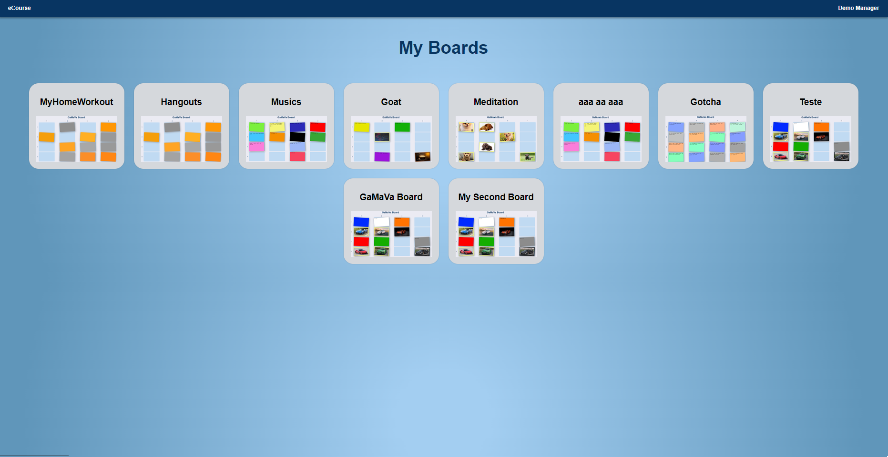
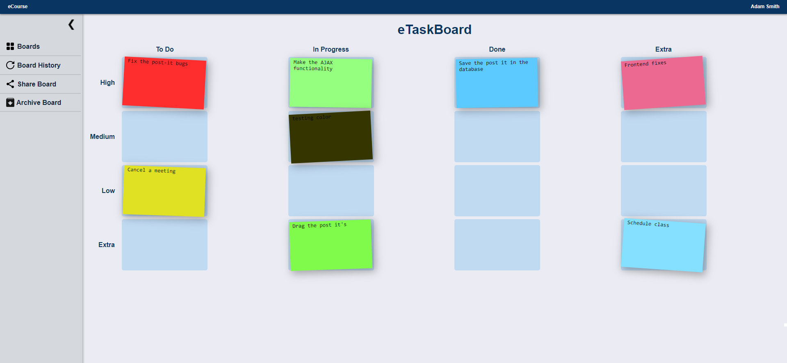
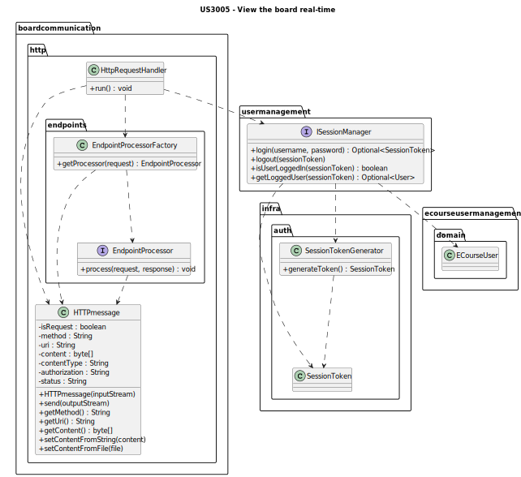
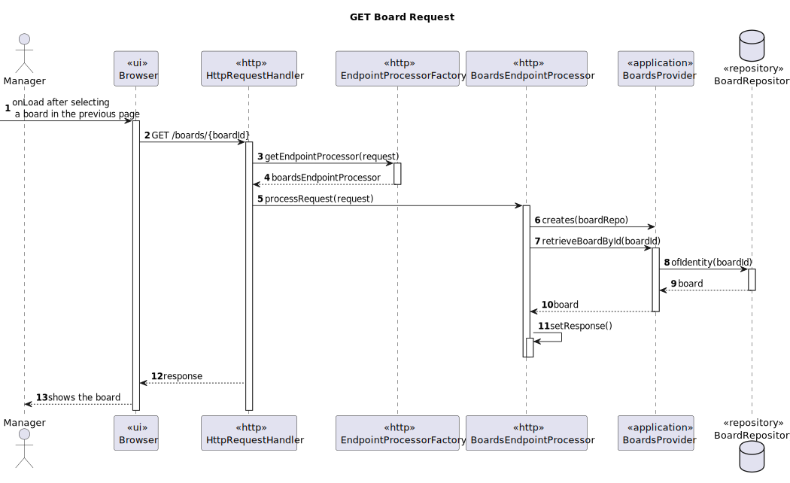

# US3005 —  As a User, I want to view, in real-time, the updates in the shared boards

## 1. Context

The eCourse solution has 4 different applications, the Manager App, the Teacher App, the Student App and the 
Shared Board App.

This US is related to the Shared Board App. The goal is to make it possible for a user to view a board and its updates,
in real-time, with no need for refreshing the page.

## 2. Requirements

It is required that:

- The necessary concerns about synchronization are taken;
- An HTTP server to handle requests is implemented;
- Updates are automatic, with no need for a User to refresh, using AJAX.

### Client Clarifications

#### System Specifications Document

- The system should display, in "real-time", the shared boards available to the user in an HTML page.
- Every user can execute this functionality.


## 3. Analysis/Breakdown
    
Since this User Story requires the user to use the browser, it was decided that the login functionality and the selection
of the board that the user wants to see is also done using the browser.

For that, several screens are needed:
- Login page:

- My Boards page:

- Board page:  



### HTTP Server and Routing

The design and implementation details will be further explored in the next topic ("4. Design"), but it is still important
to address the fact that the HTTP server and the routing of endpoints used to successfully implement the API to the
Shared Board App was made "by hand", in a real world example the use of a framework, like Spring Boot, could be 
very helpful, but since this is a rather small utilization and just a basic approach to the topic the integration with
a framework was not contemplated.

The logic followed as the one used in the example provided by RCOMP, with some improvements.

### Multiple Sessions

Until now, there was no necessity of having multiple users logged into the system at the same time.
For that reason, the authentication provided by the EAPLI framework was enough.  
The problem of using the framework in this case is that it only keeps track of one logged user, 
so a new solution is needed.

There are multiple approaches that can be taken, but the one chosen was to make use of cookies
from the browsers. With that and a system that allows us to identify a user using a token, we can
easily perform the login and send a token to the browser, the browser stores it in its cookies and
in every request, the token is sent as a authorization header to assure the user is valid.

For this a SessionManager was implemented.

### Synchronization

To ensure synchronization between the processes and requests was assured, methods that access
critical points where synchronization is needed are marked as synchronized, that and the use of the 
policy 1 Request - 1 Thread allows us to confidently say that the necessary synchronization measures
are assured.

### AJAX

To assure that the board is updated in real-time, AJAX was used.
Each request to the server is made using AJAX, having always a response from the server, even if it is
just a simple "OK" response.

The requests are sent using JavaScript, and the responses are handled by the Java server, which has the connection
to the database and can return the necessary information.

One of the techniques used to assure that the board is updated in real-time is to make a request to the server
every X seconds, to check if there are any updates to the board. If there are, the board is updated.
The same goes for the "My Boards" page, where the user can see the boards he has access to and if there are
any updates to them, i.e. if a new board is shared with the user, or if a board is archived the options are updated.

## 4. Design

### 4.1. Class Diagram

To avoid redundancy, only the main classes will be provided.

Main classes created:

- **SessionManager:** *Single instance class to ensure multiple users can be logged into the system at the same time.*
- **SessionToken** *Class that represents a Token used for each user session.*
- **SessionTokenGenerator** *Class responsible to randomly generate a Session Token.* 
- **HTTPMessage:** *Class that represents an HTTP Message using to communicate between the browser and the server.*
- **HttpRequestHandler** *Class responsible for handling 1 HTTP request. Implements the Runnable interface, so that
it is executed as a new Thread every time.*
- **EndpointProcessor** *Interface used by every endpoint processor. An endpoint processor was the way
we achieved some class separation to handle the requests according to the endpoint being called. Every
endpoint has a processor associated with it.*
- **EndpointProcessorFactory** *Class responsible for returning the correct endpoint processor, according
to the endpoint being called.*
- **SessionsEndpointProcessor** *Example of the implementation of an endpoint processor.*



### 4.2. Sequence Diagram

#### GET Board Request



***DISCLAIMER:***  
Much more requests are processed to actually have the board page set up, but since they all follow the
same logic and process, only the main request was represented by a SD.


### 4.3. Applied Patterns

Some main patterns used in this user story as a whole are:

* **Pure Fabrication:** *SessionToken and its generator are examples of classes that are purely fabricated.*
* **Client Server:** *The communication with the board is made using a client-server architecture, where we have a browser
acting as a client, and we have a server that handles all the requests.*


### 4.4. Tests

- Make a change in a board with another user and check if the change is actually applied into our board.

## 5. Implementation

Here is a list of the main classes and their responsibilities:

- **SessionManager:** *Single instance class to ensure multiple users can be logged into the system at the same time.*

````java
public class SessionManager implements ISessionManager {
    private final CredentialHandler handler = new AuthenticationCredentialHandler();
    private final UserSessionService userSessionService =
            new UserSessionService(PersistenceContext.repositories().eCourseUsers());

    // Ensure that only one instance of SessionManager exists
    private static SessionManager instance = null;

    private SessionManager() {
    }

    private final Map<SessionToken, ECourseUser> loggedInUsers = new HashMap<>();

    public static SessionManager getInstance() {
        if (instance == null) {
            instance = new SessionManager();
        }
        return instance;
    }

    private final Object loginLock = new Object();

    @Override
    public Optional<SessionToken> login(String username, String password) {
        ECourseUser user;
        synchronized (loginLock) {
            if (!handler.authenticated(username, password, ECourseRoles.MANAGER, ECourseRoles.TEACHER, ECourseRoles.STUDENT)) {
                return Optional.empty();
            }
            // Get the logged user
            user = userSessionService.getLoggedUser().isPresent() ? userSessionService.getLoggedUser().get() : null;
        }

        if (user == null) {
            return Optional.empty();
        }
        // Generate a token for the user
        SessionToken token = SessionTokenGenerator.generateToken();
        while (loggedInUsers.containsKey(token)) {
            // Generate a new token if the token already exists
            token = SessionTokenGenerator.generateToken();
        }
        loggedInUsers.put(token, user);

        return Optional.of(token);
    }

    @Override
    public void logout(SessionToken token) {
        loggedInUsers.remove(token);
    }

    @Override
    public boolean isUserLoggedIn(SessionToken token) {
        return loggedInUsers.containsKey(token);
    }

    @Override
    public Optional<ECourseUser> getLoggedInUser(SessionToken token) {
        return Optional.ofNullable(loggedInUsers.get(token));
    }
}
````

- **SessionToken** *Class that represents a Token used for each user session.*

````java
public class SessionToken {
    private final String token;
    private static final int TOKEN_LENGTH = 15;

    /**
     * Instantiates a new Session token.
     *
     * @param token the token
     */
    public SessionToken(String token) {
        // Rule 1: Token length must be 15 characters long
        if (token.length() != TOKEN_LENGTH) {
            throw new IllegalArgumentException("Token must be 15 characters long");
        }

        // Rule 2: Token must start with "st_"
        if (!token.startsWith("st_")) {
            throw new IllegalArgumentException("Token must start with \"st_\"");
        }

        this.token = token;
    }

    @Override
    public String toString() {
        return token;
    }

    @Override
    public boolean equals(Object o) {
        if (this == o) return true;
        if (o == null || getClass() != o.getClass()) return false;
        SessionToken that = (SessionToken) o;
        return Objects.equals(token, that.token);
    }

    @Override
    public int hashCode() {
        return Objects.hash(token);
    }
}
````

- **SessionTokenGenerator** *Class responsible to randomly generate a Session Token.* 

````java
public class SessionTokenGenerator {

    private static final String PREFIX = "st_";
    private static final int TOKEN_LENGTH = 15;

    /**
     * Generates a random session token
     *
     * @return a random session token
     */
    public static SessionToken generateToken() {
        StringBuilder tokenBuilder = new StringBuilder(PREFIX);
        Random random = new Random();

        final int leftChars = TOKEN_LENGTH - PREFIX.length();

        // Generate random characters
        for (int i = 0; i < leftChars; i++) {
            int randomInt = random.nextInt(26);
            char randomChar = (char) ('a' + randomInt);
            tokenBuilder.append(randomChar);
        }

        return new SessionToken(tokenBuilder.toString());
    }
}
````

- **HTTPMessage:** *Class that represents an HTTP Message using to communicate between the browser and the server.*

````java
public class HTTPmessage {

    private static final int CR = 13;
    private static final int LF = 10;
    private static final String VERSION = "HTTP/1.1";
    private static final String CONTENT_TYPE = "Content-type:";
    private static final String CONTENT_LENGTH = "Content-length:";
    private static final String CONNECTION = "Connection:";
    private static final String AUTHORIZATION = "Authorization:";

    private static final String[][] knownFileExt = {
            {".pdf", "application/pdf"},
            {".js", "application/javascript"},
            {".txt", "text/plain"},
            {".gif", "image/gif"},
            {".png", "image/png"},
            {".css", "text/css"}
    };


    static private String readHeaderLine(DataInputStream in) throws IOException {
        String ret = "";
        int val;
        do {
            val = in.read();
            if (val == -1) throw new IOException();
            if (val != CR) ret = ret + (char) val;
        }
        while (val != CR);
        val = in.read(); // read LF
        if (val == -1) throw new IOException();
        return ret;
    }

    static private void writeHeaderLine(DataOutputStream out, String line) throws IOException {
        out.write(line.getBytes(), 0, line.length());
        out.write(CR);
        out.write(LF);
    }


    //// NON-STATIC (INSTANCE) ELEMENTS

    private boolean isRequest;
    private String method;
    private String uri;
    private String status;

    private String contentType;
    private byte[] content;
    private String authorization;

    /**
     * Creates a new http.HTTPmessage by receiving it from an DataInputStream
     *
     * @param input
     * @throws IOException
     */
    public HTTPmessage(DataInputStream input) throws IOException {
        String firstLine = readHeaderLine(input);
        isRequest = !firstLine.startsWith("HTTP/");
        method = null;
        uri = null;
        content = null;
        status = null;
        contentType = null;

        // Split the firstLine line
        String[] firstLineFields = firstLine.split(" ");

        // Check if the first line is valid
        if (isRequest) {
            method = firstLineFields[0];
            uri = firstLineFields[1];
        } else {  // response
            status = firstLineFields[1] + " " + firstLineFields[2];
        }

        String headerLine;

        do {
            headerLine = readHeaderLine(input);

            // Check if the header line has the Authorization field
            if (headerLine.toUpperCase().startsWith(AUTHORIZATION.toUpperCase())) {
                authorization = headerLine.substring(AUTHORIZATION.length()).trim();
            }

            if (headerLine.toUpperCase().startsWith(CONTENT_TYPE.toUpperCase())) {
                contentType = headerLine.substring(CONTENT_TYPE.length()).trim();
            } else if (headerLine.toUpperCase().startsWith(CONTENT_LENGTH.toUpperCase())) {
                String cLen = headerLine.substring(CONTENT_LENGTH.length()).trim();
                int len;
                try {
                    len = Integer.parseInt(cLen);
                } catch (NumberFormatException ne) {
                    throw new IOException();
                }
                content = new byte[len];
            }
        }
        while (!headerLine.isEmpty());

        // READ CONTENT
        if (content != null) input.readFully(content, 0, content.length);
    }

    public HTTPmessage() {
        isRequest = true;
        method = null;
        uri = null;
        content = null;
        status = null;
        contentType = null;
    }


    public void setResponseStatus(String sT) {
        isRequest = false;
        status = sT;
    }

    public void setContent(String cnt, String cType) {
        content = cnt.getBytes();
        contentType = cType;
    }

    public void setRequestMethod(String m) {
        isRequest = true;
        method = m;
    }


    public boolean send(DataOutputStream out) throws IOException {
        if (isRequest) {
            if (method == null || uri == null) return false;
            writeHeaderLine(out, method + " " + uri + " " + VERSION);
        } else {
            if (status == null) return false;
            writeHeaderLine(out, VERSION + " " + status);
        }

        if (content != null) {
            if (contentType != null) writeHeaderLine(out, CONTENT_TYPE + " " + contentType);
            writeHeaderLine(out, CONTENT_LENGTH + " " + content.length);
        }
        writeHeaderLine(out, CONNECTION + " close");
        writeHeaderLine(out, "");
        if (content != null) {
            out.write(content, 0, content.length);
        }
        return true;
    }


    public String getMethod() {
        return method;
    }

    public String getURI() {
        return uri;
    }

    public String getAuthorization() {
        return authorization;
    }

    public String getStatus() {
        return status;
    }

    public void setURI(String u) {
        uri = u;
    }


    public boolean hasContent() {
        return (content != null);
    }

    public String getContentAsString() {
        return (new String(content));
    }

    public byte[] getContent() {
        return (content);
    }


    public void setContentFromString(String c, String ct) {
        content = c.getBytes();
        contentType = ct;
    }

    public boolean setContentFromFile(String fname) {
        File f = new File(fname);
        contentType = null;
        if (!f.exists()) {
            content = null;
            return false;
        }
        for (String[] k : knownFileExt) {
            if (fname.endsWith(k[0]))
                contentType = k[1];
        }
        if (contentType == null) contentType = "text/html";

        int cLen = (int) f.length();
        if (cLen == 0) {
            content = null;
            contentType = null;
            return false;
        }

        content = new byte[cLen];

        DataInputStream fr;
        try {
            fr = new DataInputStream(new FileInputStream(f));
            try {
                fr.readFully(content, 0, cLen);
                fr.close();
            } catch (IOException ex) {
                System.out.println("Error reading file");
                content = null;
                contentType = null;
                return false;
            }
        } catch (FileNotFoundException ex) {
            System.out.println("File Not Found");
            content = null;
            contentType = null;
            return false;
        }
        return true;
    }

} // CLASS END
````

- **HttpRequestHandler** *Class responsible for handling 1 HTTP request. Implements the Runnable interface, so that

````java
public class HttpRequestHandler implements Runnable {
  private final Socket httpSocket;
  private DataOutputStream output;
  private DataInputStream input;
  static private final String LOGIN_PAGE_PATH = "web/loginPage/loginPage.html";

  public HttpRequestHandler(Socket httpSocket) {
    this.httpSocket = httpSocket;
  }

  @Override
  public void run() {
    try {
      output = new DataOutputStream(httpSocket.getOutputStream());
      input = new DataInputStream(httpSocket.getInputStream());
    } catch (IOException ex) {
      System.out.println("Error on data streams creation");
    }

    try {
      HTTPmessage request = new HTTPmessage(input);
      HTTPmessage response = new HTTPmessage();

      System.out.println(request.getURI() + " " + request.getMethod());
      if (isNewAccess(request)) {
        launchClientWebPage(response);
      } else {
        handleProperRequest(request, response);
      }

      // Send the response
      response.send(output);

    } catch (IOException e) {
      System.out.println("A problem occurred while processing the request" + e.getMessage());
    }
  }

  private boolean isNewAccess(HTTPmessage request) {
    return request.getMethod().equals("GET") &&
            request.getURI().equals("/");
  }

  private void launchClientWebPage(HTTPmessage response) {
    if (response.setContentFromFile(LOGIN_PAGE_PATH)) {
      response.setResponseStatus("200 Ok");
    } else {
      response.setContentFromString(
              "<html><body><h1>404 File not found</h1></body></html>",
              "text/html");
      response.setResponseStatus("404 Not Found");
    }
  }

  private void handleProperRequest(HTTPmessage request, HTTPmessage response) {
    // Get the correct endpoint processor
    EndpointProcessorFactory endpointProcessorFactory = new EndpointProcessorFactory(request);
    EndpointProcessor endpointProcessor = endpointProcessorFactory.getEndpointProcessor();

    // Check if the endpoint processor is null
    if (endpointProcessor == null) {
      response.setContentFromString(
              "No Endpoint found for the specified URI",
              "text");
      response.setResponseStatus("404 Not Found");
      return;
    }

    // Process the request
    endpointProcessor.processRequest(request, response);
  }
}

````

- **EndpointProcessor** *Interface used by every endpoint processor.*

````java
public interface EndpointProcessor {

    /**
     * Process the request and return a response.
     *
     * @param request  the request
     * @param response the response
     */
    void processRequest(HTTPmessage request, HTTPmessage response);
}
````

- **EndpointProcessorFactory** *Class responsible for returning the correct endpoint processor, according
  to the endpoint being called.*

````java
public class EndpointProcessorFactory {

    private static final String SESSIONS_ENDPOINT = "sessions";
    private static final String BOARDS_ENDPOINT = "boards";
    private static final String BOARD_PERMISSIONS_ENDPOINT = "boardpermissions";
    private static final String POST_ITS_ENDPOINT = "postits";
    private static final String MY_BOARDS_PAGE_ENDPOINT = "myboards";
    private static final String MY_BOARDS_PAGE_CSS_ENDPOINT = "my-boards-page.css";
    private static final String MY_BOARDS_PAGE_JS_ENDPOINT = "my-boards-page.js";
    private static final String MY_BOARDS_BOARD_OPTION_IMAGE_ENDPOINT = "boardoptionimage";
    private static final String LOGIN_PAGE_CSS_ENDPOINT = "loginPage.css";
    private static final String LOGIN_PAGE_JS_ENDPOINT = "loginPage.js";
    private static final String COMMONS_ENDPOINTS = "commons";

    private final HTTPmessage request;

    public EndpointProcessorFactory(HTTPmessage request) {
        this.request = request;
    }

    public EndpointProcessor getEndpointProcessor() {
        String[] uriFields = request.getURI().split("/");
        String endpoint = uriFields[1];

        if (endpoint.startsWith("_")) {
            return pageLoadEndpoints(uriFields);
        } else {
            switch (endpoint) {
                case SESSIONS_ENDPOINT:
                    return SessionsEndpointProcessor.getInstance();
                case BOARDS_ENDPOINT:
                    return BoardsEndpointProcessor.getInstance();
                case POST_ITS_ENDPOINT:
                    return PostItsEndpointProcessor.getInstance();
                case BOARD_PERMISSIONS_ENDPOINT:
                    return BoardPermissionsProcessor.getInstance();


                // ONLY FOR UI
                case LOGIN_PAGE_CSS_ENDPOINT:
                    return LoginPageCssEndpointProcessor.getInstance();
                case LOGIN_PAGE_JS_ENDPOINT:
                    return LoginPageJsEndpointProcessor.getInstance();
                case MY_BOARDS_PAGE_CSS_ENDPOINT:
                    return MyBoardsPageCssEndpointProcessor.getInstance();
                case MY_BOARDS_PAGE_JS_ENDPOINT:
                    return MyBoardsPageJsEndpointProcessor.getInstance();
                    case MY_BOARDS_BOARD_OPTION_IMAGE_ENDPOINT:
                    return MyBoardsBoardOptionImageEndpointProcessor.getInstance();
                case COMMONS_ENDPOINTS:
                    return CommonsEndpointProcessor.getInstance();
                // Adicionar nos refs do html os styles sempre com um endpoint associado antes (ver commons)
                default:
                    return null;
            }
        }
    }

    private EndpointProcessor pageLoadEndpoints(String[] uriFields) {
        // Remove the _ from the endpoint
        uriFields[1] = uriFields[1].substring(1);

        switch (uriFields[1]) {
            case MY_BOARDS_PAGE_ENDPOINT:
                return MyBoardsPageHTMLEndpointProcessor.getInstance();
            case BOARDS_ENDPOINT:
                return BoardPageEndpointProcessor.getInstance();
            default:
                return null;
        }
    }
}
````

- **SessionsEndpointProcessor** *Example of the implementation of an endpoint processor.*

````java
public class SessionsEndpointProcessor implements EndpointProcessor {
    // Singleton
    private SessionsEndpointProcessor() {
    }

    private static SessionsEndpointProcessor instance = null;

    public static SessionsEndpointProcessor getInstance() {
        if (instance == null) {
            instance = new SessionsEndpointProcessor();
        }
        return instance;
    }

    private final SessionManager sessionManager = SessionManager.getInstance();
    private HTTPmessage request;
    private HTTPmessage response;

    @Override
    public void processRequest(HTTPmessage request, HTTPmessage response) {
        this.request = request;
        this.response = response;

        redirectAccordingToMethod();
    }

    private void redirectAccordingToMethod() {
        switch (request.getMethod()) {
            case "GET":
                getUsername();
                break;
            case "POST":
                postLoginAttempt();
                break;
            default:
                response.setResponseStatus("404 Not Found");
                response.setContentFromString("Endpoint method not found (" + request.getURI()+ ")", "text");
                break;
        }
    }

    private void postLoginAttempt() {
        // Get the request content
        String requestContent = request.getContentAsString();

        // Transform the json into a java object
        Gson gson = new Gson();
        LoginRequest loginRequest = gson.fromJson(requestContent, LoginRequest.class);

        // Perform the login
        Optional<SessionToken> sessionToken = sessionManager.login(loginRequest.username, loginRequest.password);

        // Check if the login was successful
        if (sessionToken.isPresent()) {
            response.setResponseStatus("200 OK");
            response.setContentFromString(sessionToken.get().toString(), "text");
        } else {
            response.setResponseStatus("401 Unauthorized");
            response.setContentFromString("Invalid username or password", "text");
        }
    }

    private void getUsername() {
        SessionToken sessionToken = new SessionToken(request.getAuthorization());
        Optional<ECourseUser> user = sessionManager.getLoggedInUser(sessionToken);
        if (user.isPresent()) {
            response.setResponseStatus("200 OK");
            response.setContentFromString(user.get().name(), "text");
        } else {
            response.setResponseStatus("404 Not Found");
            response.setContentFromString("User not found", "text");
        }
    }
}

````

- **BoardCreator** *Javascript "class" responsible for creating a board*

````java
class BoardCreator {
    constructor(nColumns, nRows, columnNames, rowNames, boardId, title) {
        this.nColumns = nColumns;
        this.nRows = nRows;
        this.columnNames = columnNames;
        this.rowNames = rowNames;
        this.boardId = boardId;
        this.title = title;
    }

    createBoardContent() {
        // Define the title of the page
        document.title = this.title;

        // Create the board scrollable container
        let boardScrollContainer = document.createElement('div');
        boardScrollContainer.className = 'board-scrl-container';

        // Append the board scrollable container to the board container
        let boardContainer = document.querySelector('.board-container');
        boardContainer.appendChild(boardScrollContainer);

        // Create the board
        let board = document.createElement('div');
        board.className = 'board';
        board.setAttribute('data-board-id', this.boardId);

        // Create the top-left corner cell
        let corner = document.createElement('div');
        corner.className = 'cell column-title row-title';
        corner.setAttribute('data-cell-id', '0_0');
        board.appendChild(corner);

        // Create column titles
        for (let j = 1; j <= this.nColumns; j++) {
            let columnTitle = document.createElement('div');
            columnTitle.className = 'cell column-title';
            columnTitle.textContent = this.columnNames[j - 1].boardLineTitle.boardLineTitle;
            columnTitle.setAttribute('data-cell-id', `0_${j}`);
            board.appendChild(columnTitle);
        }

        // Create cells and row titles
        for (let row = 1; row <= this.nRows; row++) {
            // Create row title
            let rowTitle = document.createElement('div');
            rowTitle.className = 'row-title';
            rowTitle.textContent = this.rowNames[row - 1].boardLineTitle.boardLineTitle;
            rowTitle.setAttribute('data-cell-id', `${row}_0`);
            board.appendChild(rowTitle);

            // Create cells for each column
            for (let column = 1; column <= this.nColumns; column++) {
                // Create cell
                let cell = document.createElement('div');
                cell.className = 'cell';
                cell.id = `cell_${row}_${column}`;

                // Call the function to create cell buttons
                createCellButtons(cell, row, column);

                board.appendChild(cell);
            }
        }

        // Set CSS grid-template-columns property
        board.style.gridTemplateColumns = `auto repeat(${this.nColumns}, 1fr)`;

        // Append the board to the container
        boardScrollContainer.appendChild(board);
    }

    loadPostIts() {
        // Make a request to the server to get the board post-its
        const postItCreationRequest = new XMLHttpRequest();

        const self = this;

        // Define the behavior of the request when it loads
        postItCreationRequest.onload = function () {
            if (postItCreationRequest.status === 200) {
                const postItArray = JSON.parse(postItCreationRequest.responseText);

                let postItRowColumn= 0;

                for (let row = 1; row <= self.nRows; row++) {
                    for (let column = 1; column <= self.nColumns; column++) {
                        const postIt = postItArray[postItRowColumn++];

                        if (postIt !== null) {
                            definePostItRowAndColumn(row, column);
                            createPostIt(row, column, postIt.postItContent.content, postIt.boardPostItColor.color);
                        }
                    }
                }
            }
        }

        // Get the board ID from the URL
        const boardId = window.location.href.split('/').pop();

        // Open the request
        postItCreationRequest.open('POST', `/postit/find`, true);
        postItCreationRequest.setRequestHeader("Content-Type", "application/json");

        // Set the authorization header
        const token = getTokenCookie();
        if (token) {
            postItCreationRequest.setRequestHeader('Authorization', token);
        }

        // Send the request
        postItCreationRequest.send(boardId);
    }

    createBoardHeader() {
        const boardHeader = document.createElement('div');
        boardHeader.className = 'board-header';

        const boardTitle = document.createElement('h1');
        boardTitle.className = 'board-title';
        boardTitle.textContent = this.title;

        boardHeader.appendChild(boardTitle);

        const boardContainer = document.querySelector('.board-container');
        boardContainer.appendChild(boardHeader);
    }

    createBoardContainer() {
        const boardContainer = document.createElement('div');
        boardContainer.className = 'board-container';

        // Append to main container
        const mainContainer = document.querySelector('.main-container');
        mainContainer.appendChild(boardContainer);
    }

    createBoard() {
        this.createBoardContainer();
        this.createBoardHeader();
        this.createBoardContent();
        this.loadPostIts();
    }
}
````

- **AJAX Example** of how we keep the board updated without refreshing the page

````java
function loadBoardPage() {
    if (checkIfLoggedUser()) {
        loadBoard();
        setTimeout(loadBoardPage, 4000);
    }
}

function loadBoard() {
    // Make an AJAX request to fetch the latest version of the board
    const boardRequest = new XMLHttpRequest();

    boardRequest.onload = function () {
        if (boardRequest.status === 200) {
            const board = JSON.parse(boardRequest.responseText);

            if (board.boardState === "ARCHIVED") {
                // Redirect to archived board page
                window.location.href = window.location.origin + '/_archived';
            }

            // Check if the board is already created
            const boardContainer = document.querySelector('.board-container');
            if (!boardContainer) {
                const boardCreator = new BoardCreator(
                    board.columns.length,
                    board.rows.length,
                    board.columns,
                    board.rows,
                    board.id,
                    board.boardTitle.boardTitle
                )

                boardCreator.createBoard();
                if (isFirstLoad) {
                    hidePreloader();
                    isFirstLoad = false;
                }
            }
        }
    }

    // Get the board ID from the URL
    const boardId = window.location.href.split('/').pop();

    // Open the request
    boardRequest.open('GET', `/boards/${boardId}`, true);

    // Set the authorization header
    const token = getTokenCookie();
    if (token) {
        boardRequest.setRequestHeader('Authorization', token);
    }

    boardRequest.send();
}

let isFirstLoad = true;
````

