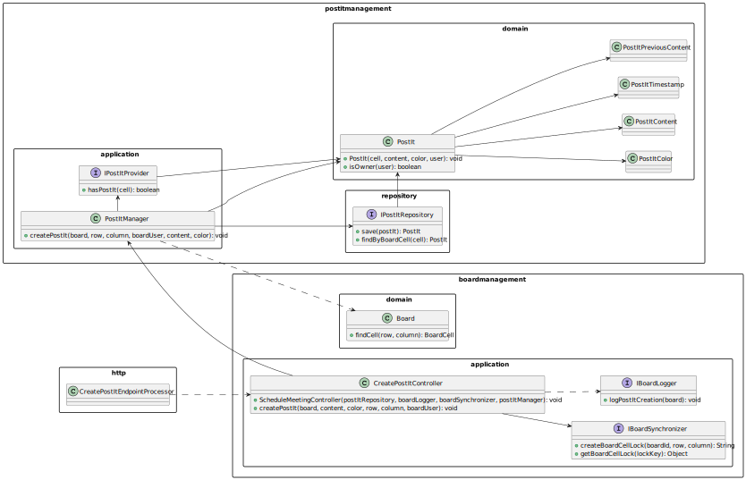
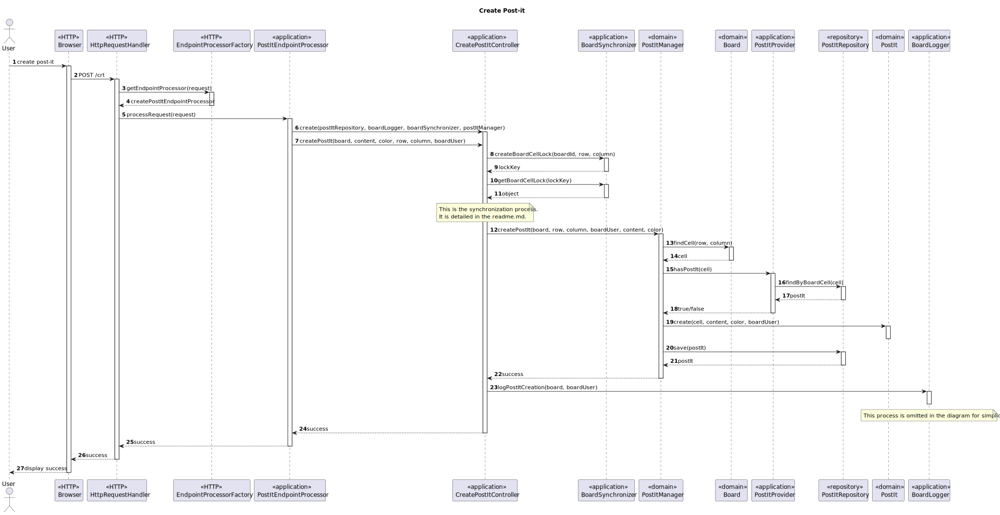

# US3006 — As a User, I want to create a post-it on a board

## 1. Context

This User Story is related to the eCourse Shared Board application.
It is expected that the application allows the user to create post-its inside a board where it is either the/an owner/member.
This is the first time the User Story is being developed, and it is a part of the sprint C requirements.

---

## 2. Requirements

### System Specifications

* **FRB04/NFR13** -
  In fact, several clients will try to concurrently update boards.
  As such, the solution design and implementation must be based on threads, condition variables and mutexes. 
  Specific requirements will be provided in SCOMP.


### User Requirements

* **The client gave no further requirements in the "Client Forum"**

---

## 3. Analysis

This User Story is directly related to both US3005 and US3004.

**US3004** - As mentioned above, the board can and will be shared with lots of users, so each board could contain multiple
post-its associated to different users.

**SU3005** - Since we must allow different users to create post-it, but also ensure that only one post-it is 
created per cell, we will use synchronization methods to ensure real time updates, but also critical area synchronization
to avoid concurrent modifications.

As the interaction with the user is made using a browser, we must also guarantee the communication between both the frontend and
backend, but more details can be seen in US3005 readme.md file.

### 3.1. Requirements Analysis

Fundamentally, this user story is divided into 2 main blocks of actions:

The first one is the creation of the post-it,
which is done by the user and sent to the backend, where it is validated and
saved in the database.

The second one is the log of that creation into the BoardLog history,
used to keep track of all the changes made to the board.

When thinking of the creation of a post-it, we must first think what is required to do so.
First of all, the user must provide a content, color, row and column for the post-it.

*It is here that we find the first area of concern, since each cell can contain at most one post-it.
To do so, we implemented a synchronization system based on locking cells.
Cells compose each board, so when a user requests to create a post-it, the thread will receive a lock based on the board
id, row and column.
If no other thread is using that lock, the thread is free to move onto the creation; otherwise it 
will wait for the lock to be released.
To do this, we created a service that acts as a lockKey provider, being a singleton to make sure that all threads are in
fact synchronized.*

*Finally, we have to make sure that the updates on the board are viewed in real time, so the same had to be done to the 
post-its.
Each couple of seconds (no defined value), there is a POST request emitted by the browser to obtain the post-its related
to the board the user is in at the moment.
Basically, the frontend keeps a list of the post-its in the board when the page was loaded,
then as the responses for the
requests are obtained, the page is refreshed only for new/edited/moved post-its.*

---

## 4. Design

### 4.1. Class Diagram



### 4.2. Sequence Diagrams



### 4.3. Design Decisions

1 - **Who is responsible for creating the Post-it?**

*It was decided that the PostItManager is resposnsible for creating the post-it, as it is a domain service.*

2 - **Who is responsible for placing the request for a log update?**

*Having in mind that several types of BoardLog that can exist, it made sense to create a service that is capable of 
creating any of the required BoardLog, combining the operation type, component and timestamp.*

3 - **Post-its per cell?**

*After a deep analysis of the requirements, we came to the conclusion that a cell can contain at most one post-it.
With this information, we can perform a simple validation that checks if the cell already has any post-it inside.*

### 4.4. Applied Patterns

Some main patterns used in this user story as a whole are:

* **Single Responsibility Principle + High Cohesion:** *Every class has only one responsibility, which leads to higher
  cohesion.*
* **Dependency Injection:** *Instead of instantiating the repositories or services that will be used inside the classes,
  they are received by parameter.*
* **Information Expert:** *The BoardRepository is the IE of the Boards.*
* **Low Coupling + Dependency Inversion:** *All the classes are loosely coupled, not depending on concrete classes,
  rather depending on interfaces.*

Overall, the SOLID and GRASP principles were applied.

### 4.5. Tests

*This User Story is responsible for the creation of post-its,
so it makes sense to test all the domain classes (including the post-it), 
that are associated with it.*

| Test Case | Description                                            | Expected Result                                |
|:---------:|:-------------------------------------------------------|:-----------------------------------------------|
|     1     | Create a valid post-it                                 | Post-it is not null                            |
|     2     | Create a valid post-it and check it's content          | Post-it is created with expected content       |
|     3     | Create a valid post-it and check it's previous content | Post-it is created with empty previous content |
|     4     | Ensure post-it is not created with empty content       | Exception is thrown                            |
|     5     | Ensure post-it is not created with null content        | Exception is thrown                            |
|     6     | Ensure post-it is not created with empty color         | Exception is thrown                            |
|     7     | Ensure post-it is not created with null color          | Exception is thrown                            |

---

## 5. Demonstration


https://github.com/Departamento-de-Engenharia-Informatica/sem4pi-22-23-16-1/assets/106761319/35ef6f5a-e941-4f5e-a3b8-22d477b776cb


---

## 6. Implementation

**Controller:**
````java
public class CreatePostItController {


    private final PostItRepository postItRepository;


    private IPostItManager postItManager;


    private final IBoardLogger boardLogger;


    private final IBoardSynchronizer boardSynchronizer;


    private static CreatePostItController instance;


    /**
     * Gets the singleton instance of this class.
     *
     * @param postItRepository   the post-it repository
     * @param boardLogger        the board logger
     * @param boardSynchronizer  the board synchronizer
     * @return the instance
     */
    public static CreatePostItController getInstance(PostItRepository postItRepository, IBoardLogger boardLogger,
                                                     IBoardSynchronizer boardSynchronizer,
                                                     IPostItManager postItManager) {
        if (instance == null)
            return instance = new CreatePostItController(postItRepository, boardLogger,
                    boardSynchronizer, postItManager);

        return instance;
    }


    /**
     * Instantiates a new CreatePostItController.
     *
     * @param postItRepository   the post-it repository
     * @param boardLogger        the board logger
     * @param boardSynchronizer  the board synchronizer
     */
    private CreatePostItController(PostItRepository postItRepository, IBoardLogger boardLogger,
                                   IBoardSynchronizer boardSynchronizer, IPostItManager postItManager) {
        if (postItRepository == null) {
            throw new IllegalArgumentException("The board repository cannot be null");
        }

        this.postItRepository = postItRepository;

        if (boardLogger == null) {
            throw new IllegalArgumentException("The board logger cannot be null");
        }

        this.boardLogger = boardLogger;

        if (boardSynchronizer == null) {
            throw new IllegalArgumentException("The board synchronizer cannot be null");
        }

        this.boardSynchronizer = boardSynchronizer;

        if (postItManager == null) {
            throw new IllegalArgumentException("The post-it manager cannot be null");
        }

        this.postItManager = postItManager;
    }


    /**
     * This method is responsible for requesting the creation of a post-it.
     * To do so, it must first talk to the board to create the post-it.
     * Then, it must talk to the logger to log the creation of the post-it.
     * Finally, it must talk to the repository to save the board.
     *
     * @param board   the board
     * @param content the content
     * @param color   the color
     * @param row     the row
     * @param column  the column
     */
    public void createPostIt(Board board, String content, String color, ECourseUser postItCreator,
                             Integer row, Integer column) {
        // Request a lock key for this cell
        String lockKey = boardSynchronizer.createBoardCellLock(board.identity(), row, column);

        // Acquire the lock using the generated lock key
        synchronized (boardSynchronizer.getBoardCellLock(lockKey)) {
            // Update the post-it manager
            updatePostItManager();

            // Verify if the user has write access permission
            if (!board.hasWritePermissions(postItCreator) && !board.isBoardOwner(postItCreator)) {
                throw new IllegalArgumentException("You do not have write access permission!");
            }

            // Create the post-it
            PostIt postIt = postItManager.createPostIt(board, BoardLineNumber.valueOf(row),
                    BoardLineNumber.valueOf(column), postItCreator, content, color);

            synchronized (this) {
                // Save the post-it
                postItRepository.save(postIt);
            }

        }

        synchronized (this) {
            boardLogger.logPostItCreation(board, postItCreator);
        }
    }

    private void updatePostItManager() {
        postItManager = new PostItManager(new PostItProvider(postItRepository));
    }
}
````

**Board Synchronizer:**
````java
public class BoardSynchronizer implements IBoardSynchronizer {


    private static BoardSynchronizer instance;


    /**
     * Gets the singleton instance of this class.
     *
     * @return the instance
     */
    public static BoardSynchronizer getInstance() {
        if (instance == null) {
            instance = new BoardSynchronizer();
        }
        return instance;
    }


    private BoardSynchronizer() {}


    // The locks for each board
    private final Map<String, Object> boardLock = new HashMap<>();


    // The locks for each cell
    private final ConcurrentHashMap<String, Object> boardCellLock = new ConcurrentHashMap<>();


    @Override
    public Object getBoardLock(String lockKey) {
        return boardLock.computeIfAbsent(lockKey, k -> new Object());
    }


    @Override
    public Object getBoardCellLock(String lockKey) {
        return boardCellLock.computeIfAbsent(lockKey, k -> new Object());
    }


    @Override
    public String createBoardCellLock(Long boardId, int row, int column) {
        return String.format("%d-%d-%d", boardId, row, column);
    }


}
````

**PostIt**
````java
package postitmanagement.domain;

import boardmanagement.domain.*;
import eapli.framework.domain.model.*;
import ecourseusermanagement.domain.ECourseUser;

import javax.persistence.*;
import java.time.LocalDateTime;
import java.util.Optional;

@Entity
public class PostIt implements AggregateRoot<Long> {

    @Id
    @GeneratedValue(strategy = GenerationType.IDENTITY)
    private Long id;
    
    @OneToOne
    private BoardCell boardCell;

    @Embedded
    private PostItTimestamp postItTimestamp; 

    @Embedded
    private PostItContent postItContent;

    @Embedded
    private PostItColor postItColor;

    @Embedded
    private PostItPreviousContent postItPreviousContent;

    @Enumerated(EnumType.STRING)
    private PostItState postItState;

    @Column
    private String previousCoordinates;

    @OneToOne(cascade = {CascadeType.PERSIST, CascadeType.REMOVE, CascadeType.DETACH, CascadeType.REFRESH})
    private ECourseUser boardPostItCreator;

    protected PostIt() {
        // For ORM
    }

    /**
     * Instantiates a new Board post it.
     *
     * @param boardPostItContent the board post-it content
     * @param boardPostItColor   the board post-it color
     */
    public PostIt(BoardCell boardCell, String boardPostItContent, String boardPostItColor,
                  ECourseUser boardPostItCreator) {
        // Verify if the board post it creator is null
        if (boardCell == null) {
            throw new IllegalArgumentException("The board cell cannot be null.");
        }

        // Create the board cell
        this.boardCell = boardCell;

        // Create the board post it content
        this.postItContent = new PostItContent(boardPostItContent);

        // Create the board post it color
        this.postItColor = new PostItColor(boardPostItColor);

        // Create the board post it create date
        this.postItTimestamp = new PostItTimestamp(LocalDateTime.now());

        // Create the board post it previous content, it was assigned to empty string due to the fact that
        // the post it was just created and the ORM needs a default constructor so we could not let it null
        // (no parameters)
        this.postItPreviousContent = new PostItPreviousContent("");

        // Verify if the board post it creator is null
        if (boardPostItCreator == null) {
            throw new IllegalArgumentException("The board post it creator cannot be null.");
        }

        this.boardPostItCreator = boardPostItCreator;
        this.postItState = PostItState.ACTIVE;

        // No previous coordinates
        this.previousCoordinates = "";
    }
}
````

**PostItsEndpointProcessor**

````java
package boardcommunication.http.endpoints;

import boardcommunication.http.HTTPmessage;
import boardcommunication.http.dto.*;
import boardcommunication.http.dto.CreatePostItRequest;
import boardcommunication.http.helpers.LocalDateAdapter;
import boardcommunication.http.helpers.LocalDateTimeAdapter;
import boardcommunication.http.helpers.RequestUserProvider;
import boardlogmanagement.application.BoardLogFactory;
import boardlogmanagement.application.BoardLogger;
import postitmanagement.application.*;
import boardmanagement.domain.*;
import postitmanagement.application.IPostItProvider;
import postitmanagement.domain.PostItManager;
import postitmanagement.application.PostItProvider;
import com.google.gson.Gson;
import com.google.gson.GsonBuilder;
import ecourseusermanagement.domain.ECourseUser;
import persistence.PersistenceContext;
import postitmanagement.application.UndoPostItChangeController;

import java.time.LocalDate;
import java.time.LocalDateTime;
import java.util.*;


public class PostItsEndpointProcessor implements EndpointProcessor {

    private HTTPmessage request;
    private HTTPmessage response;

    @Override
    public void processRequest(HTTPmessage request, HTTPmessage response) {
        this.request = request;
        this.response = response;

        redirectAccordingToMethod();
    }

    private void redirectAccordingToMethod() {
        switch (request.getMethod()) {
            case "GET":
                // redirectAccordingToGetEndpoint();
                break;
            case "POST":
                redirectAccordingToPostEndpoint();
                break;
            default:
                response.setResponseStatus("404 Not Found");
                response.setContentFromString("Endpoint not found", "text");
                break;
        }
    }

    private void redirectAccordingToPostEndpoint() {
        Optional<ECourseUser> user = requestUserProvider.getUserFromRequest(request);

        if (user.isPresent()) {
            String[] uriFields = request.getURI().split("/");

            switch (uriFields[2]) {
                case "prm":
                    userPermissions(user.get());
                    break;

                case "find":

                case "upt":
                    findPostIt();
                    break;

                case "crt":
                    createPostIt(user.get());
                    break;

                case "chg":
                    changePostItRequest(user.get());
                    break;

                case "uno":
                    undoPostIt(user.get());
                    break;

                case "del":
                    deletePostIt(user.get());
                    break;
            }

        } else {
            response.setResponseStatus("401 Unauthorized");
            response.setContentFromString("Unauthorized", "text");
        }
    }

    private void userPermissions(ECourseUser eCourseUser) {
        // Get the board
        Optional<Board> board = boardsProvider.retrieveBoardById(Long.parseLong(request.getContentAsString()));

        if (board.isPresent()) {

            // Get the board
            Board obtainedBoard = board.get();

            // Convert the post-it to JSON
            Gson toGson = new GsonBuilder()
                    .registerTypeAdapter(LocalDate.class, new LocalDateAdapter())
                    .registerTypeAdapter(LocalDateTime.class, new LocalDateTimeAdapter())
                    .setPrettyPrinting()
                    .create();

            String postItJson = toGson.toJson(boardsProvider.userCanWrite(eCourseUser, obtainedBoard));

            // If the post-it exists, return it
            response.setResponseStatus("200 OK");
            response.setContentFromString(postItJson, "application/json");

        } else {
            // If the board doesn't exist, return an error
            response.setResponseStatus("404 Not Found");
            response.setContentFromString("Board not found", "text");
        }

    }

    private void findPostIt() {
        // Get the board
        Optional<Board> board = boardsProvider.retrieveBoardById(Long.parseLong(request.getContentAsString()));

        // If the board exists
        if (board.isPresent()) {

            // Get the board
            Board obtainedBoard = board.get();

            // All the cells in the board
            List<BoardCell> cells = obtainedBoard.cells();

            // Convert the post-it to JSON
            Gson toGson = new GsonBuilder()
                    .registerTypeAdapter(LocalDate.class, new LocalDateAdapter())
                    .registerTypeAdapter(LocalDateTime.class, new LocalDateTimeAdapter())
                    .setPrettyPrinting()
                    .create();

            String postItJson = toGson.toJson(postItProvider.boardPostIts(cells));

            // If the post-it exists, return it
            response.setResponseStatus("200 OK");
            response.setContentFromString(postItJson, "application/json");

        } else {
            // If the board doesn't exist, return an error
            response.setResponseStatus("404 Not Found");
            response.setContentFromString("Board not found", "text");
        }

    }

    private void createPostIt(ECourseUser eCourseUser) {
        // Get the request content
        String requestContent = request.getContentAsString();

        // Transform the json into a java object
        Gson gson = new Gson();
        CreatePostItRequest createPostItRequest = gson.fromJson(requestContent, CreatePostItRequest.class);

        // Get the board
        Optional<Board> board = boardsProvider.retrieveBoardById(Long.parseLong(createPostItRequest.boardId));

        // If the board exists
        if (board.isPresent()) {

            // Verify if an exception was thrown
            boolean exceptionThrown = false;

            // Error message in exception case
            String errorMessage = "";

            // Create the post-it
            try {

                createPostItController.createPostIt(board.get(), createPostItRequest.content,
                        createPostItRequest.color, eCourseUser, createPostItRequest.row, createPostItRequest.column);

            } catch (Exception e) {
                exceptionThrown = true;
                errorMessage = e.getMessage();
            }

            // Check if exception was thrown
            if (exceptionThrown) {
                response.setResponseStatus("400 Bad Request");
                response.setContentFromString(errorMessage, "text/plain");

            } else {
                response.setResponseStatus("200 OK");
                response.setContentFromString("Success", "text/plain");
            }

        } else {
            // If the post-it doesn't exist, return an empty post-it
            response.setResponseStatus("404 Not Found");
            response.setContentFromString("Board not found", "text");
        }
    }
}
````

**PostItManager**

    ````java
public class PostItManager implements IPostItManager {

    private final IPostItProvider postItProvider;

    /**
     * Instantiates a new PostItManager.
     * @param postItProvider the post-it provider
     */
    public PostItManager(IPostItProvider postItProvider) {
        // Verify if the post-it provider is null
        if (postItProvider == null) {
            throw new IllegalArgumentException("The post-it provider cannot be null.");
        }

        this.postItProvider = postItProvider;
    }

    @Override
    public PostIt createPostIt(Board board, BoardLineNumber row, BoardLineNumber column, ECourseUser postItCreator,
                               String postItContent, String postItColor) {
        // Retrieve the cell in which the post-it will be created
        BoardCell cell = board.findCell(row, column);

        // Verify if there is already a post-it in the given coordinates
        if (postItProvider.hasPostIt(cell)) {
            throw new IllegalStateException("There is already a post-it in the given cell.");
        }

        // return the created post-it
        return new PostIt(cell, postItContent, postItColor, postItCreator);
    }
}
````
