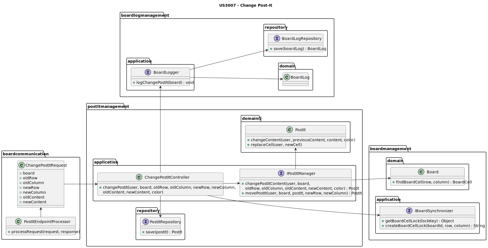

# US3006 — As a User, I want to change a post-it on a board

## 1. Context

This User Story is related to the eCourse Shared Board application.
It is expected that the application allows the user to change a post-its after its creation.
Only the onwer of a post-it can change it.
A user can change the content of a post-it, its position on the board and color.
We also allow the user to delete a post-it. Making it disappear from the board.

This is the first time the User Story is being developed, and it is a part of the sprint-c requirements.

---

## 2. Requirements

### System Specifications

* **FRB04/NFR13** -
  In fact, several clients will try to concurrently update boards.
  As such, the solution design and implementation must be based on threads, condition variables and mutexes.
  Specific requirements will be provided in SCOMP.

### User Requirements

* **The user who created a post in a cell can change that post.**
* **It may change its content, color or move the post into a free cell.**

---

## 3. Analysis

This User Story is directly related to both US3006

**US3004** - In order to change a post-it, a user must firt be able to create one.
This is the first step of the process.

As the interaction with the user is made using a browser, we must also guarantee the communication between both the
frontend and backend, but more details can be seen in US3005 readme.md file.

In terms of code and design, this functionality is particular simple.
It consists of taking a post-it and update it accordingly to the user's input.

---

## 4. Design

### 4.1. Class Diagram



### 4.2. Sequence Diagrams


### 4.3. Applied Patterns

**To Do**

Some main patterns used in this user story as a whole are:

* **Single Responsibility Principle + High Cohesion:** *Every class has only one responsibility, which leads to higher
  cohesion.*
* **Open/Closed Principle:** *We could've considered the first 2-use cases (US4003) to be one and share a controller,
  but that
  would lead to possible hard times in the future if we wanted to have more flexibility with what to do with the meeting
  invitations.*
* **Dependency Injection:** *Instead of instantiating the repositories or services that will be used inside the classes,
  they are received by parameter.*
* **Information Expert:** *The PostItRepository is the IE of the MeetingInvitation.*
* **Low Coupling + Dependency Inversion:** *All the classes are loosely coupled, not depending on concrete classes,
  rather depending on interfaces.*

Overall, the SOLID and GRASP principles were applied.

---

### 4.4. Tests

| Test Case | Description                                                | Expected Result      |
|:---------:|:-----------------------------------------------------------|:---------------------|
|     1     | Changes Post-It with valid information                     | Post-It is changed   |
|     2     | Change Post-It with a user that is not the onwer of it     | Exception is thrown  |
|     3     | Change Post-It to a cell that already has a one            | Exception is thrown  |
|     4     | Change a Post-It with invalid row/columns                  | Exception is thrown  |
|     5     | Ensure Post-it replaces its previous cell (valid cell)     | Post-it is moved     |
|     5     | Ensure Post-it replaces its previous cell (user not onwer) | Exception is thrown  |
|     6     | Ensure Post-it replaces its previous cell (cell null)      | Exception is thrown  |

---

## 5. Demonstration

In order to run this functionality you must first need to access the sharedBoard App.
Then, you must log in. You need to have a board or be a member of a board and have _write_ permissions.
Then, you can either create a new Post-It or change an existing one, if you are the owner of it.
After having a Post-it, you can change it by clicking on it.

There is a video demonstrating the functionality - Change a Post-It.

https://github.com/Departamento-de-Engenharia-Informatica/sem4pi-22-23-16-1/assets/116153853/79c7feca-af61-4f09-83c8-6415c24b3e4d


---

## 6. Implementation

Various methods, including the constructors, and variables were removed from the below classes for the sake of
simplicity.

### PostItEndpointProcessor

```java
package boardcommunication.http.endpoints;

public class PostItsEndpointProcessor implements EndpointProcessor {
    private PostItsEndpointProcessor() {
    }

    private static PostItsEndpointProcessor instance;

    public static EndpointProcessor getInstance() {
        if (instance == null) {
            instance = new PostItsEndpointProcessor();
        }
        return instance;
    }

    private static final int SPECIFIC_POST_IT_URI_LENGTH = 3;

    private final ChangePostItController changePostItController = new ChangePostItController(
            PersistenceContext.repositories().boards(), new BoardLogger(new BoardLogFactory()));

    private final RequestUserProvider requestUserProvider = new RequestUserProvider();

    private final IBoardsProvider boardsProvider = new BoardsProvider(PersistenceContext.repositories().boards());

    private HTTPmessage request;
    private HTTPmessage response;

    @Override
    public void processRequest(HTTPmessage request, HTTPmessage response) {
        this.request = request;
        this.response = response;

        redirectAccordingToMethod();
    }

    private void redirectAccordingToMethod() {
        switch (request.getMethod()) {
            case "GET":
                // redirectAccordingToGetEndpoint();
                break;
            case "POST":
                redirectAccordingToPostEndpoint();
                break;
            default:
                response.setResponseStatus("404 Not Found");
                response.setContentFromString("Endpoint not found", "text");
                break;
        }
    }

    private void redirectAccordingToPostEndpoint() {
        Optional<ECourseUser> user = requestUserProvider.getUserFromRequest(request);

        if (user.isPresent()) {
            String[] uriFields = request.getURI().split("/");

            switch (uriFields[2]) {
                case "find":
                    findPostIt();
                    break;

                case "crt":
                    createPostIt(user.get());
                    break;

                case "chg":
                    changePostItRequest(user.get());
                    break;

                case "undo":
                    // undoPostItController.undoPostIt(...);
                    break;
            }

        } else {
            response.setResponseStatus("401 Unauthorized");
            response.setContentFromString("Unauthorized", "text");
        }
    }

    private void changePostItRequest(ECourseUser user) {
        // Get the request content
        String requestContent = request.getContentAsString();

        // Transform the json into a java object
        Gson gson = new Gson();
        ChangePostItRequest changeRequest = gson.fromJson(requestContent, ChangePostItRequest.class);

        // Get the board
        Optional<Board> board = boardsProvider.retrieveBoardById(changeRequest.boardId);

        // If the board exists
        if (board.isPresent()) {
            String errorMessage = "";
            boolean receivedException = false;
            try {

                // Change the post-it - synchronized to avoid concurrency problems
                changePostItController.changePostIt(user, board.get(),
                        changeRequest.oldRow, changeRequest.oldColumn,
                        changeRequest.newRow, changeRequest.newColumn,
                        changeRequest.oldContent, changeRequest.newContent, changeRequest.color);

            } catch (IllegalStateException e) {
                receivedException = true;

                // Attribute the error message
                if (e.getMessage().equals("There is no post-it in the cell.") ||
                        e.getMessage().equals("There is already a post-it in the given cell."))
                    errorMessage = e.getMessage();
                else
                    errorMessage = "It was impossible to change the post-it.";

                response.setResponseStatus("400 Bad Request");
                response.setContentFromString(errorMessage, "text/plain");
            } catch (Exception e) {
                receivedException = true;
                errorMessage = "It was impossible to change the post-it.";
            }

            // Check if we received an exception
            if (!receivedException) {
                response.setResponseStatus("200 OK");
                response.setContentFromString("Success", "text/plain");
            } else {
                response.setResponseStatus("400 Bad Request");
                response.setContentFromString(errorMessage, "text/plain");
            }
        } else {
            // If the board doesn't exist
            response.setResponseStatus("404 Not Found");
            response.setContentFromString("Board not found", "text/plain");
        }
    }
}
```

### ChangePostItController

```java
package postitmanagement.application;

public class ChangePostItController {

    private final IBoardLogger logger;

    private IPostItManager postItManager;

    private final PostItRepository postItRepo;

    private final IBoardSynchronizer synchronizer;

    private static ChangePostItController instance;

    /**
     * Singleton
     * @param logger Board logger
     * @param postItManager Post-it manager
     * @param postItRepo Post-it repository
     * @param synchronizer Board synchronizer
     * @return Singleton instance
     */
    public static ChangePostItController getInstance(IBoardLogger logger, IPostItManager postItManager,
                                                     PostItRepository postItRepo, IBoardSynchronizer synchronizer) {
        if (instance == null) {
            instance = new ChangePostItController(logger, postItManager, postItRepo, synchronizer);
        }
        return instance;
    }


    private ChangePostItController(IBoardLogger logger, IPostItManager postItManager,
                                   PostItRepository postItRepo, IBoardSynchronizer synchronizer) {
        Preconditions.noneNull(logger, postItRepo, synchronizer);

        this.logger = logger;
        this.postItManager = postItManager;
        this.postItRepo = postItRepo;
        this.synchronizer = synchronizer;
    }


    public void updatePostItProvider() {
        postItManager = new PostItManager(new PostItProvider(postItRepo));
    }


    /**
     * Update post-it content.
     *
     * @param board      the board where the post-it is
     * @param oldRow     the row of where the post-it was
     * @param oldColumn  the column of where the post-it was
     * @param newRow     the row of where the post-it is
     * @param newColumn  the column of where the post-it is
     * @param oldContent the previous content of the post-it
     * @param newContent the current content of the post-it
     */
    public void changePostIt(ECourseUser user, Board board,
                             int oldRow, int oldColumn, int newRow, int newColumn,
                             String oldContent, String newContent, String color) {
        // Generate a unique lock key based on the row, column, and board ID
        String lockKeyOldCell = synchronizer.createBoardCellLock(board.identity(), oldRow, oldColumn);

        synchronized (synchronizer.getBoardCellLock(lockKeyOldCell)) {
            updatePostItProvider();
            PostIt postIt;
            synchronized (this) {
                postIt = postItManager.changePostItContent(user, board, oldRow, oldColumn,
                        oldContent, newContent, color);
            }

            // If the post-it was moved, then we need to lock the new cell
            if (checkIfPostItWasMoved(oldRow, oldColumn, newRow, newColumn)) {
                String lockKeyNewCell = synchronizer.createBoardCellLock(board.identity(), newRow, newColumn);

                synchronized (synchronizer.getBoardCellLock(lockKeyNewCell)) {
                    postIt = postItManager.movePostIt(user, board, postIt, newRow, newColumn);

                }
            }

            synchronized (this) {
                postItRepo.save(postIt);
            }
        }

        synchronized (this) {
            logger.logPostItUpdate(board, user);
        }
    }

    private boolean checkIfPostItWasMoved(int oldRow, int oldColumn, int newRow, int newColumn) {
        return oldRow != newRow || oldColumn != newColumn;
    }
}

```

### Board

```java
package boardmanagement.domain;

@Entity
public class Board implements AggregateRoot<Long> {

    @Id
    @GeneratedValue(strategy = GenerationType.IDENTITY)
    private Long id;
    @OneToMany(cascade = CascadeType.ALL)
    private List<BoardRow> rows;
    @OneToMany(cascade = CascadeType.ALL)
    private List<BoardColumn> columns;
    @OneToOne(cascade = CascadeType.ALL)
    private BoardPermission boardOwner;
    @OneToMany(cascade = CascadeType.ALL, fetch = FetchType.LAZY)
    private List<BoardCell> boardCells;


    /**
     * Finds a cell in the board using the row and column numbers
     * @param row the row number
     * @param column the column number
     * @return the cell
     */
    public BoardCell findCell(BoardLineNumber row, BoardLineNumber column) {
        for (BoardCell cell : boardCells) {
            if (cell.row().number() == row.lineNumber() && cell.column().number() == column.lineNumber()) {
                return cell;
            }
        }

        return null;
    }
}
```

### BoardPostIt

```java
package postitmanagement.domain;

@Entity
public class PostIt implements AggregateRoot<Long> {

    @Id
    @GeneratedValue(strategy = GenerationType.IDENTITY)
    private Long id;
    
    @OneToOne
    private BoardCell boardCell;

    @Embedded
    private PostItTimestamp postItTimestamp;

    @Embedded
    private PostItContent postItContent;

    @Embedded
    private PostItColor postItColor;

    @Embedded
    private PostItPreviousContent postItPreviousContent;

    @Enumerated(EnumType.STRING)
    private PostItState postItState;

    @Column
    private String previousCoordinates;

    @OneToOne(cascade = {CascadeType.PERSIST, CascadeType.REMOVE, CascadeType.DETACH, CascadeType.REFRESH})
    private ECourseUser boardPostItCreator;

    /**
     * Instantiates a new Board post it.
     *
     * @param boardPostItContent the board post-it content
     * @param boardPostItColor   the board post-it color
     */
    public PostIt(BoardCell boardCell, String boardPostItContent, String boardPostItColor,
                  ECourseUser boardPostItCreator) {
        // Verify if the board post it creator is null
        if (boardCell == null) {
            throw new IllegalArgumentException("The board cell cannot be null.");
        }

        // Create the board cell
        this.boardCell = boardCell;

        // Create the board post it content
        this.postItContent = new PostItContent(boardPostItContent);

        // Create the board post it color
        this.postItColor = new PostItColor(boardPostItColor);

        // Create the board post it creates date
        this.postItTimestamp = new PostItTimestamp(LocalDateTime.now());

        // Create the board post it previous content, it was assigned to empty string due to the fact that
        // the post it was just created and the ORM needs a default constructor so we could not let it null
        // (no parameters)
        this.postItPreviousContent = new PostItPreviousContent("");

        // Verify if the board post it creator is null
        if (boardPostItCreator == null) {
            throw new IllegalArgumentException("The board post it creator cannot be null.");
        }

        this.boardPostItCreator = boardPostItCreator;
        this.postItState = PostItState.ACTIVE;

        // No previous coordinates
        this.previousCoordinates = "";
    }

    /**
     * Check if the user is the owner of the post-it.
     * @param user the user
     * @return true if the user is the owner, false otherwise
     */
    public boolean isOwner(ECourseUser user) {
        return this.boardPostItCreator.equals(user);
    }


    /**
     * Change the content of the post-it.
     *
     * @param content         the new content
     * @param previousContent the previous content
     */
    public void changeContent(ECourseUser user, String previousContent, String content, String color) {
        if (!isOwner(user)) {
            throw new IllegalStateException("You are not the owner of the post-it.");
        }

        this.postItPreviousContent = new PostItPreviousContent(previousContent);
        this.postItContent = new PostItContent(content);
        this.postItColor = new PostItColor(color);

        // The post-it was edited
        this.postItTimestamp = new PostItTimestamp(LocalDateTime.now());
    }

    /**
     * Moves the post-it to a new cell.
     */
    public void replaceCell(ECourseUser user, BoardCell newCell) {
        if (!isOwner(user))
            throw new IllegalStateException("You are not the owner of the post-it.");

        // Save the previous coordinates
        this.previousCoordinates = this.boardCell.coordinates();

        this.boardCell = newCell;
    }
}

```

### Requests

```javascript

/**
 * Function that will communicate with the server to apply the changes made to the post-it
 * @param data - data to be sent to the server
 */
function changePostItRequest(data) {
    event.preventDefault();

    const request = new XMLHttpRequest();

    request.onload = function () {
        if (request.status === 200) {
            displayNotification("success", "Post-it updated successfully!");

            // Enables Post It
            disablePostIt(postItRow, postItColumn, false);
        } else {
            displayNotification('failure', request.responseText);
        }
    }

    request.open("POST", `/postit/chg`, true);
    request.setRequestHeader("Content-Type", "application/json");

    const token = getTokenCookie();
    if (token) {
        request.setRequestHeader('Authorization', token);
    }

    request.send(JSON.stringify(data));
}


function deletePostItRequest(data) {
    const request = new XMLHttpRequest();

    request.onload = function () {
        if (request.status === 200) {
            displayNotification("success", "Post-it deleted successfully!");

            // Enables Post It
            disablePostIt(postItRow, postItColumn, false);
        } else {
            displayNotification('failure', request.responseText);
            
            // Enables Post It
            disablePostIt(postItRow, postItColumn, false);
        }
    }

    request.open("POST", `/postit/del`, true);
    request.setRequestHeader("Content-Type", "application/json");

    const token = getTokenCookie();
    if (token) {
        request.setRequestHeader('Authorization', token);
    }

    request.send(JSON.stringify(data));
}

```

## 7. Tests

### BoardTests

```java
package postitmanagement.domain;

class PostItTest {

    @Test
    void createValidPostIt() {
        // Arrange
        BoardCell boardCell = BoardDataSource.boardCell();
        String boardPostItContent = "This is a valid post-it content";
        String boardPostItColor = "#FFFFFF";

        // Act
        PostIt postIt = new PostIt(boardCell, boardPostItContent, boardPostItColor, UserDataSource.getTestManager1());

        // Assert
        assertNotNull(postIt);
    }

    @Test
    void ensurePostItIsCreatedWithExpectedContent() {
        // Arrange
        BoardCell boardCell = BoardDataSource.boardCell();
        String boardPostItContent = "This is a valid post-it content";
        String boardPostItColor = "#FFFFFF";

        // Act
        PostIt postIt = new PostIt(boardCell, boardPostItContent, boardPostItColor, UserDataSource.getTestManager1());

        // Assert
        assertEquals(boardPostItContent, postIt.currentContent().content());
    }

    @Test
    void ensurePostItIsCreatedWithEmptyPreviousContent() {
        // Arrange
        BoardCell boardCell = BoardDataSource.boardCell();
        String boardPostItContent = "This is a valid post-it content";
        String boardPostItColor = "#FFFFFF";

        // Act
        PostIt postIt = new PostIt(boardCell, boardPostItContent, boardPostItColor, UserDataSource.getTestManager1());

        // Assert
        assertEquals(Optional.empty(), postIt.previousContent());
    }


    @Test
    void ensurePostItIsNotCreatedWithNullBoardCell() {
        // Arrange
        String boardPostItContent = "This is a valid post-it content";
        String boardPostItColor = "#FFFFFF";

        // Assert
        assertThrows(IllegalArgumentException.class, () ->
                new PostIt(null, boardPostItContent, boardPostItColor, UserDataSource.getTestManager1()));
    }

    @Test
    void ensurePostItIsNotCreatedWithNullContent() {
        // Arrange
        BoardCell boardCell = BoardDataSource.boardCell();
        String boardPostItColor = "#FFFFFF";

        // Assert
        assertThrows(IllegalArgumentException.class, () ->
                new PostIt(boardCell, null, boardPostItColor, UserDataSource.getTestManager1()));
    }

    @Test
    void ensurePostItIsNotCreatedWithNullColor() {
        // Arrange
        BoardCell boardCell = BoardDataSource.boardCell();
        String boardPostItContent = "This is a valid post-it content";

        // Assert
        assertThrows(IllegalArgumentException.class, () ->
                new PostIt(boardCell, boardPostItContent, null, UserDataSource.getTestManager1()));
    }

    @Test
    void ensurePostItIsNotCreatedWithNullCreator() {
        // Arrange
        BoardCell boardCell = BoardDataSource.boardCell();
        String boardPostItContent = "This is a valid post-it content";
        String boardPostItColor = "#FFFFFF";

        // Assert
        assertThrows(IllegalArgumentException.class, () ->
                new PostIt(boardCell, boardPostItContent, boardPostItColor, null));
    }

    @Test
    void ensurePostItIsChanged() {
        // Arrange
        BoardCell boardCell = BoardDataSource.boardCell();
        String boardPostItContent = "This is a valid post-it content";
        String boardPostItColor = "#FFFFFF";
        PostIt postIt = new PostIt(boardCell, boardPostItContent,
                boardPostItColor, UserDataSource.getTestStudent1());

        // Act
        String newBoardPostItContent = "This is a new valid post-it content";
        postIt.changeContent(UserDataSource.getTestStudent1(), boardPostItContent,
                newBoardPostItContent, boardPostItColor);

        // Assert
        assertEquals(newBoardPostItContent, postIt.currentContent().content());
    }

    @Test
    void ensurePostItIsNotChangeIfUserIsNotOnwer() {
        // Arrange
        BoardCell boardCell = BoardDataSource.boardCell();
        String boardPostItContent = "This is a valid post-it content";
        String boardPostItColor = "#FFFFFF";
        PostIt postIt = new PostIt(boardCell, boardPostItContent,
                boardPostItColor, UserDataSource.getTestStudent1());

        // Act
        String newBoardPostItContent = "This is a new valid post-it content";
        assertThrows(IllegalStateException.class, () ->
                postIt.changeContent(UserDataSource.getTestStudent2(), boardPostItContent,
                        newBoardPostItContent, boardPostItColor));
    }


    @Test
    void ensurePostItReplacesItsCell() {
        // Arrange
        BoardCell boardCell = BoardDataSource.boardCell();
        String boardPostItContent = "This is a valid post-it content";
        String boardPostItColor = "#FFFFFF";
        ECourseUser creator = UserDataSource.getTestStudent1();

        PostIt postIt = new PostIt(boardCell, boardPostItContent,
                boardPostItColor, creator);
        BoardCell newBoardCell = BoardDataSource.boardCell();

        // Act
        postIt.replaceCell(creator, newBoardCell);

        // Assert
        assertEquals(newBoardCell, postIt.cell());
    }


    @Test
    void ensurePostItsDoesNotReplaceItsCellIfUserIsNotOnwer() {
        // Arrange
        BoardCell boardCell = BoardDataSource.boardCell();
        String boardPostItContent = "This is a valid post-it content";
        String boardPostItColor = "#FFFFFF";
        ECourseUser creator = UserDataSource.getTestStudent1();

        PostIt postIt = new PostIt(boardCell, boardPostItContent,
                boardPostItColor, creator);
        BoardCell newBoardCell = BoardDataSource.boardCell();

        // Assert
        assertThrows(IllegalStateException.class, () ->
                postIt.replaceCell(UserDataSource.getTestStudent2(), newBoardCell));
    }


    @Test
    void ensurePostItsDeleteItself() {
        // Arrange
        BoardCell boardCell = BoardDataSource.boardCell();
        String boardPostItContent = "This is a valid post-it content";
        String boardPostItColor = "#FFFFFF";
        ECourseUser creator = UserDataSource.getTestStudent1();

        PostIt postIt = new PostIt(boardCell, boardPostItContent,
                boardPostItColor, creator);

        // Act
        postIt.delete(creator);

        // Assert
        assertTrue(postIt.isDeleted());
    }


    @Test
    void ensurePostItDoesNotDeleteItselfIfUserIsNotTheOnwer() {
        // Arrange
        BoardCell boardCell = BoardDataSource.boardCell();
        String boardPostItContent = "This is a valid post-it content";
        String boardPostItColor = "#FFFFFF";
        ECourseUser creator = UserDataSource.getTestStudent1();

        PostIt postIt = new PostIt(boardCell, boardPostItContent,
                boardPostItColor, creator);

        // Assert
        assertThrows(IllegalStateException.class, () -> postIt.delete(UserDataSource.getTestStudent2()));
    }
}
```
