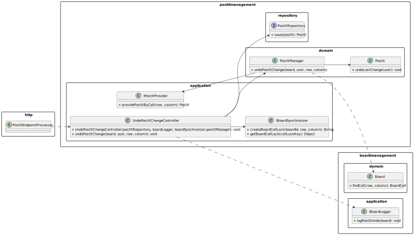
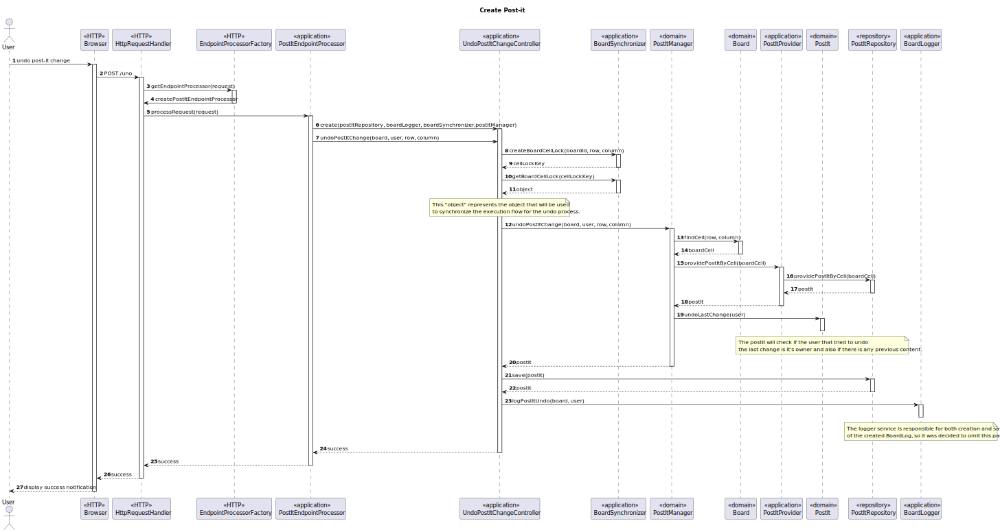

# US3008 — As a User I want to the last change in a post-it.

## 1. Context

This User Story is related to the eCourse Shared Board application.
It is expected that the application allows the user to undo the last change to a post-it inside a board where it 
is either the/an owner/member.
This is the first time the User Story is being developed, and it is a part of the sprint C requirements.

---

## 2. Requirements

### System Specifications

* **FRB06** - A user undo the last change in a post-it.


### User Requirements

* **The client gave no further requirements in the "Client Forum"**

---

## 3. Analysis

This User Story is directly related to US3006.

It is required that the user who *owns* the post-it is able to undo the change he made to the post-it.
The user will be able to change the post-it content to the previous one.

As expected, the whole process should be synchronized and use the best practices regarding synchronization.
Having in mind that only the post-it owner can make changes to the post-it, we will only maintain a sync process for 
 the same user logged in two different accounts trying to undo simultaneously and also for edition coinciding with the 
undo process.

Another important topic to keep in mind is the fact that once the last change of the post-it is undo, its previous 
content will also be altered to the current one.


### 3.1. Requirements Analysis

There are some topics that need to be met for the user to be able to undo the last post-it changes for the content.

1—The user must be the owner of the that post-it.
2—The post-it must have a previous content.

---

## 4. Design

### 4.1. Class Diagram



### 4.2. Sequence Diagrams



### 4.3. Design Decisions

1 - **Who is responsible for undoing the Post-it?**

*The post-it is the information expert for its previous content, so it is him the responsible for the process of 
undoing a change.*

### 4.4. Applied Patterns

Some main patterns used in this user story as a whole are:

* **Single Responsibility Principle + High Cohesion:** *Every class has only one responsibility, which leads to higher
  cohesion.*
* **Dependency Injection:** *Instead of instantiating the repositories or services that will be used inside the classes,
  they are received by parameter.*
* **Information Expert:** *The PostItRepository is the IE of the Post-it.*
* **Low Coupling + Dependency Inversion:** *All the classes are loosely coupled, not depending on concrete classes,
  rather depending on interfaces.*

Overall, the SOLID and GRASP principles were applied.

### 4.5. Tests

*This User Story is responsible for the creation of post-its,
so it makes sense to test all the domain classes (including the post-it),
that are associated with it.*

| Test Case | Description                             | Expected Result                                    |
|:---------:|:----------------------------------------|:---------------------------------------------------|
|     1     | Undo a post-it with no previous content | Exception is thrown                                |
|     2     | Undo a post-it with previous content    | Post-it content is altered to the previous content |

---

## 5. Demonstration


https://github.com/Departamento-de-Engenharia-Informatica/sem4pi-22-23-16-1/assets/106761319/edfdcd9c-7438-47dc-b348-9de16f2dbb91


---

## 6. Implementation

*Controller*

````java
public class UndoPostItChangeController {

    private final PostItRepository postItRepository;


    private IPostItManager postItManager;


    private final IBoardLogger boardLogger;


    private final IBoardSynchronizer boardSynchronizer;


    private static UndoPostItChangeController instance;


    /**
     * Gets the singleton instance of this class.
     *
     * @param postItRepository  the post-it repository
     * @param boardLogger       the board logger
     * @param boardSynchronizer the board synchronizer
     * @return the instance
     */
    public static UndoPostItChangeController getInstance(PostItRepository postItRepository, IBoardLogger boardLogger,
                                                         IBoardSynchronizer boardSynchronizer,
                                                         IPostItManager postItManager) {
        if (instance == null)
            return instance = new UndoPostItChangeController(postItRepository, boardLogger,
                    boardSynchronizer, postItManager);

        return instance;
    }


    /**
     * Instantiates a new CreatePostItController.
     *
     * @param postItRepository  the post-it repository
     * @param boardLogger       the board logger
     * @param boardSynchronizer the board synchronizer
     */
    private UndoPostItChangeController(PostItRepository postItRepository, IBoardLogger boardLogger,
                                       IBoardSynchronizer boardSynchronizer, IPostItManager postItManager) {
        if (postItRepository == null) {
            throw new IllegalArgumentException("The board repository cannot be null");
        }

        this.postItRepository = postItRepository;

        if (boardLogger == null) {
            throw new IllegalArgumentException("The board logger cannot be null");
        }

        this.boardLogger = boardLogger;

        if (boardSynchronizer == null) {
            throw new IllegalArgumentException("The board synchronizer cannot be null");
        }

        this.boardSynchronizer = boardSynchronizer;

        if (postItManager == null) {
            throw new IllegalArgumentException("The post-it manager cannot be null");
        }

        this.postItManager = postItManager;
    }


    /**
     * This method is responsible for requesting the undoing of the last change to a post-it.
     * It is synchronized using the IBoardSynchronizer interface.
     *
     * @param board     the board the post-it belongs to
     * @param boardUser the user trying to undo the post-it changes
     * @param row       the row where the post-it is placed
     * @param column    the column where the post-it is placed
     */
    public void undoPostItChange(Board board, ECourseUser boardUser, Integer row, Integer column) {
        // Request a lock key for this cell
        String lockKey = boardSynchronizer.createBoardCellLock(board.identity(), row, column);

        // Acquire the lock using the generated lock key
        synchronized (boardSynchronizer.getBoardCellLock(lockKey)) {
            // Update the post-it manager
            updatePostItManager();

            // Verify if the user has write access permission
            if (!board.hasWritePermissions(boardUser) && !board.isBoardOwner(boardUser)) {
                throw new IllegalArgumentException("You do not have write access permission!");
            }

            synchronized (this) {
                // Undo the last change to the post-it
                PostIt postIt = postItManager.undoPostItChange(board, boardUser, BoardLineNumber.valueOf(row),
                        BoardLineNumber.valueOf(column));
                
                // Save the post-it
                postItRepository.save(postIt);
            }

        }

        synchronized (this) {
            boardLogger.logPostItUndo(board, boardUser);
        }
    }

    private void updatePostItManager() {
        postItManager = new PostItManager(new PostItProvider(postItRepository));
    }

}
````

**Endpoint**

````java
public class PostItsEndpointProcessor implements EndpointProcessor {
    
    private final UndoPostItChangeController undoPostItChangeController = UndoPostItChangeController.getInstance(
            PersistenceContext.repositories().postIts(),
            new BoardLogger(new BoardLogFactory(), PersistenceContext.repositories().boardLogs()),
            BoardSynchronizer.getInstance(),
            new PostItManager(new PostItProvider(PersistenceContext.repositories().postIts()))
    );

    private void undoPostIt(ECourseUser eCourseUser) {
        // Get the request content
        String requestContent = request.getContentAsString();

        // Transform the json into a java object
        Gson gson = new Gson();
        UndoPostItChangeRequest undoPostItRequest = gson.fromJson(requestContent, UndoPostItChangeRequest.class);

        // Get the board
        Optional<Board> board = boardsProvider.retrieveBoardById(Long.parseLong(undoPostItRequest.boardId));

        // If the board exists
        if (board.isPresent()) {

            // Verify if an exception was thrown
            boolean exceptionThrown = false;

            // Error message in exception case
            String errorMessage = "";

            // Create the post-it
            try {

                undoPostItChangeController.undoPostItChange(board.get(), eCourseUser,
                        undoPostItRequest.row, undoPostItRequest.column);

            } catch (IllegalStateException e) {
                exceptionThrown = true;
                errorMessage = e.getMessage();
            } catch (Exception e) {
                exceptionThrown = true;
                errorMessage = "Oops! Please try again! ";
            }

            // Check if exception was thrown
            if (exceptionThrown) {
                response.setResponseStatus("400 Bad Request");
                response.setContentFromString(errorMessage, "text/plain");

            } else {
                response.setResponseStatus("200 OK");
                response.setContentFromString("Success", "text/plain");
            }

        } else {
            // If the post-it doesn't exist, return an empty post-it
            response.setResponseStatus("404 Not Found");
            response.setContentFromString("Board not found", "text");
        }
    }
}
````
