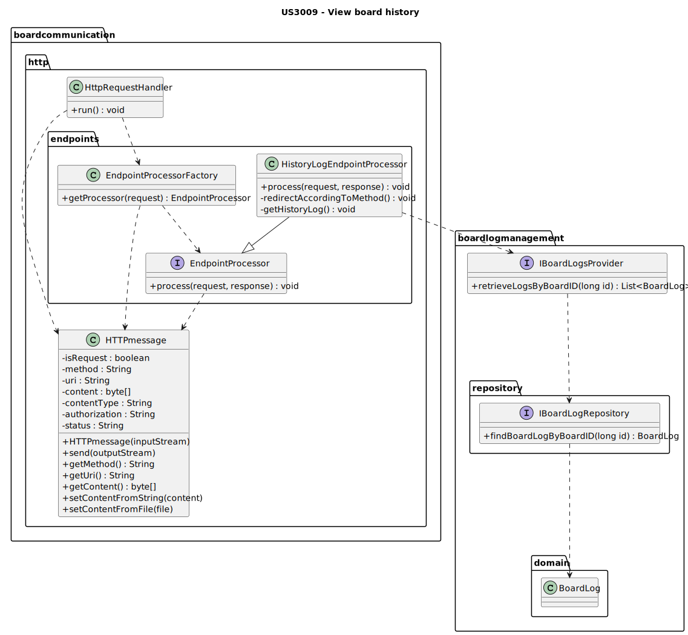

# US3009 —  As a User, I want to view the history log of a board

## 1. Context

This US is related to the Shared Board App. So it was developed in web.

## 2. Requirements

It is required that:

- Every user with permission to see a board can see the history log of that board.


## 3. Analysis/Breakdown
    
While analysing the requirements, it was possible to identify the following concepts:

- the log should present every action to the board, and it's post-its, with date and the user who made the action;
- the log should be presented in a chronological order;
- the log should auto update when a new action is made to the board;


### HTTP Server and Routing

The design and implementation details will be further explored in the next topic ("4. Design"), but it is still important
to address the fact that the HTTP server and the routing of endpoints used to successfully implement the API to the
Shared Board App was made "by hand", in a real world example the use of a framework, like Spring Boot, could be 
very helpful, but since this is a rather small utilization and just a basic approach to the topic the integration with
a framework was not contemplated.

The logic followed as the one used in the example provided by RCOMP, with some improvements.


### AJAX

To assure that the board is updated in real-time, AJAX was used.
Each request to the server is made using AJAX, having always a response from the server, even if it is
just a simple "OK" response.

The requests are sent using JavaScript, and the responses are handled by the Java server, which has the connection
to the database and can return the necessary information.

One of the techniques used to assure that the board is updated in real-time is to make a request to the server
every X seconds, to check if there are any updates to the board. If there are, the board is updated.
The same goes for the "My Boards" page, where the user can see the boards he has access to and if there are
any updates to them, i.e. if a new board is shared with the user, or if a board is archived the options are updated.

## 4. Design

### 4.1. Class Diagram

To avoid redundancy, only the main classes will be provided.



### 4.2. Sequence Diagram


***DISCLAIMER:***  
Much more requests are processed to actually have the board page set up, but since they all follow the
same logic and process, only the main request was represented by a SD.


### 4.3. Applied Patterns

Some main patterns used in this user story as a whole are:

* **Pure Fabrication:** *SessionToken and its generator are examples of classes that are purely fabricated.*
* **Client Server:** *The communication with the board is made using a client-server architecture, where we have a browser
acting as a client, and we have a server that handles all the requests.*


### 4.4. Tests

- Make a change in a board with another user and check if the history log is updated in real-time.

## 5. Demonstration


https://github.com/Departamento-de-Engenharia-Informatica/sem4pi-22-23-16-1/assets/105438055/a65b1331-598a-44fe-ac12-08d33e571189


## 6. Implementation


- **EndpointProcessor** *Interface used by every endpoint processor.*

````java
public interface EndpointProcessor {

    /**
     * Process the request and return a response.
     *
     * @param request  the request
     * @param response the response
     */
    void processRequest(HTTPmessage request, HTTPmessage response);
}
````

- **HistoryLogEndpointProcessor** *Class responsible for processing the history log endpoint.*

````java
public class HistoryLogEndpointProcessor implements EndpointProcessor{


  private HTTPmessage request;

  private HTTPmessage response;

  private final IBoardsProvider boardsProvider = new BoardsProvider(PersistenceContext.repositories().boards());

  private final RequestUserProvider requestUserProvider = new RequestUserProvider();

  @Override
  public void processRequest(HTTPmessage request, HTTPmessage response) {
    this.request = request;
    this.response = response;

    redirectAccordingToMethod();
  }

  private void redirectAccordingToMethod() {
    switch (request.getMethod()) {
      case "GET":
        getHistoryLog();
        break;
      default:
        response.setResponseStatus("404 Not Found");
        response.setContentFromString("Endpoint not found", "text");
        break;
    }
  }

  private void getHistoryLog() {

    Optional<ECourseUser> user = requestUserProvider.getUserFromRequest(request);

    if (user.isPresent()) {
      String[] uriFields = request.getURI().split("/");

      // Get the board where the history was requested
      Optional<Board> board = boardsProvider.retrieveBoardById(Long.parseLong(uriFields[2]));

      if(board.isPresent()){

        // Get the history log
        List<BoardLog> historyLog = board.get().history();

        // Convert the post-it to JSON
        Gson toGson = new GsonBuilder()
                .registerTypeAdapter(LocalDate.class, new LocalDateAdapter())
                .registerTypeAdapter(LocalDateTime.class, new LocalDateTimeAdapter())
                .setPrettyPrinting()
                .create();

        String jsonString = toGson.toJson(historyLog);

        response.setResponseStatus("200 OK");
        response.setContentFromString(jsonString, "application/json");

      } else{
        response.setResponseStatus("404 Not Found");
        response.setContentFromString("Board not found", "text");
      }

    } else {
      response.setResponseStatus("401 Unauthorized");
      response.setContentFromString("No user logged in", "text");
    }

  }
}
````

- *board.pag.js* *JavaScript file responsible for handling the log requests.*

````javascript

...

function createHistoryTable(history, container) {

    const div = document.createElement('div');
    div.className = 'board-history-table-container';

    // Create a table element
    const table = document.createElement('table');
    table.className = 'board-history-table';
    table.id = 'historyTable';

    createHistoryTableHeader(div, table);

    history.forEach(element => {
        switch (element.operation) {
            case 'CREATE_POSTIT':
                logPostItCreation(element, table);
                break;
            case 'UPDATE_POSTIT':
                logPostItUpdate(element, table);
                break;
            case 'UNDO_POSTIT':
                logPostItUndo(element, table);
                break;
            case 'DELETE_POSTIT':
                logPostItDeletion(element, table);
                break;
            case 'CREATE_BOARD':
                logBoardCreation(element, table);
                break;
            default:
                console.log('Log type not recognized');
                break;
        }
    });

    sortHistoryTable(table);


    div.appendChild(table);

    container.appendChild(div);

}

function loadHistoryTable(container) {

    // Make an AJAX request to fetch the latest version of the history log
    const historyRequest = new XMLHttpRequest();

    historyRequest.onload = function () {
        if (historyRequest.status === 200) {
            const history = JSON.parse(historyRequest.responseText);

            // Get the current table size if exist
            let table = document.getElementById("historyTable");

            if (table) {
                const existingOptions = Array.from(table.children);

                if (history.length > table.rows.length - 1) {
                    // Check if there are new logs
                    history.forEach(element => {
                        // Check if the log is already in the table
                        const existingOption = existingOptions.find(option => {
                            return option.value === element.id;
                        });

                        if (!existingOption) {

                            displayNotification('info', 'Log updated!');

                            switch (element.operation) {
                                case 'CREATE_POSTIT':
                                    logPostItCreation(element, table);
                                    break;
                                case 'UPDATE_POSTIT':
                                    logPostItUpdate(element, table);
                                    break;
                                case 'UNDO_POSTIT':
                                    logPostItUndo(element, table);
                                    break;
                                case 'DELETE_POSTIT':
                                    logPostItDeletion(element, table);
                                    break;
                                case 'CREATE_BOARD':
                                    logBoardCreation(element, table);
                                    break;
                                default:
                                    console.log('Log type not recognized');
                                    break;
                            }

                        }

                    });

                    sortHistoryTable(table);
                }
            } else {
                createHistoryTable(history, container);
            }


        }
    }

    // Get the board ID from the URL
    const boardId = window.location.href.split('/').pop();

    historyRequest.open('GET', `/log/${boardId}`, true);

    // Set the authorization header
    const token = getTokenCookie();
    if (token) {
        historyRequest.setRequestHeader('Authorization', token);
    }

    historyRequest.send();

}

function loadBoardHistory() {

    on();

    // Create a container element
    const container = document.createElement('div');
    container.id = 'board-history-container';
    container.className = 'board-history-container';

    loadHistoryHeader(container);

    loadHistoryTable(container);


    // Append the container to the document body
    document.body.appendChild(container);

    keepUpdatingHistory();
}

function keepUpdatingHistory() {

    if (checkIfLoggedUser()) {
        let container = document.getElementById("board-history-container");
        if (container) {
            loadHistoryTable(container);

            setTimeout(keepUpdatingHistory, 3000);
        }
    }

}

...

````
