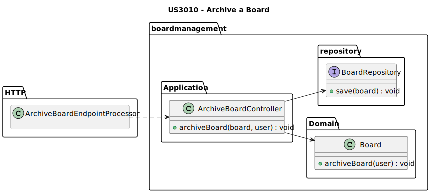
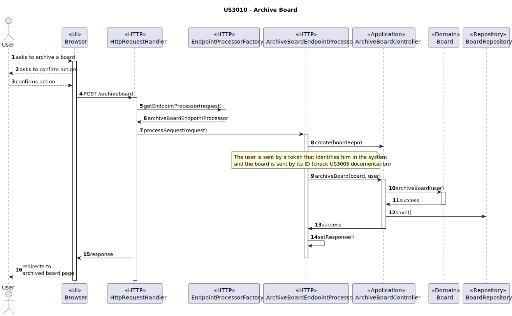

# US3010 — As User, I want to archive a board I own

## 1. Context

This US is being developed for the first time, since it was assigned in this sprint (sprint C).
This requirement is placed in the context of archiving a [board](../MainDocs/glossary.md).

---

## 2. Requirements

The user must be registered in the system, have at least one board that's not archived.

#### System Specifications Document

* FRB08 - Archive Board The owner of a board can archive the board

---

## 3. Analysis

To view archive a board, there are pre-conditions that need to be met:

* The User must be logged in.
* The User must be the owner of at least one board that's not archived.

Meeting all the preconditions, the User then must:

1 - Get inside the board that they want to archive.

2 - Click on the button to archive the board and confirm the action.

3 - Then, the system will change the state of the selected board from "ACTIVE" to "ARCHIVED".

4 - The User will then be redirected to a page with a success message.

5 - Having the state changed to "ARCHIVED", the board will not be available anymore for any of its users.

---

## 4. Design

### 4.1. Class Diagram



### 4.2. Sequence Diagrams



**IMPORTANT**
* It is important to consult the [US3005 readme file](../US3005_ViewBoardUpdates/readme.md) to understand how things are handled in the http subject.
* This means that the browser does not have direct access to the EndpointProcessor, it has a server handling it.

### 4.3. Applied Patterns

Some main patterns used in this user story as a whole are:

* **Controller:** *The controller is responsible for handling the user input, and orchestrating (controlling) the use
  cases.*

* **Single Responsibility Principle + High Cohesion:** *Every class has only one responsibility, which leads to higher
  cohesion.*

* **Dependency Injection:** *Instead of instantiating the repositories or services that will be used inside the classes,
  they are received by parameter.*

* **Information Expert:** *The BoardRepository is the IE of the boards.*

### 4.4. Tests

* The main test to be done is to check if the board actually gets archived (state changes to "ARCHIVED") and if only the owners of a board can archive it.

#### 4.4.1. BoardTest
```java
public class BoardTest {
    @Test
    public void ensureBoardIsArchived() {
        // Arrange
        Board board = BoardDataSource.boardTest();

        // Act
        board.archiveBoard(UserDataSource.getTestStudent1());

        // Assert
        assertEquals(board.state(), BoardState.ARCHIVED);
    }

    @Test
    public void ensureUsersThatAreNotOwnersCannotArchiveBoards() {
        // Arrange
        Board board = BoardDataSource.boardTest();

        assertThrows(IllegalArgumentException.class, () -> board.archiveBoard(UserDataSource.getTestStudent2()));
    }
}
```

---

## 5. Demonstration

#### 5.1. Demonstration Video of a Board being Archived


https://github.com/Departamento-de-Engenharia-Informatica/sem4pi-22-23-16-1/assets/107274763/aced1d92-b582-4581-9ee9-b1f56261f272

---

## 6. Implementation

#### 6.1. ArchiveBoardController
```java
public class ArchiveBoardController {
    private final IBoardRepository boardRepository;

    public ArchiveBoardController(IBoardRepository boardRepository) {
        if(boardRepository == null)
            throw new IllegalArgumentException("boardRepository can't be null");
        this.boardRepository = boardRepository;
    }

    /**
     * Method to archive a board
     * @param board the board to archive
     * @param user the user that wants to archive the board
     */
    public void archiveBoard(Board board, ECourseUser user){
        if(board == null)
            throw new IllegalArgumentException("Board can't be null");
        board.archiveBoard(user);
        boardRepository.save(board);
    }
}
```

#### 6.2. ArchiveBoardEndpointProcessor
```java
public class ArchiveBoardEndpointProcessor implements EndpointProcessor {
    private ArchiveBoardEndpointProcessor() {
    }

    private static ArchiveBoardEndpointProcessor instance;
    public static ArchiveBoardEndpointProcessor getInstance() {
        if (instance == null) {
            instance = new ArchiveBoardEndpointProcessor();
        }
        return instance;
    }

    private final ArchiveBoardController archiveBoardController = new ArchiveBoardController(PersistenceContext.repositories().boards());
    private final IBoardsProvider boardsProvider = new BoardsProvider(PersistenceContext.repositories().boards());
    private final RequestUserProvider requestUserProvider = new RequestUserProvider();
    private HTTPmessage request;
    private HTTPmessage response;

    @Override
    public void processRequest(HTTPmessage request, HTTPmessage response) {
        this.request = request;
        this.response = response;

        archiveBoard();
    }

    // Method that processes the request to archive a board
    private void archiveBoard() {
        if(request.getMethod().equals("POST")){
            Optional<ECourseUser> user = requestUserProvider.getUserFromRequest(request);
            if (user.isPresent()) {
                // Retrieve the board to archive from the id passed in the request
                Optional<Board> board = boardsProvider.retrieveBoardById(Long.parseLong(request.getContentAsString()));
                if (board.isPresent()) {
                    if (board.get().isBoardOwner(user.get())) {
                        try{
                            archiveBoardController.archiveBoard(board.get(), user.get());
                        } catch (Exception e){
                            respectiveResponse("Something went wrong", "500 Internal Server Error");
                        }
                        respectiveResponse("Board archived", "200 OK");
                    } else {
                        respectiveResponse("The user is not the owner of this board", "403 Forbidden");
                    }
                } else {
                    respectiveResponse("Board not found", "404 Not Found");
                }
            } else {
                respectiveResponse("No user logged in", "401 Unauthorized");
            }
        } else {
            response.setResponseStatus("404 Not Found");
            response.setContentFromString("Endpoint not found", "text");
        }
    }

    // Generic method to set the response status and content
    private void respectiveResponse(String message, String status){
        response.setResponseStatus(status);
        response.setContentFromString(message, "text");
    }
}
```

#### 6.3. board-page.js
```javascript
function createOwnerSidebarButtons() {
  const sidebarContainer = document.querySelector('.sidebar-content');

  // Create the first div
  const shareDiv = createSidebarButton('sidebar/share-icon.png', 'ShareIcon', 'Share Board');
  sidebarContainer.appendChild(shareDiv);

  // Create the second div
  const historyDiv = createSidebarButton('sidebar/history-icon.png', 'HistoryIcon', 'Board History');
  sidebarContainer.appendChild(historyDiv);

  // Create the third div
  const archiveDiv = createSidebarButton('sidebar/archive-icon.png', 'ArchiveIcon', 'Archive Board');
  archiveDiv.addEventListener('click', archiveBoard)
  sidebarContainer.appendChild(archiveDiv);
}


function archiveBoard() {
    event.preventDefault();

    const confirmationModal = document.getElementById('confirmationModal');
    const confirmArchiveBtn = document.getElementById('confirmArchiveBtn');
    const cancelArchiveBtn = document.getElementById('cancelArchiveBtn');

    // Show the confirmation modal
    confirmationModal.style.display = 'block';

    // Handle click on the "Archive" button
    confirmArchiveBtn.onclick = function () {
        confirmationModal.style.display = 'none';
        performArchiveAction(); // Call the function to archive the board
    };

    // Handle click on the "Cancel" button or outside the modal
    cancelArchiveBtn.onclick = function () {
        confirmationModal.style.display = 'none';
    };
}

function performArchiveAction() {
    const archiveRequest = new XMLHttpRequest();

    archiveRequest.onload = function () {
        if (archiveRequest.status === 200) {
            window.location.href = window.location.origin + '/_archived';
        } else {
            alert("Board cannot be archived");
        }
    };

    // Get the board ID from the URL
    const boardId = window.location.href.split('/').pop();

    archiveRequest.open('POST', '/archiveboard', true);

    const token = getTokenCookie();
    // Set the authorization header
    if (token) {
        archiveRequest.setRequestHeader('Authorization', token);
    }

    // Send the request
    archiveRequest.send(boardId);
}
```

#### 6.4. archived-board-page.js
```javascript
function loadArchivePage(){
    if (checkIfLoggedUser()) {
        showCountdown(5, redirectBoardsPage);
    }
}

function checkIfLoggedUser() {
    const token = getTokenCookie();
    if (!token) {
        // Redirect to login page
        window.location.href = window.location.origin;
        return false;
    } else {
        setUserName()
        return true;
    }
}

function redirectBoardsPage(){
    window.location.href = window.location.origin + '/_myboards';
}

function showCountdown(seconds, callback) {
    const countdownElement = document.createElement('div');
    countdownElement.id = 'countdown';
    countdownElement.classList.add('countdown-container');
    document.body.appendChild(countdownElement);

    const countdownTextTopElement = document.createElement('div');
    countdownTextTopElement.classList.add('countdown-text-top');
    countdownTextTopElement.innerText = 'You will be redirected in';
    countdownElement.appendChild(countdownTextTopElement);

    const countdownLoadingElement = document.createElement('div');
    countdownLoadingElement.classList.add('countdown-loading');
    countdownElement.appendChild(countdownLoadingElement);

    const countdownTextElement = document.createElement('div');
    countdownTextElement.classList.add('countdown-text');
    countdownTextElement.innerText = `${seconds}`;
    countdownElement.appendChild(countdownTextElement);

    let count = seconds;

    const countdownInterval = setInterval(() => {
        count--;
        countdownTextElement.innerText = `${count}`;

        if (count === 0) {
            clearInterval(countdownInterval);
            document.body.removeChild(countdownElement);
            callback();
        }
    }, 1000);
}
```

#### 6.5. archived-board-page.css
```css
 .info-archived {
  text-align: center;
  color: #083562;
  font-size: 4em;
  padding-top: 50px;
}

.countdown-container {
  position: fixed;
  top: 50%;
  left: 50%;
  transform: translate(-50%, -50%);
  display: flex;
  flex-direction: column;
  align-items: center;
  justify-content: center;
}

.countdown-text-top {
  color: #083562;
  font-size: 2em;
  font-weight: bold;
  margin-bottom: 20px;
}

.countdown-loading {
  width: 80px;
  height: 80px;
  border: 6px solid rgba(8, 53, 98, 0.2);
  border-top-color: #083562;
  border-radius: 50%;
  animation: countdownLoadingAnimation 1s infinite linear;
}

.countdown-text {
  margin-top: 20px;
  color: #083562;
  font-size: 4em;
  font-weight: bold;
}

@keyframes countdownLoadingAnimation {
  0% {
    transform: rotate(0);
  }
  100% {
    transform: rotate(360deg);
  }
}
```
---
