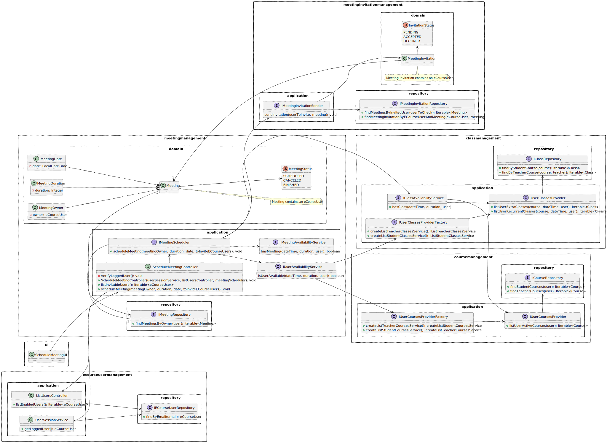
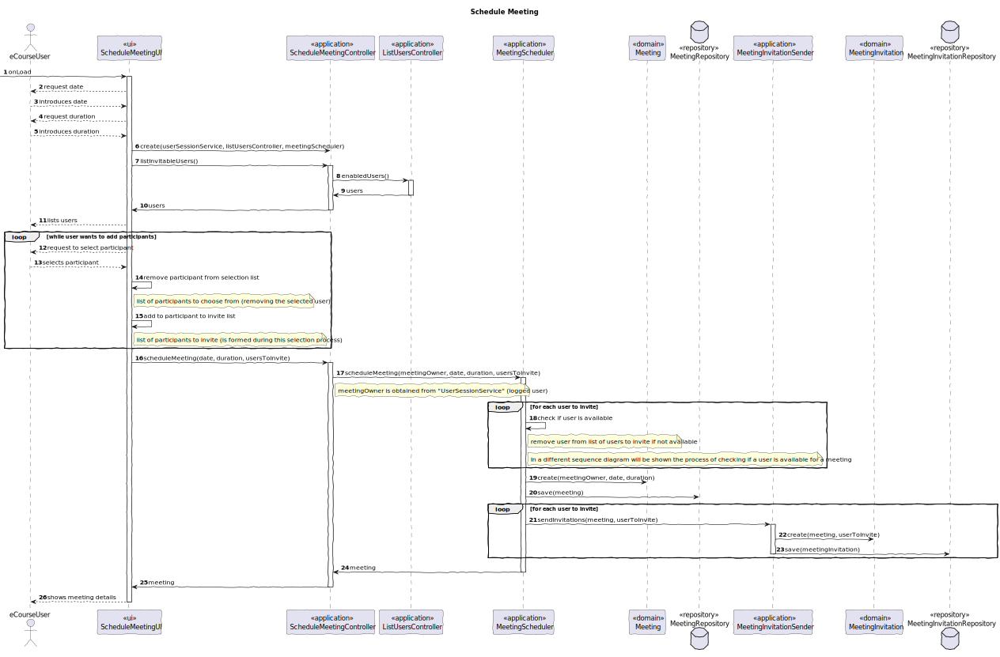
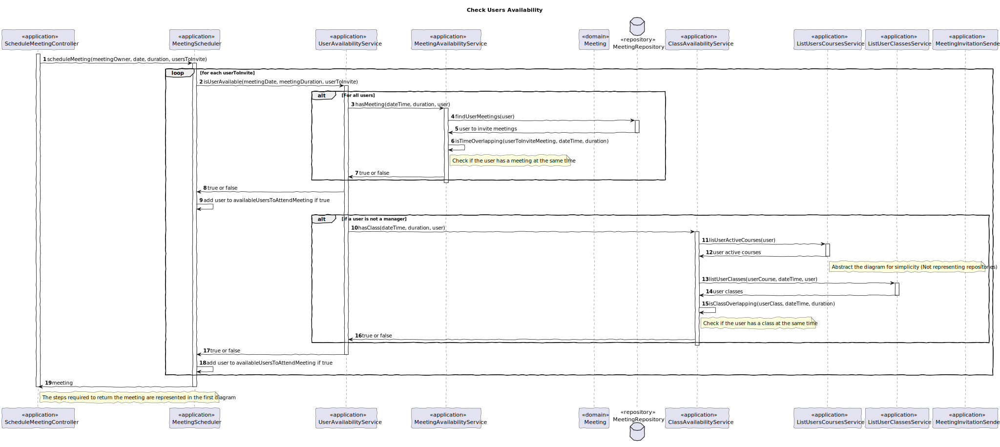

# US4001 — As User, I want to schedule a meeting

## 1. Context

Any user can schedule a meeting.
Note that the user that is scheduling the meeting can invite any other user
(active), later on, the invited user can accept or decline the invitation.

---

## 2. Requirements

It is required that the following use case is implemented:

* **UC4001.1** As a User, I want to schedule a meeting.

### Client Clarifications

#### System Specifications Document

- FRM01 - The system must check if all participants are available and send invitations to participants
- All users are able to execute this feature

#### Client Forum

- FRM01 relates to the fact that the system should check if participants are available before sending the invitations. 
For instance, checking if a user has no other class or meeting at the same time. The system should only invite 
participants with a free calendar at the time of the meeting.

---

## 3. Analysis

To be able to schedule a meeting, the user must input a date/time and a duration for the meeting.

The user must also select the participants from a list of all the active users.
In US1001 we already have the feature of listing all the active users, so it makes sense to re-utilize the controller
from that use case.

The system must then check the availability of each participant, and only send invitations to the participants that are
available at the date and time of the meeting.

*Regards*

- As expected, meetings will only be created with dates that are planned for the future, so the system must check if the
  date is valid (not in the past).

---

## 4. Design

The design for this user story is presented in the following subsections.

The main concern of this user story is to schedule a meeting, and to do so, the user must input a date/time and a duration.

The user must also select the participants from a list of all the active users.
And it is here that some design decisions were made.

The first decision was to re-utilize the controller from US1001, since it already has the feature of listing all the
active users.

The second decision was to create a domain service, the MeetingScheduler, responsible for managing the process of the
creation of the meeting itself.

This service commands the whole validation process for each user to invite, following the tell, don't ask principle.
For that, it was decided to create services that are responsible for verifying the availability of each user for each 
applicational event, such as meetings and classes.

### 4.1. Class Diagram



By using factories and interfaces, we create a much more flexible and extensible system; that is also easier to test.
Per example, the ClassAvailabilityService only knows that it needs to check the availability of a user for a class,
so it doesn't know how to get the classes, being able to receive classes from both students and teachers.


### 4.2. Sequence Diagrams

**[UC4001.1] As a User, I want to schedule a meeting.**



Bellow is represented the sequence diagram for the use case of checking the availability of a user for a meeting.



#### 4.2.1. Sequence Diagram Decisions

It was decided to split the sequence diagram in two, to make it easier to understand.

* To list the active users, the controller from US1001 is used.
* To schedule meetings, the MeetingScheduler is used.

*The meeting scheduler is a domain service responsible for managing the process of the creation of the meeting itself.
This service is responsible for verifying the available users for the upcoming meeting, scheduling the meeting and
creating the invites associated to the scheduled meeting.*

### 4.3. Applied Patterns

Some main patterns used in this user story as a whole are:

* **Controller:** *The controller is responsible for handling the user input, and orchestrating (controlling) the use
  cases.*

* **Single Responsibility Principle + High Cohesion:** *Every class has only one responsibility, which leads to higher
  cohesion.*

* **Tell, don't ask:** *The MeetingSchedulerController doesn't get information and then makes the decision, rather than
that, it tells the MeetingScheduler to perform the required operations.*

* **Creator Pattern:** *The MeetingScheduler registers meetings and has the necessary data to initialize meetings 
(always on a valid state).* 

* **Dependency Injection:** *Instead of instantiating the repositories or services that will be used inside the classes,
  they are received by parameter.*

* **Information Expert:** *The meetingRepository is the IE of meetings.*

* **Low Coupling + Dependency Inversion:** *All the classes are loosely coupled, not depending on concrete classes,
  rather depending on interfaces.*

Overall, the SOLID and GRASP principles were applied.
Reinforcing the fact that the code is easy to read, understand, maintain and extend.
Interfaces were used to make the code more flexible and extensible.

### 4.4. Tests

Since, for now, there is only the requirement of having unit tests, only those were implemented.

Notes:
- All test cases, both unit and integration, can and should be also executed manually, by running the application
  and assuring that everything is running smoothly.

##### 4.4.1 Unit Tests

| Test Case | Description                                        | Expected Result               |
|:---------:|:---------------------------------------------------|:------------------------------|
|     1     | Create a meeting with valid data                   | Meeting is created            |
|     2     | Create a meeting with invalid duration             | Exception is thrown           |
|     3     | Create a meeting with invalid date                 | Exception is thrown           |
|     4     | Ensure available participant is invited            | Meeting Invitation is created |
|     5     | Ensure unavailable participant is not invited      | Truthful comparison           |
|     6     | Ensure meeting is created with SCHEDULED state     | Truthful comparison           |
|     7     | Ensure meeting is not created when no user invited | Truthful comparison           |

---

## 5. Demonstration

https://github.com/Departamento-de-Engenharia-Informatica/sem4pi-22-23-16-1/assets/106761319/d56d336e-add4-483b-bf9e-b1bf6f08ea5d

**Important**

*In the demonstration, we can see some key points about this User Story.*
*It is visible that the user scheduling the meeting can invite any of the active eCourse users.*
*Even if some participants are not available, the meeting is still schedule with the available invited participants.*

---

## 6. Implementation

### 6.1. MeetingSchedulerController

The meeting scheduler controller is the middleman between the user and the meeting scheduler.

It is responsible for orchestrating the use case.

````java
public class ScheduleMeetingController {

    private final UserSessionService userSessionService;

    private final ListUsersController listUsersController;

    private final MeetingScheduler meetingScheduler;

    private ECourseUser meetingOwner;

    /**
     * Instantiates a new Schedule meeting controller.
     *
     * @param userSessionService  the user session service
     * @param listUsersController the list users controller
     * @param meetingScheduler    the meeting scheduler
     *
     * @throws IllegalArgumentException if any of the parameters is null
     */
    public ScheduleMeetingController(UserSessionService userSessionService, ListUsersController listUsersController,
                                     MeetingScheduler meetingScheduler) {
        // Verify if the userSessionService is null
        if (userSessionService == null) {
            throw new IllegalArgumentException("The userSessionService cannot be null.");
        }

        this.userSessionService = userSessionService;

        // Verify if the listUsersController is null
        if (listUsersController == null) {
            throw new IllegalArgumentException("The listUsersController cannot be null.");
        }

        this.listUsersController = listUsersController;

        // Verify if the meetingScheduler is null
        if (meetingScheduler == null) {
            throw new IllegalArgumentException("The meetingScheduler cannot be null.");
        }

        this.meetingScheduler = meetingScheduler;
    }

    private void verifyUser() {
        Optional<ECourseUser> eCourseUserOptional = userSessionService.getLoggedUser();

        eCourseUserOptional.ifPresentOrElse(
                eCourseUser -> this.meetingOwner = eCourseUser,
                () -> {
                    throw new IllegalStateException("No eCourse user found. Make sure you are registered.");
                }
        );
    }

    /**
     * List invitable users (enabled in the system).
     *
     * @return the iterable
     */
    public Iterable<ECourseUser> listInvitableUsers() {
        // Make sure the user is logged in
        verifyUser();

        return listUsersController.enabledUsers();
    }

    /**
     * Attempt to schedule the meeting with the given data by the meeting owner.
     *
     * @param meetingDate     the meeting date
     * @param meetingDuration the meeting duration
     * @param usersToInvite   the users to invite
     * @return the meeting
     */
    public Meeting scheduleMeeting(LocalDateTime meetingDate, Integer meetingDuration,
                                   Iterable<ECourseUser> usersToInvite) {
        // Attempt to schedule the requested meeting
        return meetingScheduler.scheduleMeeting(meetingOwner, meetingDate, meetingDuration, usersToInvite);
    }

}
````

### 6.2. MeetingScheduler

The meeting scheduler is responsible for managing the process of the creation of the meeting itself.

````java
public class MeetingScheduler implements IMeetingScheduler {

    private final IUserAvailabilityService userAvailabilityService;

    private final IMeetingRepository meetingRepository;

    private final IMeetingInvitationSender meetingInvitationSender;

    /**
     * Instantiates a new Meeting scheduler.
     *
     * @param userAvailabilityService the user availability service
     */
    public MeetingScheduler(IUserAvailabilityService userAvailabilityService, IMeetingRepository meetingRepository,
                            IMeetingInvitationSender meetingInvitationSender) {
        // Verify if the meetingRepository is null
        if (userAvailabilityService == null) {
            throw new IllegalArgumentException("The user availability service cannot be null.");
        }

        this.userAvailabilityService = userAvailabilityService;

        // Verify if the meetingRepository is null
        if (meetingRepository == null) {
            throw new IllegalArgumentException("The meeting repository cannot be null.");
        }

        this.meetingRepository = meetingRepository;

        // Verify if the meetingInvitationSender is null
        if (meetingInvitationSender == null) {
            throw new IllegalArgumentException("The meeting invitation sender cannot be null.");
        }

        this.meetingInvitationSender = meetingInvitationSender;
    }

    private void sendMeetingInvitations(Meeting meeting, Iterable<ECourseUser> usersToInvite) {
        // Send the meeting invitations
        for (ECourseUser userToInvite : usersToInvite) {
            meetingInvitationSender.sendInvitation(userToInvite, meeting);
        }
    }

    @Override
    public Meeting scheduleMeeting(ECourseUser meetingOwner, LocalDateTime meetingDate, Integer meetingDuration,
                                   Iterable<ECourseUser> usersToInvite) {
        // List of users that are available to attend the meeting
        List<ECourseUser> availableUsersToAttendMeeting = new ArrayList<>();

        // Verify which users to invite are available to attend the meeting
        for (ECourseUser userToInvite : usersToInvite) {
            if (userAvailabilityService.isUserAvailable(meetingDate, meetingDuration, userToInvite) &&
                    !userToInvite.equals(meetingOwner)) {
                availableUsersToAttendMeeting.add(userToInvite);
            }
        }

        // Verify the list of available users is not empty
        if (availableUsersToAttendMeeting.isEmpty()) {
            throw new IllegalArgumentException("There are no available users to attend the meeting.");
        }

        // Create the meeting
        Meeting savedMeeting = meetingRepository.save(new Meeting(meetingDate, meetingDuration, meetingOwner));

        // Add the available users to attend the meeting
        sendMeetingInvitations(savedMeeting, availableUsersToAttendMeeting);

        // Return the meeting
        return savedMeeting;
    }
}
````

### 6.3. MeetingInvitationSender

The meeting invitation sender is responsible for sending the meeting invitations to the users.

````java
public class MeetingInvitationSender implements IMeetingInvitationSender {

    private final IMeetingInvitationRepository meetingInvitationRepository;

    /**
     * Instantiates a new Meeting invitation sender.
     *
     * @param meetingInvitationRepository the meeting invitation repository
     */
    public MeetingInvitationSender(IMeetingInvitationRepository meetingInvitationRepository) {
        // Verify if the meetingInvitationRepository is null
        if (meetingInvitationRepository == null) {
            throw new IllegalArgumentException("The meeting invitation repository cannot be null.");
        }

        this.meetingInvitationRepository = meetingInvitationRepository;
    }

    private Optional<MeetingInvitation> checkIfMeetingInvitationAlreadyExists(ECourseUser userToInvite,
                                                                              Meeting meeting) {
        return meetingInvitationRepository.findMeetingInvitationByECourseUserAndMeeting(userToInvite, meeting);
    }

    @Override
    public void sendInvitation(ECourseUser userToInvite, Meeting meeting) {
        // Verify if the userToInvite is null
        if (userToInvite == null) {
            throw new IllegalArgumentException("The user to invite cannot be null.");
        }

        // Verify if the meeting is null
        if (meeting == null) {
            throw new IllegalArgumentException("The meeting cannot be null.");
        }

        // Verify if the meeting invitation already exists
        if (checkIfMeetingInvitationAlreadyExists(userToInvite, meeting).isPresent()) {
            throw new IllegalArgumentException("The meeting invitation already exists.");
        }

        // Create the meeting invitation
        MeetingInvitation meetingInvitation = new MeetingInvitation(userToInvite, meeting);

        // Save the meeting invitation
        meetingInvitationRepository.save(meetingInvitation);
    }
}
````

### 6.4. MeetingAvailabilityService

The meeting availability service is responsible for checking if the user is available to attend the meeting.

````java
public class MeetingAvailabilityService implements IMeetingAvailabilityService {

    private final IMeetingRepository meetingRepository;

    private final IMeetingInvitationRepository meetingInvitationRepository;

    /**
     * Instantiates a new meeting availability service.
     *
     * @param meetingRepository the meeting repository
     */
    public MeetingAvailabilityService(IMeetingRepository meetingRepository,
                                      IMeetingInvitationRepository meetingInvitationRepository) {
        // Verify if the meetingRepository is null
        if (meetingRepository == null) {
            throw new IllegalArgumentException("The meeting repository cannot be null.");
        }

        this.meetingRepository = meetingRepository;

        // Verify if the meetingInvitationRepository is null
        if (meetingInvitationRepository == null) {
            throw new IllegalArgumentException("The meeting invitation repository cannot be null.");
        }

        this.meetingInvitationRepository = meetingInvitationRepository;
    }

    private Iterable<Meeting> findUserToCheckMeetingsAsOwner(ECourseUser userToCheck) {
        return meetingRepository.findMeetingsByOwner(userToCheck);
    }

    private Iterable<Meeting> findUserToCheckMeetingsAsInvitedUser(ECourseUser userToCheck) {
        return meetingInvitationRepository.findMeetingsByInvitedUser(userToCheck);
    }

    private LocalDateTime addDurationToMeetingDate(LocalDateTime meetingDate, Integer meetingDuration) {
        return meetingDate.plusMinutes(meetingDuration);
    }

    /**
     * Checks if the meeting to check overlaps the userToInviteMeeting.
     *
     * @param userToInviteMeeting already scheduled meeting that the user is expected to attend
     * @param meetingToCheckDate the date of the meeting to check
     * @param meetingToCheckDuration the duration of the meeting to check
     * @return true if the meeting to check overlaps the userToInviteMeeting, false otherwise
     */
    private boolean isTimeOverlapping(Meeting userToInviteMeeting, LocalDateTime meetingToCheckDate,
                                      Integer meetingToCheckDuration) {
        // Expected date for userToInviteMeeting to end
        LocalDateTime userToInviteMeetingEndDate =
                addDurationToMeetingDate(userToInviteMeeting.scheduledMeetingDate().retrieveDate(),
                        userToInviteMeeting.expectedDuration().retrieveDuration());

        // Expected date for meetingToSchedule to end
        LocalDateTime meetingToCheckEndDate = addDurationToMeetingDate(meetingToCheckDate, meetingToCheckDuration);

        // Verify if the userToInviteMeeting overlaps the meetingToCheck
        if (meetingToCheckDate.isBefore(userToInviteMeeting.scheduledMeetingDate().retrieveDate()) &&
                meetingToCheckEndDate.isBefore(userToInviteMeeting.scheduledMeetingDate().retrieveDate())) {
            return false;
        }

        else return !meetingToCheckDate.isAfter(userToInviteMeetingEndDate);
    }

    @Override
    public boolean hasMeeting(LocalDateTime dateTime, Integer duration, ECourseUser user) {
        // Retrieve the meetings of the user to check where he is the owner
        List<Meeting> userToInviteMeetings = (List<Meeting>) findUserToCheckMeetingsAsOwner(user);

        // Retrieve the meetings of the user to check where he is an invited user
        userToInviteMeetings.addAll((List<Meeting>) findUserToCheckMeetingsAsInvitedUser(user));

        if (userToInviteMeetings.isEmpty()) return false;

        boolean isOverlapping = false;

        // Verify if the userToCheck has a meeting scheduled for the same date and time
        for (Meeting userToInviteMeeting : userToInviteMeetings) {
            if (isTimeOverlapping(userToInviteMeeting, dateTime, duration)) {
                isOverlapping = true;
            }
        }

        return isOverlapping;
    }
}
````

### 6.5. UserAvailabilityService

The user availability service is responsible for checking if the user is available to attend the meeting.
It is responsible for interacting with the meeting availability service and the class availability service.

````java
public class UserAvailabilityService implements IUserAvailabilityService {

    private final IMeetingAvailabilityService meetingAvailabilityService;

    private final IListUserClassesFactory listUserClassesFactory;

    private final IListUserCoursesFactory listUserCoursesFactory;

    private IListUserClassesService listUserClassesService;

    private IListUserCoursesService listUserCoursesService;

    /**
     * Instantiates a new User availability service.
     *
     * @param meetingAvailabilityService the meeting availability service
     * @param listUserClassesFactory     the list user classes factory
     * @param listUserCoursesFactory     the list user courses factory
     */
    public UserAvailabilityService(IMeetingAvailabilityService meetingAvailabilityService,
                                   IListUserClassesFactory listUserClassesFactory,
                                   IListUserCoursesFactory listUserCoursesFactory) {
        // Verify that the meetingAvailabilityService is not null
        if (meetingAvailabilityService == null) {
            throw new IllegalArgumentException("meetingAvailabilityService cannot be null");
        }

        this.meetingAvailabilityService = meetingAvailabilityService;

        // Verify that the listUserClassesFactory is not null
        if (listUserClassesFactory == null) {
            throw new IllegalArgumentException("listUserClassesFactory cannot be null");
        }

        this.listUserClassesFactory = listUserClassesFactory;

        // Verify that the listUserCoursesFactory is not null
        if (listUserCoursesFactory == null) {
            throw new IllegalArgumentException("listUserCoursesFactory cannot be null");
        }

        this.listUserCoursesFactory = listUserCoursesFactory;
    }

    private void classAvailabilityAccordingToRole(ECourseUser user) {
        // If the user is a student
        if (user.isStudent()) {
            listUserCoursesService = listUserCoursesFactory.createListStudentCoursesService();
            listUserClassesService = listUserClassesFactory.createListStudentClassesService();
        }

        // If the user is a teacher
        else if (user.isTeacher()) {
            listUserCoursesService = listUserCoursesFactory.createListTeacherCoursesService();
            listUserClassesService = listUserClassesFactory.createListTeacherClassesService();
        }

    }

    @Override
    public boolean isUserAvailable(LocalDateTime dateTime, Integer duration, ECourseUser user) {
        // Verify if the user is a manager
        if (!user.isStudent() && !user.isTeacher()) {
            return !meetingAvailabilityService.hasMeeting(dateTime, duration, user);
        }

        // Get the listUserClassesService and listUserCoursesService according to the user role
        classAvailabilityAccordingToRole(user);

        IClassAvailabilityService classAvailabilityService = new ClassAvailabilityService(listUserCoursesService,
                listUserClassesService);

        return !meetingAvailabilityService.hasMeeting(dateTime, duration, user) && !classAvailabilityService
                .hasClass(dateTime, duration, user);
    }
}
````
