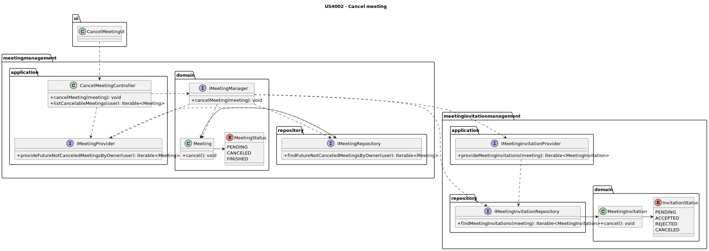
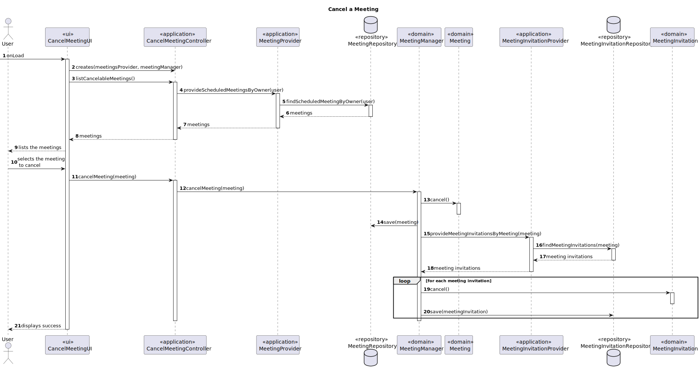

# US4002 —  As a User, I want to cancel a meeting

## 1. Context

Users may create meetings.
Meeting can be later canceled by the user that created them.

## 2. Requirements

- The creator of the meeting can cancel it.
- The meeting is canceled when the creator of the meeting cancels it.
- The invitations are canceled when the meeting is canceled.

### Client Clarifications

#### System Specifications Document

- FRM02 Cancel Meeting A user cancels a meeting that he owns

## 3. Analysis/Breakdown
    
This is a simple user story, that can be divided in two main parts:
- Selection of the meeting to cancel;
- Changing the state of the meeting and of the invitations to cancel.

### 3.1. Selection of the meeting to cancel

The user must be presented with the meeting that he owns, that are not canceled, and that are in the future.
Then he only needs to select the meeting that he wants to cancel.

### 3.2. Changing the state of the meeting and of the invitations to cancel

After the user selects the meeting that he wants to cancel, the state of the meeting and of the invitations must be
changed to cancel.  
There are some verifications that must be made before changing the state of the meeting and of the invitations:
- The meeting must not be canceled;
- The meeting must be in the future;
- The user must be the creator of the meeting.

Even if some of the invitations are already accepted/rejected, they must be canceled.

## 4. Design

### 4.1. Class Diagram

Beyond the already existing classes, and the normal classes that are created for the use cases, there won't be any new
classes created for this user story.  
There is already a service responsible for managing the meetings, ***MeetingManager***, that will be used to cancel the
meeting, and the invitations.



### 4.2. Sequence Diagram



*Notes:*
- The UserSessionService used to get the user that is logged is not represented as it is not
relevant for this user story and is already represented in other diagrams.

### 4.3. Applied Patterns

Some main patterns used in this user story as a whole are:

* **Low Coupling:** *The classes are not dependent on each other, rather they are dependent on abstractions, and the
dependencies are injected by parameter.*
* **Dependency Injection:** *Instead of instantiating the repositories or services that will be used inside the classes,
they are received by parameter.*
* **Single Responsibility + High Cohesion:** *All the classes have only one responsibility, and they are highly cohesive,
as they only have methods related to their responsibility.*

*The dependency injection should be made with the help of a framework, such as Spring, but since the project is not
using any framework, it was decided to use the constructor injection, which is the most basic form of dependency
injection. By using dependency injection, the code is more scalable, flexible, and it is easier to test.  
*Since we are using the controller from another US, it would be nice to have an interface for the controller, so that
we could inject the dependency of the controller, instead of instantiating it inside the class. But since this is a
rather simple application, and the controller is not a complex class, it was decided to instantiate it inside the
class, and not create an interface for it. This note serves as a reminder that, in a real world application, this
should be done, to reduce the coupling even more.

### 4.4. Tests

#### 4.4.1. Unit Tests

Some of the most important unit tests are:

- Ensure a cancelable meeting is canceled;
- Ensure that a meeting that is already canceled is not canceled again;
- Ensure that a meeting that is not cancelable is not canceled;

- Ensure a meeting invitation is canceled;
- Ensure that a meeting invitation that is already canceled is not canceled again;


``
@Test
public void ensureCancellableMeetingIsCancelled() {
// Arrange
LocalDateTime meetingDate = LocalDateTime.of(2026, 5, 5, 5, 5);
Integer meetingDuration = 45;
ECourseUser meetingOwner = UserDataSource.getTestManager1();

        Meeting meeting = new Meeting(meetingDate, meetingDuration, meetingOwner);

        // Act
        meeting.cancelMeeting();

        // Assert
        Assert.assertEquals(MeetingStatus.CANCELLED, meeting.currentStatus());
    }
``


## 5. Demonstration

### Video canceling a meeting


## 6. Implementation

Here is a list of the main classes and their responsibilities:

- **Meeting** (Domain Object): Represents a meeting.

````java
@Entity
public class Meeting implements AggregateRoot<Long> {

    private static final long serialVersionUID = 1L;

    @Id
    @GeneratedValue(strategy = GenerationType.AUTO)
    private Long id;

    @Embedded
    private MeetingDate meetingDate;

    @Embedded
    private MeetingDuration meetingDuration;

    @Enumerated(EnumType.STRING)
    private MeetingStatus meetingStatus;

    @ManyToOne(fetch = FetchType.EAGER)
    private ECourseUser meetingOwner;

    protected Meeting() {
        // For ORM
    }

    /**
     * Instantiates a new Meeting.
     *
     * @param meetingDate     the meeting date
     * @param meetingDuration the meeting duration
     * @param meetingOwner    the meeting owner
     * @throws IllegalArgumentException the illegal argument exception
     */
    public Meeting(LocalDateTime meetingDate, Integer meetingDuration, ECourseUser meetingOwner) {
        // Verify if the eCourseUser is not null
        if (meetingOwner == null) {
            throw new IllegalArgumentException("Meeting owner cannot be null");
        }

        this.meetingOwner = meetingOwner;

        // Create the meeting date
        this.meetingDate = new MeetingDate(meetingDate);

        // Create the meeting duration
        this.meetingDuration = new MeetingDuration(meetingDuration);

        // Meeting status is set to schedule
        this.meetingStatus = MeetingStatus.SCHEDULED;
    }

    /**
     * Current status for the meeting.
     *
     * @return the current meeting status
     */
    public MeetingStatus currentStatus() {
        return this.meetingStatus;
    }

    /**
     * Cancel meeting.
     *
     * @throws IllegalStateException if the meeting is already canceled
     * @throws IllegalStateException if the meeting is already finished
     * @throws IllegalStateException if the meeting is in the past
     */
    public void cancelMeeting() {
        // Verify if the meeting is already canceled
        if (this.currentStatus() == MeetingStatus.CANCELLED) {
            throw new IllegalStateException("Can't cancel an already canceled Meeting!");
        }

        // Verify if the meeting is occurring
        else if (this.currentStatus() == MeetingStatus.IN_PROGRESS) {
            throw new IllegalStateException("Can't cancel an ongoing Meeting!");
        }

        // Verify if the meeting is already finished
        else if (this.currentStatus() == MeetingStatus.FINISHED) {
            throw new IllegalStateException("Can't cancel a finished Meeting!");
        }

        // Set the meeting status to canceled
        this.meetingStatus = MeetingStatus.CANCELLED;
    }

    /**
     * Finish meeting.
     *
     * @throws IllegalStateException if the meeting is already canceled
     * @throws IllegalStateException if the meeting is already finished
     */
    public void finishMeeting() {
        // Verify if the meeting is ongoing
        if (this.currentStatus() != MeetingStatus.IN_PROGRESS) {
            throw new IllegalStateException("A Meeting can only be finished if it is ongoing!");
        }

        // Set the meeting status to finished
        this.meetingStatus = MeetingStatus.FINISHED;
    }

    /**
     * Start meeting.
     *
     * @throws IllegalStateException if the meeting is already canceled
     * @throws IllegalStateException if the meeting is already finished
     * @throws IllegalStateException if the meeting has already started
     */
    public void startMeeting() {
        // Verify if the meeting is already canceled
        if (this.currentStatus() == MeetingStatus.CANCELLED) {
            throw new IllegalStateException("It is not possible to start a canceled meeting");
        }

        // Verify if the meeting is already finished
        else if (this.currentStatus() == MeetingStatus.FINISHED) {
            throw new IllegalStateException("It is not possible to start a finished meeting");
        }

        // Verify if the meeting has already started
        else if (this.currentStatus() == MeetingStatus.IN_PROGRESS) {
            throw new IllegalStateException("It is not possible to start a meeting that has already started");
        }

        // Set the meeting status to started
        this.meetingStatus = MeetingStatus.IN_PROGRESS;
    }

    /**
     * Retrieve the meeting owner.
     *
     * @return the meeting owner
     */
    public ECourseUser meetingOwner() {
        return this.meetingOwner;
    }

    /**
     * Retrieve the meeting date.
     *
     * @return the meeting date
     */
    public MeetingDate scheduledMeetingDate() {
        return this.meetingDate;
    }

    /**
     * Retrieve the meeting duration.
     *
     * @return the meeting duration
     */
    public MeetingDuration expectedDuration() {
        return this.meetingDuration;
    }

    @Override
    public String toString() {
        return "Date = " + meetingDate.toString() + "\n" +
                "Duration = " + meetingDuration.retrieveDuration() + " min" + "\n" +
                "Status = " + meetingStatus + "\n" +
                "Owner = " + meetingOwner.identity() + "\n";
    }

    @Override
    public boolean sameAs(Object other) {
        if (!(other instanceof Meeting)) {
            return false;
        }

        final Meeting that = (Meeting) other;

        return this.meetingOwner.sameAs(that.meetingOwner) && this.meetingDate.equals(that.meetingDate) &&
                this.meetingDuration.equals(that.meetingDuration);
    }

    @Override
    public Long identity() {
        return this.id;
    }
}
````

- **MeetingInvitation** (Domain Object): Represents a meeting invitation.

````java
@Entity
public class MeetingInvitation implements AggregateRoot<Long> {

    private static final long serialVersionUID = 1L;

    @Id
    @GeneratedValue(strategy = GenerationType.AUTO)
    private Long id;

    @ManyToOne
    private ECourseUser invitedParticipant;

    @ManyToOne
    private Meeting meeting;

    @Enumerated(EnumType.STRING)
    private InvitationStatus invitationStatus;

    /**
     * Instantiates a new meeting invitation.
     *
     * @param invitedParticipant the invited participant
     *
     * @throws IllegalArgumentException if the meeting is null
     * @throws IllegalArgumentException if the invitedParticipant is null
     */
    public MeetingInvitation(final ECourseUser invitedParticipant, final Meeting meeting) {
        // Verify if the invitedParticipant is not null
        if (invitedParticipant == null) {
            throw new IllegalArgumentException("Invited Participant can't be null");
        }

        this.invitedParticipant = invitedParticipant;

        // Verify if the meeting is not null
        if (meeting == null) {
            throw new IllegalArgumentException("Meeting can't be null");
        }

        this.meeting = meeting;

        // Default invitation status
        this.invitationStatus = InvitationStatus.PENDING;
    }

    public MeetingInvitation() {
        // For ORM
    }

    public ECourseUser invitedParticipant() {
        return this.invitedParticipant;
    }

    /**
     * Invitation status string.
     *
     * @return the string
     */
    public InvitationStatus invitationStatus() {
        return invitationStatus;
    }

    /**
     * Accept a meeting invitation.
     *
     * @throws IllegalStateException if the meeting invitation status is not set to scheduled
     */
    public void accept() {
        // Verify if the meeting invitation is already accepted
        if (invitationStatus == InvitationStatus.ACCEPTED) {
            throw new IllegalStateException("Meeting invitation already accepted");
        }

        // Verify if the meeting invitation is already rejected
        if (invitationStatus == InvitationStatus.REJECTED) {
            throw new IllegalStateException("Meeting invitation already rejected");
        }

        // Verify if the meeting invitation is already canceled
        if (invitationStatus == InvitationStatus.CANCELED) {
            throw new IllegalStateException("Meeting invitation already canceled");
        }

        // Change the meeting invitation status to accepted
        invitationStatus = InvitationStatus.ACCEPTED;
    }

    /**
     * Reject a meeting invitation.
     *
     * @throws IllegalStateException if the meeting invitation status is not set to scheduled
     */
    public void reject() {
        // Verify if the meeting invitation is already rejected
        if (invitationStatus == InvitationStatus.REJECTED) {
            throw new IllegalStateException("Meeting invitation already rejected!");
        }

        // Verify if the meeting has been accepted
        if (invitationStatus == InvitationStatus.ACCEPTED) {
            throw new IllegalStateException("Meeting invitation already accepted!");
        }

        // Verify if the meeting has been canceled
        if (invitationStatus == InvitationStatus.CANCELED) {
            throw new IllegalStateException("Meeting invitation already canceled!");
        }

        // Change the meeting invitation status to rejected
        invitationStatus = InvitationStatus.REJECTED;
    }

    /**
     * Cancel a meeting invitation.
     *
     * @throws IllegalStateException if the meeting invitation is already canceled
     */
    public void cancel(){
        // Verify if the meeting invitation is already canceled
        if (invitationStatus == InvitationStatus.CANCELED) {
            throw new IllegalStateException("Meeting invitation already canceled");
        }

        // Change the meeting invitation status to canceled
        invitationStatus = InvitationStatus.CANCELED;
    }

    @Override
    public String toString() {
        return "Meeting Owner: " + meeting.meetingOwner().identity() + " | Meeting Date: " +
                meeting.scheduledMeetingDate().retrieveDate() + " | Invitation Status - " + invitationStatus;
    }

    @Override
    public boolean sameAs(Object other) {
        return false;
    }

    @Override
    public Long identity() {
        return this.id;
    }
}
````

- **MeetingManager:** Implementation of the service responsible for managing the meetings.

````java
public class MeetingManager implements IMeetingManager {

    private final IUserAvailabilityService userAvailabilityService;

    private final IMeetingRepository meetingRepository;

    private final IMeetingInvitationRepository meetingInvitationRepository;

    private final IMeetingInvitationSender meetingInvitationSender;

    private final IMeetingInvitationProvider meetingInvitationProvider;

    /**
     * Instantiates a new Meeting scheduler.
     *
     * @param userAvailabilityService the user availability service
     */
    public MeetingManager(IUserAvailabilityService userAvailabilityService,
                          IMeetingRepository meetingRepository,
                          IMeetingInvitationRepository meetingInvitationRepository,
                          IMeetingInvitationSender meetingInvitationSender,
                          IMeetingInvitationProvider meetingInvitationProvider) {
        // Verify if the meetingRepository is null
        if (userAvailabilityService == null) {
            throw new IllegalArgumentException("The user availability service cannot be null.");
        }

        this.userAvailabilityService = userAvailabilityService;

        // Verify if the meetingRepository is null
        if (meetingRepository == null) {
            throw new IllegalArgumentException("The meeting repository cannot be null.");
        }

        this.meetingRepository = meetingRepository;

        // Verify if the meetingInvitationRepository is null
        if (meetingInvitationRepository == null) {
            throw new IllegalArgumentException("The meeting invitation repository cannot be null.");
        }

        this.meetingInvitationRepository = meetingInvitationRepository;

        // Verify if the meetingInvitationSender is null
        if (meetingInvitationSender == null) {
            throw new IllegalArgumentException("The meeting invitation sender cannot be null.");
        }

        this.meetingInvitationSender = meetingInvitationSender;

        // Verify if the meetingInvitationProvider is null
        if (meetingInvitationProvider == null) {
            throw new IllegalArgumentException("The meeting invitation provider cannot be null.");
        }

        this.meetingInvitationProvider = meetingInvitationProvider;
    }

    private void sendMeetingInvitations(Meeting meeting, Iterable<ECourseUser> usersToInvite) {
        // Send the meeting invitations
        for (ECourseUser userToInvite : usersToInvite) {
            meetingInvitationSender.sendInvitation(userToInvite, meeting);
        }
    }

    @Override
    public Meeting scheduleMeeting(ECourseUser meetingOwner, LocalDateTime meetingDate, Integer meetingDuration,
                                   Iterable<ECourseUser> usersToInvite) {
        // Verify if the meetingOwner is available to attend the meeting
        if (!userAvailabilityService.isUserAvailable(meetingDate, meetingDuration, meetingOwner)) {
            throw new IllegalArgumentException("The meeting owner is not available to attend the meeting.");
        }

        // List of users that are available to attend the meeting
        List<ECourseUser> availableUsersToAttendMeeting = new ArrayList<>();

        // Verify which users to invite are available to attend the meeting
        for (ECourseUser userToInvite : usersToInvite) {
            if (userAvailabilityService.isUserAvailable(meetingDate, meetingDuration, userToInvite) &&
                    !userToInvite.equals(meetingOwner)) {
                availableUsersToAttendMeeting.add(userToInvite);
            }
        }

        // Verify the list of available users is not empty
        if (availableUsersToAttendMeeting.isEmpty()) {
            throw new IllegalArgumentException("There are no available users to attend the meeting.");
        }

        // Create the meeting
        Meeting createdMeeting = meetingRepository.save(new Meeting(meetingDate, meetingDuration, meetingOwner));

        // Add the available users to attend the meeting
        sendMeetingInvitations(createdMeeting, availableUsersToAttendMeeting);

        // Return the meeting
        return createdMeeting;
    }

    @Override
    public void cancelMeeting(Meeting meeting) {
        // Cancel the meeting
        meeting.cancelMeeting();
        meetingRepository.save(meeting);

        // Get the meeting invitations
        Iterable<MeetingInvitation> meetingInvitations = meetingInvitationProvider.provideMeetingInvitationsByMeeting(meeting);

        // Cancel the meeting invitations
        for (MeetingInvitation meetingInvitation : meetingInvitations) {
            meetingInvitation.cancel();
            meetingInvitationRepository.save(meetingInvitation);
        }
    }
}
````

- **MeetingRepository:** Implementation of the repository responsible for managing the meetings.

````java
public class JpaMeetingRepository extends eCourseJpaRepositoryBase<Meeting, Long, Long> implements IMeetingRepository {

    /**
     * Instantiates a new Jpa meeting repository.
     *
     * @param identityFieldName the identity field name
     */
    public JpaMeetingRepository(String identityFieldName) {
        super(identityFieldName);
    }

    @Override
    public Iterable<Meeting> findScheduledMeetingByOwner(ECourseUser userToCheck) {
        final TypedQuery<Meeting> query = entityManager().createQuery("SELECT m FROM Meeting m " +
                "WHERE m.meetingOwner.email = :ownerEmail AND m.meetingStatus = :status ", Meeting.class);

        query.setParameter("ownerEmail", userToCheck.identity());
        query.setParameter("status", MeetingStatus.SCHEDULED);

        try {
            return query.getResultList();
        } catch (NoResultException e) {
            return null;
        }
    }
}
````

- **MeetingInvitationRepository:** Implementation of the repository responsible for managing the meeting invitations.

````java
public class JpaMeetingInvitationRepository extends eCourseJpaRepositoryBase<MeetingInvitation, Long, Long>
        implements IMeetingInvitationRepository {

    /**
     * Instantiates a new Jpa meeting invitation repository.
     *
     * @param identityFieldName the identity field name
     */
    public JpaMeetingInvitationRepository(String identityFieldName) {
        super(identityFieldName);
    }

    @Override
    public Optional<MeetingInvitation> findMeetingInvitationByECourseUserAndMeeting(ECourseUser eCourseUser, Meeting meeting) {
        final TypedQuery<MeetingInvitation> query = entityManager().createQuery("SELECT mi " +
                "FROM MeetingInvitation mi " +
                    "WHERE mi.invitedParticipant.email = :participantEmail " +
                        "AND mi.meeting.meetingDate.meetingDate = :meetingDate " +
                            "AND mi.meeting.meetingOwner.email = :meetingOwner", MeetingInvitation.class);

        query.setParameter("participantEmail", eCourseUser.identity());
        query.setParameter("meetingDate", meeting.scheduledMeetingDate().retrieveDate());
        query.setParameter("meetingOwner", meeting.meetingOwner().identity());

        try {
            return Optional.of(query.getSingleResult());
        } catch (NoResultException e) {
            return Optional.empty();
        }
    }

    @Override
    public Iterable<Meeting> findMeetingsByInvitedUser(ECourseUser userToCheck) {
        final TypedQuery<Meeting> query = entityManager().createQuery("SELECT mi.meeting " +
                "FROM MeetingInvitation mi " +
                    "WHERE mi.invitedParticipant.email = :participantEmail " +
                        "AND mi.meeting.meetingStatus = 'SCHEDULED'", Meeting.class);

        query.setParameter("participantEmail", userToCheck.identity());

        return query.getResultList();
    }

    @Override
    public Iterable<Meeting> findAllMeetingsByInvitedUser(ECourseUser userToCheck) {
        final TypedQuery<Meeting> query = entityManager().createQuery("SELECT mi.meeting " +
                "FROM MeetingInvitation mi " +
                "WHERE mi.invitedParticipant.email = :participantEmail ", Meeting.class);

        query.setParameter("participantEmail", userToCheck.identity());

        return query.getResultList();
    }

    @Override
    public Iterable<MeetingInvitation> findMeetingInvitationsByMeeting(Meeting meeting) {
        final TypedQuery<MeetingInvitation> query = entityManager().createQuery("SELECT mi " +
                "FROM MeetingInvitation mi " +
                    "WHERE mi.meeting.meetingDate.meetingDate = :meetingDate " +
                        "AND mi.meeting.meetingOwner.email = :meetingOwner", MeetingInvitation.class);

        query.setParameter("meetingDate", meeting.scheduledMeetingDate().retrieveDate());
        query.setParameter("meetingOwner", meeting.meetingOwner().identity());

        return query.getResultList();
    }

    @Override
    public Iterable<MeetingInvitation> findUserUncanceledMeetingInvitations(ECourseUser user) {
        final TypedQuery<MeetingInvitation> query = entityManager().createQuery("SELECT mi " +
                "FROM MeetingInvitation mi " +
                "WHERE mi.invitationStatus != 'CANCELED' " +
                "AND mi.meeting.meetingDate.meetingDate > CURRENT_DATE " +
                "AND mi.invitedParticipant.email = :userEmail", MeetingInvitation.class);

        query.setParameter("userEmail", user.identity());

        return query.getResultList();
    }
}

````

- **CancelMeetingController:** Controller responsible for canceling a meeting.

````java
public class CancelMeetingController {

    private final IMeetingProvider meetingProvider;
    private final IMeetingManager meetingManager;
    private final UserSessionService userSessionService;

    /**
     * Instantiates a new Cancel meeting controller.
     *
     * @param meetingProvider    the meeting provider
     * @param meetingManager     the meeting manager
     * @param userSessionService the user session service
     */
    public CancelMeetingController(IMeetingProvider meetingProvider, IMeetingManager meetingManager, UserSessionService userSessionService) {
        // Check if the meeting provider is not null
        if (meetingProvider == null) {
            throw new IllegalArgumentException("MeetingProvider cannot be null.");
        }
        this.meetingProvider = meetingProvider;

        // Check if the meeting manager is not null
        if (meetingManager == null) {
            throw new IllegalArgumentException("MeetingManager cannot be null.");
        }
        this.meetingManager = meetingManager;

        // Check if the user session service is not null
        if (userSessionService == null) {
            throw new IllegalArgumentException("UserSessionService cannot be null.");
        }
        this.userSessionService = userSessionService;
    }

    /**
     * Cancel a meeting.
     *
     * @param meeting the meeting to be canceled
     */
    public void cancelMeeting(Meeting meeting) {
        meetingManager.cancelMeeting(meeting);
    }

    /**
     * List cancelable meetings list.
     *
     * @return the list of cancelable meetings
     */
    public List<Meeting> listCancelableMeetings() {
        // Get the logged user
        Optional<ECourseUser> eCourseUserOptional = userSessionService.getLoggedUser();
        // Check if there is a logged user
        if (eCourseUserOptional.isEmpty()) {
            throw new IllegalStateException("No user found. Make sure you are logged.");
        }

        return meetingProvider.provideScheduledMeetingsByOwner(eCourseUserOptional.get());
    }
}

````


