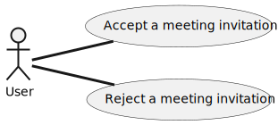
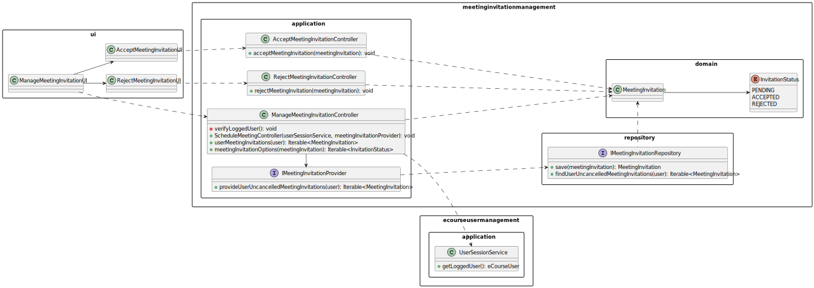
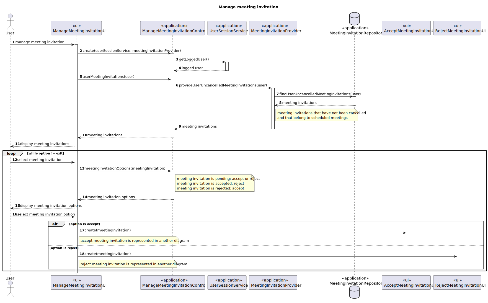
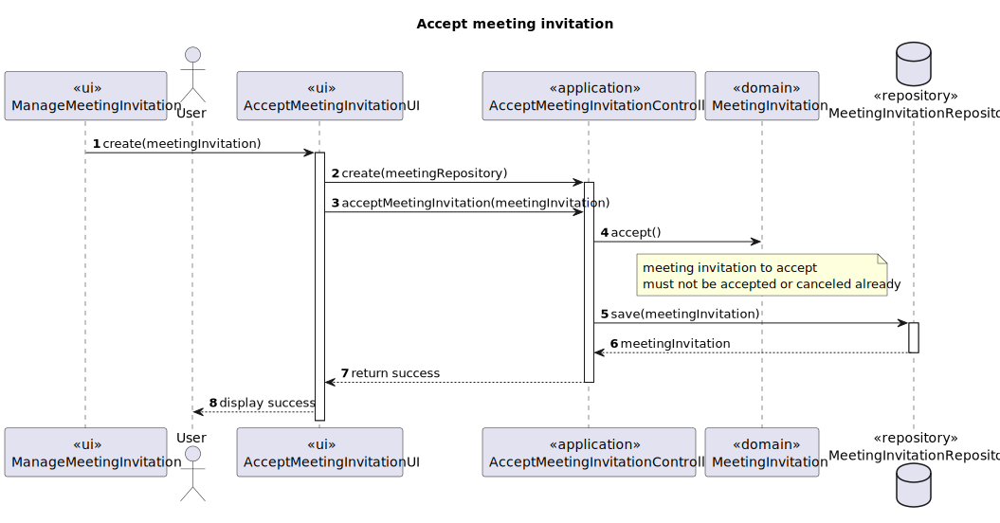
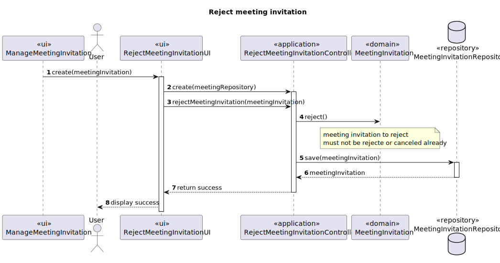

# US4003 — As a User, I want to accept or reject a meeting invitation

## 1. Context

This User Story is from the third sprint of the project, and it is heavily related to US4001 (Schedule Meeting).
The client wants to be able to accept or reject a meeting invitation, and the system should register the decision.

---

## 2. Requirements

### System Specifications

* **FRM03** A user accepts or rejects an invitation to a meeting.

### User Requirements

* **UC_ManageMeetingInvitation** As a User, I want to manage a meeting invitation.
* **UC4003.1** As a User, I want to accept a meeting invitation.
* **UC4003.2** As a User, I want to reject a meeting invitation.

---

## 3. Analysis

Meetings are created by a user, and the user can invite other users to the meeting, so to accept or reject 
a meeting invitation, the user must be invited to the meeting.

*Meeting Invitations have one of four possible states, with them being - Pending, Accepted, Rejected or Cancelled.*

Bellow are the required steps to accept or reject a meeting invitation:

1. The user must be able to select a meeting invitation.
2. The user must be able to alter the state of the meeting invitation to "ACCEPTED" or "REJECTED".

*Acceptance Criteria:*

Related to the first step, the user must only be able to select meeting invitations that are related to meetings 
in "SCHEDULED" state.

Regarding the second step, the user must be able to alter the state of the meeting invitation indefinitely.
Meaning that the user can change the state of the meeting invitation from "ACCEPTED" to "REJECTED" and vice-versa.

### 3.1. Use Case Diagram

A use case diagram was created to represent the use cases that are related to this user story.



---

## 4. Design

### 4.1. Class Diagram

*All Use Cases have been placed in the same Class Diagram for simplicity reasons, and due to the high dependencies 
between each other.*



### 4.2. Sequence Diagrams

We decided to approach this User Story having in mind a flexible solution. That would allow us to easily add more
features in the future, such as changing the state of the meeting invitation to a newer one (future requirement
per example).

To achieve this flexibility, we decided to create a new controller, "ManageEnrollmentRequestsController", that will
be responsible for handling the meeting invitations change of state. 
Connected to this controller, we have the "ManageEnrollmentRequestsUI". That will act as an Information Expert for
the selected meeting invitation and the new state. With this information, the ui will have a method to provide the 
correct implementation for the selected state.
*To provide this implementation, the controller must talk to a factory (ChangeMeetingInvitationStatusUIFactory)*

Basically:

    UI -----> Controller
    |
    |-----> UI - Accept
    |
    |------> UI - Reject

*Again, the advantage of this solution is having the possibility of expansion, example bellow:*

    UI -----> Controller
    |
    |-----> UI - Accept
    |
    |------> UI - Reject
    |
    |--------> UI - Cancell (new feature)

**[UC_ManageMeetingInvitation] - As a User, I want to manage a meeting invitation**



In this diagram, we can see the common flow for both use cases, with the difference being the selected option.

**Important**

It is important to refer that the UserSessionService is not represented at its full
due to the fact that it is not relevant for this user story and is already represented in other diagrams.

**[UC4003.1] As a User, I want to accept a meeting invitation**



In this diagram, we can see the flow for the use case of accepting a meeting invitation.
The meeting invitation is passed as a parameter when AcceptMeetingInvitationUI is instantiated because it is needed
to change the state of the meeting invitation.

**[UC4003.2] As a User, I want to reject a meeting invitation**



In this diagram, we can see the flow for the use case of rejecting a meeting invitation.
The meeting invitation is passed as a parameter when RejectMeetingInvitationUI is instantiated because it is needed
to change the state of the meeting invitation.

### 4.3. Applied Patterns

Some main patterns used in this user story as a whole are:

* **Single Responsibility Principle + High Cohesion:** *Every class has only one responsibility, which leads to higher
  cohesion.*
* **Open/Closed Principle:** *We could've considered the first 2-use cases (US4003) to be one and share a controller, but that
  would lead to possible hard times in the future if we wanted to have more flexibility with what to do with the meeting invitations.*
* **Dependency Injection:** *Instead of instantiating the repositories or services that will be used inside the classes,
  they are received by parameter.*
* **Information Expert:** *The MeetingInvitationRepository is the IE of the MeetingInvitation.*
* **Low Coupling + Dependency Inversion:** *All the classes are loosely coupled, not depending on concrete classes,
  rather depending on interfaces.*

Overall, the SOLID and GRASP principles were applied.

---

### 4.4. Tests

| Test Case | Description                                   | Expected Result                |
|:---------:|:----------------------------------------------|:-------------------------------|
|     1     | Accept, pending meeting invitation            | Meeting Invitation is accepted |
|     2     | Accept, rejected meeting invitation           | Meeting Invitation is accepted |
|     3     | Accept, accepted meeting invitation           | Exception is thrown            |
|     4     | Accept, cancelled meeting, meeting invitation | Exception is thrown            |
|     5     | Reject, pending meeting invitation            | Meeting Invitation is rejected |
|     6     | Reject, accepted meeting invitation           | Meeting Invitation is rejected |
|     7     | Reject, rejected meeting invitation           | Exception is thrown            |
|     8     | Reject, cancelled meeting, meeting invitation | Exception is thrown            |

````java
void setUp() {
        // Arrange
        LocalDateTime meetingDate = LocalDateTime.of(2026, 5, 5, 5, 5);
        Integer meetingDuration = 60;
        ECourseUser meetingOwner = UserDataSource.getTestManager1();

        Meeting meeting = new Meeting(meetingDate, meetingDuration, meetingOwner);

        // Invitation
        ECourseUser invite = UserDataSource.getTestStudent1();

        this.meetingInvitation = new MeetingInvitation(invite, meeting);
    }

    @Test
    public void ensurePendingMeetingInvitationCanBeAccepted() {
        // Arrange
        setUp();

        // Act
        this.meetingInvitation.accept();

        // Assert
        Assert.assertEquals(this.meetingInvitation.invitationStatus(), InvitationStatus.ACCEPTED);
    }

    @Test
    public void ensurePendingMeetingInvitationCanBeRejected() {
        // Arrange
        setUp();

        // Act
        this.meetingInvitation.reject();

        // Assert
        Assert.assertEquals(this.meetingInvitation.invitationStatus(), InvitationStatus.REJECTED);
    }

    @Test
    public void ensureAcceptedMeetingInvitationCanNotBeAccepted() {
        // Arrange
        setUp();

        // Act
        this.meetingInvitation.accept();

        // Assert
        Assert.assertThrows(IllegalStateException.class, () -> this.meetingInvitation.accept());
    }

    @Test
    public void ensureRejectedMeetingInvitationCanNotBeRejected() {
        // Arrange
        setUp();

        // Act
        this.meetingInvitation.reject();

        // Assert
        Assert.assertThrows(IllegalStateException.class, () -> this.meetingInvitation.reject());
    }
````

---

## 5. Demonstration

1. The user must be logged in the system.
2. The user must select the "Manage Meeting Invitations" option in the "Meetings" menu.
3. The user must select either the "Accept Meeting Invitation" option or the "Reject Meeting Invitation" option.

**To Do** - Place here the video demonstration of the user story.

---

## 6. Implementation

### 6.1. Managing Meeting Invitations Controller

````java
public class ManageMeetingInvitationController {

    private final UserSessionService userSessionService;

    private final IMeetingInvitationProvider meetingInvitationProvider;

    private ECourseUser eCourseUser;

    /**
     * Instantiates a new Manage meeting invitation controller.
     *
     * @param userSessionService        the user session service
     * @param meetingInvitationProvider the meeting invitation provider
     */
    public ManageMeetingInvitationController(final UserSessionService userSessionService,
            final IMeetingInvitationProvider meetingInvitationProvider) {
        // Verify if the user session service is not null
        if (userSessionService == null) {
            throw new IllegalArgumentException("User session service cannot be null.");
        }

        this.userSessionService = userSessionService;

        // Verify if the meeting invitation provider is not null
        if (meetingInvitationProvider == null) {
            throw new IllegalArgumentException("Meeting invitation provider cannot be null.");
        }

        this.meetingInvitationProvider = meetingInvitationProvider;

        verifyUser();
    }

    private void verifyUser() {
        Optional<ECourseUser> eCourseUserOptional = userSessionService.getLoggedUser();

        eCourseUserOptional.ifPresentOrElse(
                eCourseUser -> this.eCourseUser = eCourseUser,
                () -> {
                    throw new IllegalStateException("No eCourse user found. Make sure you are registered.");
                }
        );
    }

    /**
     * User meeting invitations for the logged user.
     *
     * @return the iterable of meeting invitations
     */
    public Iterable<MeetingInvitation> userMeetingInvitations() {
        return meetingInvitationProvider.provideUserUncanceledMeetingInvitations(eCourseUser);
    }

    /**
     * This method creates a list with the options for the meeting invitation.
     *
     * @param meetingInvitation the meeting invitation
     * @return the iterable of strings (meeting invitation options)
     */
    public Iterable<String> meetingInvitationOptions(final MeetingInvitation meetingInvitation) {
        // List with the options for the meeting invitation
        List<String> meetingInvitationOptions =
                new java.util.ArrayList<>(Arrays.asList("Accept", "Reject"));

        // Remove the status that the meeting invitation already has and the pending status
        switch (meetingInvitation.invitationStatus()) {
            case ACCEPTED:
                meetingInvitationOptions.remove("Accept");
                break;
            case REJECTED:
                meetingInvitationOptions.remove("Reject");
                break;
            default:
                break;
        }

        return meetingInvitationOptions;
    }

}
````

### 6.2. Accept Meeting Invitation Controller

````java
public class AcceptMeetingInvitationController {

    private final IMeetingInvitationRepository meetingInvitationRepository;

    public AcceptMeetingInvitationController(IMeetingInvitationRepository meetingInvitationRepository) {
        // Verify that the meetingInvitationRepository is not null
        if (meetingInvitationRepository == null) {
            throw new IllegalArgumentException("Parameter meetingInvitationRepository was null!");
        }

        this.meetingInvitationRepository = meetingInvitationRepository;
    }

    public void acceptMeetingInvitation(MeetingInvitation meetingInvitation) {
        // Verify that the meetingInvitation is not null
        if (meetingInvitation == null) {
            throw new IllegalArgumentException("Parameter meetingInvitation was null!");
        }

        // Reject the meeting invitation
        meetingInvitation.accept();

        // Save the meeting invitation
        meetingInvitationRepository.save(meetingInvitation);
    }

}
````

### 6.3. Reject Meeting Invitation Controller

````java
public class RejectMeetingInvitationController {

    private final IMeetingInvitationRepository meetingInvitationRepository;

    public RejectMeetingInvitationController(IMeetingInvitationRepository meetingInvitationRepository) {
        // Verify that the meetingInvitationRepository is not null
        if (meetingInvitationRepository == null) {
            throw new IllegalArgumentException("Parameter meetingInvitationRepository was null!");
        }

        this.meetingInvitationRepository = meetingInvitationRepository;
    }

    public void rejectMeetingInvitation(MeetingInvitation meetingInvitation) {
        // Verify that the meetingInvitation is not null
        if (meetingInvitation == null) {
            throw new IllegalArgumentException("Parameter meetingInvitation was null!");
        }

        // Reject the meeting invitation
        meetingInvitation.reject();

        // Save the meeting invitation
        meetingInvitationRepository.save(meetingInvitation);
    }
}
````

### 6.4. Meeting Invitation Provider

````java
public class MeetingInvitationProvider implements IMeetingInvitationProvider {

    private final IMeetingInvitationRepository meetingInvitationRepository;

    /**
     * Instantiates a new Meeting invitation provider.
     *
     * @param meetingInvitationRepository the meeting invitation repository
     */
    public MeetingInvitationProvider(final IMeetingInvitationRepository meetingInvitationRepository) {
        // Verify if the meeting invitation repository is not null
        if (meetingInvitationRepository == null) {
            throw new IllegalArgumentException("Meeting invitation repository cannot be null.");
        }

        this.meetingInvitationRepository = meetingInvitationRepository;
    }

    @Override
    public Iterable<MeetingInvitation> provideUserUncanceledMeetingInvitations(ECourseUser user) {
        return meetingInvitationRepository.findUserUncanceledMeetingInvitations(user);
    }
}
````