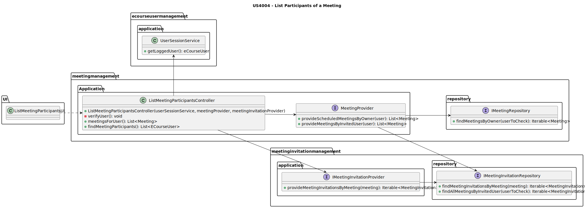
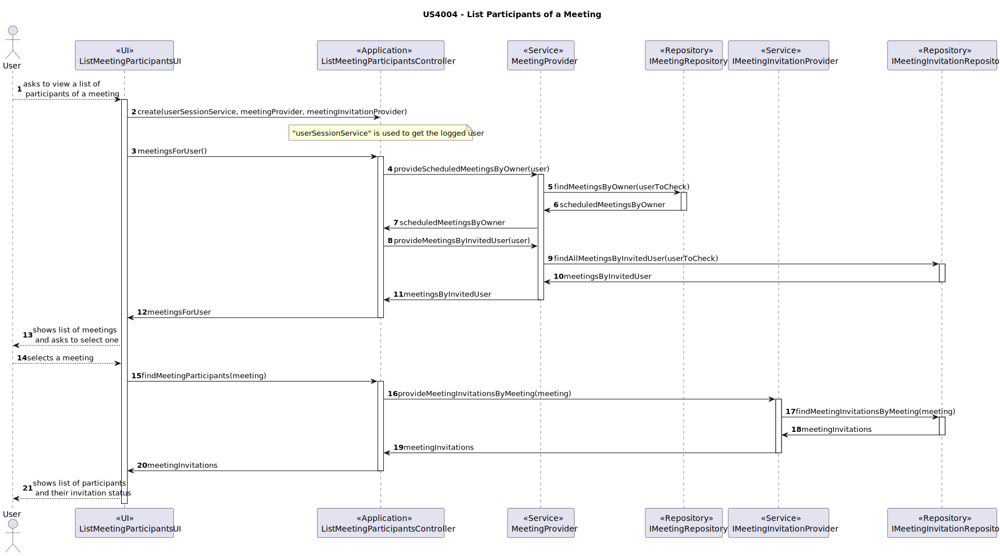

# US4004 — As User, I want to view a list of participants in my meeting and their status (accept or reject).

## 1. Context

This US is being developed for the first time, since it was assigned in this sprint (sprint C).
This requirement is placed in the context of listing the participants of a [meeting](../MainDocs/glossary.md) and their status whether it's accepted, rejected or pending.

---

## 2. Requirements

The user must be registered in the system, invited to a meeting, or with a scheduled meeting and invited participants on it.

#### System Specifications Document

* FRM04 - List Participants The system displays the lists of participants in a meeting and the response status (accept or reject meeting).

---

## 3. Analysis

To view all the participants in a meeting, there are pre-conditions that need to be met:

* The User must be logged in.
* The User must be associated to a meeting (invited to it or owner of it).

Meeting all the preconditions, the User then must:

1 - Select the option to view the list of the participants of a meeting.

2 - Then, the system will provide a list of the meetings associated to that User.

3 - The User will select the meeting they want to view the participants of.

4 - Finally, the system will iterate through the list of participants of that meeting having in mind the status of each participant invitation (accepted, rejected or pending), and show the final list of participants to the User.

**DISCLAIMER:** An important thing to highlight is the fact that besides listing the participants that accepted and rejected invitations, the ones with pending invitations will also be considered. This was a decision made by the group regarding what would be more logical when looking at what was asked.

---

## 4. Design

### 4.1. Class Diagram



### 4.2. Sequence Diagrams



**IMPORTANT THINGS TO CONSIDER:**

* Besides not being directly represented, the **UserSessionService** will be injected in the controller to verify if the user is logged in and get their identity.

### 4.3. Applied Patterns

Some main patterns used in this user story as a whole are:

* **Controller:** *The controller is responsible for handling the user input, and orchestrating (controlling) the use
  cases.*

* **Single Responsibility Principle + High Cohesion:** *Every class has only one responsibility, which leads to higher
  cohesion.*

* **Dependency Injection:** *Instead of instantiating the repositories or services that will be used inside the classes,
  they are received by parameter.*

* **Information Expert:** *The IMeetingRepository is the IE of meetings and the IMeetingInvitationRepository is the IE of meeting invitations.*

* **Low Coupling + Dependency Inversion:** *All the classes are loosely coupled, not depending on concrete classes,
  rather depending on interfaces.*

### 4.4. Tests

* Since this is a US that only requires the listing of existing data on the system, there are no unity tests required, and since integration tests are not truly required, there are none.
---

## 5. Demonstration

#### 5.1 Demonstration Video


https://github.com/Departamento-de-Engenharia-Informatica/sem4pi-22-23-16-1/assets/107274763/e502c6c3-c5ac-416d-afba-662081d873f0

---

## 6. Implementation

#### 6.1. ListMeetingParticipantsController
```java
public class ListMeetingParticipantsController {
  private UserSessionService userSessionService;
  private MeetingProvider meetingProvider;
  private IMeetingInvitationProvider meetingInvitationProvider;
  private ECourseUser user;

  public ListMeetingParticipantsController(UserSessionService userSessionService, MeetingProvider meetingProvider, IMeetingInvitationProvider meetingInvitationProvider) {
    if(userSessionService == null){
      throw new IllegalArgumentException("userSessionService cannot be null.");
    }

    this.userSessionService = userSessionService;

    verifyUser();

    if(meetingProvider == null){
      throw new IllegalArgumentException("meetingProvider cannot be null.");
    }

    this.meetingProvider = meetingProvider;

    if(meetingInvitationProvider == null){
      throw new IllegalArgumentException("meetingInvitationProvider cannot be null.");
    }

    this.meetingInvitationProvider = meetingInvitationProvider;
  }

  /**
   * Verify if the user is logged in.
   */
  private void verifyUser(){
    Optional<ECourseUser> eCourseUserOptional = userSessionService.getLoggedUser();

    eCourseUserOptional.ifPresentOrElse(
            eCourseUser -> this.user = eCourseUser,
            () -> {
              throw new IllegalStateException("No eCourse user found. Make sure you are registered.");
            }
    );
  }

  /**
   * Provide the meetings for the user.
   *
   * @return the list of meetings for the user
   */
  public List<Meeting> meetingsForUser(){
    List<Meeting> meetingsForUser = new ArrayList<>();

    List<Meeting> scheduledMeetingsByOwner = meetingProvider.provideScheduledMeetingsByOwner(user);

    List<Meeting> meetingsByInvitedUser = meetingProvider.provideMeetingsByInvitedUser(user);

    meetingsForUser.addAll(scheduledMeetingsByOwner);

    meetingsForUser.addAll(meetingsByInvitedUser);

    return meetingsForUser;
  }

  /**
   * Provide the invitations of a meeting.
   *
   * @param meeting - the meeting to find the invitations
   * @return the list of invitations of the meeting
   */
  public List<MeetingInvitation> findMeetingParticipants(Meeting meeting) {
    return meetingInvitationProvider.provideMeetingInvitationsByMeeting(meeting);
  }
}
```

#### 6.2. MeetingProvider
```java
public class MeetingProvider {
  private final IMeetingRepository meetingRepository;
  private final IMeetingInvitationRepository meetingInvitationRepository;

  /**
   * Instantiates a new Meeting provider.
   *
   * @param meetingRepository the meeting repository
   */
  public MeetingProvider(IMeetingRepository meetingRepository, IMeetingInvitationRepository meetingInvitationRepository){
    if (meetingRepository == null) {
      throw new IllegalArgumentException("meetingRepository cannot be null.");
    }

    this.meetingRepository = meetingRepository;

    if(meetingInvitationRepository == null){
      throw new IllegalArgumentException("meetingInvitationRepository cannot be null.");
    }

    this.meetingInvitationRepository = meetingInvitationRepository;
  }


  /**
   * Provide the meetings that were scheduled by a user.
   *
   * @param user - the user to get the meetings
   * @return the list of meetings scheduled by the user
   */
  public List<Meeting> provideScheduledMeetingsByOwner(ECourseUser user){
    return (List<Meeting>) meetingRepository.findMeetingsByOwner(user);
  }

  /**
   * Provide the meetings that a user was invited to.
   *
   * @param user - the user to get the meetings
   * @return the list of meetings the user was invited to
   */
  public List<Meeting> provideMeetingsByInvitedUser(ECourseUser user){
    return (List<Meeting>) meetingInvitationRepository.findAllMeetingsByInvitedUser(user);
  }
}
```

#### 6.4. JPAMeetingInvitationRepository
```java
public class JpaMeetingInvitationRepository extends eCourseJpaRepositoryBase<MeetingInvitation, Long, Long>
        implements IMeetingInvitationRepository {

    /**
     * Instantiates a new Jpa meeting invitation repository.
     *
     * @param identityFieldName the identity field name
     */
    public JpaMeetingInvitationRepository(String identityFieldName) {
        super(identityFieldName);
    }

  @Override
  public Iterable<Meeting> findAllMeetingsByInvitedUser(ECourseUser userToCheck) {
    final TypedQuery<Meeting> query = entityManager().createQuery("SELECT mi.meeting " +
            "FROM MeetingInvitation mi " +
            "WHERE mi.invitedParticipant.email = :participantEmail ", Meeting.class);

    query.setParameter("participantEmail", userToCheck.identity());

    return query.getResultList();
  }

    @Override
    public Iterable<MeetingInvitation> findMeetingInvitationsByMeeting(Meeting meeting) {
        final TypedQuery<MeetingInvitation> query = entityManager().createQuery("SELECT mi " +
                "FROM MeetingInvitation mi " +
                    "WHERE mi.meeting.meetingDate.meetingDate = :meetingDate " +
                        "AND mi.meeting.meetingOwner.email = :meetingOwner", MeetingInvitation.class);

        query.setParameter("meetingDate", meeting.scheduledMeetingDate().retrieveDate());
        query.setParameter("meetingOwner", meeting.meetingOwner().identity());

        return query.getResultList();
    }
    
}
```

#### 6.5. JPAMeetingRepository
```java
public class JpaMeetingRepository extends eCourseJpaRepositoryBase<Meeting, Long, Long> implements IMeetingRepository {

    /**
     * Instantiates a new Jpa meeting repository.
     *
     * @param identityFieldName the identity field name
     */
    public JpaMeetingRepository(String identityFieldName) {
        super(identityFieldName);
    }

    @Override
    public Iterable<Meeting> findMeetingsByOwner(ECourseUser userToCheck) {
        final TypedQuery<Meeting> query = entityManager().createQuery("SELECT m FROM Meeting m " +
                "WHERE m.meetingOwner.email = :participantEmail " +
                "AND m.meetingStatus = 'SCHEDULED'", Meeting.class);

        query.setParameter("participantEmail", userToCheck.identity());

        try {
            return query.getResultList();
        } catch (NoResultException e) {
            return null;
        }
    }
}
```

---
